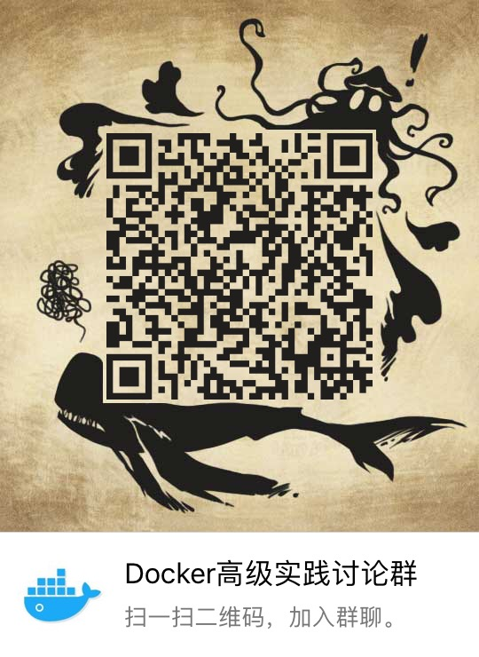

iBook

通过访问一下链接可以直接访问到Wiki

[linuxea.readthedocs.io](http://linuxea.readthedocs.io/)

[linuxea.rtfd.io](http://linuxea.rtfd.io/)

这是一个个人维护的Wiki，你可以直接访问我的[博客](https://www.linuxea.com)或者[Github](https://github.com/marksugar/iBook
)

------

## 内容

这里有我的笔记，其中包括Docker容器，kubernetes，Devops(方法和工具：gitlab-ci/cd，jenkins)，Git版本仓库

## 联系我

Docker实践讨论群 QQ群：47355295

### 微信群

## 致谢

- [如何捐赠](docs/dnnate.md)

Copyright 2019  Marksugar (usertzc@163.com) GNU General Public License v3.0, 详情见 [LICENSE](https://github.com/marksugar/iBook/blob/master/LICENSE) 文件。