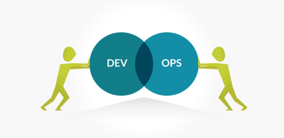

如果你问一个普通人，“DevOps对你意味着什么？” 对方很大可能是茫然的。还有一些人并没有直接参与，而是模糊地意识到DevOps是一个概念。虽然模糊的理解总比没有好，但它留下了误解和错误信息的空间，从长远来看这可能是个问题。DevOps的准确定义是必要的。

如何为非技术受众提供DevOps的准确定义？长期DevOps从业者Alex Honor回应了早期的敏捷软件开发原则，他创造了“人们过度使用工具”这一短语。这个口头禅提供了一个简单的DevOps优先级列表，因此提供了一个有用的框架，可以轻松理解DevOps的。

## 从大众开始

每个人都喜欢一个好的组织结构图，并讨论DevOps团队如何组织，是了解DevOps如何在实践中发挥作用的有用方法。DevOps非常关注传统上独立的开发和运营部门的桥接，但这不仅仅是增加团队之间的协作。

在传统设置中，开发人员构建应用程序并在必要时修复它们，而运营团队则负责维护，支持和监视这些应用程序。

在DevOps中，划分这两个世界的墙就消失了。但这不仅仅是让开发和运营团队更紧密地合作 - 而是创建一个开发人员和工程师在产品生命周期的每个阶段彼此协同工作的环境。换句话说，dev和ops之间应该没有分离，只是一个统一的DevOps团队。

通过强调人员因素并将DevOps团队结构与更传统的安排进行对比，可以更容易地看到DevOps在现实世界中的表现。对于技术水平较低的受众来说，揭开DevOps的神秘色彩，这是一个很好的起点。

## **继续进行流程**

当投入实践时，DevOps应该比更传统的软件工程方法更快，更高效，更可靠 - 一旦组织结构到位，这些好处就可以通过创新的DevOps流程实现。

在传统的开发和操作中，手动操作任务的习惯意味着减慢进程并妨碍高频部署。但是在基于作为代码的基础架构的DevOps流程中，团队可以自动化资源的提供和管理。

例如，承担配置服务器资源的任务。过去，开发人员会通过电子邮件向基础架构团队发送电子邮件(或者其他即时通讯)，并要求在特定配置中提供一组特定资源。然后，基础架构团队中的某个人会在最终部署服务器之前查看文档并遵循任务清单。

在DevOps流程中，开发人员和基础架构工程师不仅在同一个团队中彼此协同工作，他们还通过基础架构作为代码（[IAC](https://en.wikipedia.org/wiki/Infrastructure_as_code)）实施流程。

在IAC的环境中，通过代码自动配置IT资源，因此开发人员只需单击按钮即可手动配置服务器。然后，所需的基础架构自动执行，加速整个流程，并为DevOps团队提供更频繁，更高效的部署方式。

通过描述IAC实现的自动化流程，DevOps与更传统的实践之间的差异变得更加清晰。对于技术含量较低的员工，这种解释为DevOps团队的日常工作提供了一些急需的背景。

## **工具**

技术及自动化和管理方面带来的好处是DevOps的关键驱动因素。云计算和虚拟化的成熟，特别是基础架构即服务（IaaS）的出现，提供了DevOps所需的灵活性和速度。

借助IaaS，可以立即为高度定制和不断变化的IT需求提供计算资源，而无需使用本地硬件或手动配置。这反过来又使基础设施成为上面详述的代码（IaC）流程，以及DevOps团队运行所需的自动化水平。

因此，IaaS和IAC形式的云计算奠定了DevOps的技术基础。这是最重要的东西，但那些非技术人员可能真正听说过的那些品牌工具呢？Docker，Kubernetes，GitHub/GitLab，Jenkins，Travis CI ......类似这个列表还有很多，但这些对于DevOps的核心概念有多重要？

可以说，不是很好。虽然容器化，源代码控制和持续集成工具都可以在DevOps上下文中执行非常重要的角色，但它们很难定义DevOps本身的功能。

Puppet和Chef等连续配置自动化解决方案更直接在IAC保护伞下实现，可实现数据中心资源的自动配置和扩展。但与其他设备一样，这些工具在更传统的设置中同样适用于每一个公司。

从这个意义上说，没有“DevOps工具”这样的东西，只有可以在DevOps组织中用于DevOps进程的工具。这就是如何使用它们真正重要的。

因此，当为新手提供DevOps的定义时，不要陷入简单的工具列表陷阱。DevOps更多的是关于人员，组织和流程。虽然它非常依赖于IaaS和IAC技术，但DevOps团队使用的许多工具或多或少都是偶然的。

## **DevOps的提醒**

DevOps的最终目标不仅仅是统一开发和运营，而是缩短开发周期，更频繁的部署，更高质量的产品和满足客户。更直接的是，DevOps的最终目标不仅仅是说“我们做DevOps”，而是提高生产力并使业务更有利可图。

如阿里巴巴，腾讯，谷歌，亚马逊。这些公司的成功取决于他们每天，甚至每小时多次部署新软件的能力。或许他们不同意该术语的精确定义，但他们所同意的是DevOps作为一套统一的软件工程实践，对其盈利能力至关重要。

随着DevOps在过去几年中出现的广泛争议达成共识，DevOps的缺乏定义将随着其文化不断演变而变得不那么重要。与此同时，好消息是DevOps背后的重要思想也是向非技术受众解释最直接的。

通过首先将DevOps打破，处理第二个和第三个工具，可以准确且相对简单地定义DevOps。DevOps基本上是关于人，开发人员和工程师如何组织自己，并作为一个统一的团队工作，以更快地提供更好的产品。在这个结构的基础上构建了DevOps流程，重点关注自动化和创新工具 - 始终在核心DevOps原则和实践的背景下。