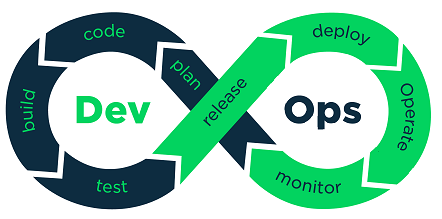

大多数公司认为他们已经在使用持续集成(CI)，但当谈到是否遵循CI的关键实践时，如：运行测试来验证每个构件，其中许多并没有。

今天我们来讨论如下几点：
1，我们是否每天更改或至少每天多次构建我们的应用程序代码？
2，我们是否有意识到避免长时间在分支开发代码功能？
3，我们是否优先考虑修改构件中出现的已知故障而并非进行新的迭代？
如果上述三个问题的答案是否定的，那么你做的并不是真正意义上CI。

持续交付(CD)是Devops的基础，他建立在持续集成基础之上，因此，在使用CD和Devops真正取得有效进展之前，必须正确实施CI。换句话说，我们必须解决这些问题才能在后面进行飞跃的提升。

> 掌握持续集成的步骤

为了实现业务目标，以下是必须采用的七种实践来掌握CI

### 1.自动化构建

在实施持续集成之前，开发人员在桌面进行本地构建，或者让构建人员手动集成代码。再者通过手动撸一个烦躁的步骤。但是让人疑惑的是，这种“CI”形式的确存在。

简单来讲，持续集成的构建应该运行一个集中管理的控制器单元上，能够完全无人值守的运行并自动化，以便于相同的每次输入都会产生相同的输出结果。

### 2.尽可能频繁的进行构建

在测试环境中每天都会进行大量的构建工作，理想情况下除拉取外，合并，提交时候都会触发每次更改的构建，每次提交构建可以在引入错误后立即找出错误，在这样的情况下有利于修复bug

持续集成(整合)中，“持续”尽可能的采用字面意思。通常，在一个公司中，当讨论到构建频率时，答案如下：

1，通过某些按钮触发构建，每周X次
2，每天晚上都进行构建，每周一次
3，每天在某个时间段进行构建一次

这些并不是真正的持续构建，他们可能是集中管理一台管理服务器，自动构建或者预订构建。但这些不提供持续集成的好处。倘若现在由于某些原因，10个开发人员在两天内进行了多达30多次代码提交，对于出现的BUG则可能需要对这些工作排序并且找出更正的原因。这样情况下生产力将会下降。

### 3.经常提交或合并到主线

在已有CI的团队中可能在每次更改时或每天至少一次对主线或者主要部分代码进行合并。例如：长时间维护一个功能分支，则无法频繁的确验证集成更改。如果分支很长一段时间没有进行合并验证，当合并时大概率会出现冲突或者错误需要解决，这延迟了项目进度。

### 4.快速构建

假如你的测试环境中的CI，每次构建在5-10分钟完成是正常的。如果构建需要更长的时间（有的构建长达三四个小时），不仅会延迟进度，也无法得到有价值的反馈。

花时间优化构建。这过程中可能需要分解CI构建过程，或者组件，这些与团队密切相关，而后将整个集成应用程序的验证作为整个开发过程中的单独步骤来做。

### 5.验证构建

CI中包括验证更改和生成的报告。这种测试应该是整个构建过程的一部分，如果你是唯一验证仅基于确认软件编译结果，那这并不是真正的实践CI。大多数实践CI团队都包括CI构建中的代码扫描和单元测试，以及后续的黑白盒等。

### 6.在类似生产环境中验证

成熟的CI可确保开发，测试和预生成环境之间的一致性。最成熟的方案莫过于虚拟机和容器技术，服务器虚拟化和其他技术来确保在类似的生产环境进行验证，并且当在集成这些更改之后，就可以降低在预生产和生产中出现错误的风险。

### 7.立即修复崩溃的构建

如上所述，团队发现并快速解决问题以便他们不会向下推进也至关重要。使用CI，可以建立流程，在这些流程中，构建可以持续验证和提交，如果出现问题，则更容易修复。如果忽略了错误的构建，则问题在此后更难以找到并修复，但更糟的是这背后的文化。

CI是基于质量优先的方法，如果构建中断，停止并修复。从长远来看，得益于每个参与的人。

### 最后的文化问题

这些看起来似乎很简单，但是当结合起来后，结果必然是显著的。不能说不遵循这几条的团队可能会在定期提供构建功能就会出现问题。但是如果 持续集成推进失败，团队成员将会恢复此前的方式。不仅存在流程问题，也存在文化问题，这也是多数团队陷入困境的原因之一。

团队必须改变工作的方式并且确保他们的思维方式一致。CI对团队有很多好处，但不要忘记CI本身是为了正面发现问题，解决问题并不是通过CI来避免和消除问题。持续集成构建一个系统，开发人员可以快速发现BUG，有利于及早，快速的找到问题并修复。

持续集成是真正的Devops转型的基本要素之一，众所周知，这是许多当前 团队的首要任务，真正使用它是为了跟上现代商业需求至关重要的一小节。

