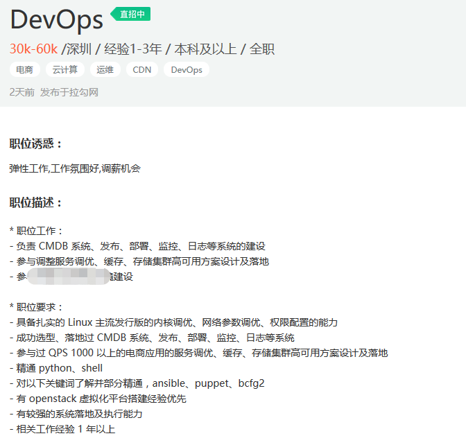

并不是每个公司都适合devops，但这并不能说devops不好，其中对人员的要求和新技术的引入而引起的问题远比现实复杂。

devops在当下不是一个难以实现的问题，但在很多时候它出现引起了很多误解。

## ？？

9012年后，许多公司对devops热衷，寻求不断被放大。我不断的在听到大家谈论devops，但似乎与原本的初衷并不一致。

devops定义是改善开发到生产周期，缩短开发周期，通过devops更快的部署 ，通常而言，如下代码所示：

```
1/6 sonarqube:
  stage: code-check
  script: 
    - sonarqube
    - date
2/6 code_quality:
  <<: *job_docker_group
  script:
    - code_quality
    - date

2/6 code_quality_Increment:
  <<: *job_docker_group
  script:
    - code_quality_Increment
    - date
   
# Static Application Security Testing
3/6 SAST:
  <<: *job_docker_group    
  script:
    - SAST
    - date
4/6 dependency-scanning:
  <<: *job_docker_group
  script:
    - dependency_scanning
    - date
  
5/6 dependency-check:
  stage: code-check
  script: 
    - dependency_check
    - date
    
6/6 license_management:
  <<: *job_docker_group
  script:
    - license_management       
    - date

# Dynamic Application Security Testing
1/2 DAST_ZAP_JSON:
  <<: *zap_docker_group 
  script:  
    - DAST_ZAP_JSON
    - date      

2/2 DAST_ZAP_HTML:
  <<: *zap_docker_group
  script:   
    - DAST_ZAP_HTML
    - date     

deploy:
  stage: deploy-test
  environment:
    name: staging
    url: https://www.linuxea.com  
  only:
    - master 
  script:
```

当然，这只是部分信息。

除了开发过程外i，能够自动处理的可控范围内的问题，不会影响到用户，并且能够进行有效且高质量的监控。。

现实情况：

- 手动测试或者不测试，亦或者单独的伪自动化测试
- 监控没有导向的事情
- 不改善工作流程
- 继续在迭代中执行上述操作等并尝试在出现火灾的时候进行救火

devops均在解决这些等问题，从而来完成更高质量的的产品。最终的目的是提供生产力。

在此基础上，仍然需要与各部门良好的协作和沟通，以及对系统和产品的熟悉，缩短开发周期和质量测试。这些都包含在自动化中。

## devops职位的分析

在招聘网站的devops




这些招聘信息与devops有很直接的关系吗？

后端架构设计和研发平台构建

devops需要建设CMDB,发布，部署，监控，日志系统，并且需要服务优化，缓存，存储集群设计和落地？

CMDB建设，包含部署设计，监控，优化等，在我理解中，有运维开发和资深运维来做。这不是自动化运维的职责内容吗？其中甚至没有提到持续集成和持续交付。

看到这里，你大致可以明白，devops信息中实际需要运维开发，或者资深运维工程师，或者云运维工程师，在或者自动化运维工程师，甚至没有考虑到需要持续集成和持续交付。

 很明显，他们理解错了。

如果认为devops就是开发和运维，那是错误的，devops在开发运维之上。当谈论到devops时候，往往意味着：

- 开发和运营的密切关系
- 至少应该是熟悉彼此，这样开发知道他们正在编写的系统，并和运维部署的代码。了解这些才能够在不影响系统的情况下进行调整出更好的方式。
- 在短时间内开发，并且快速部署，在出错后尽快修复

这其中就包含了自动化，自动化包含测试和运维，并且最终放在管道中运行。但是这些取决于基础架构是否完善。

## 从哪里开始偏离了？

devops方法是抽象和复杂的概念，它不是一个工具那么简单。

采用什么工具和技能，并将其命名为devops。

这些工具使用和所需的技能附加到职位描述。现在devops一词开始描述知道如何进行开发和自动化的人。要知道devops不是一件事情，dev 同 ops，而不是dev和ops。在更多时候devops是一个团队在做的事情，并不是某一个人做的。不要采用流行的一个单词，而是背后的流程与方法的实际理念。

不管如何，我们是将产品最终交付到生产。

另外，不要认为使用了cmdb,使用了容器技术，使用了kubernetes,ansible，就认为在做devops。

## 延伸阅读

- [Devops](https://www.linuxea.com/tag/Devops/)