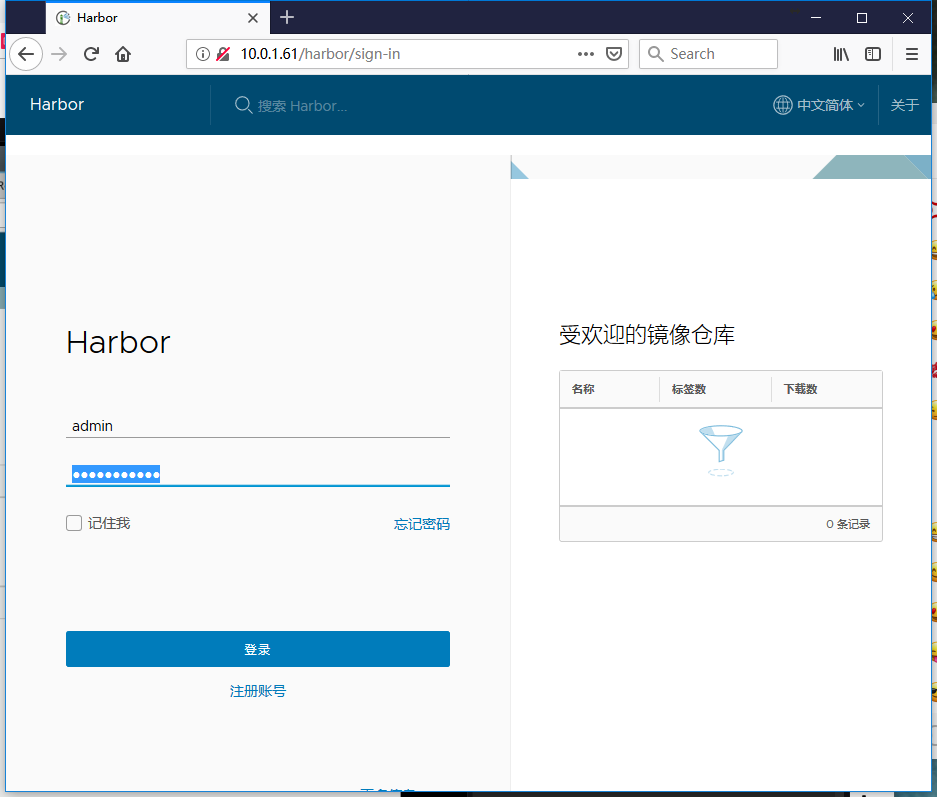
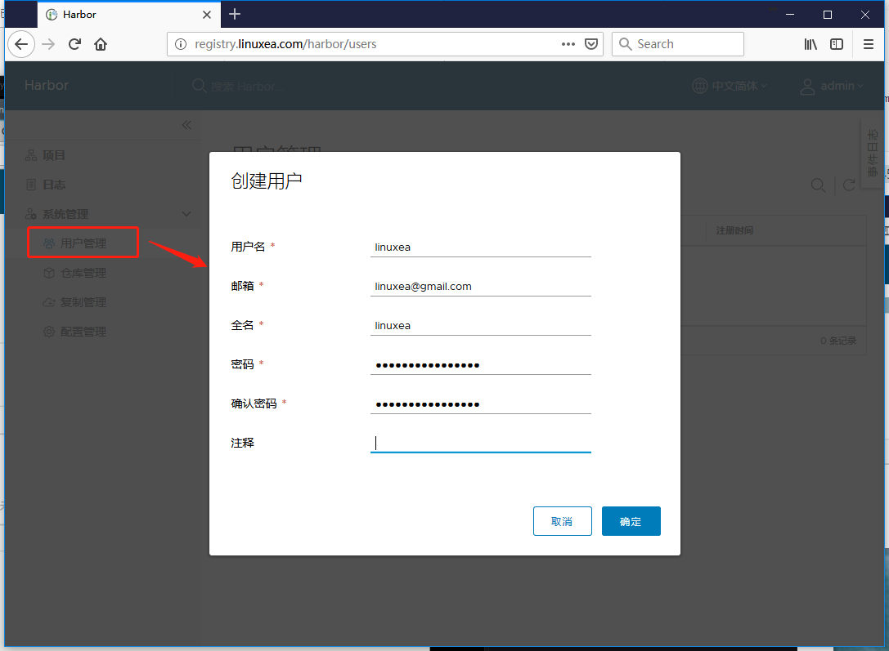
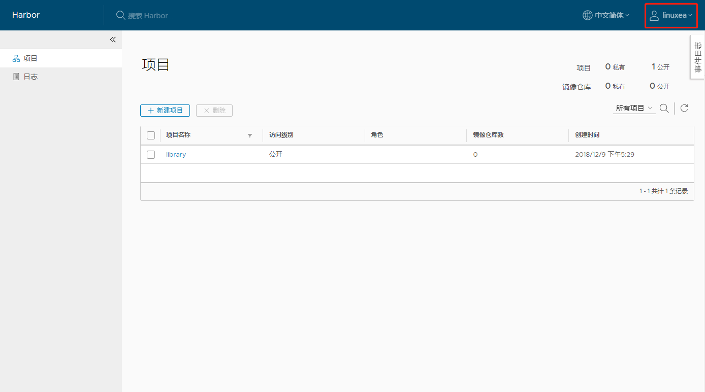
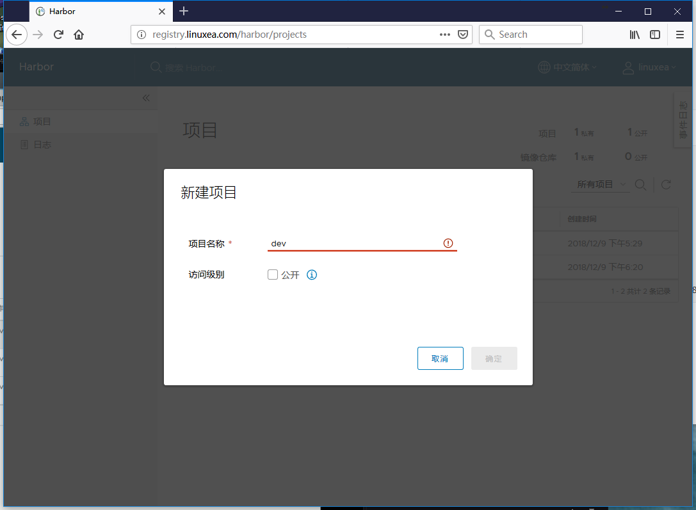
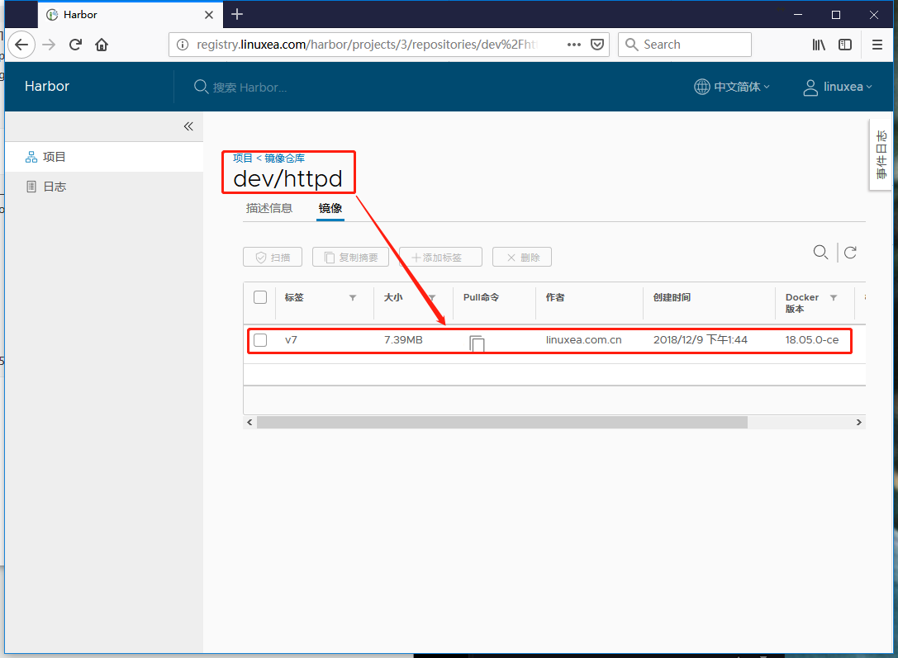

Registry用于保存docker镜像，包括镜像的层次结构和元数据，用户可以自己创建Registry，也可以使用官方的dockerhub，这些Registry支持第三方注册。但是这些Registry在互联网上，使用时候下载的速度不会再快，并且在实际使用中，有多数进行下载，宽带也会成为一个问题。为了达到最快的拉取目的，我们就需要自己构建Registry。

## Private Registry

Registry主要用于托管镜像，Registry默认是https的，如果要使用http就需要特别的指定。

为了能够使我们快速构建Registry，dockre提供了一个项目distribution，安装即可。而在docker官方已经将Registry作为镜像，由此，我们直接使用Registry镜像就可以运行Registry。

Registry主要用于托管镜像，而Registry本身也是托管在容器中，容器的文件系统会随着容器的终止而删除的，Registry运行在容器后这些镜像是不能存放在容器中的，我们将它存储到存储卷内，如：网络存储。当然也可以在本地存放。这种方式很简单就可以运行起来一个Registry。

如果不想使用这种方式，也可以使用docker-distribution

### 安装docker-distribution

```
[marksugar@www-linuxea ~]$ yum-config-manager     --add-repo     https://download.docker.com/linux/centos/docker-ce.repo
```

```
[marksugar@www-linuxea ~]$ yum install docker-distribution -y
```

```
[marksugar@www-linuxea ~]$ rpm -ql docker-distribution
/etc/docker-distribution/registry/config.yml  配置文件 
/usr/bin/registry
/usr/lib/systemd/system/docker-distribution.service
/usr/share/doc/docker-distribution-2.6.2
/usr/share/doc/docker-distribution-2.6.2/AUTHORS
/usr/share/doc/docker-distribution-2.6.2/CONTRIBUTING.md
/usr/share/doc/docker-distribution-2.6.2/LICENSE
/usr/share/doc/docker-distribution-2.6.2/MAINTAINERS
/usr/share/doc/docker-distribution-2.6.2/README.md
/var/lib/registry  仓库默认目录
```

而后我修改了仓库目录

```
[marksugar@www-linuxea ~]$ mkdir /data/Registry
```

```
[marksugar@www-linuxea ~]$ cat /etc/docker-distribution/registry/config.yml
version: 0.1
log:
  fields:
    service: registry
storage:
    cache:
        layerinfo: inmemory
    filesystem:
        rootdirectory: /data/Registry
http:
    addr: :5000
```

```
[marksugar@www-linuxea ~]$ systemctl start docker-distribution.service 
[marksugar@www-linuxea ~]$ ss -tlnp|grep 5000
LISTEN     0      32768        *:5000                     *:*                   users:(("registry",pid=9228,fd=3))
```

如果5000端口正常就说明启动成功

### 管理标签

我修改了hosts，通过域名来进行打标

```
[marksugar@www-linuxea ~]$ echo "10.10.240.145 registry.linuxea.com" >> /etc/hosts
```

```
[marksugar@www-linuxea ~]$ cat /etc/hosts
127.0.0.1   localhost localhost.localdomain localhost4 localhost4.localdomain4
::1         localhost localhost.localdomain localhost6 localhost6.localdomain6

10.10.10.250    mirrors.ds.com
10.10.240.145 registry.linuxea.com
```

而后重新打标签，将`marksugar/httpd:v7 `修改为`registry.linuxea.com:5000/marksugar/httpd:v7`

```
[marksugar@www-linuxea ~]$ docker tag marksugar/httpd:v7 registry.linuxea.com:5000/marksugar/httpd:v7
```

推送默认是要使用https协议，而服务器断是http，所以这里会报错如下

```
[marksugar@www-linuxea ~]$ docker push registry.linuxea.com:5000/marksugar/httpd:v7
The push refers to repository [registry.linuxea.com:5000/marksugar/httpd]
Get https://registry.linuxea.com:5000/v2/: http: server gave HTTP response to HTTPS client
```

- 通过标记http来解决

```
[marksugar@www-linuxea ~]$ cat /etc/docker/daemon.json 
{
  "insecure-registries": ["registry.linuxea.com:5000"]
}
```

而后重启

```
[marksugar@www-linuxea ~]$ systemctl restart docker 
```

而后再次推送

```
[marksugar@www-linuxea ~]$  docker push registry.linuxea.com:5000/marksugar/httpd:v7
The push refers to repository [registry.linuxea.com:5000/marksugar/httpd]
e37e4dcca4e6: Pushed 
7e0e76680fcf: Pushed 
7e36f706b93d: Pushed 
2d1436269532: Pushed 
7030e9e24693: Pushed 
df64d3292fd6: Pushed 
v7: digest: sha256:9fd332615f424252c54583f31946816039a5f69d648a35034426be904c75a5e6 size: 1568
```

推送的文件存放在存储目录下，我这里的路径位置是`/data/Registry/docker/registry/v2/repositories/marksugar/httpd`，在此之下是层目录和上传目录，这些文件又会链接到blobs下

```
[marksugar@DS-linuxea ~]$ ls /data/Registry/docker/registry/v2/repositories/marksugar/httpd
_layers  _manifests  _uploads
```

这些推送过的镜像如果要被pull使用，那么使用的客户端就也需要配置`insecure-registries`

## Harbor

Harbor是vmware开源的镜像仓库，harbor的安装是非常麻烦的，不过可以使用compose来组合安装。

而docker-compose也是一个简单的编排工具，这个编排工具中可以将docker run的命令组合在一个文件中调用，并且可以控制容器的启动顺序。

docker-compose的前身是Fig，也是最早最火的编排工具，比k8s早，而后docker公司收购Fig。而在docker-compose中也有多个版本，有2，3版本

我们下载离线包安装

```
https://storage.googleapis.com/harbor-releases/release-1.6.0/harbor-offline-installer-v1.6.2.tgz
```

```
[marksugar@www-Node_10_0_1_61 ~]$ tar xf harbor-offline-installer-v1.6.2.tgz -C /data
[marksugar@www-Node_10_0_1_61 ~]$ cd /data/harbor/
```

在harbor.cfg中需要按需修改一些配置，比如hostname，而后`./install.sh `

> 在这个docker-compose中定义的文件的映射关系，启动的服务顺序，网络模式，暴露端口等都被事先预设好了，也就是精心设计过的。
>
> 暂停服务：docker-compose stop
>
> 重启服务：docker-compose restart
>
> 启动服务：docker-compose -f  ./docker-compose.yaml up -d
>
> 关闭删除服务：docker-compose down

```
[marksugar@www-Node_10_0_1_61 /data/harbor]# ./install.sh 
...
[Step 4]: starting Harbor ...
Creating network "harbor_harbor" with the default driver
Creating harbor-log ... done
Creating harbor-adminserver ... done
Creating registry           ... done
Creating redis              ... done
Creating harbor-db          ... done
Creating harbor-ui          ... done
Creating harbor-jobservice  ... done
Creating nginx              ... done

✔ ----Harbor has been installed and started successfully.----

Now you should be able to visit the admin portal at http://registry.linuxea.com. 
For more details, please visit https://github.com/goharbor/harbor .
...
```

Harbor是监听在宿主机的80端口，我们通过浏览器直接访问。用户名：admin，密码：Harbor12345



vmware Harbor的开发有一大部分是中国人，大概也就是如此才会这么快就有中文支持

而后可以创建普通用户


普通用户也是可以创建项目，推送镜像的


- 客户端推送镜像到仓库

新建一个dev项目，而后推送，格式如下



推送前需要重新修改标签
```
推送镜像 
在项目中标记镜像：
	docker tag SOURCE_IMAGE[:TAG] registry.linuxea.com/dev/IMAGE[:TAG]
推送镜像到当前项目：
	docker push registry.linuxea.com/dev/IMAGE[:TAG]
```

- NODT

> 那么，在推送之前，我们还需要将此前的配置修改，此前使用distribution，是5000端口，此刻使用Harbor的80端口
> 
> ```
> [marksugar@www-LinuxEA ~]$ cat /etc/docker/daemon.json
> {
>   "insecure-registries": ["registry.linuxea.com"]
> }
> ```
> 
> 重启
> 
> ```
> [marksugar@www-LinuxEA /data/harbor]$ systemctl restart docker
> ```

- 打标签

```
[marksugar@www-LinuxEA ~]$ docker tag marksugar/httpd:v7 registry.linuxea.com/dev/httpd:v7
```

而后登陆到Harbor

```
[marksugar@www-LinuxEA ~]$ docker login registry.linuxea.com
Username: linuxea
Password: 
WARNING! Your password will be stored unencrypted in /root/.docker/config.json.
Configure a credential helper to remove this warning. See
https://docs.docker.com/engine/reference/commandline/login/#credentials-store

Login Succeeded
```

推送即可

```
[marksugar@www-LinuxEA ~]$ docker push registry.linuxea.com/dev/httpd:v7
The push refers to repository [registry.linuxea.com/dev/httpd]
e37e4dcca4e6: Pushed 
7e0e76680fcf: Pushed 
7e36f706b93d: Pushed 
2d1436269532: Pushed 
7030e9e24693: Pushed 
df64d3292fd6: Pushed 
v7: digest: sha256:9fd332615f424252c54583f31946816039a5f69d648a35034426be904c75a5e6 size: 1568
```

回到Harbor，已经能够看到这些详细的信息。




