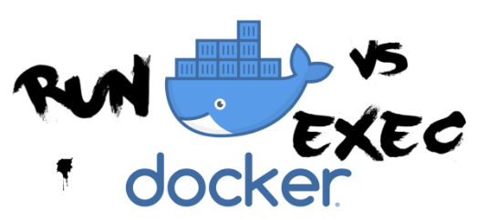

run命令和exec是容器的执行命令，但是他们之间存在很大的差异



## run

使用此命令在**新**容器中运行一条命令。它适合没有容器运行的情况，并且你想要创建一个容器，启动它然后在其上运行一个进程。

```
docker run [OPTIONS] IMAGE [COMMAND] [ARG...]
```

在`docker run`命令之后，必须指定`image`从中创建容器，但也可以传递可选参数。例如：

```
docker run --name linuxea_bash --rm -i -t ubuntu bash
```

这将创建一个名为的容器`linuxea_bash`并启动Bash会话。该示例中使用的选项和参数的更详细分类如下：

- `--name` 在这种情况下，为容器指定一个名称 `linuxea_bash`
- `--rm`像bash命令一样，`rm`它会删除容器，但是这是在当它退出时
- `-i`简而言之`-interactive`，这确保即使没有[连接](https://docs.docker.com/engine/reference/commandline/attach/)到正在运行的容器，STDIN也会保持打开状态
- `-t`，也可以引用`-tty` ，`bash`在容器中启动交互式shell
- 容器的*images*取决于你使用什么，这里image是`ubuntu`
- image后面的最后一部分是您要运行的*命令*：`bash`

## EXEC

这适用于要在**现有**容器中运行命令的情况。如果你已经有一个容器正在运行并希望更改它或从中获取某些内容，那么这样做会更好。例如，如果正在使用`docker-compose`，则可能会启动多个容器，并且你可能希望在创建它们后访问其中的一个或多个容器。

```
docker exec [OPTIONS] CONTAINER COMMAND [ARG...]
```

这里的选项`-it`具有与之相同的效果`run`。更多选项和参数的示例是：

```
docker exec -d -w /temp linuxea_bash touch my_file.sh
```

- `-w` 后跟目录或文件路径允许你，说明要在哪个工作目录中运行命令。
- -d或`-detached`表示容器将以分离模式运行，因此您仍可以继续将终端会话与在后台运行的容器一起使用。如果要查看容器发送到STDOUT的内容，请不要使用此选项。
- 该命令`touch`用于在正在运行的容器`linuxea_bash.sh`的`/temp`目录中创建名称文件`my_file.sh`

除这两个命令之外，还有其他docker命令也有一些细微的差别，如[run](https://docs.docker.com/engine/reference/commandline/run/)与[build](https://docs.docker.com/engine/reference/commandline/build/)，[create](https://docs.docker.com/engine/reference/commandline/create/)的相似之处

延伸阅读:

- [docker exec ](https://docs.docker.com/engine/reference/commandline/exec/)
- [docker run](https://docs.docker.com/engine/reference/commandline/run/)

