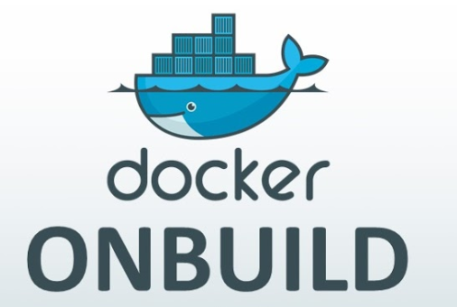

## shell

该`SHELL`指令允许覆盖用于*shell*形式的命令的默认shell 。Linux上的默认shell是`["/bin/sh", "-c"]`，而在Windows上`["cmd", "/S", "/C"]`。该`SHELL`指令*必须*以JSON格式写入Dockerfile。

参考：https://docs.docker.com/engine/reference/builder/#shell

## STOPSIGNAL

该`STOPSIGNAL`指令设置将发送到容器的系统调用信号以退出。此信号可以是与内核的系统调用表中的位置匹配的有效无符号数，例如9，或SIGNAME格式的信号名，例如SIGKILL，例如15，停止容器。如果要发送其他的信号就要在这里定义

```
STOPSIGNAL signal
```

## ARG

`ARG`指令定义了一个变量，可以`docker build`使用该`--build-arg <varname>=<value>` 标志在构建时将该变量传递给构建器。这样定义的Dockerfile可以适用于较多的场景，尤其是程序版本迭代。如果指定了未在Dockerfile中定义的构建参数，则构建会输出警告。

示例：

定义ARG author默认是"linuxea.com.cn"

```
ARG author="linuxea.com.cn"
LABEL maintainer="${author}"
```

```
[marksugar@www.linuxea.com /data/linuxea3]$ cat Dockerfile 
FROM nginx:1.14.2-alpine

ARG author="linuxea.com.cn"
LABEL maintainer="${author}"
ENV NGINX_ROOT="/data/wwwroot"

ADD entrypoint.sh /bin/entrypoint.sh
ADD index.html ${NGINX_ROOT}/

EXPOSE 8080/tcp 80/tcp

HEALTHCHECK --interval=3s --timeout=3s --start-period=3s CMD wget -O - -q http://${IP:-0.0.0.0}:${NGPORT:-80}||exit 1
#HEALTHCHECK --start-period=3s CMD wget -O - -q http://${IP:-0.0.0.0}:${NGPORT} || exit 1

CMD ["/usr/sbin/nginx","-g","daemon off;"]
ENTRYPOINT ["/bin/entrypoint.sh"]
```

build

```
[marksugar@www.linuxea.com /data/linuxea3]$ docker build --build-arg author="mark www.linuxea.com" -t marksugar/nginx:v5 .
```

查看，marksugar/nginx:v5的Labels是默认的linuxea.com.cn

```
[marksugar@www.linuxea.com /data/linuxea3]$ docker inspect -f {{.ContainerConfig.Labels}} marksugar/nginx:v5
map[maintainer:linuxea.com.cn]
```

而后重新build，重新赋值--build-arg author="mark www.linuxea.com"

```
[marksugar@www.linuxea.com /data/linuxea3]$ docker build --build-arg author="mark www.linuxea.com" -t marksugar/nginx:v6 .
```

而后在查看，赋值被生效

```
[marksugar@www.linuxea.com /data/linuxea3]$ docker inspect -f {{.ContainerConfig.Labels}} marksugar/nginx:v6
map[maintainer:mark www.linuxea.com]
```

## ONBUILD

docker onbuild用于指定当前的docker镜象用作另一个镜象的基本镜象时候运行的命令，在使用前，需要一个静态的基本镜象，而后其动态配置会在新的镜象（子镜象）发生作用，或者在新镜象依赖之前构建镜象的情况下使用！



ONBUILD用于在Dockerfile中定义一个触发器，Dockerfile用于build镜像文件，此镜像文件可作为base image被另一个Dockerfile用作FROM指令的参数，并以之构建新的映像文件

- 疑问

当使用各种指令创建一个dockerfile，并在dockerfile指定了onbuild指令，当我们使用docker build使用当前的dockerfile构建镜象的时候，将会创建一个新的docker镜象，但onbuild指令不会应用于当前的docker镜象，仅仅作为将要创建新的景象用作为另外一个dockerfile中的基本镜象时候，才会应用此选项。

在后面的这个Dockerfile中的FROM指令在build过程中被执行时，将会“触发”创建其base image的Dockerfile文件中的ONBUILD指令定义的触发器

```
ONBULD <INSTRUCTION>
```

尽管任何指令都可注册成为触发器指令，但ONBUILD不能自我嵌套，且不会触发FROM和MAINTAINER指令

使用包含ONBUILD指令的Dockerfile构建的镜像应该使用特殊的标签，例如：mysql:5.6-onbuild

在ONBUILD指令中使用ADD或COPY指令如果缺少指定的源文件时会失败(比如二次build copy，本地却无文件)。多数情况下，ONBUILD会执行ADD或者RUN进行下载安装等。

- **也就说ONBUILD不会在自己构建的时候执行，而是在被其他人使用作为基础镜像的时候才会执行。**

添加一条ONBUILD，示例如下：

```
ONBUILD ADD http://10.10.240.145/CentOS-Base.repo /etc/
```

如下:

```
[marksugar@www.linuxea.com /data/linuxea3]$ cat Dockerfile 
FROM nginx:1.14.2-alpine

ARG author="linuxea.com.cn"
LABEL maintainer="${author}"
ENV NGINX_ROOT="/data/wwwroot"

ADD entrypoint.sh /bin/entrypoint.sh
ADD index.html ${NGINX_ROOT}/

EXPOSE 8080/tcp 80/tcp

HEALTHCHECK --interval=3s --timeout=3s --start-period=3s CMD wget -O - -q http://${IP:-0.0.0.0}:${NGPORT:-80}||exit 1
#HEALTHCHECK --start-period=3s CMD wget -O - -q http://${IP:-0.0.0.0}:${NGPORT} || exit 1


ONBUILD ADD http://10.10.240.145/CentOS-Base.repo /etc/


CMD ["/usr/sbin/nginx","-g","daemon off;"]
ENTRYPOINT ["/bin/entrypoint.sh"]
```

而后build为marksugar/httpd:v7

```
[marksugar@www.linuxea.com /data/linuxea3]$ docker  build -t marksugar/httpd:v7 .
Sending build context to Docker daemon  4.608kB
Step 1/11 : FROM nginx:1.14.2-alpine
 ---> d956af1ad36a
Step 2/11 : ARG author="linuxea.com.cn"
 ---> Using cache
 ---> c4c543206ad1
Step 3/11 : LABEL maintainer="${author}"
 ---> Using cache
 ---> 36edfcb86dfb
Step 4/11 : ENV NGINX_ROOT="/data/wwwroot"
 ---> Using cache
 ---> 6547ed95f45a
Step 5/11 : ADD entrypoint.sh /bin/entrypoint.sh
 ---> Using cache
 ---> d650f4dcb46c
Step 6/11 : ADD index.html ${NGINX_ROOT}/
 ---> Using cache
 ---> 865b4df58910
Step 7/11 : EXPOSE 8080/tcp 80/tcp
 ---> Using cache
 ---> 1454ea1fc5e3
Step 8/11 : HEALTHCHECK --interval=3s --timeout=3s --start-period=3s CMD wget -O - -q http://${IP:-0.0.0.0}:${NGPORT:-80}||exit 1
 ---> Using cache
 ---> 157834157357
Step 9/11 : ONBUILD ADD http://10.10.240.145/CentOS-Base.repo /etc/
 ---> Running in 37e29f61d449
Removing intermediate container 37e29f61d449
 ---> f334451b2c4c
Step 10/11 : CMD ["/usr/sbin/nginx","-g","daemon off;"]
 ---> Running in d3b24f896853
Removing intermediate container d3b24f896853
 ---> b9307347b1ce
Step 11/11 : ENTRYPOINT ["/bin/entrypoint.sh"]
 ---> Running in cd1f126e961f
Removing intermediate container cd1f126e961f
 ---> a79987f1e18a
Successfully built a79987f1e18a
Successfully tagged marksugar/httpd:v7
```

```
[marksugar@www.linuxea.com /data/linuxea3]$ docker images
REPOSITORY                                        TAG                 IMAGE ID            CREATED              SIZE
marksugar/httpd                                   v7                  a79987f1e18a        About a minute ago   17.7MB
```

重新写一个Dockerfile，调用刚刚构建的marksugar/httpd:v7

```
[marksugar@www.linuxea.com /data/linuxea4]$ cat Dockerfile 
FROM marksugar/httpd:v7

RUN echo "helo" >> /tmp/linuxea.txt
```

在build的时候，就会执行上一个Dockerfile中的ONBUILD命令，如下：

```
[marksugar@www.linuxea.com /data/linuxea4]$ docker build -t onbuild:1 .
Sending build context to Docker daemon  2.048kB
Step 1/2 : FROM marksugar/httpd:v7
# Executing 1 build trigger
Downloading [==================================================>]  1.664kB/1.664kB
 ---> b64f3cd2ba7f
Step 2/2 : RUN echo "helo" >> /tmp/linuxea.txt
 ---> Running in e9f45b68bb24
Removing intermediate container e9f45b68bb24
 ---> 63bced5b493c
Successfully built 63bced5b493c
Successfully tagged onbuild:1
```

而后run起来验证下

```
[marksugar@www.linuxea.com /data/linuxea4]$ docker run --name onbuild --rm onbuild:1 ls /etc/CentOS-Base.repo
/etc/CentOS-Base.repo
```

```
[marksugar@www.linuxea.com /data/linuxea4]$ docker run --name onbuild --rm onbuild:1 cat  /etc/CentOS-Base.repo
# CentOS-Base.repo
#
# The mirror system uses the connecting IP address of the client and the
# update status of each mirror to pick mirrors that are updated to and
# geographically close to the client.  You should use this for CentOS updates
# unless you are manually picking other mirrors.
#
# If the mirrorlist= does not work for you, as a fall back you can try the 
# remarked out baseurl= line instead.
#
#

[base]
name=CentOS-$releasever - Base
mirrorlist=http://mirrorlist.centos.org/?release=$releasever&arch=$basearch&repo=os&infra=$infra
#baseurl=http://mirror.centos.org/centos/$releasever/os/$basearch/
gpgcheck=1
gpgkey=file:///etc/pki/rpm-gpg/RPM-GPG-KEY-CentOS-7
...
```