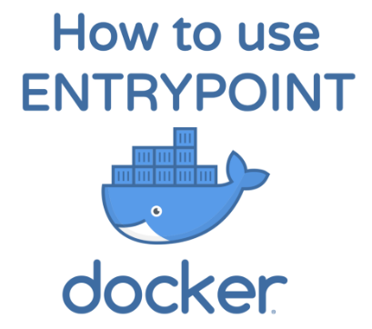

**Entrypoint设置在运行容器时将首先执行的命令和参数。**

在本教程中，我将解释Docker的Entrypoint指令如何工作以及如何在[Dockerfiles](https://www.linuxea.com/tag/dockerfile/)和[Docker Compose](https://www.linuxea.com/tag/docker-compose/)中使用它。这还将介绍一些最佳实践和想法，以便你了解更多信息。

## Entrypoint可以做什么

Entrypoint设置在运行容器时将首先执行的命令和参数。

传递给的任何命令行参数`docker run <image>`都将附加到entrypoint命令，并将覆盖使用的所有指定元素`CMD`。例如，`docker run <image> bash`将命令参数添加`bash`到入口点的末尾。

## Dockerfile ENTRYPOINT

Dockerfiles使用全部大写字母作为入口点指令。有几种方法可以定义它。

#### exec语法

该**exec**的形式是，你所指定的命令和参数作为一个"JSON数组"。这意味着你需要使用双引号而不是单引号。

```
ENTRYPOINT ["executable", "param1", "param2"]
```

使用此语法，Docker将不使用命令shell，这意味着不会发生正常的shell处理。如果需要shell处理功能，则可以使用shell命令启动JSON"数组"。

```
ENTRYPOINT [ "sh", "-c", "echo $HOME" ]
```

#### 使用ENTRYPOINT脚本

另一种选择是使用脚本来运行容器的入口点命令。按照惯例，它通常包含名称中的**入口点**。在此脚本中，你可以设置应用程序以及加载任何配置和环境变量。下面是一个如何使用`ENTRYPOINT` **exec**语法在Dockerfile中运行它的示例。

```
COPY ./docker-entrypoint.sh /
ENTRYPOINT ["/docker-entrypoint.sh"]
CMD ["postgres"]
```

例如，[Postgres官方图像](https://hub.docker.com/_/postgres/)使用以下脚本作为其`ENTRYPOINT`：

```
#!/bin/bash
set -e
if [ "$1" = 'postgres' ]; then
    chown -R postgres "$PGDATA"
if [ -z "$(ls -A "$PGDATA")" ]; then
        gosu postgres initdb
    fi
exec gosu postgres "$@"
fi
exec "$@"
```

我们还可以使用CMD的方式，你可以在[linuxea:白话容器之dockerfile CMD/entrypoint详解3(20)](https://www.linuxea.com/2216.html)中和[linuxea:docker run与exec的使用差异](https://www.linuxea.com/2240.html)查看

### docker compose entrypoint

你在Docker Compose文件中使用的指令是相同的，除了你使用小写字母。

```
entrypoint: /code/entrypoint.sh
```

你还可以在docker-compose.yml中使用列表定义入口点。

```
entrypoint:
    - php
    - -d
    - zend_extension=/usr/local/lib/php/xdebug.so
    - -d
    - memory_limit=-1
    - vendor/bin/phpunit
```

### 覆盖entrypoint

- 你可以使用该`--entrypoint`标志覆盖入口点指令。

  - [`docker run --entrypoint`](https://docs.docker.com/engine/reference/run/#entrypoint-default-command-to-execute-at-runtime)
  - [`docker-compose run --entrypoint`](https://docs.docker.com/compose/reference/run/)

### 语法最佳实践

还有EXEC语法，docker允许shell语法两个中另一个有效的选项`ENTRYPOINT`和`CMD`。这将以字符串形式执行此命令并执行变量替换。

  - `ENTRYPOINT command param1 param2`

可以阅读[Dockerfile](https://docs.docker.com/engine/reference/builder/#usage)这里参考

> 所述`*ENTRYPOINT*`是以 shell 形式防止任何`*CMD*`或`*run*`使用命令行参数覆盖，但是具有缺点
>
> `*ENTRYPOINT*`将被开始作为一个子命令`*/bin/sh -c*`，其不通过信号。这意味着可执行文件不会是容器`*PID 1*`- 并且不会收到Unix信号 - 因此你的可执行文件将不会收到`*SIGTERM*`来自`*docker stop <container>*`
>
> 这些内容在[linuxea:白话容器之dockerfile CMD/entrypoint详解3(20)](https://www.linuxea.com/2216.html)中提到过相同的问题，可以参考

> 如果`*CMD*`用于为`*ENTRYPOINT*`指令提供默认参数，则应使用JSON数组格式指定`*CMD*`和`*ENTRYPOINT*`指令。

## 学习更多

学习如何使用Docker CLI命令，Dockerfile命令，使用Bash命令可以帮助你更有效地使用Docker应用程序。查看Docker文档和我的其他帖子以了解更多信息。

- [docker目录](https://www.linuxea.com/category/big-data/)
- [白话容器](https://www.linuxea.com/tag/%E7%99%BD%E8%AF%9D%E5%AE%B9%E5%99%A8/)

- [dockerfile](https://www.linuxea.com/tag/dockerfile/)