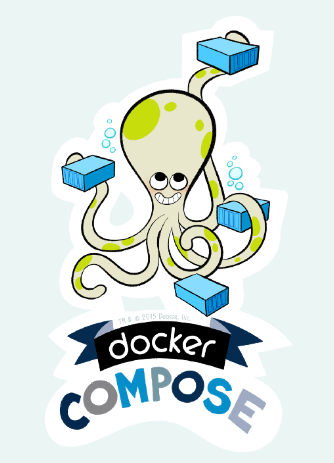

- 前言：

docker公司在2015年[收购fig项目](https://blog.docker.com/2015/02/announcing-docker-compose/)，而在早期fig项目是非常热度的，这比kubermetes要早，fig之所以收到欢迎就是因为，fig提出了容器编排，并且在一定范围解决了"容器编排"

fig被收购后改名为compose，随即成为docker公司最受欢迎的第二大受欢迎的项目，直到今天仍然被很多人使用。

`docker-compose.yml`通过使用`up`和`down`命令启动和停止，并且可以使用docker-compose定义应用程序且可以控制多[容器](https://www.docker.com/what-container)应用程序。

  > Compose是一个用于定义和运行多容器Docker应用程序的工具。使用Compose，你可以使用Compose文件来配置应用程序的服务。然后，使用单个命令，你可以从配置中创建并启动所有服务。-  [docker在Github上地址](https://github.com/docker/compose)

## 与docker命令的相似之处

[docker-compose CLI命令](https://docs.docker.com/compose/reference/)是类似于于[docker](https://docs.docker.com/engine/reference/commandline/docker/)的命令，除了一些与多个[容器和image](https://docs.docker.com/get-started/#image-and-containers)的指令相关的附加内容。特别是，如果你将它们与docker一起使用的时候，以下命令是需要熟悉的：

- [ps,build,pull,push,run,logs](https://docs.docker.com/compose/reference/)

在我发布的[十大Docker命令中](https://www.linuxea.com/2256.html)了解更多关于这些的信息。

## docker-compose up and down

- `docker-compose up`创建和启动容器。在[“ **分离(后台)** ”模式](https://www.linuxea.com/2242.html)（`-d`）中，Compose在启动容器后退出，但容器继续在后台运行。`docker-compose up -d linuxea_nginx`
- [`docker-compose down`](https://docs.docker.com/compose/reference/down/) - 停止并删除容器，网络，image和卷，例如`docker-compose down -v`。这有一些有用的选择：

```
  --rmi type  
  ```
  > 删除images。 类型必须是以下之一：
  > 'all'：删除任何服务使用的所有images。
  > 'local'：仅删除没有`image`字段设置的自定义标记的images。
  ```
  -v, --volumes  
```
>  删除在Compose文件的`volumes`部分中声明的命名卷和附加到容器的匿名卷，匿名卷发生在dockerfile中，我们可以在之外，[覆盖匿名卷](https://www.linuxea.com/2207.html#docker%E7%AE%A1%E7%90%86%E5%8D%B7)。

```
--remove-orphans   
```
>  删除未在Compose文件中定义的服务的容器


## 创建一个Dockerfile

就像运行[docker](https://docs.docker.com/engine/reference/builder/)一样，你需要一个[Dockerfile](https://docs.docker.com/engine/reference/builder/)来指定如何为程序创建镜像和容器。[Ruby on Rails应用程序的Dockerfile](https://docs.docker.com/compose/rails/)示例可以是：

```
  FROM ruby:2.3.3
  RUN apt-get update -qq && apt-get install -y build-essential libpq-dev nodejs
  RUN mkdir /myapp
  WORKDIR /myapp
  COPY Gemfile /myapp/Gemfile
  COPY Gemfile.lock /myapp/Gemfile.lock
  RUN bundle install
  volumes /datalinuxea
  COPY . /myapp
```

该[docker-compose:入门指南](https://docs.docker.com/compose/gettingstarted/)让你一步一步的指示，创建Dockerfile并将其集成到你的docker-compose.yml。

> 如上: volumes /datalinuxea就是匿名卷

## docker-compose.yml:的结构和组件

要定义多容器应用程序，请在项目的根目录中使用[docker-compose.yml](https://docs.docker.com/compose/compose-file/)文件。该[docker-compose文档](https://docs.docker.com/compose/compose-file/)提供详细的解释和指导，了解此文档更好的掌握。以下是一些主要功能的快速入门指南：

在顶部包括版本： `version: "3"`

> 在docker-compose版本中，是有一定的差异，这需要使用者查探问题，如早期的[v3弃用volumes_from](https://www.linuxea.com/1615.html)

然后 `services:`

在此之后，列出要创建的容器，例如每个容器都有配置选项。

- [image](https://docs.docker.com/compose/compose-file/#image)  - 这可能是存储在docker hub中的image，也可能是存储在本地的image

```
  image: ruby:alpine
```

- [depends_on](https://docs.docker.com/compose/compose-file/#depends_on)  - 此容器需要的其他容器，创建父容器也将创建和启动依赖容器。

> 倘若此刻，运行一个LNMP，那么我们首先应该让mariadb 先启动，而后是php，再nginx，depends_on则对这些启动的依赖顺序起到关键的作用。如下所示中，web是以来db和redis，只有db和redis 成功up起来后才会启动web

```
  version: '3'
  services:
    web:
      build: .
      depends_on:
        - db
        - redis
    redis:
      image: redis
    db:
      image: postgres
```

- [environment](https://docs.docker.com/compose/compose-file/#environment)  - 添加环境变量。

```
  environment:
    RACK_ENV: development
    SHOW: 'true'
    SESSION_SECRET:
  environment:
    - RACK_ENV=development
    - SHOW=true
    - SESSION_SECRET
```

- [volumes](https://docs.docker.com/compose/compose-file/#volumes)  - 包括主机路径或命名卷。你可以使用此格式替换容器中的数据，`<path to file>:<path to location in container>`并且可以使用权限（例如  `:ro`，只读）来执行此操作。

```
  version: "3.2"
  services:
    web:
      image: nginx:alpine
      volumes:
        - type: volume
          source: mydata
          target: /data
          volume:
            nocopy: true
        - type: bind
          source: ./static
          target: /opt/app/static
    db:
      image: postgres:latest
      volumes:
        - "/var/run/postgres/postgres.sock:/var/run/postgres/postgres.sock"
        - "dbdata:/var/lib/postgresql/data"
```

- [ports](https://docs.docker.com/compose/compose-file/#ports)  - 指定ports（`HOST:CONTAINER`）或仅指定容器端口（选择短暂的主机端口）。

```
  ports:
   - "3000"
   - "3000-3005"
   - "8000:8000"
   - "9090-9091:8080-8081"
   - "49100:22"
   - "127.0.0.1:8001:8001"
   - "127.0.0.1:5000-5010:5000-5010"
   - "6060:6060/udp" 
```

*有关端口的更多信息，请查看*[*linuxea:简单解释docker的端口和端口暴露(EXPOSE)*](https://www.linuxea.com/2248.html#Docker_Compose_EXPOSE_vs_Prot)*。*

## 了解更多

Docker Compose是运行多容器应用程序的强大工具。有许多方法可以配置你的应用程序`docker-compose.yml`以及其他Docker Compose CLI命令来学习。查看Docker文档和我的其他帖子了解更多信息。

- [docker-compose：入门](https://docs.docker.com/compose/gettingstarted/)
- [docker-compose CLI文档](https://docs.docker.com/compose/reference/overview/)
- [Docker-compose docs：文档](https://docs.docker.com/compose/compose-file/)

### 阅读更多[docker文章](https://www.linuxea.com/category/big-data/)

- [十大Docker命令，你必须了解](https://www.linuxea.com/2256.html)
- [如何过滤和grep Docker容器，image和卷以及如何使用它们](https://www.linuxea.com/2249.html)
- [使用单个命令清理Docker镜像，容器和卷](https://www.linuxea.com/2246.html)

## 学习更多

学习如何使用Docker CLI命令，Dockerfile命令，使用Bash命令可以帮助你更有效地使用Docker应用程序。查看Docker文档和我的其他帖子以了解更多信息。

- [docker目录](https://www.linuxea.com/category/big-data/)
- [白话容器](https://www.linuxea.com/tag/%E7%99%BD%E8%AF%9D%E5%AE%B9%E5%99%A8/)
- [dockerfile](https://www.linuxea.com/tag/dockerfile/)