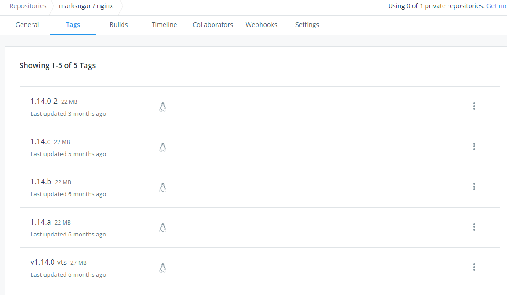

如果你已经开始使用docker，你肯定遇到过docker的标签，他们通常看起来像“my_image_name:v1”,其中冒号后面的部分称为标记，标记image时不总是标记，文下会有解释

## 什么是Docker标签？

那么，Docker标签到底是什么？简单来说，Docker标签传达有关特定images版本/变化的有用信息。它们是image ID的别名，通常如下所示：`965b523dfe25`。这种类似与git的提交版本号。

标签发挥作用的两种最常见的情况是：

1. 构建镜像时，我们使用以下命令：

```
docker build -t username / image_name：tag_name .
```

让我们试着分解一下这个命令的作用。我们告诉Docker守护进程获取当前目录中存在的Docker文件（这就是最后  `.`的目的）。接下来，我们告诉Docker守护程序构建镜像并为其指定标记。如果你运行`docker images`，你应该看到一个存储库是`username/image_name`和标签的image`tag_name`。

`username/image_name `不是指定image名称的强制格式。当你需要将image推送到Docker仓库时，避免再次标记image，这仅作为一个有用的约定。

你的image可以根据需要命名。对于公共Docker仓库，在命名image时，你被限制为两级层次结构。例如，你的image不能具有名称`a/b/c:1.`此限制通常不存在于私有仓库中。如前所述，并非强制要求指定一个`tag_name.`我们将很快看到在这种情况下会发生什么。

2.通过`tag`命令显式标记image。

```
docker tag SOURCE_IMAGE[:TAG] TARGET_IMAGE[:TAG]
```

这个命令只是通过创建的名称的别名（参考）`TARGET_IMAGE `是指`SOURCE_IMAGE.`这就是它所做的一切。这就像为现有image指定另一个名称来引用它。注意标签如何在这里被指定为可选的`[:TAG]` 。

## 如果不指定标签会发生什么？

好的，现在让我们来看看在标记image时没有指定标记时会发生什么。这是`latest`标签进入image的地方。每当image被标记而没有显式标记时，`latest`默认情况下会给出标记。这是一个令人遗憾的命名选择，会引起很多混乱。但我喜欢将它视为未指定image时为image指定的**默认标记**。

`latest`由于期望它是image的最新版本，特别是在Dockerfiles中引起了很多混乱。让我们用一个例子来考虑各种场景：

### 场景1：

假设我们的Dockerfile中存在以下语句：

```
From debian
```

由于我们没有指定任何标记，Docker将添加`latest`标记并尝试拉取image`debian:latest` 。

### 场景2：

```
From debian:9.3
```

由于此处明确提到了标记，因此Docker将拉出标记为9.3的Debian image

另外要记住的是，没有规则说明image只需要一个标签。image可以有多个标签，它们通常用于指定主要版本和次要版本。例如，参考一下：


在撰写本文时，Debian image的最新标记指向9.3版本和9版本。每当主要版本或次要版本碰撞时，image很可能在将来发生变化。

请注意，用于定义版本控制的标记是遵循的约定，但标记不是为此目的而设计的

### 总之，最新的不是特殊标签

到目前为止我们所介绍的主要内容是**最新版本**latest**与其他标签一样**。开发人员有责任正确标记image，以便`latest`始终指向image的最新稳定版本。

因此，我们在拉动image时没有在我们的Dockerfiles中明确指定标记，因为我们最终可能会得到与之前使用的基本image完全不同的版本。 无法保证它是否会出现不同版本自己的差异。 即使旧版本也可以标记为最新版本。

## 学习更多

学习如何使用Docker CLI命令，Dockerfile命令，使用Bash命令可以帮助你更有效地使用Docker应用程序。查看Docker文档和我的其他帖子以了解更多信息。

- [docker目录](https://www.linuxea.com/category/big-data/)
- [白话容器](https://www.linuxea.com/tag/%E7%99%BD%E8%AF%9D%E5%AE%B9%E5%99%A8/)