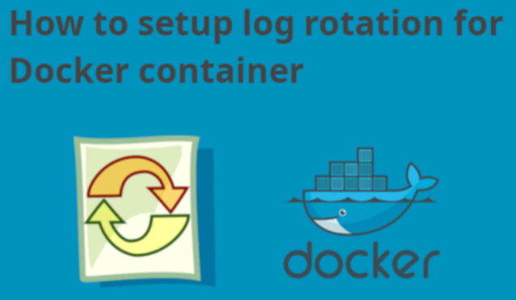

倘若你在使用docker，那么你肯定遇到过这种情况。

- 日志太大占用了磁盘空间
- 有太多了历史日志，查看并不便利

在许多情况下，读取日志在调试时占用了大部分时间。本文介绍如何为Docker容器设置日志轮换。

## 默认日志记录驱动程序

我们可以为容器配置不同的日志驱动程序 默认情况下，容器的**stdout**和**stderr**写在位于*/var/lib/docker/containers/[container-id]/[container-id]-json.log*中的JSON文件中。如果将其置于无人看管状态，则会占用大量磁盘空间，如下所示。


### 手动清除日志

如果此JSON日志文件占用了大量磁盘，我们可以使用以下命令清除它。

```
truncate -s 0 < logfile >
```

我们可以设置一个cronjob来定期清除这些JSON日志文件。但从长远来看，设置日志轮换会更好。

## 设置日志轮换

### 配置默认日志记录驱动程序

这可以通过在*/etc/docker/daemon.json中*添加以下值来*完成*。如果该文件不存在，请创建该文件。

```
[marksugar@www.linuxea.com ~]# cat /etc/docker/daemon.json 
{
  "log-driver": "json-file",
  "log-opts": {
    "max-size": "10m",
    "max-file": "10"
  }
}
```

该*JSON文件*有几个选项，我们甚至可以更改为其他日志驱动器，如*系统日志*。有关更多信息，请参阅[Docker文档 - 配置日志记录驱动程序](https://docs.docker.com/config/containers/logging/configure/)。

执行命令以重新加载更新的*daemon.json*。重新启动后，新配置将应用于所有新创建的容器。

### 配置容器的日志记录驱动程序

如果你不想在全局范围内应用配置，也可以在容器级别上完成配置。

**docker run命令**

我们可以在*docker run*命令中指定日志记录驱动程序和选项。例如：

```
$ docker run \
    --log-driver json-file \
    --log-opt max-size=10m \
    --log-opt max-file=10 \
    alpine echo hello world
```

**使用docker-compose**

还可以使用docker-compose配置日志记录驱动程序和选项。例如：

```
version: '3.2'
services:
  nginx:
    image: 'marksugar/redis:5.0'
    ports:
      - '3306:3306'
    logging:
      driver: "json-file"
      options:
        max-size: "1k"
        max-file: "3"
```

这样一来，就会变成有3个1k的日志文件，多余的会被切割删除掉。

你还可以使用单个文件，通过调整max-size大小决定。

## docker目录转移

如果你的容器非常的多，那么日志量也就会增加，随之而来的问题可能是根目录不够用。我们可以改善这一点

1，首先关闭docker

2，移动docker目录到target location

3，而后做软连接

如下所示：

```
service docker stop   // 关闭docker
mv /var/lib/docker /root/data/docker  //将docker目录移动到/root/data/docker
ln -s /root/data/docker /var/lib/docke  //链接到/var/lib/docker
```

## 学习更多

学习如何使用Docker CLI命令，Dockerfile命令，使用Bash命令可以帮助你更有效地使用Docker应用程序。查看Docker文档和我的其他帖子以了解更多信息。

- [docker目录](https://www.linuxea.com/category/big-data/)
- [白话容器](https://www.linuxea.com/tag/%E7%99%BD%E8%AF%9D%E5%AE%B9%E5%99%A8/)