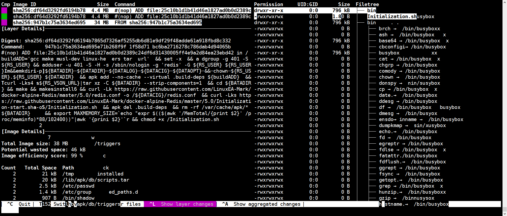
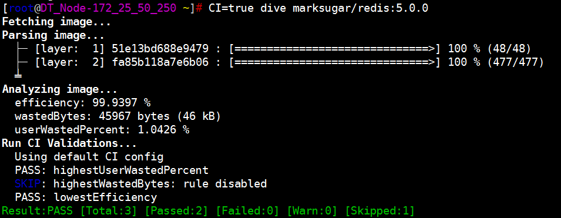
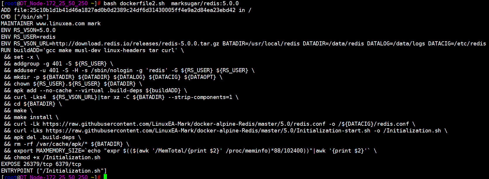

有这么两个场景：

1，当我丢失了原本的Dockfile，我希望找回Dockerfile，但是我只有镜像

2，我希望知道一个镜像中的Dockfile详情

鉴于此，我找到了几种解决方案，大致可以复现出Dockfile的很大一部分的内容，如下：

我们有必要了解[`docker history `](https://docs.docker.com/engine/reference/commandline/history/),但是仅仅使用`docker history --no-trunc`是无法提取完整

- docker环境

```
[marksugar@www.linuxea.com ~]# docker version
Client:
 Version:           18.06.1-ce
 API version:       1.38
 Go version:        go1.10.3
 Git commit:        e68fc7a
 Built:             Tue Aug 21 17:23:03 2018
 OS/Arch:           linux/amd64
 Experimental:      false

Server:
 Engine:
  Version:          18.06.1-ce
  API version:      1.38 (minimum version 1.12)
  Go version:       go1.10.3
  Git commit:       e68fc7a
  Built:            Tue Aug 21 17:25:29 2018
  OS/Arch:          linux/amd64
  Experimental:     false
```

## Dive

[Dive](https://github.com/wagoodman/dive)**用于发现docker镜像，镜像层内容以及发现缩小Docker镜像大小的方法的工具。**

要分析Docker镜像，只需使用图像标记/ id / digest运行潜水：

```
dive <your-image-tag>
```

或者如果你想建立新的，那么直接跳到分析它：

```
dive build -t <some-tag> .
```

建立在Macbook上

```
docker run --rm -it \
      -v /usr/local/bin/docker:/bin/docker \
      -v /var/run/docker.sock:/var/run/docker.sock \
      -v  "$(pwd)":"$(pwd)" \
      -w "$(pwd)" \
      -v "$HOME/.dive.yaml":"$HOME/.dive.yaml" \
      wagoodman/dive:latest build -t <some-tag> .
```

rpm安装

```
curl -OL https://github.com/wagoodman/dive/releases/download/v0.6.0/dive_0.6.0_linux_amd64.rpm 
rpm -i dive_0.6.0_linux_amd64.rpm
```
### Dive查看Dockerfile

使用`dive marksugar/redis:5.0.0 `即可查看，如下图中。相信你也看到了，这里的内容不止于此



### Dive CI

此外，您可以在CI管道中运行此命令，以确保将浪费的空间保持在最低限度（这会跳过UI）：

```
CI=true dive <your-image>
```

ok，我们本来是看Dockfile的，但是也不妨测试一下镜像的质量
使用`CI=true dive marksugar/redis:5.0.0`



## bash解决方案

我们看一下效果

脚本如下：

```
#!/bin/bash
#########################################################################
# File Name: dockerfile.sh
# Author: www.linuxea.com
# Version: 1
# Created Time: Thu 14 Feb 2019 10:52:01 AM CST
#########################################################################
case "$OSTYPE" in
    linux*)
        docker history --no-trunc --format "{{.CreatedBy}}" $1 | # extract information from layers
        tac                                                    | # reverse the file
        sed 's,^\(|3.*\)\?/bin/\(ba\)\?sh -c,RUN,'             | # change /bin/(ba)?sh calls to RUN
        sed 's,^RUN #(nop) *,,'                                | # remove RUN #(nop) calls for ENV,LABEL...
        sed 's,  *&&  *, \\\n \&\& ,g'                           # pretty print multi command lines following Docker best practices
    ;;
    darwin*)
        docker history --no-trunc --format "{{.CreatedBy}}" $1 | # extract information from layers
        tail -r                                                | # reverse the file
        sed -E 's,^(\|3.*)?/bin/(ba)?sh -c,RUN,'               | # change /bin/(ba)?sh calls to RUN
        sed 's,^RUN #(nop) *,,'                                | # remove RUN #(nop) calls for ENV,LABEL...
        sed $'s,  *&&  *, \\\ \\\n \&\& ,g'                      # pretty print multi command lines following Docker best practices
    ;;
    *)
        echo "unknown OSTYPE: $OSTYPE"
    ;;
esac
```

分步说明：

```
docker history --no-trunc --format "{{.CreatedBy}}" $1		从镜像层中提取信息
```

```
tac   														反转文件
```

```
sed 's,^\(|3.*\)\?/bin/\(ba\)\?sh -c,RUN,'    				修改shell调用run的操作
```

```
sed 's,^RUN #(nop) *,,'										'删除/bin/sh调用ENV，LABEL等
```

```
sed 's,  *&&  *, \\\n \&\& ,g   							以更易读的方式打印
```

此运行` bash dockerfile2.sh  CONTAINER_NAME`即可，如：

```
[marksugar@www.linuxea.com ~]# bash dockerfile2.sh  marksugar/redis:5.0.0
```


