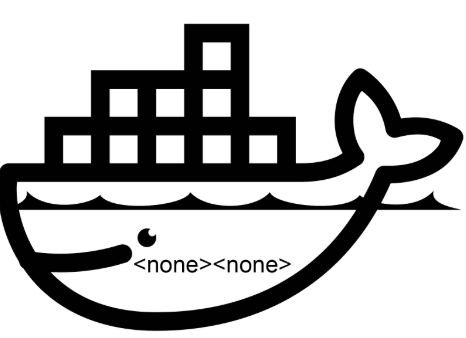
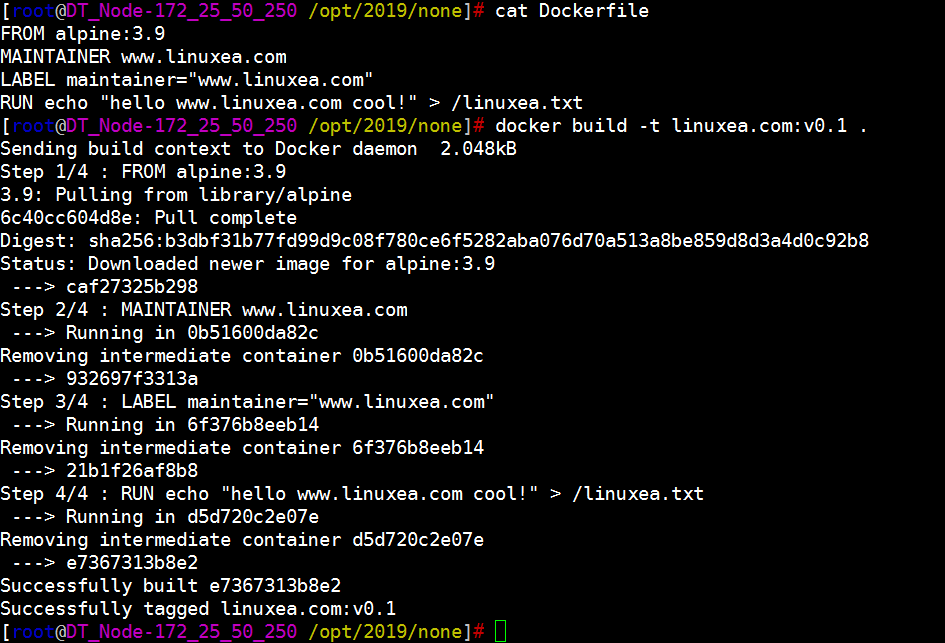
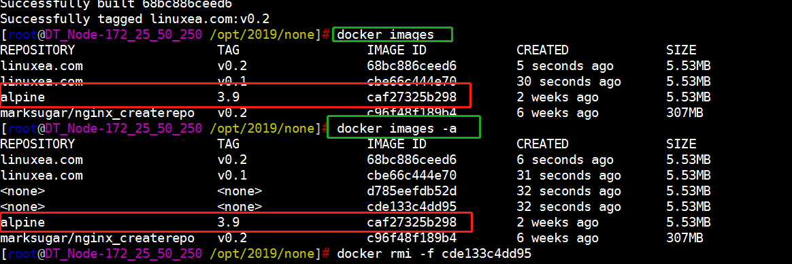
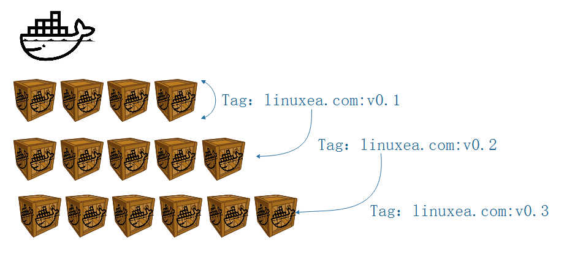

我们在使用docker build的过程中经常会遇到`<none><none>`这类的images状态，那么这篇文章主要来简单的解释它是如何产生的，以及它们的影响，我将尝试解释以下几点：

1，什么是`<none><none>`

2，为什么会存在`<none><none>`

3，`docker images`与`docker images -a`中`<none><none>`区别

以及删除容器出现`Error response from daemon: conflict: unable to delete caf27325b298 (cannot be forced) - image has dependent child images`是怎么 回事

要理解这一点，我们下载一个`alpine:3.9`的镜像来做示例，重现上述提到的这几种`<none>`状态。我先尝试解释，`docker images -a`中的`<none><none>`

## `docker images -a`中的`<none><none>`

编写一个Dockerfile，假设它如下所示：

```
FROM alpine:3.9
MAINTAINER www.linuxea.com
LABEL maintainer="www.linuxea.com"
RUN echo "hello www.linuxea.com cool!" > /linuxea.txt
```

而后我们build

如上，从Step 1/4到Step 4/4经历了四个阶段，每一个阶段分别有一个标识，分别是：

`caf27325b298`，`932697f3313a`，`21b1f26af8b8`，`e7367313b8e2`如下图：

```
Step 1/4 : FROM alpine:3.9
3.9: Pulling from library/alpine
6c40cc604d8e: Pull complete 
 ---> caf27325b298
Step 2/4 : MAINTAINER www.linuxea.com
 ---> Running in 0b51600da82c
Removing intermediate container 0b51600da82c
 ---> 932697f3313a
Step 3/4 : LABEL maintainer="www.linuxea.com"
 ---> Running in 6f376b8eeb14
Removing intermediate container 6f376b8eeb14
 ---> 21b1f26af8b8
Step 4/4 : RUN echo "hello www.linuxea.com cool!" > /linuxea.txt
 ---> Running in d5d720c2e07e
Removing intermediate container d5d720c2e07e
 ---> e7367313b8e2
```

这些只读层，从上往下执行，第一个执行完成，执行第二个，一个接一个地运行Dockerfile中的指令，每个层都代表一个Dockerfile指令。这些层是堆叠的，每个层都是前一层变化的增量。在必要时将每条指令的结果提交给新镜像层，最后输出新镜像层的ID。Docker守护程序将自动清理发送的上下文。

- 每条指令创建一个层：

```
FROM alpine:3.9
MAINTAINER www.linuxea.com
LABEL maintainer="www.linuxea.com"
RUN echo "hello www.linuxea.com cool!" > /linuxea.txt
```

- `FROM`从`alpine:3.9`Docker镜像创建一个图层。
- `MAINTAINER` 添加info信息
- `LABE` 添加标签
- `RUN` 指定在容器中运行的echo命令。

>  请注意，每条指令都是独立运行的，会导致创建新镜像层 - 因此` echo "hello www.linuxea.com cool!" > /linuxea.txt`不会对下一条指令产生任何影响。

>  只要有可能，Docker将重新使用中间图像（缓存），以`docker build`显着加速该过程。这由`Using cache`控制台输出中的消息指示。（有关详细信息，请参阅[构建高速缓存段](https://docs.docker.com/engine/userguide/eng-image/dockerfile_best-practices/#build-cache)的 `Dockerfile`最佳实践指南）
>
> 这其中最有意思的还是--cache-from，缓存重用

但我们了解上述的表达后，我们使用[docker history](https://docs.docker.com/engine/reference/commandline/history/)在看镜像的中间层

```
[marksugar@www.linuxea.com /opt/2019/none]# docker history linuxea.com:v0.1
IMAGE               CREATED             CREATED BY                                      SIZE                COMMENT
e7367313b8e2        2 hours ago         /bin/sh -c echo "hello www.linuxea.com cool!…   28B                 
21b1f26af8b8        2 hours ago         /bin/sh -c #(nop)  LABEL maintainer=www.linu…   0B                  
932697f3313a        2 hours ago         /bin/sh -c #(nop)  MAINTAINER www.linuxea.com   0B                  
caf27325b298        2 weeks ago         /bin/sh -c #(nop)  CMD ["/bin/sh"]              0B                  
<missing>           2 weeks ago         /bin/sh -c #(nop) ADD file:2a1fc9351afe35698…   5.53MB   
```
而这些中间层在构建之后会存放在这里，供给给最上面的读写层。

此时，如果使用`docker images -a`你会看到`<none><none>` ，这些`<none><none>`是镜像的中间层，只会在Build的时候产生在本地，并且不能被删除。

如果此时，根据`IMAGE ID`来删除基础镜像便会提示`Error response from daemon: conflict: unable to delete caf27325b298 (cannot be forced) - image has dependent child images`



正确的删除方式是通过镜像REPOSITORY:TAG进行删除依赖的镜像

```
[marksugar@www.linuxea.com /opt/2019/none]# docker rmi -f alpine:3.9
Untagged: alpine:3.9
Untagged: alpine@sha256:b3dbf31b77fd99d9c08f780ce6f5282aba076d70a513a8be859d8d3a4d0c92b8
```
## docker images `<none><none>`

我们在来看第二种场景，`docker images`中的`none`

我们准备三个Dockerfile，如下

```
FROM alpine:3.9
MAINTAINER www.linuxea.com
LABEL maintainer="www.linuxea.com"
RUN echo "hello www.linuxea.com cool!" > /linuxea.txt
```

```
FROM alpine:3.9
MAINTAINER www.linuxea.com
LABEL maintainer="www.linuxea.com"
RUN echo "hello www.linuxea.com cool!" > /linuxea.txt
RUN echo "hello www.linuxea.com good!" >> /linuxea.txt
```

```
FROM alpine:3.9
MAINTAINER www.linuxea.com
RUN echo "hello www.linuxea.com see you!" >> /linuxea.txt
LABEL maintainer="www.linuxea.com"
RUN echo "hello www.linuxea.com cool!" >> /linuxea.txt
RUN echo "hello www.linuxea.com good!" >> /linuxea.txt
```

第一个build命名`linuxea.com:v0.1`，第二个命名`linuxea.com:v0.2`，第三个build命名到`linuxea.com:v0.3`

我们会得到三个镜像

```
[root@DT_Node-172_25_50_250 /opt/2019/none]# docker images
REPOSITORY                   TAG                 IMAGE ID            CREATED             SIZE
linuxea.com                  v0.3                9ba68f247813        5 seconds ago       5.53MB
linuxea.com                  v0.2                f14e080bbad1        35 seconds ago      5.53MB
linuxea.com                  v0.1                00a0fad355c1        53 seconds ago      5.53MB
alpine                       3.9                 caf27325b298        2 weeks ago         5.53MB
```

而后在将第三个`Dockerfile build`成`linuxea.com:v0.2`

```
[marksugar@www.linuxea.com /opt/2019/none]# docker build -t  linuxea.com:v0.2 .
```

此时就出现了一个`<none> <none> `，并且iD是之前的`f14e080bbad1`，也就是之前的`linuxea.com:v0.2`

```
[marksugar@www.linuxea.com /opt/2019/none]# docker images
REPOSITORY                   TAG                 IMAGE ID            CREATED              SIZE
linuxea.com                  v0.2                9ba68f247813        About a minute ago   5.53MB
linuxea.com                  v0.3                9ba68f247813        About a minute ago   5.53MB
<none>                       <none>              f14e080bbad1        About a minute ago   5.53MB
linuxea.com                  v0.1                00a0fad355c1        2 minutes ago        5.53MB
alpine                       3.9                 caf27325b298        2 weeks ago          5.53MB
```

这又是为什么？我们来大胆的想象一下，如下图：



上图中标识每次构建都基于上次构建的层之上进行，如果相同就复用。在最后我们使用`docker build -t  linuxea.com:v0.2 .`事实上是将原本的`linuxea.com:v0.2`标记到`linuxea.com:v0.3`的IMAGE ID，而原本的`linuxea.com:v0.2`就变成了`<none><none>`，这也就解释了`<none><none>`的IMAGE ID是f14e080bbad1，和之前的`linuxea.com:v0.2`一样。而`<none><none>`这样的镜像是可以通过REPOSITORY:TAG删除的。

我想我已经解释明白了开头的三点`<none><none>`。

## 学习更多

学习如何使用Docker CLI命令，Dockerfile命令，使用Bash命令可以帮助你更有效地使用Docker应用程序。查看Docker文档和我的其他帖子以了解更多信息。

- [docker目录](https://www.linuxea.com/category/big-data/)
- [白话容器](https://www.linuxea.com/tag/%E7%99%BD%E8%AF%9D%E5%AE%B9%E5%99%A8/)
- [docker-compose](https://www.linuxea.com/tag/docker-compose/)