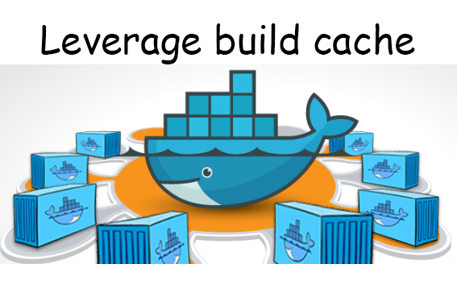
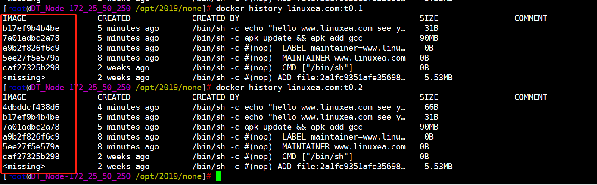

在本文中，你将学习如何使用[docker 构建缓存](https://docs.docker.com/develop/develop-images/dockerfile_best-practices/#Leverage%20build%20cache)。

## Caching

Docker的优势之一是它提供了缓存，可帮助你更快地迭代镜像构建。

构建映像时，Docker会逐步执行Dockerfile中的指令，按顺序执行每个指令。在检查每条指令时，Docker在其缓存中查找现有的中间镜像，它可以重复使用而不是创建新的（重复的）中间镜像。

如果缓存无效，则使其无效的指令和所有后续Dockerfile指令都会生成新的中间映像。一旦缓存失效，就可以使用Dockerfile中的其余指令。

所以从Dockerfile的顶部开始，如果基本映像已经在缓存中，则重用它。否则，缓存无效。

然后将下一条指令与从该基本镜像导出的高速缓存中的所有子镜像进行比较。比较每个缓存的中间镜像以查看指令是否找到缓存命中。如果是高速缓存未命中，则高速缓存无效。重复相同的过程，直到达到Dockerfile的末尾。

大多数新指令只是与中间镜像中的指令进行比较。如果匹配，则使用缓存副本。

例如，当`RUN pip install -r requirements.txt`在Dockerfile中找到指令时，Docker会在其本地缓存的中间镜像中搜索相同的指令。旧的和新的*requirements.txt*文件的内容不进行比较。

如果使用新软件包更新*requirements.txt*文件并使用`RUN pip install`并希望使用新软件包名称重新运行软件包安装，则此行为可能会出现问题。我马上就会展示一些解决方案。

与其他Docker指令不同，ADD和COPY指令确实需要Docker查看文件的内容以确定是否存在缓存命中。将引用文件的校验和与现有中间镜像中的校验和进行比较，在这些校验和中不考虑文件的最后修改时间和最后访问时间。如果文件内容或元数据已更改，则缓存无效。

除了`ADD`和`COPY`命令之外，缓存检查不会查看容器中的文件来确定缓存匹配。例如，在处理`RUN apt-get -y update`命令时，不检查容器中更新的文件以确定是否存在缓存命中。在这种情况下，只需使用命令字符串本身来查找匹配项。

以下是有效使用缓存的一些提示。

- 缓存可以通过将关闭`--no-cache=True`与`docker build`。
- 如果你要对指令进行更改，则后续的每个层都将经常重建。要利用缓存，请将可能更改的指令放在Dockerfile中尽可能低的位置。
- Chain `RUN apt-get update`和`apt-get install`命令，以避免缓存未命中问题。
- 如果你正在使用包装安装程序（如pip和*requirements.txt*文件），请按照下面的模型进行操作，以确保你没有收到带有*requirements.txt中*列出的旧包的陈旧中间映像。

```
COPY requirements.txt /tmp/
RUN pip install -r /tmp/requirements.txt
COPY . /tmp/
```

一旦高速缓存失效，所有后续`Dockerfile`命令都会生成新图像，并且不使用缓存。

### 如何利用缓存？

如何利用缓存来快速的构建？

为了演示这一点，我们构建一个镜像，Dockerfile如下：

```
[marksugar@www.linuxea.com /opt/2019/none]# cat Dockerfile
FROM alpine:3.9
MAINTAINER www.linuxea.com
LABEL maintainer="www.linuxea.com"
RUN apk update \
&& apk add gcc 
RUN echo "hello www.linuxea.com see you!" >> /linuxea.txt
```

其中，在update后安装了gcc，并且`echo "hello www.linuxea.com see you!" >> /linuxea.txt`中，而后开始build

```
[marksugar@www.linuxea.com /opt/2019/none]# docker build -t linuxea.com:t0.1 .
Sending build context to Docker daemon   5.12kB
Step 1/5 : FROM alpine:3.9
 ---> caf27325b298
Step 2/5 : MAINTAINER www.linuxea.com
 ---> Using cache
 ---> 5ee27f5e579a
Step 3/5 : LABEL maintainer="www.linuxea.com"
 ---> Using cache
 ---> a9b2f826f6c9
Step 4/5 : RUN apk update && apk add gcc
 ---> Running in 79fc02b7c52d
fetch http://dl-cdn.alpinelinux.org/alpine/v3.9/main/x86_64/APKINDEX.tar.gz
fetch http://dl-cdn.alpinelinux.org/alpine/v3.9/community/x86_64/APKINDEX.tar.gz
v3.9.0-28-g04484bcf48 [http://dl-cdn.alpinelinux.org/alpine/v3.9/main]
v3.9.0-27-g022fc53172 [http://dl-cdn.alpinelinux.org/alpine/v3.9/community]
OK: 9751 distinct packages available
(1/10) Installing binutils (2.31.1-r2)
(2/10) Installing gmp (6.1.2-r1)
(3/10) Installing isl (0.18-r0)
(4/10) Installing libgomp (8.2.0-r2)
(5/10) Installing libatomic (8.2.0-r2)
(6/10) Installing libgcc (8.2.0-r2)
(7/10) Installing mpfr3 (3.1.5-r1)
(8/10) Installing mpc1 (1.0.3-r1)
(9/10) Installing libstdc++ (8.2.0-r2)
(10/10) Installing gcc (8.2.0-r2)
Executing busybox-1.29.3-r10.trigger
OK: 92 MiB in 24 packages
Removing intermediate container 79fc02b7c52d
 ---> 7a01adbc2a78
Step 5/5 : RUN echo "hello www.linuxea.com see you!" >> /linuxea.txt
 ---> Running in 52ada0971e54
Removing intermediate container 52ada0971e54
 ---> b17ef9b4b4be
Successfully built b17ef9b4b4be
Successfully tagged linuxea.com:t0.1
```

那么现在就有一个`linuxea.com:t0.1`的镜像

```
[marksugar@www.linuxea.com /opt/2019/none]# docker images
REPOSITORY                   TAG                 IMAGE ID            CREATED              SIZE
linuxea.com                  t0.1                b17ef9b4b4be        2 minutes ago        95.6MB
```

此后，我们在修改了Dockerfile，添加了`RUN echo "hello www.linuxea.com see you two!" >> /linuxea.txt`

```
[marksugar@www.linuxea.com /opt/2019/none]# cat Dockerfile
FROM alpine:3.9
MAINTAINER www.linuxea.com
LABEL maintainer="www.linuxea.com"
RUN apk update \
&& apk add gcc
RUN echo "hello www.linuxea.com see you!" >> /linuxea.txt
RUN echo "hello www.linuxea.com see you two!" >> /linuxea.txt
```

重新build

```
[marksugar@www.linuxea.com /opt/2019/none]# docker build -t linuxea.com:t0.2 .
Sending build context to Docker daemon   5.12kB
Step 1/6 : FROM alpine:3.9
 ---> caf27325b298
Step 2/6 : MAINTAINER www.linuxea.com
 ---> Using cache
 ---> 5ee27f5e579a
Step 3/6 : LABEL maintainer="www.linuxea.com"
 ---> Using cache
 ---> a9b2f826f6c9
Step 4/6 : RUN apk update && apk add gcc
 ---> Using cache
 ---> 7a01adbc2a78
Step 5/6 : RUN echo "hello www.linuxea.com see you!" >> /linuxea.txt
 ---> Using cache
 ---> b17ef9b4b4be
Step 6/6 : RUN echo "hello www.linuxea.com see you two!" >> /linuxea.txt
 ---> Running in fe4dc61a4e1b
Removing intermediate container fe4dc61a4e1b
 ---> 4dbddcf438d6
Successfully built 4dbddcf438d6
Successfully tagged linuxea.com:t0.2
```

- 你看到了什么？

在第二次build的时候，并没有看到`RUN apk update && apk add gcc`的安装过程，而是使用了此前创建的缓存中间层，如下：

