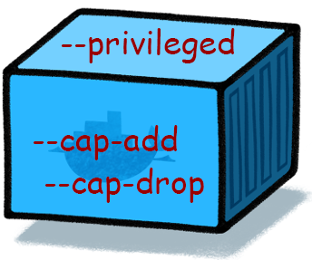

你可能希望在容器中执行的一些高级操作（例如Docker-in-Docker（DinD），NTP，安装环回设备等），默认情况下将需要比给予容器的root用户更高的权限。因此，需要允许其他特权才能使容器无问题地运行，因此对于该用例，Docker具有非常简单但非常宽泛的特权模式，可将完整主机的功能添加到容器中。要使用此模式，只是追加--privileged到docker run命令：

Docker-in-Docker（通常称为DinD）是一种容器的特殊配置，允许你在已经在Docker引擎上运行但不共享Docker套接字的容器内运行Docker引擎，这允许（如果预防措施是在你的基础架构中构建已经容器化的容器的更安全和强大的方法。此配置的流行程度有点罕见，但在用作持续集成（CI）和持续交付（CD）设置的一部分时非常强大。

没有额外特权的NTP守护进程，看看会发生什么

```
[marksugar@www.linuxea.com ~]# run -it \
--rm \
cguenther/ntpd
ntpd: can't set priority: Permission denied
reset adjtime failed: Operation not permitted
creating new /var/db/ntpd.drift
adjtimex failed: Operation not permitted
adjtimex adjusted frequency by 0.000000ppm
ntp engine ready
reply from 139.99.97.88: offset -0.010032 delay 0.040738, next query 5s
settimeofday: Operation not permitted
reply from 210.23.25.77: offset -0.003515 delay 0.043521, next query 9s
reply from 139.99.41.7: offset -0.017110 delay 0.044403, next query 9s
reply from 139.99.97.88: offset -0.012315 delay 0.045440, next query 6s
reply from 210.23.25.77: offset -0.008560 delay 0.053329, next query 6s
reply from 139.99.97.88: offset -0.007878 delay 0.036450, next query 8s
```

那现在我使用特权模式

```
[marksugar@www.linuxea.com ~]#  docker run -it  --rm --privileged    cguenther/ntpd
creating new /var/db/ntpd.drift
adjtimex adjusted frequency by 0.000000ppm
ntp engine ready
reply from 128.199.87.57: offset -0.007699 delay 0.036460, next query 9s
set local clock to Mon Feb 18 08:10:32 UTC 2019 (offset -0.007699s)
reply from 210.23.25.77: offset 0.005943 delay 0.029169, next query 8s
reply from 183.177.72.201: offset 0.018927 delay 0.052242, next query 7s
reply from 183.177.72.201: offset 0.020719 delay 0.066146, next query 8s
reply from 210.23.25.77: offset 0.000334 delay 0.056709, next query 9s
```

如你所见，添加此标志会从输出中删除所有错误，因为我们现在可以更改系统时间。通过解释此模式的功能，我们现在可以讨论为什么理想情况下，如果可能，你永远不应该使用特权模式。默认情况下，特权模式允许几乎完全访问大多数主机系统，并且在大多数情况下都不够精确，因此在你发现容器需要其他权限后，你应该选择性地添加它们--cap-add。这些标志是标准的Linux功能标识符，你可以在http://man7.org/linux/man-pages/man7/capabilities.7.html等位置找到它们，并允许微调到你想要的访问级别。如果我们现在将我们之前的NTP守护程序示例转换为这种新样式，它应该看起来更像这样：

```
[marksugar@www.linuxea.com ~]# docker run -it --rm  cguenther/ntpd
ntpd: can't set priority: Permission denied
reset adjtime failed: Operation not permitted
creating new /var/db/ntpd.drift
adjtimex failed: Operation not permitted
adjtimex adjusted frequency by 0.000000ppm
ntp engine ready
```

现在增加了SYS_TIME功能

```
[marksugar@www.linuxea.com ~]# docker run -it --rm --cap-add SYS_TIME       cguenther/ntpd
ntpd: can't set priority: Permission denied
creating new /var/db/ntpd.drift
adjtimex adjusted frequency by 0.000000ppm
ntp engine ready
reply from 209.58.172.140: offset 0.028803 delay 0.044228, next query 5s
set local clock to Mon Feb 18 08:29:25 UTC 2019 (offset 0.028803s)
reply from 202.73.57.107: offset -0.027237 delay 0.113698, next query 7s
reply from 103.114.160.109: offset 0.000547 delay 0.210185, next query 8s
```

如果你注意到，由于另一个缺少功能，我们仍然可以看到错误，但settimeofday 错误  消失了，这是我们需要修复此容器运行的最重要问题。

有趣的是，--cap-drop如果我们想要提高安全性，我们也可以从我们的容器中删除未使用的功能。对于此标志，还有一个特殊关键字，ALL可用于删除所有可用权限。如果我们使用它来完全锁定我们的NTP容器，但一切正常，让我们看看它会是什么样子：

```
[marksugar@www.linuxea.com ~]# docker run -it \
> --rm \
> --cap-drop ALL \
> --cap-add SYS_TIME \
> --cap-add SYS_CHROOT \
> --cap-add SETUID \
> --cap-add SETGID \
> --cap-add SYS_NICE \
> cguenther/ntpd
creating new /var/db/ntpd.drift
adjtimex adjusted frequency by 0.000000ppm
ntp engine ready
reply from 139.162.12.72: offset -0.013927 delay 0.036491, next query 7s
set local clock to Mon Feb 18 08:33:24 UTC 2019 (offset -0.013927s)
reply from 209.58.172.140: offset 0.021554 delay 0.030414, next query 5s
reply from 183.177.72.202: offset 0.006347 delay 0.043784, next query 7s
reply from 209.58.172.140: offset 0.029093 delay 0.043691, next query 8s
reply from 139.162.12.72: offset 0.000467 delay 0.037517, next query 9s
reply from 183.177.72.202: offset 0.013560 delay 0.059300, next query 5s
reply from 183.177.72.202: offset 0.014058 delay 0.057387, next query 5s
reply from 209.58.172.140: offset 0.028728 delay 0.045038, next query 5s
reply from 139.162.12.72: offset 0.000349 delay 0.038627, next query 5s
peer 183.177.72.202 now valid
reply from 183.177.72.202: offset 0.011139 delay 0.063721, next query 5s
peer 209.58.172.140 now valid
reply from 209.58.172.140: offset 0.029599 delay 0.043637, next query 9s
```

在这里，我们首先删除了所有功能，然后添加了运行容器所需的几个功能，正如你所看到的，情况正常。在你自己的部署中，我强烈建议如果你有备用开发容量或面向安全性，请花一些时间以这种方式锁定正在运行的容器，因为它们会更加安全，你将更加确信容器以最小特权原则运行。

在最小权限原则是在计算机安全，你只允许运行到用户或服务组件所需的最低权限的概念。这个原则是高安全性实现的主要原因，但由于管理访问的假设开销，往往在其他地方找不到，即使它是提高系统安全性和稳定性的好方法。如果你想了解有关此概念的更多信息，请查看[最小特权原则](https://en.wikipedia.org/wiki/Principle_of_least_privilege)。

另外，永远不要在所有接口上绑定Docker守护程序。`--host=tcp://0.0.0.0:2375`不需要绑定到TCP端口，因为*unix*套接字已经通过使用映射`--host=unix:///var/run/docker.sock`。这将导致一些安全隐患。

## 学习更多

学习如何使用Docker CLI命令，Dockerfile命令，使用Bash命令可以帮助你更有效地使用Docker应用程序。查看Docker文档和我的其他帖子以了解更多信息。

- [docker目录](https://www.linuxea.com/category/big-data/)
- [白话容器](https://www.linuxea.com/tag/%E7%99%BD%E8%AF%9D%E5%AE%B9%E5%99%A8/)
- [docker-compose](https://www.linuxea.com/tag/docker-compose/)