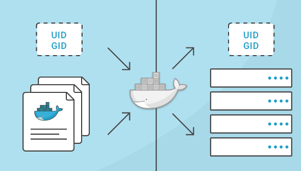

了解用户名，组名，用户ID（uid）和组ID（gid）如何在容器内运行的进程与主机系统之间进行映射对于构建安全系统非常重要。如果没有提供任何其他选项，容器中的进程将以root身份执行（除非在Dockerfile中提供了不同的uid）。本文将解释这是如何工作的，如何正确授予权限并显示示例来说明。

## 逐步分析uid/gid安全性

首先，让我们回顾一下如何实现uid和gid。linux内核负责管理uid和gid空间，它的内核级系统调用用于确定是否应该授予所请求的权限。例如，当进程尝试写入文件时，内核会检查创建该进程的uid和gid，以确定它是否具有足够的权限来修改该文件。这里不使用用户名，使用uid。

在服务器上运行Docker容器时，仍然只有一个内核。容器化带来的巨大价值在于所有这些独立的进程可以继续共享单个内核。这意味着即使在运行Docker容器的服务器上，整个uids和gids也由单个内核控制。

所以你不能让不同的用户在不同的容器中使用相同的uid。这是因为在常见的linux工具中显示的用户名（和组名）不是内核的一部分，而是由外部工具（/etc/passwd，LDAP，Kerberos等）管理。因此，你可能会看到不同的用户名，但即使在不同的容器内，你也无法为同一个uid/gid拥有不同的权限。这一开始看起来很混乱，所以让我们用几个例子说明一下：

### 简单的Docker运行

我将首先以docker组中的普通用户（linuxea）身份登录服务器。这允许我在不使用sudo命令的情况下启动docker容器。然后，从容器外部，让我们看看这个过程是如何出现的。

```
[root@www-linuxea-com ~]# useradd linuxea -G docker
[marksugar@www.linuxea.com ~]# su - linuxea
```

```
[marksugar@www.linuxea.com ~]$ docker run -d alpine:3.9 sleep 10000
e18b6e93b21a30f095ca0c6cbfbd0762dcbc220b3c057a7233c5371fe4f40c47
```

```
[marksugar@www.linuxea.com ~]$ ps aux|grep sleep
root      7145  0.5  0.0   1520     4 ?        Ss   15:57   0:00 sleep 10000
linuxea   7203  0.0  0.1 112716  2192 pts/0    S+   15:58   0:00 grep --color=auto sleep
```

这很有趣。即使我从未输入sudo并且我不是root用户，我执行的sleep命令也以root用户身份启动并具有root权限。我怎么知道它有root权限？容器内的root = =容器外的root吗？

是的，因为，正如我所提到的，有一个内核和一个共享的uids和gids池。因为用户名在容器外部显示为“root”，所以我可以肯定地知道容器内的进程是由具有uid = 0的用户启动的。

### 具有已定义用户的Dockerfile

当我在Dockerfile中创建不同的用户并以该用户身份启动命令时会发生什么？为了简化这个例子，我没有在这里指定一个gid，但同样的概念适用于组ID。

首先，我将这些命令作为用户“linuxea”运行，其uid为1001。

```
[marksugar@www.linuxea.com ~]$ echo $UID
1001
```

Dockerfile

```
[marksugar@www.linuxea.com ~]$ cat Dockerfile 
FROM alpine:latest
MAINTAINER www.linuxea.com mark
RUN addgroup www && adduser -u 1001 -S -H -s /sbin/nologin -g 'nginx' -G www www
USER www
ENTRYPOINT ["sleep","30000"]
```

让我们构建并运行它：

```
[marksugar@www.linuxea.com ~]$ docker build -t test .
Sending build context to Docker daemon  6.656kB
Step 1/5 : FROM alpine:latest
 ---> caf27325b298
Step 2/5 : MAINTAINER www.linuxea.com mark
 ---> Using cache
 ---> 97c60ecc6438
Step 3/5 : RUN addgroup www && adduser -u 1001 -S -H -s /sbin/nologin -g 'nginx' -G www www
 ---> Running in dd3eaaa2d820
Removing intermediate container dd3eaaa2d820
 ---> 1a81d642cab6
Step 4/5 : USER www
 ---> Running in fedfcda0d798
Removing intermediate container fedfcda0d798
 ---> fc564057218b
Step 5/5 : ENTRYPOINT ["sleep","30000"]
 ---> Running in a87dfbe5edd8
Removing intermediate container a87dfbe5edd8
 ---> 0b28fd7c7ad1
Successfully built 0b28fd7c7ad1
Successfully tagged test:latest
```

```
[marksugar@www.linuxea.com ~]$ docker run -d test
06494798ce210032582e21a2b3f990fcdfe3e9623402c41bd78f4c22fa5ce518
```

```
[marksugar@www.linuxea.com ~]$ ps aux|grep sleep
linuxea  10652  0.1  0.0   1520     4 ?        Ss   16:42   0:00 sleep 30000
linuxea  10716  0.0  0.1 112716  2144 pts/0    S+   16:42   0:00 grep --color=auto sleep
```

```
[marksugar@www.linuxea.com ~]$ docker exec -i 0649 ps aux|grep sleep
    1 www       0:00 sleep 30000
```
### ?
到底发生了什么，这表明了什么？我构建了一个Docker镜像，其用户名为“www”，该用户的定义uid为1001.在我的测试服务器上，我正在使用的帐户名为“linuxea”，它的uid为1001。我启动容器，sleep命令作为www执行，因为Dockerfile包含“ADDUSER www”行。但这实际上并没有使它作为www运行，它使它作为用户的uid运行，Docker镜像是已知www用户是自己的用户的。

当我检查在容器外部运行的进程时，我看到它被映射到用户“linuxea”，但是在容器内部它被映射到用户“www”。这两个用户名只显示其执行上下文已知的用户名映射到1001。

这不是非常重要的。但重要的是要知道在容器内部，***用户“www”从容器外获取用户“linuxea”的权限和特权。在linux主机上向用户linuxea或uid 1001授予权限也将授予容器内www的这些权限***。

### 如何控制容器的访问权限

另一种选择是运行docker容器并指定用户名或uid，以及运行时的组名或gid。

再次使用上面的初始示例。

```
[marksugar@www.linuxea.com ~]$ docker run -d --user 1001 alpine:3.9 sleep 30001
b197a816bdc0a71060331e2b5a6701432cce786161e2d9939dd3a50eabf0fa9b
```

```
[marksugar@www.linuxea.com ~]$ ps aux|grep sleep
linuxea  12071  0.7  0.0   1520     4 ?        Ss   17:01   0:00 sleep 30001
linuxea  12131  0.0  0.1 112716  2216 pts/0    S+   17:01   0:00 grep --color=auto sleep
```

我在这做什么?

我创建了容器以作为1001用户启动。因此，当我执行诸如ps或top（或大多数监视工具）之类的命令时，该过程将映射到“linuxea”用户。

有趣的是，当我执行到该容器时，你可以看到1001用户在/etc/passwd文件中没有条目，并在容器的bash提示符中显示为“I have no name！”。

现在我使用ubuntu

```
[marksugar@www.linuxea.com ~]$ docker run -d --user 1001 ubuntu:19.04 sleep 30001
a658a0a5b49db14831d83b792413dc0cc08112877c64ffb2006c4c0e716a83f4
```

```
[marksugar@www.linuxea.com ~]$ docker exec -it a65 bash
I have no name!@a658a0a5b49d:/$ 
```

需要注意的是，在创建容器时指定用户标志也会覆盖Dockerfile中的该值。还记得第二个例子，我使用的Dockerfile有一个映射到本地主机上不同用户名的uid吗？当我们在命令行上使用用户标志运行它以启动执行“sleep 30000”过程的容器时会发生什么？

```
[marksugar@www.linuxea.com ~]$ docker run -d test
25a0cdc509b2d56185fd42046249d2b53c3a84e393f76c1ca304e552b5ab1058
[marksugar@www.linuxea.com ~]$ ps aux|grep sleep
linuxea  14157  0.6  0.0   1520     4 ?        Ss   17:18   0:00 sleep 30000
linuxea  14215  0.0  0.1 112716  2144 pts/1    S+   17:18   0:00 grep --color=auto sleep
```

```
[marksugar@www.linuxea.com ~]$ docker run -d --user 0 test
5dc20cacd8d8c075c3e0ba910a72b36c16b851ef9a7ef56a4d90a2c97d148dc6
[marksugar@www.linuxea.com ~]$ ps aux|grep sleep
linuxea  14157  0.1  0.0   1520     4 ?        Ss   17:18   0:00 sleep 30000
root     14275  3.0  0.0   1520     4 ?        Ss   17:18   0:00 sleep 30000
linuxea  14330  0.0  0.1 112716  2216 pts/1    S+   17:18   0:00 grep --color=auto sleep
```

在上面的最后一个例子中，你可以看到我最终有2个容器运行睡眠过程，一个用作“linuxea”，另一个用作“root”。这是因为第二个命令通过`--user`在命令行上传递标志来更改uid 。

## 权限测试

为了更好的验证这些，我们来测试一下。众所周知，普通用户是无法删除root用户创建的文件的

```
[marksugar@www.linuxea.com /opt]$ \rm -rf 2
rm: cannot remove ‘2’: Permission denied
```

如果此时，我们将这些文件挂载到容器内，请注意，我通过不同的用户ID挂载后，进行删除

- user=0

```
[marksugar@www.linuxea.com ~]$ docker run -d --user=0 -v /opt:/opt test
```

```
[marksugar@www.linuxea.com ~]$ docker exec -it modest_newton sh
/ # cd /opt/
/opt # ls
1     2     2019
/opt # \rm -rf 1
/opt # ls
2     2019
/opt # 
```

使用--user=0后进行挂载，可以顺利删除root创建的目录

- user=1001

```
[marksugar@www.linuxea.com /opt]$ docker run -d --user=1001 -v /opt:/opt test
a4663d98c6e89f5c4af0f34516f0c4efe48a6fa881af881da5d8fd4029d9ccf8
```

```
[marksugar@www.linuxea.com /opt]$ docker exec -it a46 sh
/ $ cd /opt/
/opt $ ls
2     2019
/opt $ ls -l
total 4
-rw-r--r--    1 root     root          3784 Feb 15 06:44 2
drwxr-xr-x    4 root     root           174 Feb 19 02:35 2019
/opt $ \rm -rf 2
rm: can't remove '2': Permission denied
```

显而易见，单单从上述来看，普通用户似乎更为安全

为了改善这一点，我们可以使用券权限来解决，仍然使用--user=0，挂在的/opt权限是ro，这样就不能被删除了。如下：

```
[marksugar@www.linuxea.com ~]$ docker run -d --user=0 -v /opt:/opt:ro test
ac8cc54d81dec6b528519c85f845c15c6b8515ab2777dff6d0a51cae59350ad2
[marksugar@www.linuxea.com ~]$ docker exec -it ac8 sh
/ # cd /opt/
/opt # ls
2     2019
/opt # \rm -rf 2
rm: can't remove '2': Read-only file system
/opt # ls -ll
total 4
-rw-r--r--    1 www      root          3784 Feb 15 06:44 2
drwxr-xr-x    4 root     root           174 Feb 19 02:35 2019
/opt # \rm -rf 2019
rm: can't remove '2019/1.sh': Read-only file system
rm: can't remove '2019/go1.11.4.linux-amd64.tar.gz': Read-only file system
rm: can't remove '2019/pipe.go': Read-only file system
rm: can't remove '2019/telnet.go': Read-only file system
rm: can't remove '2019/telnet.sh': Read-only file system
```

但是普通用户1001赋予rw，仍然无法删除

```
[marksugar@www.linuxea.com /opt]$ docker run -d --user=1001 -v /opt:/opt:rw test
a7cc54fd596df7b9f226d2633cd5fdffa5b6784469a2f6b37e944cdac0633db5
[marksugar@www.linuxea.com /opt]$ docker exec -it a7cc sh
/ $ cd /opt
/opt $ ls
2     2019
/opt $ ls -ll
total 4
-rw-r--r--    1 www      root          3784 Feb 15 06:44 2
drwxr-xr-x    4 root     root           174 Feb 19 02:35 2019
/opt $ \rm -rf 2
rm: can't remove '2': Permission denied
/opt $ \rm -rf 2019
rm: can't remove '2019/1.sh': Permission denied
rm: can't remove '2019/go1.11.4.linux-amd64.tar.gz': Permission denied
rm: can't remove '2019/pipe.go': Permission denied
rm: can't remove '2019/telnet.go': Permission denied
```

另外，我们还需要知道一点，尽管是root用户user=0，但是与宿主机的root用户权限还是有与别的，突破这一点，我们需要使用[特权模式](https://www.linuxea.com/2291.html)--privileged  

```
/opt # ls -ll /dev
total 0
lrwxrwxrwx    1 root     root            11 Feb 20 10:01 core -> /proc/kcore
lrwxrwxrwx    1 root     root            13 Feb 20 10:01 fd -> /proc/self/fd
crw-rw-rw-    1 root     root        1,   7 Feb 20 10:01 full
drwxrwxrwt    2 root     root            40 Feb 20 10:01 mqueue
crw-rw-rw-    1 root     root        1,   3 Feb 20 10:01 null
lrwxrwxrwx    1 root     root             8 Feb 20 10:01 ptmx -> pts/ptmx
drwxr-xr-x    2 root     root             0 Feb 20 10:01 pts
crw-rw-rw-    1 root     root        1,   8 Feb 20 10:01 random
drwxrwxrwt    2 root     root            40 Feb 20 10:01 shm
lrwxrwxrwx    1 root     root            15 Feb 20 10:01 stderr -> /proc/self/fd/2
lrwxrwxrwx    1 root     root            15 Feb 20 10:01 stdin -> /proc/self/fd/0
lrwxrwxrwx    1 root     root            15 Feb 20 10:01 stdout -> /proc/self/fd/1
crw-rw-rw-    1 root     root        5,   0 Feb 20 10:01 tty
crw-rw-rw-    1 root     root        1,   9 Feb 20 10:01 urandom
crw-rw-rw-    1 root     root        1,   5 Feb 20 10:01 zero
```

而宿主机

```
[marksugar@www.linuxea.com /opt]$ ls  /dev
autofs           cuse  fuse       lightnvm          network_latency     raw       tty    tty16  tty24  tty32  tty40  tty49  tty57  tty8  
block            disk  hidraw0    log               network_throughput  rtc       tty0   tty17  tty25  tty33  tty41  tty5   tty58  tty9  
btrfs-control    dm-0  hpet       loop-control      null                rtc0      tty1   tty18  tty26  tty34  tty42  tty50  tty59  ttyS0 
bus              dm-1  hugepages  mapper            nvram               shm       tty10  tty19  tty27  tty35  tty43  tty51  tty6   ttyS1 
char             dm-2  hwrng      mcelog            port                snapshot  tty11  tty2   tty28  tty36  tty44  tty52  tty60  ttyS2 
console          dri   initctl    mem               ppp                 snd       tty12  tty20  tty29  tty37  tty45  tty53  tty61  ttyS3 
core             fb0   input      memory_bandwidth  ptmx                stderr    tty13  tty21  tty3   tty38  tty46  tty54  tty62  uhid  
cpu              fd    kmsg       mqueue            pts                 stdin     tty14  tty22  tty30  tty39  tty47  tty55  tty63  uinput
cpu_dma_latency  full  LBVG       net               random              stdout    tty15  tty23  tty31  tty4   tty48  tty56  tty7   urando
```

## 这意味着什么

现在我们已经探讨了这一点，有意义的是，运行具有有限权限的容器的方法都利用来自主机的用户系统：

1. 如果有一个已知的uid，即容器内的进程正在执行的用户，它可能就像限制对主机系统的访问一样简单，以便容器中的uid具有有限的访问权限。
2. 更好的解决方案是使用已知的uid启动容器`--user`（你也可以使用用户名，但请记住，它只是从主机的用户名系统提供uid的更友好的方式），然后限制对主机上的uid的访问你决定容器将运行为。
3. 因为uid和用户名（以及gid和组名称）从容器映射到主机，指定一个容器进程运行的用户可以使进程看起来由容器内部和外部的不同用户拥有。

### 注意这些测试

我在Centos7服务器上运行这些测试。涉及的镜像有Ubuntu 19.04和alpine:3.9 。虽然可以在Docker for OSX上执行相同的命令和测试，但你会看到不同的结果，因为Docker for OSX实际上是在基于Alpine Linux的虚拟机上执行docker-engine，并且你执行的命令是在OSX上执行。
## 学习更多

学习如何使用Docker CLI命令，Dockerfile命令，使用Bash命令可以帮助你更有效地使用Docker应用程序。查看Docker文档和我的其他帖子以了解更多信息。

- [docker目录](https://www.linuxea.com/category/big-data/)
- [白话容器](https://www.linuxea.com/tag/%E7%99%BD%E8%AF%9D%E5%AE%B9%E5%99%A8/)
- [docker-compose](https://www.linuxea.com/tag/docker-compose/)