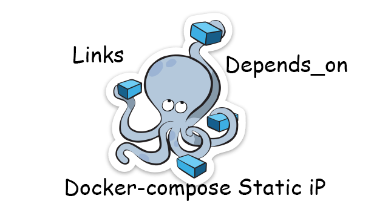

在容器中设置静态ip，这似乎又是一个过时的老话题，在讨论群中仍然有朋友为此感到困惑。我致力于解决这些小问题和在使用中容器落地的问题。为此，我又写了这篇文章来描述容器中使用静态ip，和不使用静态ip了解的技巧。

在正式配置docker-compose之前，我们需要先了解[link](https://docs.docker.com/compose/networking/)，因为在我看来在容器中使用固定ip是件没有必要的事情，使用ip只是我们脑中长久的一个使用习惯。而在docker中link已经帮我们解决了这个麻烦事，并提供了更简单的方式。

那么，通常来讲，在这个问题上产生疑问的，必然是在使用两个以上的容器。那就有必要了解[depends_on](https://docs.docker.com/compose/compose-file/#depends-on)。在使用link的同时，我当然也会叙述另外一个常用的选项[depends_on](https://docs.docker.com/compose/compose-file/#depends-on)，它非常有用。并且我会做简单的比较。

阅读本篇文章，你将了解，docker-compose中3版本的使用，以及link使用方式和depends_on的技巧。

## 容器间互联

尽管，我们要解决的是单机网络，也不妨先简单介绍下跨主机和不跨主机容器间互联的区别

- [不跨主机互相访问](https://www.linuxea.com/2186.html#%E5%AE%B9%E5%99%A8%E7%BD%91%E7%BB%9C%E8%AE%BF%E9%97%AE)

不跨主机互联可以采用默认的bridge网络，[docker0](https://www.linuxea.com/2186.html#docker%E7%BD%91%E7%BB%9C)桥在物理机上，而后创建的容器，容器内有eth0，另外一侧在物理机的docker0，而docker0可以理解成一个虚拟交换机。这样同一个交换机内的容器就可以直接进行互联。

除此之外，还可以使用[host网络模式](https://www.linuxea.com/2186.html#Host)，共用宿主机网络，这样一来容器和宿主机使用同一个网络，不隔离网络名称空间，网卡信息，就不存在网络上的问题。

最后还可以采用[联盟式容器](https://www.linuxea.com/2195.html)解决网络问题


- [跨主机容器互联](https://www.linuxea.com/2186.html#%E8%B7%A8%E4%B8%BB%E6%9C%BA%E5%AE%B9%E5%99%A8%E8%AE%BF%E9%97%AE)

容器跨主机访问实际上是做了DNAT，将容器发布出去，这些规则在iptables中可以看到

```
Chain DOCKER (3 references)
 pkts bytes target     prot opt in     out     source               destination         
    0     0 ACCEPT     tcp  --  !br-77c0aabda308 br-77c0aabda308  0.0.0.0/0            172.18.0.2           tcp dpt:26379
    0     0 ACCEPT     tcp  --  !br-77c0aabda308 br-77c0aabda308  0.0.0.0/0            172.18.0.2           tcp dpt:6379
    0     0 ACCEPT     tcp  --  !br-77c0aabda308 br-77c0aabda308  0.0.0.0/0            172.18.0.3           tcp dpt:1194
    0     0 ACCEPT     tcp  --  !br-77c0aabda308 br-77c0aabda308  0.0.0.0/0            172.18.0.3           tcp dpt:443
```

而对于互相双方来讲，是看不到后面的容器的，访问的是通过端口转发到真正的容器端口上。如果你要跨主机访问，就不能使用容器的ip，只能使用宿主机的ip和容器映射的端口通过iptables转发访问。

```
[marksugar@www.linuxea.com ~]# telnet 172.25.50.250 6379
Trying 172.25.50.250...
Connected to 172.25.50.250.
Escape character is '^]'.
```
当然，也有例外，如果是叠加的方式就不需要在物理机做端口映射，直接通过隧道访问对端ip和端口

## link连接

我们了解到在容器网络中的分配ip是不固定的，倘若我在第一次使用的ip地址在后面使用中发生了改变，那可能不无法正常使用了！这显然并不是我们想要的。link就解决了这个问题。links似乎将会被弃用，因为它并不重要(不使用link仍然可以通过容器名称访问)，我们主要来看这里的别名操作

docker-compose如下：

```
version: '3'
services:
  redis:
    image: marksugar/redis:5.0.0
    container_name: redis
    restart: always
    privileged: true
    environment:
      - REDIS_CONF=on
      - REQUIRE_PASS=OTdmOWI4ZTM4NTY1M2M4OTZh
      - MASTER_AUTH=OTdmOWI4ZTM4NTY1M2M4OTZh
      - MAXCLIENTS_NUM=600
      - MAXMEMORY_SIZE=4096M
    volumes:
      - /etc/localtime:/etc/localtime:ro
      - /data/redis-data:/data/redis:Z
      - /data/logs:/data/logs
    ports:
      - '6379:6379'
      - '26379:26379'

  softether:
    image: marksugar/softether:4.27
    links:
      - "redis:redisdb"
    container_name: softether4.27
    restart: always
    ports:
      - '443:443'
      - '1194:1194'
```

请注意，其中

```
    links:
      - "redis:redisdb"
```

>  softether和redis的容器ip地址分别是172.18.0.2和172.25.8.0.3，假设此时我们并不知道ip

这里在softether中链接了redis，并设置了别名，redisdb。那也就是说我们可以使用redisdb来访问redis本身。

```
[marksugar@www.linuxea.com /opt/2019/net]# docker exec -it softether4.27 sh
/ # apk update
fetch http://dl-cdn.alpinelinux.org/alpine/v3.8/main/x86_64/APKINDEX.tar.gz
fetch http://dl-cdn.alpinelinux.org/alpine/v3.8/community/x86_64/APKINDEX.tar.gz
v3.8.2-56-g4d33ed061d [http://dl-cdn.alpinelinux.org/alpine/v3.8/main]
v3.8.2-53-g53558ad6fc [http://dl-cdn.alpinelinux.org/alpine/v3.8/community]
OK: 9559 distinct packages available
/ # apk add redis
(1/1) Installing redis (4.0.11-r0)
Executing redis-4.0.11-r0.pre-install
Executing redis-4.0.11-r0.post-install
Executing busybox-1.28.4-r0.trigger
OK: 68 MiB in 35 packages
/ # redis-cli -a OTdmOWI4ZTM4NTY1M2M4OTZh -h redisdb info
Warning: Using a password with '-a' option on the command line interface may not be safe.
# Server
redis_version:5.0.0
redis_git_sha1:00000000
redis_git_dirty:0
redis_build_id:a7a8d032c5a69a3f
redis_mode:standalone
os:Linux 4.18.12-1.el7.elrepo.x86_64 x86_64
arch_bits:64
multiplexing_api:epoll
atomicvar_api:atomic-builtin
gcc_version:6.4.0
process_id:10
run_id:c6162ba2b02d70c1defda6073f863af1ccb207a6
tcp_port:6379
uptime_in_seconds:263
uptime_in_days:0
hz:10
configured_hz:10
lru_clock:7302247
```

### 这说明了什么？

我们完全可以使用容器的名称来进行访问，并不需要使用ip地址来指定。因为ip会变，名称却不会变，这是因为容器的hosts

```
/ # cat /etc/hosts
127.0.0.1	localhost
::1	localhost ip6-localhost ip6-loopback
fe00::0	ip6-localnet
ff00::0	ip6-mcastprefix
ff02::1	ip6-allnodes
ff02::2	ip6-allrouters
172.18.0.3	d374cbffc3b0
```

在hosts中，已经写了ip和容器id的对应关系。你完全可以使用容器名称来进行访问。

> tips

你可以不使用别名，直接使用容器名称进行访问，你会看到redis容器的ip地址

```
/ # ping redis
PING redis (172.18.0.2): 56 data bytes
64 bytes from 172.18.0.2: seq=0 ttl=64 time=0.093 ms
64 bytes from 172.18.0.2: seq=1 ttl=64 time=0.143 ms
64 bytes from 172.18.0.2: seq=2 ttl=64 time=0.106 ms
64 bytes from 172.18.0.2: seq=3 ttl=64 time=0.152 ms
```

因为在同一个网络内。
##    depends_on

我们在看另外一个场景，假如此刻softether依赖于redis，在启动的时候就需要读取redis或者写入，通常情况下，redis必然要先启动，redis启动，softether在启动。这才是正确的方式，如果softether先启动，而redis还没有就绪，程序必然会报错，甚至崩溃。此时[depends_on](https://docs.docker.com/compose/compose-file/#depends-on)就有了用武之地

如上场景中那般，配置如下：

```
redis:
    image: marksugar/redis:5.0.0
	...
	
softether：
    image: marksugar/softether:4.27
	...
    depends_on:
      - redis
```

这样，softether会在redis启动之后启动。

如果你有多个依赖，就可以按照顺序往后写，比如mysql

```
redis:
    image: marksugar/redis:5.0.0
	...
mysql:
    image:
    ...
softether：
    image: marksugar/softether:4.27
	...
    depends_on:
      - redis
      - mysql
```

这样的顺序就是，softether会等待，先启动redis，在启动mysql，依次启动才到softether。由此可见，depends_on和links完全是两个不同的东西。

- tips：

***我非常有必要提醒，启动和准备就绪是两个概念 ，启动并不意味着一定就启动完成，就像点击开机并不意味着马上就进入桌面。其中的就绪状态则是另外的问题。请参阅[启动顺序策略](https://docs.docker.com/compose/startup-order/)。***

## docker-compose 静态ip

默认情况下，docker会为容器分配随机（某种......）IP地址。通过使用链接，您可以将条目添加到容器的hosts文件中，并使用其IP地址映射另一个容器的名称。这样您就不需要知道其IP地址，只需使用其名称即可通过网络访问它。这种通过容器的hosts文件继而使用容器名称进行访问，这似乎已经解决了一大半人的问题。

但是，我们仍然可以使用静态ip。上面我提到，网络是会发生改变的，为了彻底解决这一点，我们将网关，子网都设置好。

在上面的默认网络中使用的ip是172.18.0.0网段。现在，我们修改它

```
version: '3.7'
services:
  redis:
    networks:
      linuxea:
        ipv4_address: 172.2.0.10
...        
  softether:
    networks:
      linuxea:
        ipv4_address: 172.2.0.11
...
networks:
  linuxea:
    ipam:
     driver: default
     config:
       - subnet: 172.2.0.0/24
```
docker-compose如下
```
[marksugar@www.linuxea.com /opt/2019/net]# cat docker-compose.yaml 
version: '3.7'
services:
  redis:
    image: marksugar/redis:5.0.0
    container_name: redis
    restart: always
    privileged: true
    environment:
      - REDIS_CONF=on
      - REQUIRE_PASS=OTdmOWI4ZTM4NTY1M2M4OTZh
      - MASTER_AUTH=OTdmOWI4ZTM4NTY1M2M4OTZh
      - MAXCLIENTS_NUM=600
      - MAXMEMORY_SIZE=4096M
    volumes:
      - /etc/localtime:/etc/localtime:ro
      - /data/redis-data:/data/redis:Z
      - /data/logs:/data/logs
    ports:
      - '6379:6379'
      - '26379:26379'
    networks:
      linuxea:
        ipv4_address: 172.2.0.10
  softether:
    image: marksugar/softether:4.27
    links:
      - "redis:redisdb"
    container_name: softether4.27
    restart: always
    ports:
      - '443:443'
      - '1194:1194'
    networks:
      linuxea:
        ipv4_address: 172.2.0.11
networks:
  linuxea:
    ipam:
     driver: default
     config:
       - subnet: 172.2.0.0/24
```

现在，你就可以使用静态的ip进行访问

```
[marksugar@www.linuxea.com /opt/2019/net]# docker-compose -f ./docker-compose.yaml up -d
Creating redis ... done
Creating softether4.27 ... done
```

```
[marksugar@www.linuxea.com /opt/2019/net]# docker exec -it softether4.27 sh
/ # ip a
1: lo: <LOOPBACK,UP,LOWER_UP> mtu 65536 qdisc noqueue state UNKNOWN qlen 1000
    link/loopback 00:00:00:00:00:00 brd 00:00:00:00:00:00
    inet 127.0.0.1/8 scope host lo
       valid_lft forever preferred_lft forever
293: eth0@if294: <BROADCAST,MULTICAST,UP,LOWER_UP,M-DOWN> mtu 1500 qdisc noqueue state UP 
    link/ether 02:42:ac:02:00:0b brd ff:ff:ff:ff:ff:ff
    inet 172.2.0.11/24 brd 172.2.0.255 scope global eth0
       valid_lft forever preferred_lft forever
```
安装redis-client
```
/ # apk update
fetch http://dl-cdn.alpinelinux.org/alpine/v3.8/main/x86_64/APKINDEX.tar.gz
fetch http://dl-cdn.alpinelinux.org/alpine/v3.8/community/x86_64/APKINDEX.tar.gz
v3.8.2-56-g4d33ed061d [http://dl-cdn.alpinelinux.org/alpine/v3.8/main]
v3.8.2-53-g53558ad6fc [http://dl-cdn.alpinelinux.org/alpine/v3.8/community]
OK: 9559 distinct packages available
/ # apk add redis
(1/1) Installing redis (4.0.11-r0)
Executing redis-4.0.11-r0.pre-install
Executing redis-4.0.11-r0.post-install
Executing busybox-1.28.4-r0.trigger
OK: 68 MiB in 35 packages
```
通过静态ip链接
```
/ # redis-cli -a OTdmOWI4ZTM4NTY1M2M4OTZh -h 172.2.0.10
Warning: Using a password with '-a' option on the command line interface may not be safe.
172.2.0.10:6379> info
# Server
redis_version:5.0.0
redis_git_sha1:00000000
redis_git_dirty:0
redis_build_id:a7a8d032c5a69a3f
redis_mode:standalone
os:Linux 4.18.12-1.el7.elrepo.x86_64 x86_64
arch_bits:64
multiplexing_api:epoll
atomicvar_api:atomic-builtin
gcc_version:6.4.0
process_id:10
run_id:cbf1e8eacc74da75c3dfcf797d104a8a2f95076e
```
使用`ipam`可以为新网络定义特定的CIDR块，然后将每个容器连接到该网络，可以在该范围上指定其IP地址。

现在，redis始终使用IP地址172.2.0.10运行，softether运行172.2.0.11，并且我能够在配置文件中对这些地址进行硬编码。

## 延伸阅读

[linuxea:白话容器之虚拟化网络与容器网络(8)](https://www.linuxea.com/2182.html)

[linuxea:白话容器之docker网络(9)](https://www.linuxea.com/2186.html)

## 学习更多

学习如何使用Docker CLI命令，Dockerfile命令，使用这些命令可以帮助你更有效地使用Docker应用程序。查看Docker文档和我的其他帖子以了解更多信息。

- [docker目录](https://www.linuxea.com/category/big-data/)
- [白话容器](https://www.linuxea.com/tag/%E7%99%BD%E8%AF%9D%E5%AE%B9%E5%99%A8/)
- [docker-compose](https://www.linuxea.com/tag/docker-compose/)