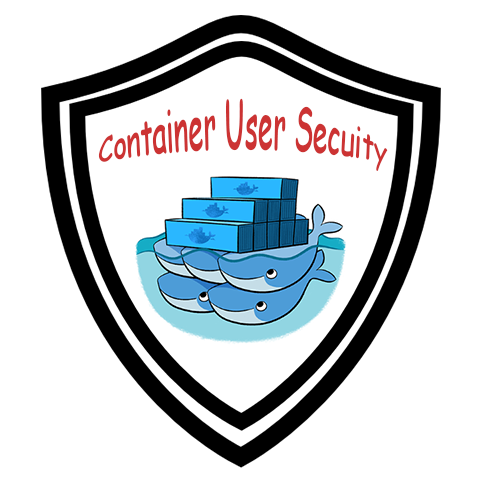

容器中的进程不应以root身份运行，或者假设它们是root用户。正确的方式是使用已知的UID和GID在Dockerfile中创建用户，并以此用户身份运行你的进程。通过限制对资源的访问，遵循此模式的映像更容易安全运行

## 概观

精心设计的系统遵循[最小特权原则](https://en.wikipedia.org/wiki/Principle_of_least_privilege)。这简单地说明应用程序应该只能访问它所需的资源以执行其所需的功能。这在设计安全系统时至关重要。无论是恶意还是由于某些错误，进程可能会在运行时产生意外后果。保护自己免受任何意外的最佳方法之一是仅授予进程运行所需的最小权限。

大多数容器化进程是应用程序服务，因此不需要root访问权限。虽然[Docker需要root](https://docs.docker.com/engine/security/security/#docker-daemon-attack-surface)运行，但容器本身却不需要。编写良好，安全且可重用的Docker镜像不应该以root身份运行，并且应该提供一种可预测且简单的方法来限制访问。

## 为什么这很重要

请记住，在容器中运行的进程与在Linux上运行的其他进程没有什么不同，除了它有一小段元数据声明它在容器中。容器不是信任边界，因此，容器中运行的任何东西都应该与主机本身上运行的任何东西一样对待。

就像你不会（或不应该）在服务器上以root身份运行任何东西一样，你不应该在服务器上的容器中以root身份运行任何东西。在别处创建的运行二进制文件需要大量的信任条件，对于容器中的二进制文件也是如此。

如果容器内的进程默认以root身份运行，则可以在启动容器时更改uid和gid。作为镜像的作者，你应该默认以不同的用户身份运行，并且更容易限制该用户的访问权限。通过在Dockerfile中创建用户，你不仅可以使其默认安全，而且更容易保持安全。

示例将显示以root身份运行容器的风险。让我们在`/root`目录中创建一个test.file文件，防止root 以外的任何人查看它：
```
[marksugar@www.linuxea.com ~]# echo "www.linuxea.com" >> ./test.file
[marksugar@www.linuxea.com ~]# chmod 600 test.file 
[marksugar@www.linuxea.com ~]# ls -l
total 4
-rw------- 1 root root 16 Feb 23 13:24 test.file
```
而后切换到linuxea用户下
```
[marksugar@www.linuxea.com ~]# su - linuxea
Last login: Wed Feb 20 17:44:35 CST 2019 on pts/2
```
```
[linuxea@linuxea.com ~]$ cat /root/test.file
cat: /root/test.file: Permission denied
[linuxea@linuxea.com ~]$ ls /root/test.file
ls: cannot access /root/test.file: Permission denied
[linuxea@linuxea.com ~]$ ls -l /root/test.file
ls: cannot access /root/test.file: Permission denied
```
现在我在root家目录创建了一个test.file的文件，并且追加了信息，权限是600，只有root可以看到内容。以普通个用户登陆是没有权限查看的。
现在，我创建一个Dockerfile镜像
```
FROM alpine:latest
MAINTAINER www.linuxea.com mark
ENTRYPOINT ["cat","/opt/test.file"]
```
```
[linuxea@linuxea.com ~]$ docker build -t linuxea:23 .
Sending build context to Docker daemon  10.24kB
Step 1/3 : FROM alpine:latest
 ---> caf27325b298
Step 2/3 : MAINTAINER www.linuxea.com mark
 ---> Using cache
 ---> c9603327aeb5
Step 3/3 : ENTRYPOINT ["cat","/opt/test.file"]
 ---> Running in d1d8fd1f5fd6
Removing intermediate container d1d8fd1f5fd6
 ---> 1bd2e84b67f9
Successfully built 1bd2e84b67f9
Successfully tagged linuxea:23
```
而后我运行这个镜像，并且将不能查看的文件挂在到容器中并运行
```
[linuxea@linuxea.com ~]$ docker run --rm -v /root/test.file:/opt/test.file linuxea:23 
www.linuxea.com
```
即使我是linuxea，容器正在运行root，因此可以访问root此服务器上的所有内容。这不理想; 以这种方式运行容器意味着你从Docker Hub中提取的每个容器都可以完全访问服务器上的所有内容（具体取决于你运行它的方式）。
## 建议
这里的建议是创建一个uid Dockerfile中已知的用户，并以该用户身份运行应用程序进程。Dockerfile的开头应遵循以下模式：
```
FROM <centos:-基本镜像>
RUN groupadd -g 999 USER && \ 
    useradd -r -u 999 -g USER USER 
USER USER
... <Dockerfile的其余部分> ...
```
使用此模式，可以在具有所需权限最少的用户/组的上下文中轻松运行容器。

例如，我将从上面将它添加到我的Dockerfile并重新运行该示例。我的Dockerfile现在看起来像这样：
```
FROM alpine:latest
MAINTAINER www.linuxea.com mark
RUN addgroup www && adduser -u 1001 -S -H -s /sbin/nologin -g 'nginx' -G www www
USER www
ENTRYPOINT ["cat","/opt/test.file"]
```
```
[linuxea@linuxea.com ~]$ docker build -t linuxea:24 .
Sending build context to Docker daemon  10.24kB
Step 1/5 : FROM alpine:latest
 ---> caf27325b298
Step 2/5 : MAINTAINER www.linuxea.com mark
 ---> Using cache
 ---> c9603327aeb5
Step 3/5 : RUN addgroup www && adduser -u 1001 -S -H -s /sbin/nologin -g 'nginx' -G www www
 ---> Running in 09d9fc94586a
Removing intermediate container 09d9fc94586a
 ---> 85d82a2b1c7f
Step 4/5 : USER www
 ---> Running in 9dd67807ba0e
Removing intermediate container 9dd67807ba0e
 ---> c56e5dc43a7f
Step 5/5 : ENTRYPOINT ["cat","/opt/test.file"]
 ---> Running in 31007cdf4293
Removing intermediate container 31007cdf4293
 ---> e6dfe1c64d2c
Successfully built e6dfe1c64d2c
Successfully tagged linuxea:24
```
使用与以前相同的命令运行此容器：
```
[linuxea@linuxea.com ~]$ docker run --rm -v /root/test.file:/opt/test.file linuxea:24
cat: can't open '/opt/test.file': Permission denied
```
## 重复使用其他图像
Docker的镜像是很好用的，因为它们是可重用的。但是当FROM的镜像以非root身份运行时，你的容器将继承该非root用户。如果你需要创建自己的或以root身份执行操作，请确保USER root在Dockerfile顶部附近的某处。然后FROM User再次使其可用。
```
FROM alpine:latest
MAINTAINER www.linuxea.com mark
USER root
RUN make install 《root权限需要》
RUN addgroup www && adduser -u 1001 -S -H -s /sbin/nologin -g 'nginx' -G www www
USER www
ENTRYPOINT ["cat","/opt/test.file"]
```
## 以非root用户身份运行其他容器
Docker镜像设计为可移植的，从Docker Hub中提取其他镜像是正常的。其中一些（官方镜像）将遵循此最佳实践并作为普通用户帐户运行。但许多镜像都没有这样做。许多镜像只是运行root，并由你决定如何安全地运行它们。有几个选项可以让你安全地运行没有创建自己用户的镜像。

### 创建另一个图像

首先，一个选项是使用原始镜像作为`FROM`图层创建另一个镜像。然后，您可以创建用户帐户，并将原始`ENTRYPOINT`和`CMD`指令复制到自己的镜像。此结果镜像现在遵循此处概述的最佳实践，并且默认情况下将安全运行。这里的权衡是你需要在更新基本镜像时重建构建镜像。你必须在重建基本镜像时设置重建过程。你可以在原有的镜像之上修改，也可以从[docker镜像复现Dockerfile](https://www.linuxea.com/2276.html)进行重新编写。

### 启动容器时指定uid

最后，你可以在主机上创建用户，并`uid`在启动容器时将其传递给Docker。例如，重新访问原始示例Dockerfile：

```
FROM alpine:latest
MAINTAINER www.linuxea.com mark
ENTRYPOINT ["cat","/opt/test.file"]
```

我可以使用或不使用用户id参数运行此容器，并查看不同的结果（用户ID 1001是我自己在此服务器上的linuxea帐户）：

```
[linuxea@linuxea.com ~]$ docker run --rm --user=1001 -v /root/test.file:/opt/test.file linuxea:23
cat: can't open '/opt/test.file': Permission denied
```

```
[linuxea@linuxea.com ~]$ docker run --rm  -v /root/test.file:/opt/test.file linuxea:23
www.linuxea.com
```

这与在Dockerfile中创建用户的工作方式相同，但它要求用户可选择安全地运行容器。在Dockerfile中指定非root用户将使容器*默认*安全运行。

## 进一步了解

- [linuxea:了解uid和gid如何在docker容器中工作](https://www.linuxea.com/2295.html)
- [linuxea:docker run的十个常用选项](https://www.linuxea.com/2254.html)
- [linuxea:十个初学Dcoker cli指令](https://www.linuxea.com/2256.html)

## 学习更多

学习如何使用Docker CLI命令，Dockerfile命令，使用这些命令可以帮助你更有效地使用Docker应用程序。查看Docker文档和我的其他帖子以了解更多信息。

- [docker目录](https://www.linuxea.com/category/big-data/)
- [白话容器](https://www.linuxea.com/tag/%E7%99%BD%E8%AF%9D%E5%AE%B9%E5%99%A8/)
- [docker-compose](https://www.linuxea.com/tag/docker-compose/)