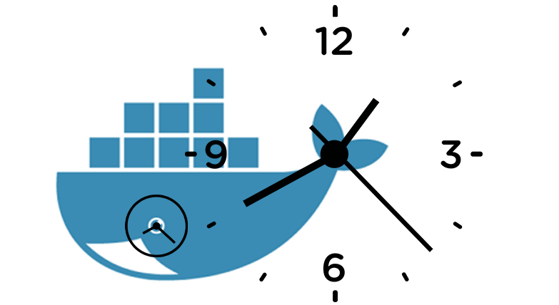

一般情况下，我们仅仅需要修改容器的时间与我们宿主机的实际实际一致即可，

我们知道，默认情况下docker容器是不允许访问系统时钟，但是有一款开源的软件使这样的需求变成了可能。此[lib](https://github.com/wolfcw/libfaketime)拦截用于检索当前时间和日期的所有系统调用，完成了容器内时间的修改。

阅读此篇文章，你将了解在容器内修改时间的方法。

## 使用

以alpine为例，我们进行编译安装，并挑选几个简单的使用方法来进行演示这个时间调整

```
git clone https://github.com/wolfcw/libfaketime.git
cd libfaketime/src
make install
```

他的使用非常简单，只需要设置环境变量即可，如下

```
bash-4.4$ date
Fri Mar  8 15:17:52 CST 2019
```

修改天数

```
bash-4.4$ LD_PRELOAD=/usr/local/lib/faketime/libfaketime.so.1 FAKETIME="-2d"
```
```
bash-4.4$ date
Wed Mar  6 15:28:03 CST 2019
```
修改分钟
```
bash-4.4$ LD_PRELOAD=/usr/local/lib/faketime/libfaketime.so.1 FAKETIME="-70m"
```
```
bash-4.4$ date
Fri Mar  8 14:18:45 CST 2019
```

>虚拟时间的默认规范是缓存的，时间为10秒钟
>`FAKETIME_NO_CACHE =1`是禁用缓存，但这可能带来性能影响

## 嵌入docker基础镜像中

使用此前的基础镜像。在启动脚本中添加TIME_OFFSET变量，顺便修改启动容器进程的id和用户名

```
#!/bin/bash
#########################################################################
# File Name: entrypoint.sh
# Author: www.linuxea.com
# Created Time: Tue 05 Mar 2019 03:59:05 PM CST
#########################################################################

USER_ID=${USER_ID:-1101}
USER_NAME=${USER_NAME:-www}
TIME_OFFSET=${TIME_OFFSET:-FAKETIME_NO_CACHE=1 FAKETIME=""}

echo "Starting with UID : $USER_ID And user $USER_NAME"
addgroup --gid $USER_ID $USER_NAME 
adduser -u $USER_ID -S -H -s /bin/bash -g $USER_NAME -G $USER_NAME $USER_NAME -D
# useradd --shell /bin/bash -u $USER_ID -o -c "" -m user
export HOME=/home/$USER_NAME
export LD_PRELOAD=/usr/local/lib/faketime/libfaketime.so.1 $TIME_OFFSET

exec /usr/local/bin/gosu $USER_NAME "$@"
```

这样以来，在下次启动的时候，传递环境变量就达到了修改容器时间的办法

我将次镜像构建为`marksugar/alpine:3.9-time-gosu`，你可以下载进行使用

```
[marksugar@www.linuxea.com /opt/2019/djd/jj]# docker build -t marksugar/alpine:3.9-time-gosu .
```

现在我们进行测试这个时间修改

挂载`/etc/localtime`让容器时间与机器时间一致，而后在进行传递`$TIME_OFFSET`修改时间的偏移量

```
docker run \
	--rm \
    -v /etc/localtime:/etc/localtime \
    -e TIME_OFFSET=FAKETIME="-10m" \
    -e USER_ID=1101 \
    -e USER_NAME=linuxea.com \
    -it marksugar/alpine:3.9-time-gosu \
	date +%F" "%T
```

我们先取出时间

```
[marksugar@www.linuxea.com ~]# date +%F" "%T
2019-03-08 15:54:11
```

而后修改分钟，减去10分钟，-10m

```
[marksugar@www.linuxea.com ~]# docker run \
> --rm \
>     -v /etc/localtime:/etc/localtime \
>     -e TIME_OFFSET=FAKETIME="-10m" \
>     -e USER_ID=1101 \
>     -e USER_NAME=linuxea.com \
>     -it marksugar/alpine:3.9-time-gosu \
>	  date +%F" "%T
Starting with UID : 1101 And user linuxea.com
2019-03-08 15:44:16
```

时间从`2019-03-08 15:54:11`变成`2019-03-08 15:44:16`

修改天数，减去3天，-3d

```
[marksugar@www.linuxea.com ~]# docker run \
> --rm \
>     -v /etc/localtime:/etc/localtime \
>     -e TIME_OFFSET=FAKETIME="-3d" \
>     -e USER_ID=1101 \
>     -e USER_NAME=linuxea.com \
>     -it marksugar/alpine:3.9-time-gosu \
> date +%F" "%T
Starting with UID : 1101 And user linuxea.com
2019-03-05 15:57:43
```
或者这样
```
docker run \
	--rm \
    -v /etc/localtime:/etc/localtime \
    -e TIME_OFFSET=FAKETIME="-10m" \
    -e USER_ID=1101 \
    -e USER_NAME=linuxea.com \
    -it marksugar/alpine:3.9-time-gosu \
	date +%F" "%T
```

- FAKETIME_NO_CACHE=1

```
[marksugar@www.linuxea.com ~]# date +%F" "%T
2019-03-08 16:03:18
```

```
[marksugar@www.linuxea.com ~]# docker run \
> --rm \
>     -v /etc/localtime:/etc/localtime \
>     -e TIME_OFFSET="FAKETIME_NO_CACHE=1 FAKETIME="-10m"" \
>     -e USER_ID=1101 \
>     -e USER_NAME=linuxea.com \
>     -it marksugar/alpine:3.9-time-gosu \
> 	  date +%F" "%T
Starting with UID : 1101 And user linuxea.com
2019-03-08 15:53:18
```

## 更多阅读

有关如何将密码信息传递到容器的更多信息的一些建议是：

- [linuxea:docker卷和文件系统权限](https://www.linuxea.com/2303.html)

- [linuxea:docker容器中程序不应该以root用户身份运行](https://www.linuxea.com/2301.html)
- [linuxea:变量实值与文件变量替换](https://www.linuxea.com/2188.html)

## 学习更多

学习如何使用Docker CLI命令，Dockerfile命令，使用这些命令可以帮助你更有效地使用Docker应用程序。查看Docker文档和我的其他帖子以了解更多信息。

- [docker目录](https://www.linuxea.com/category/big-data/)
- [白话容器](https://www.linuxea.com/tag/%E7%99%BD%E8%AF%9D%E5%AE%B9%E5%99%A8/)
- [docker-compose](https://www.linuxea.com/tag/docker-compose/)