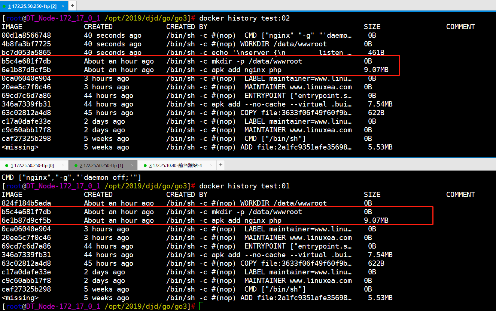

在这篇文章中，我描述了在无法提供任何层缓存的无服务器主机上构建时，我如何提高容器的构建性能。我使用多阶段构建和远程存储库缓存的组合来避免重复性工作来提高性能。

阅读本篇，你将了解--target的使用和--cache-from的使用，更好理解多阶段构建和缓存的利用。

- note

使用`--target`来构建多级建立的特定阶段，并推动这些镜像传输到远程存储库。在后续构建中，拉出这些镜像并使用作为构建缓存`--cache-from`

我们先来看，一个普通的构建脚本

```
## 镜像版本号
DOCKER_IMAGE_VERSION=20190305_addpjp

## 构建镜像
docker build \
	-t marksugar/test:$DOCKER_IMAGE_VERSION \
	-t marksugar/test:latest \
	-f "./Dockerfile" \
	"."
## 推送到仓库	
docker push marksugar/test:$DOCKER_IMAGE_VERSION
docker push marksugar/test:latest

```

此bash脚本基于Dockerfile构建docker镜像，使用特定的版本号`$DOCKER_IMAGE_VERSION`和`latest`标记镜像tag，而后推送到仓库中，完成构建过程。

> 事实上我们在实际生产中的构建脚本远比这要复杂的多。为此，学习利用--target和--cache-from能提高时间效益

## --target

创建多阶段构建时候，可以为每个构建阶段提供名称，例如，我此刻命名的createfile和linuxea，分别在(准备阶段createfile和最终阶段linuxea)：

```
FROM marksugar/alpine:3.9-time-gosu as createfile
MAINTAINER www.linuxea.com
LABEL maintainer="www.linuxea.com"
RUN mkdir /data/ && touch /hello.txt
WORKDIR /data

FROM marksugar/go:alpine-go1.12 as linuxea
MAINTAINER www.linuxea.com
LABEL maintainer="www.linuxea.com"
COPY linuxea.go /data/linuxea.go
WORKDIR /data
CMD ["go","run","linuxea.go"]
COPY --from=createfile /data/ .
```

通过阶段的名称，可以在后续中引用，并且复制到最后的容器中。为了更好的解释这个，我们还是进行一次构建

```
docker build -t test:1 .
```
并运行
```
[marksugar@www.linuxea.com /opt/2019/djd/go/go2]# docker run -d -p:1818:8080 test:1 
01e07ddc26daf94bc57ddc7d61d5cbe0f530c85792e045126dc501e67e047ac8
```
运行正常，可以被访问
```
[marksugar@www.linuxea.com /opt/2019/djd/go/go2]# curl 127.0.0.1:8080 
20190303 欢迎来到 www.linuxea.com
```

但是，这仅仅只是多阶段构建。此刻，我只想构建其中一个阶段，--target就派上用途了。

> 只构建某个阶段，如linuxea或者createfile，并不全部构建

- 只构建linux的阶段

```
[marksugar@www.linuxea.com /opt/2019/djd/go/go2]# docker build --target linuxea -t test:linuxea -f "$PWD/Dockerfile" "."


[marksugar@www.linuxea.com /opt/2019/djd/go/go2]# docker run --rm -it test:1 bash
Starting with UID : 1101 And user www
bash-4.4$ ls
linuxea.go
bash-4.4$ 

```
- 只构建createfile阶段
```
[marksugar@www.linuxea.com /opt/2019/djd/go/go2]# docker build --target createfile -t test:2 -f "$PWD/Dockerfile" "."


[marksugar@www.linuxea.com /opt/2019/djd/go/go2]# docker run --rm -it test:2 bash
Starting with UID : 1101 And user www
bash-4.4$ pwd
/data     
bash-4.4$ ls /hello.txt 
/hello.txt
```

如上所示中，两个阶段的构建结果仅限于Dockerfile中的多阶段构建的名称下的内容。我们在往下看。

## --cache-from

默认情况下，在构建Docker镜像时，Docker使用它的构建缓存来检查它是否可以跳过Dockerfile中的任何步骤。该`--cache-from`参数告诉docker，可用缓存的镜像是什么。如果提供的镜像和当前版本具有相同的图层，则可以获得与在同一台计算机上构建镜像时以相同层构建出更快的速度。

例如，简单地想象我们没有使用多阶段构建，因此推送到远程存储库的最终镜像包含所有构建层。不使用`--cache-from`我们的构建脚本*总是*必须执行Dockerfile中的*每个*命令，因为构建缓存将为空：

```
docker build -t marksugar/test:01
```

相反，我们可以`--cache-from`结合使用`docker pull`，大概如下：

```
docker pull IMAGES1 || true

docker build \
	--cache-from IMAGES1 \
	-t IMAGE2:Version \
	-t IMAGE2:latest \
	-f "PATH/Dockefile" \
	"."
	
docker push IMAGES2:latest
docker push IMAGES2:Version
```

为了更好的测试，我们手动进行build两个镜像做一个简单的测试

- 第一个Dockerfile

```
FROM marksugar/alpine:3.9-time-gosu as createfile
MAINTAINER www.linuxea.com
LABEL maintainer="www.linuxea.com"
RUN apk add nginx php
RUN mkdir -p /data/wwwroot
WORKDIR /data/wwwroot
```

```
docker build marksugar/test:01
```

- 第二个Dockerfile

在第二个dockerfile中，我们主要看两层，如下：

```
RUN apk add nginx php
RUN mkdir -p /data/wwwroot
```

Dockerfile。在dockerfile中的这两层与上一个dockerfile的层是相同的

```
FROM marksugar/alpine:3.9-time-gosu
MAINTAINER www.linuxea.com
LABEL maintainer="www.linuxea.com"
RUN apk add nginx php
RUN mkdir -p /data/wwwroot
RUN echo '\n\
server {\n\
        listen 1080;\n \
        root /data/wwwroot;\n \
        index index.html;\n \
}\n'\
>> /etc/nginx/conf.d/default.conf \
	&& echo "hello www.linuxea.com" >> /data/wwwroot/index.html
WORKDIR /data/wwwroot
CMD ["nginx","-g","'daemon off;'"]
```

build

```
docker build \
	--cache-from marksugar/test:01 \
    -t marksugar/test:02 \
    -f "$PWD/Dockerfile" \
    "."
```

如下：

```
[marksugar@www.linuxea.com /opt/2019/djd/go/go3]# docker build --cache-from marksugar/test:01  -t marksugar/test:02 -f "$PWD/Dockerfile" "."
Sending build context to Docker daemon  2.048kB
Step 1/8 : FROM marksugar/alpine:3.9-time-gosu
 ---> 69cd7c6d7a86
Step 2/8 : MAINTAINER www.linuxea.com
 ---> Using cache
 ---> 45e40729aaae
Step 3/8 : LABEL maintainer="www.linuxea.com"
 ---> Using cache
 ---> 5f10b4ec6e3e
Step 4/8 : RUN apk add nginx php
 ---> Using cache
 ---> 0fd71721e8ff
Step 5/8 : RUN mkdir -p /data/wwwroot
 ---> Using cache
 ---> 07066ac12068
Step 6/8 : RUN echo '\nserver {\n        listen 1080;\n         root /data/wwwroot;\n         index index.html;\n }\n'>> /etc/nginx/conf.d/default.conf 	&& echo "hello www.linuxea.com" >> /data/wwwroot/index.html
 ---> Running in 1aaa3449af16
Removing intermediate container 1aaa3449af16
 ---> 434c3dee5d37
Step 7/8 : WORKDIR /data/wwwroot
 ---> Running in 2ed3ce787ab0
Removing intermediate container 2ed3ce787ab0
 ---> 078644925acb
Step 8/8 : CMD ["nginx","-g","'daemon off;'"]
 ---> Running in 065aa5b66fe8
Removing intermediate container 065aa5b66fe8
 ---> 81adb261a754
Successfully built 81adb261a754
Successfully tagged marksugar/test:02
```

我们在来对比一下层，你会发现这俩个镜像对于上述相同的RUN命令层，公用一个ID，这将减少我们的构建时间



如果你的最终构建的镜像包含所有的docker构建层，这个简单的方法很有效。但在多阶段中可能会出现问题，我们可以使用--target和--cache-from一起使用

## --target And --cache-from

倘若此时，在多构建的基础之上，我们需要重新构建准备阶段和最终的运行阶段我们可能使用这种方式，如下：

```
DOCKER_IMAGE_VERSION=VERSION

# 拉取最新的镜像
docker pull marksugar/base:1 || true

# 使用最新拉取的镜像作为缓存层
docker build \
  --target builder \
  --cache-from marksugar/base:1 \
  -t marksugar/base:1 \
  -f "path/Dockerfile" \
  "."
  
# 在拉一个最终的镜像  
docker pull marksugar/web:latest || true

# 不指定target（构建整个Dockerfile） 
＃ 使用刚构建的构建器镜像和拉出的运行时候镜像作为缓存
docker build \
  --cache-from marksugar/base:1 \
  --cache-from marksuagr/Web:latest \
  -t marksugar/web:$DOCKER_IMAGE_VERSION \
  -t marksugar/Web:latest \
  -f "path/Dockerfile" \
  "."
  
# 重新推送  
docker push marksugar/Web:$DOCKER_IMAGE_VERSION
docker push marskugar/Web:latest
docker push marksugar/base:1
```
## 延伸阅读

[linuxea:Distroless与多阶段构建](https://www.linuxea.com/1939.html)
[linuxea:docker多阶段构建Multi-Stage与Builder对比总结](https://www.linuxea.com/2293.html)

## 学习更多

学习如何使用Docker CLI命令，Dockerfile命令，使用这些命令可以帮助你更有效地使用Docker应用程序。查看Docker文档和我的其他帖子以了解更多信息。

- [docker目录](https://www.linuxea.com/category/big-data/)
- [白话容器](https://www.linuxea.com/tag/%E7%99%BD%E8%AF%9D%E5%AE%B9%E5%99%A8/)
- [docker-compose](https://www.linuxea.com/tag/docker-compose/)


