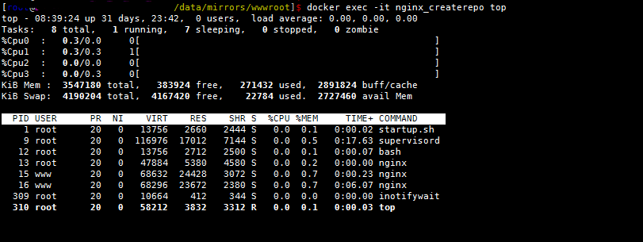

### 容器中的nginx优化
在物理机上配置Nginx时通常会将Nginx的worker进程数配置为CPU核心数并且会将每个worker绑定到特定CPU上，这可以有效提升进程的Cache命中率，从而减少内存访问损耗。在Nginx配置中一般指定worker_processes指令的参数为auto，来自动检测系统的CPU核心数从而启动相应个数的worker进程。在Linux系统上Nginx获取CPU核心数是通过系统调用 sysconf(_SC_NPROCESSORS_ONLN) 来获取的，对于容器来说目前还只是一个轻量级的隔离环境，它并不是一个真正的操作系统，所以容器内也是通过系统调用sysconf(_SC_NPROCESSORS_ONLN)来获取的，这就导致在容器内，使用Nginx如果worker_processes配置为auto，看到的也是宿主机的CPU核心数。

通常当我们绑定好CPU并设置nginx进程是CPU核数的两倍，用于提高整体的并发

小米运维使用了一种的解决的方式是：劫持系统调用sysconf，在类Unix系统上可以通过LD_PRELOAD这种机制预先加载个人编写的的动态链接库，在动态链接库中劫持系统调用sysconf并根据cgroup信息动态计算出可用的CPU核心数。

而XCFS目前仅支持改变容器的CPU视图（/proc/cpuinfo文件内容）并且只有--cpuset-cpus参数可以生效，对于系统调用sysconf(_SC_NPROCESSORS_ONLN)返回的同样还是物理机的CPU核数。

我抱着试一试的态度，对此作了一些测试，如下：

### 开始测试
我们在4核CPU的机器做测试，对容器的CPU资源做限制（如果不做CPU限制默认使用所有的资源）,我们使用cpuset: '1,3'绑定cpu-2和cpu-4上，然后观察仍然是4个，对容器设置 cpu-shares 和 cpu-quota 也会得到同样的结果。 我们进行测试
####  配置cpu限制
cpuset: '1,3'
```
[marksugar@www.linuxea.com /data/mirror]$ cat docker-compose.yml 
version: '2'
services:
  nginx_createrepo:
    image: marksugar/nginx_createrepo
#    build:
#      context: https://raw.githubusercontent.com/LinuxEA-Mark/docker-createrepo/master/Dockerfile
    container_name: nginx_createrepo
    restart: always
    network_mode: "host"
    cpuset: '1,3'
    cpu_quota: 400000
    volumes:
      - /data/mirrors:/data
    environment:
      - NGINX_PORT=80
      - SERVER_NAME=localhost
```
nginx配置`worker_processes auto;`
我们先用 cpuset: '1,3'绑定cpu2和cpu4，按照我们之前的逻辑，两颗CPU，在worker_processes auto的情况下，nginx进程应该是两个的

在过滤下更明显

```
[marksugar@www.linuxea.com ~]$ docker exec -it nginx_createrepo ps aux|grep nginx
root        13  0.0  0.0  45912  6024 ?        S    08:01   0:00 nginx: master p
www         35  0.0  0.3  66324 23704 ?        S    08:01   0:00 nginx: worker p
www         36  0.0  0.3  66324 23704 ?        S    08:01   0:00 nginx: worker p
www         37  0.0  0.3  66324 23704 ?        S    08:01   0:00 nginx: worker p
www         38  0.0  0.3  66324 23704 ?        S    08:01   0:00 nginx: worker p
```
#### container_cpu_detection 
我们克隆小米开源的container_cpu_detection测试下
代码克隆
```
[marksugar@www.linuxea.com /data/mirror]$ git clone https://github.com/agile6v/container_cpu_detection.git
正克隆到 'container_cpu_detection'...
remote: Counting objects: 46, done.
remote: Compressing objects: 100% (25/25), done.
remote: Total 46 (delta 19), reused 41 (delta 17), pack-reused 0
Unpacking objects: 100% (46/46), done.
[marksugar@www.linuxea.com /data/mirror]$
```
make
```
[linuxea-VM-Node_10_10_240_144 /data/mirror/container_cpu_detection]$ make
gcc -std=c99 -Wall -shared -g -fPIC -ldl detection.c -o detection.so
gcc sysconf_linuxea.c -o sysconf_linuxea
[marksugar@www.linuxea.com /data/mirror/container_cpu_detection]$ sed -i 's/test/linuxea/g' * && mv sysconf_test.c sysconf_linuxea.c
```
挂载到容器里面，添加这些参数到容器：
资源限制
>cpuset: '1,3'
cpu_quota: 200000

变量传递    
>- DETECTION_TARGETS=nginx
- LD_PRELOAD=/usr/lib/detection.so

文件挂载
>- /data/container_cpu_detection/detection.so:/usr/lib/detection.so
- /data/container_cpu_detection/sysconf_linuxea:/tmp/sysconf_linuxea      

完整的compose如下
```
[marksugar@www.linuxea.com /data/mirror]$ cat docker-compose.yml 
version: '2'
services:
  nginx_createrepo:
    image: marksugar/nginx_createrepo
#    build:
#      context: https://raw.githubusercontent.com/LinuxEA-Mark/docker-createrepo/master/Dockerfile
    container_name: nginx_createrepo
    restart: always
    network_mode: "host"
    cpuset: '1,3'
    cpu_quota: 200000
    volumes:
      - /data/mirrors:/data
      - /data/container_cpu_detection/detection.so:/usr/lib/detection.so
      - /data/container_cpu_detection/sysconf_linuxea:/tmp/sysconf_linuxea
    environment:
      - NGINX_PORT=80
      - SERVER_NAME=localhost
      - DETECTION_TARGETS=nginx
      - LD_PRELOAD=/usr/lib/detection.so
```
up起来，查看CPU个数仍然不变
```
[marksugar@www.linuxea.com /data/container_cpu_detection]$ docker exec -it nginx_createrepo top
top - 09:02:09 up 41 days,  2:40,  0 users,  load average: 0.07, 0.02, 0.00
Tasks:   8 total,   1 running,   7 sleeping,   0 stopped,   0 zombie
%Cpu0  :   0.0/0.0     0[                                                     ]
%Cpu1  :   0.0/0.0     0[                                                     ]
%Cpu2  :   0.0/0.8     1[                                                     ]
%Cpu3  :   0.0/0.0     0[                                                     ]
KiB Mem : 33.5/7188532  [||||||||||||||||||                                   ]
KiB Swap:  0.0/4190204  [                                                     ]

  PID USER      PR  NI    VIRT    RES    SHR S  %CPU %MEM     TIME+ COMMAND     
    1 root      20   0   13756   2716   2500 S   0.0  0.0   0:00.02 startup.sh  
   10 root      20   0  116972  16976   7104 S   0.0  0.2   0:00.20 supervisord 
   13 root      20   0   13756   2640   2444 S   0.0  0.0   0:00.00 bash        
   14 root      20   0   48028   6192   5140 S   0.0  0.1   0:00.01 nginx       
   15 root      20   0   10664    392    324 S   0.0  0.0   0:00.00 inotifywait 
   38 www       20   0   68440  23732   2380 S   0.0  0.3   0:00.00 nginx       
   39 www       20   0   68440  23732   2380 S   0.0  0.3   0:00.03 nginx       
  131 root      20   0   58212   3900   3384 R   0.0  0.1   0:00.03 top    
```
在看nginx进程已经如限制的核心数一致
```
[marksugar@www.linuxea.com /data/mirror]$ docker exec -it nginx_createrepo ps aux|grep nginx
root        13  0.0  0.0  48028  6016 ?        S    13:19   0:00 nginx: master p
www         32  0.0  0.3  68440 23696 ?        S    13:20   0:00 nginx: worker p
www         33  0.0  0.3  68440 23696 ?        S    13:20   0:00 nginx: worker p
```
### cpu资源约束信息
--cpu-quota=<value>
> 对容器施加CPU CFS配额。--cpu-period限制前容器限制为每秒的微秒数。作为有效上限。如果您使用Docker 1.13或更高版本，请--cpus改用。

--cpuset-cpus
> 限制容器可以使用的特定CPU或核心。如果您有多个CPU，则容器可以使用的以逗号分隔的列表或连字符分隔的CPU范围。第一个CPU编号为0.有效值可能是0-3（使用第一个，第二个，第三个和第四个CPU）或1,3（使用第二个和第四个CPU）。

--cpu-shares
> 将此标志设置为大于或小于默认值1024的值，以增加或减少容器的重量，并使其可以访问主机的CPU周期的较大或较小比例。仅在CPU周期受限时才会强制执行此操作。当有足够的CPU周期时，所有容器都会根据需要使用尽可能多的CPU。这样，这是一个软限制。--cpu-shares不会阻止容器以群集模式进行调度。它为可用的CPU周期优先考虑容器CPU资源。它不保证或保留任何特定的CPU访问权限。

--cpu-period=<value>
> 指定CPU CFS调度程序周期，它与并用 --cpu-quota。默认为100微秒。大多数用户不会更改默认设置。如果您使用Docker 1.13或更高版本，请--cpus改用。

-cpus=<value>	
> 指定容器可以使用的可用CPU资源量。例如，如果主机有两个CPU并且您已设置--cpus="1.5"，则容器最多保证一个半CPU。这相当于设置--cpu-period="100000"和--cpu-quota="150000"。可在Docker 1.13及更高版本中使用。

| `-c`， `--cpu-shares=0` | CPU份额（相对权重）                                          |
| ----------------------- | ------------------------------------------------------------ |
| `--cpus=0.000`          | CPU数量。数字是小数。0.000表示没有限制。                     |
| `--cpu-period=0`        | 限制CPU CFS（完全公平计划程序）期间                          |
| `--cpuset-cpus=""`      | 允许执行的CPU（0-3,0,1）                                     |
| `--cpuset-mems=""`      | 允许执行的存储器节点（MEM）（0-3,0,1）。仅对NUMA系统有效。   |
| `--cpu-quota=0`         | 限制CPU CFS（完全公平计划程序）配额                          |
| `--cpu-rt-period=0`     | 限制CPU实时周期。在几微秒内。需要设置父cgroup并且不能高于父cgroup。还要检查rtprio ulimits。 |
| `--cpu-rt-runtime=0`    | 限制CPU实时运行时。在几微秒内。需要设置父cgroup并且不能高于父cgroup。还要检查rtprio ulimits |
参考：
```
https://docs.docker.com/engine/reference/run/#cpuset-constraint
https://docs.docker.com/config/containers/resource_constraints/#configure-the-default-cfs-scheduler
https://docs.docker.com/compose/compose-file/compose-file-v2/#cpu-and-other-resources
https://github.com/agile6v/container_cpu_detection。
```