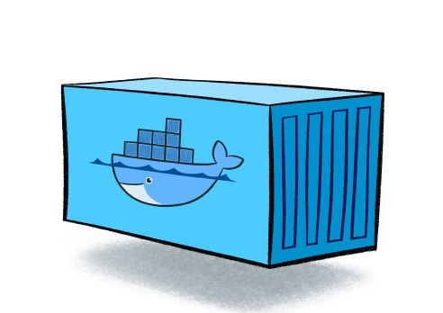

Docker容器是无状态的（不需要在运行时候做持久化数据）。一般来讲，一些有状态的，存储重要数据的应用需要一些持久存储。卷功能提供了一种支持此要求的方法，但它带有一些关于文件系统权限的问题。

在大多数部署的设置中，将使用容器编排机制，并且持久存储由某些公共云产品提供，这些产品可能具有自己的配置权限的方式。但是，在本地开发或产品的早期迭代期间，最简单的方法是将主机目录公开为docker卷。

简而言之，这些是将主机目录配置为卷时需要注意的事实：

- 从主机和容器的角度来看，对卷中内容设置的文件权限是相同的。
- 只有UID（用户ID）和GID（组ID）很重要。例如，用户和组的名称和密码不需要匹配，甚至不需要存在于主机和容器中
- 根据自己的配置对在运行的容器，具有所有操作权限，如：强制执行文件权限。例如，如果用户A同时存在于主机和容器中，将用户A添加到主机上的组B，不允许用户A写入容器内的组B所拥有的目录，除非在容器内创建组B并且向其添加用户A.
- 默认情况下，容器的命令以root身份运行
- （在基于unix的系统上）可以将文件/目录所有权设置为不属于任何实际组的GID

如果你掌握上述事实，应该能够配置容器和卷而不会有太多意外事故。如果你不熟悉UNIX文件权限，我可以推荐本站的[linuxea基础之权限管理](https://www.linuxea.com/1375.html)一篇。

## 文件权限

我们可以方便地为本地开发配置内容，示例：

将要用作卷的目录的组所有权设置为某些GID（在此示例中为1101）未在主机上的任何实际组上使用

```
[root@linuxea.com ~]# mkdir /root/linuxea.com
[root@linuxea.com ~]# chown :1101 /root/linuxea.com
```

- 更改目录的权限以授予组成员完全访问权限（读取+写入+执行）

```
[root@linuxea.com ~]# chmod 755 /root/linuxea.com
```

- 确保文件夹中的所有之后内容都将继承组所有权

```
[root@linuxea.com ~]# chmod g+s /root/linuxea.com/
```

- 在Dockerfile中创建一个用户，该用户是1101组的成员

看起来可以是这样

```
FROM alpine:3.9
MAINTAINER www.linuxea.com
LABEL maintainer="www.linuxea.com"
RUN addgroup --gid 1101 www \
	&& adduser -u 1101 -S -H -s /bin/bash -g www -G www www -D
```

- （可选）将主机用户添加到组中，以便你方便地使用主机中的目录

centos:

```
useradd linuxea
```

上面的示例是一个最小化设置，可确保你不以root身份运行容器命令，并且可以使用主机上附加卷的内容，而无需使用主机root用户(你必须确保你使用的非root用户启动容器)。该设置在构建时执行硬编码配置，使你无法在运行时调整GID。如果需要，你必须将GID作为环境变量传递，并包含可以使用它的通用脚本。示例如下：

- entrypoint.sh

```
#!/bin/bash
# www.linuxea.com
USER_ID=${LOCAL_USER_ID:-1101}
USER_NAME=${LOCAL_USER_NAME:-www}

echo "Starting with UID : $USER_ID And user $USER_NAME"
addgroup --gid $USER_ID $USER_NAME 
adduser -u $USER_ID -S -H -s /bin/bash -g $USER_NAME -G $USER_NAME $USER_NAME -D
# useradd --shell /bin/bash -u $USER_ID -o -c "" -m user
export HOME=/home/$USER_NAME

exec /usr/local/bin/gosu www "$@"
```

我们在这里做的是从环境变量中获取UID和将要用到的名称，如果它不存在则默认为1101，NAME不存在则www，并且使用`adduser/useradd`设置UID时实际使用熟悉的命令创建用户“www” 。

## entrypoint创建

最后我们用这个用户`gosu`来执行我们的流程`"$@"`。记住来自Dockerfile的[CMD](https://www.linuxea.com/2216.html)或来自[docker CLI](https://www.linuxea.com/2256.html)的命令作为命令行参数传递给[entrypoint](https://www.linuxea.com/2216.html).sh脚本。

我们在看Dockerfile

```
FROM alpine:3.9
MAINTAINER www.linuxea.com
LABEL maintainer="www.linuxea.com"
COPY entrypoint.sh /bin/entrypoint.sh
RUN apk update \
	&& apk add bash \
	&& wget https://github.com/tianon/gosu/releases/download/1.11/gosu-amd64 -O /usr/local/bin/gosu \
	&& chmod +x /bin/entrypoint.sh /usr/local/bin/gosu \
	&& rm /var/cache/apk/*
ENTRYPOINT ["entrypoint.sh"]
CMD ["sleep","30000"]
```

build

```
[root@linuxea.com ~]# docker build -t marksugar/alpine:3.9 .
```

run

- 可以传递LOCAL_USER_ID和LOCAL_USER_NAME改变脚本参数，从而改变gid和name

```
[root@linuxea.com ~]# docker run -d marksugar/alpine:3.9
00f7afb58a9ee069f1bca6fdd716131e48538bc161911e62bf4249328f98270b
```

```
[root@linuxea.com ~]# docker exec -it 00f7 ps aux
PID   USER     TIME  COMMAND
    1 www       0:00 sleep 30000
   14 root      0:00 ps aux
```

```
[root@linuxea.com ~]# ps aux|grep sleep
1101     27414  0.3  0.0   1520     4 ?        Ss   21:56   0:00 sleep 30000
```

现在你就可以下载`marksugar/alpine:3.9`镜像来作为基础镜像了。