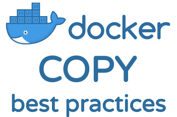

## COPY与ADD的最佳实践

COPY和ADD是可以将文件放入容器中，那么最好的用法是COPY而不是ADD，当然了，除非文件是tar包并且像自动解压



此[Dockerfile](https://docs.docker.com/engine/reference/builder/)指令将一个或多个本地文件或文件夹复制到Docker镜像中的目标中。

- `COPY <source>... <destination>`
- `COPY ["<source>",... "<destination>"]` （包含空格的路径）

#### 使用COPY的示例Dockerfile

这是`COPY`在Dockerfile中使用Ruby应用程序的方法。

```
FROM ruby:2.5.1
WORKDIR /usr/src/app
COPY Gemfile Gemfile.lock ./
RUN bundle install
COPY . .
CMD ["./your-daemon-or-script.rb"]
```

它积聚在镜象中的层，先从父镜象`ruby:2.5.1`，使用所定义`FROM`。

Docker指令`WORKDIR`为其后面的`COPY`或者`ADD` 指令定义工作目录

使用`COPY`它时，会将文件从本地源（在本例  `.`中为当前目录中的文件）复制到定义的位置`WORKDIR`。在上面的示例中，第二个  `.`引用镜象中工作目录中的当前目录。

#### 使用COPY创建镜象图层的最佳做法

Docker建议使用`COPY`以在不同镜象层中保存不同文件上下文的方式创建镜象层。这意味着重建镜象是有效的。最不可能更改的文件应位于较低层，而最可能更改的文件应最后添加。

如果您有多个`Dockerfile`步骤使用上下文中的不同文件，则`COPY`它们是单独的，而不是一次性完成。这可确保每个步骤的构建缓存仅在特定所需文件更改时失效（强制重新执行该步骤）。

 - [ 编写Dockerfiles的最佳实践](https://docs.docker.com/develop/develop-images/dockerfile_best-practices/#add-or-copy)

上面的Dockerfile示例演示了此原则。通过复制Gemfiles，然后`RUN bundle install` 使用已安装的Ruby Gems创建一个镜象层，可以对其进行缓存。最后两条Docker指令将应用程序的文件复制到镜象中，并使用默认命令设置`CMD`。

这意味着如果您更改任何应用程序的文件，则可以使用缓存的父级和中间层重建Docker镜像。这比从头开始构建所有这些更有效。

### 为什么不应该使用ADD

该`ADD`指令具有类似的语法`COPY`。除了将本地文件和目录复制到Docker镜像中的目标[之外](https://docs.docker.com/engine/reference/builder/#add)，它还具有一些[附加功能](https://docs.docker.com/engine/reference/builder/#add)。

- `ADD <source>... <destination>`
- `ADD ["<source>",... "<destination>"]` （包含空格的路径）

但是，Docker的Dockerfile最佳实践官方指南指出，这`COPY`是`ADD`大多数用途中的首选指令。

> 一般而言，虽然`*ADD*` and `*COPY*`在功能上类似，但是`*COPY*`是优选的。那是因为它更透明`*ADD*`。`*COPY*`仅支持将本地文件基本复制到容器中，同时`*ADD*`具有一些功能（如仅限本地的tar提取和远程URL支持），这些功能并不是很明显。因此，最好的用途`*ADD*`是将本地tar文件自动提取到镜象中
>
> 如：[编写Dockerfiles的最佳实践](https://docs.docker.com/develop/develop-images/dockerfile_best-practices/#add-or-copy)`*ADD rootfs.tar.xz /*`

其中一个`ADD`附加功能是它可以从URL复制文件，但Docker建议不要将其用于此目的。

#### 从URL复制文件的最佳做法

如果`ADD`source是URL，它将下载文件并将其复制到Docker镜像中的目标位置。docker表明，它往往是效率不高，从使用URL复制`ADD`，这是[最好的做法](https://docs.docker.com/develop/develop-images/dockerfile_best-practices/#add-or-copy)，以使用其他策略，包括所需的远程文件。

> 由于镜象大小很重要，`ADD`因此强烈建议不要使用从远程URL获取包。你应该使用`curl`或`wget`代替。这样，您可以删除提取后不再需要的文件，也不必在镜象中添加其他图层。 
>
>  - [ Dockerfile最佳实践](https://docs.docker.com/develop/develop-images/dockerfile_best-practices/#add-or-copy)

例如，你应该避免做以下事情：

```
ADD http://example.com/big.tar.xz /usr/src/things/
RUN tar -xJf /usr/src/things/big.tar.xz -C /usr/src/things
RUN make -C /usr/src/things all
```

而是做一些像：

```
RUN mkdir -p /usr/src/things \
    && curl -SL http://example.com/big.tar.xz \
    | tar -xJC /usr/src/things \
    && make -C /usr/src/things all
```

### 什么时候可以使用ADD

如果`<source>`是具有可识别压缩格式的**本地** `tar`存档，则它会自动解压缩为Docker镜像中的目录。例如：`ADD rootfs.tar.xz /`。这是Dockerfiles 中`ADD`over 的主要推荐用法`COPY`。

对于不需要`ADD`tar自动提取功能的其他项目（文件，目录），应该始终使用`COPY`。