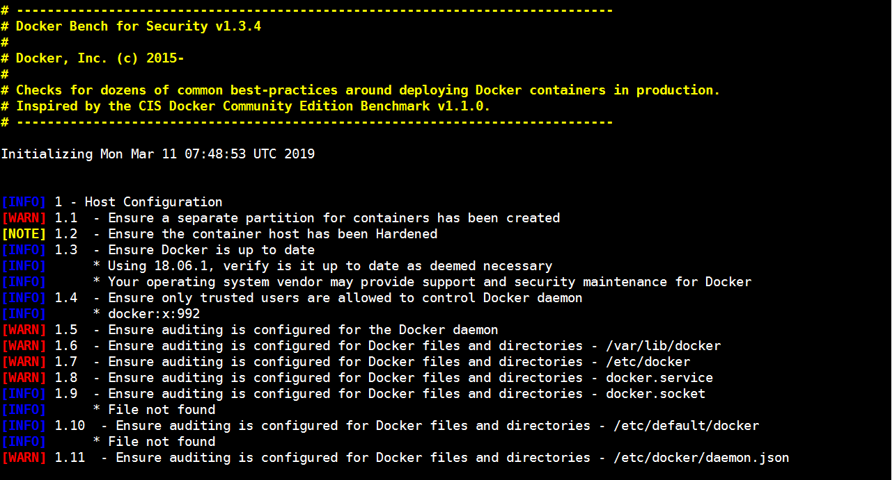

Docker可以加速部署周期，可以更快速度推出代码。但它也带来了一系列意想不到的安全隐患，你应该知道。

下面是五种常见的场景，其中部署Docker镜像会打开以前可能没有考虑过的新类型的安全问题，以及一些好的工具和建议，你可以使用它们来确保在部署时尽可能的减少安全隐患。

## 1.镜像的真实性

让我们从一个Docker本质上固有的问题开始：*镜像真实性*。
如果你已经使用Docker一段时间，你将熟悉很多镜像和容器的基础;这些镜像来自[官方的](https://hub.docker.com/explore/)，如*NGINX*，*Redis*，*Ubuntu*或*Alpine Linux* ; 或者来自一个完全陌生的人构建。

因此，我们有很多选择。
如果你不喜欢一个容器，因为它不太适合您的需求，那么你可以将其替换为另一个容器。

- 但是，这是最安全的方法吗？

如果你不确定我的意思，让我们从代码的角度考虑这个问题。
在开发应用程序时，直接使用别人的代码上线，你会这样做吗？
或者，你是否应该将所有未经分析的代码视保持怀疑态度？

我建议，如果安全性对你有很大重要性，那么在将代码集成到应用程序的代码库*之前*，你始终会对代码*进行*尽职审查。

- 是否这样？

好吧，应该对Docker容器给予同样程度的怀疑。
如果你不了解这些开发人员或组织，是否可以确信你选择的容器不包含其他恶意代码的受损二进制文件？
这似乎很难确定。

鉴于此，我建议你做三件事。

### 使用私有或受信任的存储库

首先，你可以使用私有和受信任的存储库，例如[Docker Hub的官方存储库](https://hub.docker.com/explore/)。
官方存储库有基本镜像：

- 操作系统，如Ubuntu。
- 编程语言，如PHP和Ruby。
- MySQL，PostgreSQL和Redis等服务器。

除了其他方面，使Docker Hub与众不同的是，[Docker的安全扫描服务](https://docs.docker.com/docker-cloud/builds/image-scan/)始终会扫描和审查这些镜像。
如果你没有听说过该服务。引用文档：

> Docker Cloud和Docker Hub可以扫描私有存储库中的镜像，以验证它们是否没有已知的安全漏洞或暴露的已有的漏洞，并报告每个镜像:tag的扫描结果。

因此，通过使用官方存储库，你可以知道你的容器可以安全使用，并且不包含恶意代码。

该功能可在限定时间内免费使用，并可用于所有付费用户。
如果你已经有付费，请使用扫描服务以确保你的自定义容器镜像也是安全可靠的，它应该不包含任何你不知道的漏洞。
这样，你就可以创建一个私有存储库，供你的组织使用。

如果你并不清楚镜像存储库，你可以参考我之前的博客：https://www.linuxea.com/search/harbor/

### 使用信任的Docker内容

你应该使用的另一个工具是[Docker Content Trust](https://docs.docker.com/engine/security/trust/content_trust/)。
这是Docker Engine 1.8中引入的新功能，允许你验证Docker镜像发布者。
引用Docko安全负责人DiogoMónica [发布的文章](https://blog.docker.com/2015/08/content-trust-docker-1-8/)：

> 在发布者将镜像推送到远程存储库之前，Docker Engine会使用发布者的私钥在本地对镜像进行签名。当你稍后提取此镜像时，Docker Engine会使用发布者的公钥来验证你要运行的镜像是否与发布者创建的镜像完全相同，未被篡改并且是最新的。

总而言之，该服务可防止镜像伪造，重放攻击和Compromised-key attack。我建议你查看该文章以及官方文档。

### Docker Bench Security

我最近使用的另一个工具是[Docker Bench Security](https://github.com/docker/docker-bench-security)，它包括：

> 检查有关在生产中部署Docker容器的许多常见最佳实践。

该工具基于[CIS Docker 1.13基准测试中](https://benchmarks.cisecurity.org/tools2/docker/CIS_Docker_1.13.0_Benchmark_v1.0.0.pdf)的建议，并针对以下六个方面进行检查：

1. 主机配置
2. Docker守护程序配置
3. Docker守护程序配置文件
4. 容器镜像和构建文件
5. 容器运行时
6. Docker安全操作

我们直接使用制作好的docker镜像

```
🌟 root@host-172-25-50-250 🎁 ~ 🎄 ❄ 2019-03-11 15:49:11 
$ docker run -it --net host --pid host --userns host --cap-add audit_control \
    -e DOCKER_CONTENT_TRUST=$DOCKER_CONTENT_TRUST \
    -v /var/lib:/var/lib \
    -v /var/run/docker.sock:/var/run/docker.sock \
    -v /usr/lib/systemd:/usr/lib/systemd \
    -v /etc:/etc --label docker_bench_security \
    docker/docker-bench-security
```

或者你也可以克隆代码仓库: `git clone git@github.com:docker/docker-bench-security.git`

这样构建的容器启动，会对主机上的镜像以及其运行的容器进行检查。
下面是它产生的输出样本。


你可以看到它提供了非常清晰的颜色编码输出，详细说明了它运行的检查及其结果。
就当前而言，这效果相当不错，但是也需要一些改进。

这个最妙的地方在于，它可以作为CI过程的一部分包含在内，有助于确保容器尽可能安全地运行。

## 2.特权

“特权的问题一直是个问题。如：root权限等，这些包括操作系统root，数据库root和一系列拥有超级管理员权限的权限“

而关于Docker，我特别关注两点：

- 容器以特权模式运行
- 容器使用的超额权限

从第一点开始，你可以使用`--privileged`运行Docker容器。
这样做是为这个容器提供扩展权限。
引用文档：

> 为容器提供*所有*功能，它还解除了设备cgroup控制器强制执行的所有限制。换句话说，容器几乎可以完成主机可以执行的所有操作。此标志存在以允许特殊用例，例如在Docker中运行Docker。

如果在这种情况下，让你继续使用的想法不会停下来，那么这应该使你感到担心。
老实说，除非你有*一个非常特殊的*用例，否则我不知道你为什么要使用这个开关，这个用法应该得到谨慎对待。
鉴于此，请在此之前谨慎行事。
引用此前的[linuxea:docker特权模式与--cap-add和--cap-drop](https://www.linuxea.com/2291.html)一文中的特权模式，可以得出以下结论：

> 不要使用特权容器，除非你对待它们的方式与处理以root身份运行的任何其他进程的方式相同。

但即使你没有使用`--privileged`运行容器，你的一个或多个容器也可能具有多余功能。
默认情况下，Docker使用一组相当有限的功能启动容器。

但是，可以通过非默认配置文件覆盖它。
如果你是构建Docker容器组织，如：*DigitalOcean*，*sloppy.io*，*dotCloud*和*Quay.io*等供应商，这些默认值可能不是你所拥有的。你也可能是自托管的，在这种情况下，验证容器的权限同样重要。

另外，我们需要关注另外一个谷歌的产品[gvisor](https://github.com/google/gvisor)，我会在后面的文章中介绍，请关注我的博客。

### 删除不必要的权限和功能

无论是谁主持一场容器的会议中，Docker安全[指南](https://docs.docker.com/engine/security/security/)都会谈论：

> 用户的最佳做法是删除除进程明确要求之外的所有功能。

考虑以下问题：

- 你的应用程序需要什么样的网络连接？
- 是否需要原始套接字访问？
- 是否需要发送和接收UDP请求？

如果没有，那就否认这些能力。

但是，它是否需要默认情况下大多数应用程序不具备的功能？
如果是，那就提供那些功能。

通过这样做，你将有助于限制恶意用户滥用你系统的能力，因为他们无法执行此操作。
为此，请使用`--cap-drop`和`--cap-add`开关。

假设你的应用程序不需要能够修改进程功能或绑定特权端口，但需要能够加载和卸载内核模块。

以下是删除和添加相应功能的方法：

```
docker run \
--cap-drop SETPCAP \
--cap-drop NET_BIND_SERVICE \
--cap-add SYS_MODULE \
-ti /bin/sh
```

有关这些选项的深入介绍，请参阅文档的[“运行时权限和Linux功能”](https://docs.docker.com/engine/reference/run/#runtime-privilege-and-linux-capabilities)和本站[docker特权模式与--cap-add和--cap-drop](https://www.linuxea.com/2291.html)的章节。

## 3.系统安全

我们应该减小(或删除)多余的容器权限
同时，我们应该确定容器的安全，我们先考虑两个点：
如果流氓代理访问你的容器，他们可以访问哪种权限？
如果攻击者可以破坏你的容器，那么他们是否很容易做其他事情？
如果是这样，有必要强化你的容器了。

虽然默认情况下Docker越来越安全，但由于以命名空间和cgroup为基础，你不需要仅依赖这些功能。但可以进一步使用其他Linux安全选项，例如[AppArmor](https://wiki.ubuntu.com/AppArmor)，[SELinux](https://selinuxproject.org/)，[grsecurity](https://grsecurity.net/)和[Seccomp](https://docs.docker.com/engine/security/seccomp/)。

这些都是一个成熟且经过良好测试的工具，能够进一步扩展容器主机安全性。但是鉴于我只是再次提到这些，而更深入的介绍这些技术并不在本章的范畴内。
但我强烈建议你了解有关它们的更多信息，如果有可能，将它们用作基础架构的一部分。

## 4.限制可用资源消耗

你的应用需要什么？
它是一个非常轻的应用程序，需要不超过500MB的内存？
那为什么要让它访问更多？
它是否执行更密集的处理，需要4个以上的CPU？
然后允许它访问它 - **但不能再**访问它。CPU配额和指定在有些时候是常见的

假设*分析*，*分析*和*基准测试*是持续开发过程的一部分，那么这些信息将随时可用。但必须合理。

比如：一个java程序，设定为2G内存，而pod只给了1G。这就会出现问题

因此，在部署容器时，请确保它们只拥有所需的资源。
为此，请使用适用的docker run开关，例如：

- `-m/--memory`：设置内存限制
- `--memory-reservation`：设置软内存限制
- `--kernel-memory`：设置内核内存限制
- `--cpus`：限制CPU数量
- `--device-read-bps`：限制设备的读取速率

下面是一个如何在Docker compose配置文件中执行其中一些操作的示例，取自[官方文档](https://docs.docker.com/compose/compose-file/#resources)：

```
version: '3'
	services:
		redis:
		image: redis:alpine
		deploy:
			resources:
				limits:
					cpus: '0.001'
					memory: 50M
			reservations:
				memory: 20M
```

可以通过运行`docker help run`或参考Docker运行文档中的[“资源的运行时约束”](https://docs.docker.com/engine/reference/run/#runtime-constraints-on-resources)部分找到更多信息。

## 5.大型攻击面

更多时候，体积更大的镜像，也就意味着更大的攻击面。为此，[缩减镜像](https://www.linuxea.com/2307.html#%E6%9B%B4%E5%B0%91%E7%9A%84%E5%B1%82)势在必行.

另外，我们还应该考虑的安全性的最后一个方面是Docker如何工作的结果 - 一个可能非常大的攻击面。
这可能发生在任何IT组织中，但由于基于容器的基础架构的短暂性质而加剧。

由于Docker允许你如此快速地创建和部署应用程序 - 以及同样轻松地销毁它们 - 因此很难*准确*了解你的组织已部署的应用程序。
鉴于此，大型攻击面的潜力增大。

你如果不确定部署统计信息？
为此，请了解以下问题：

- 当前部署了哪些应用程序？
- 谁部署了他们？
- 他们何时部署？
- 他们为什么要部署？
- 他们需要多长时间部署？
- 谁对他们负责？
- 上次运行安全扫描的时间是什么时候？

其实你也不必紧这些问题，这些信息仅仅需要跟安全的规范和手册便可以做到。但是现在，我要说的不仅仅是这些。

### 使用适当的日志记录实现审计跟踪

与应用程序中的审计跟踪一样，例如用户在激活帐户时创建帐户，以及用户上次更新密码时，以及组织内更广泛的密码，请考虑围绕组织创建和部署的每个容器实施审计跟踪。

这不一定复杂但它也不简单。
但它应该实现记录如下细节的东西：

- 部署应用程序时
- 谁部署了它
- 为何部署
- 它的意图是什么
- 什么时候应该弃用

大多数连续开发工具应支持记录此信息，无论是直接在工具中还是以你选择的首选编程语言提供自定义脚本。

除此之外，请考虑添加通知，无论是通过电子邮件还是其他通知，如：微信，QQ，email.
此额外层应确保部署对每个人都可见且透明。
这样，如果不应该发生某些事情，就不能隐藏它。

我并不是说你不应该信任你组织内的员工，但要及时了解正在发生的事情是很好的。

但是，有必要至少仔细思考这些问题，能够定期进行审核，并且能够始终从知情的角度进行工作，这有助于降低针对组织创建未知攻击面的可能性。

## 延伸阅读

[linuxea:Distroless与多阶段构建](https://www.linuxea.com/1939.html)
[linuxea:缩减docker镜像大小的5个步骤](https://www.linuxea.com/2307.html)
[linuxea:dockerfile中的RUN指令对镜像大小的影响](https://www.linuxea.com/2305.html)
[linuxea:docker容器中程序不应该以root用户身份运行](https://www.linuxea.com/2301.html)
[linuxea:docker特权模式与--cap-add和--cap-drop](https://www.linuxea.com/2291.html)

## 学习更多

学习如何使用Docker CLI命令，Dockerfile命令，使用这些命令可以帮助你更有效地使用Docker应用程序。查看Docker文档和我的其他帖子以了解更多信息。

- [docker目录](https://www.linuxea.com/category/big-data/)
- [白话容器](https://www.linuxea.com/tag/%E7%99%BD%E8%AF%9D%E5%AE%B9%E5%99%A8/)
- [docker-compose](https://www.linuxea.com/tag/docker-compose/)