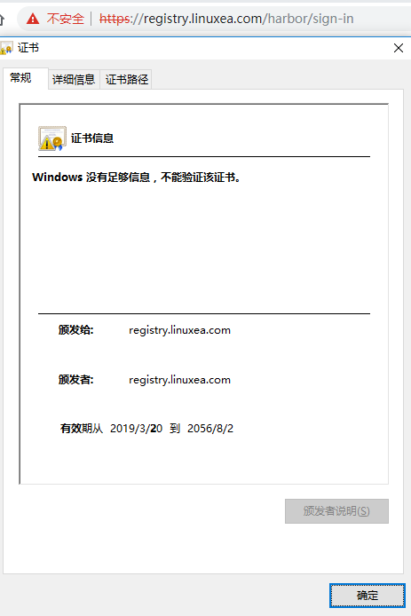
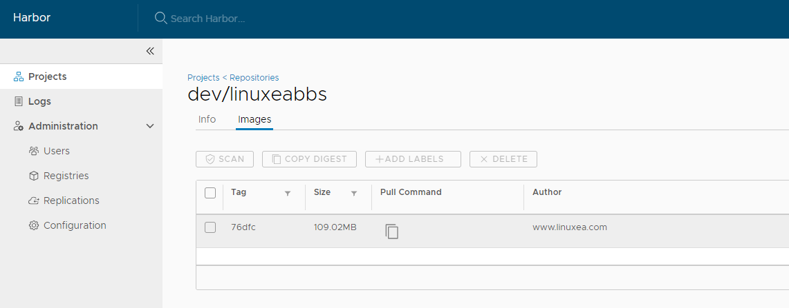

![201903121.png][1]
> 在此前的文章中有[安装配置harbor](https://www.linuxea.com/2236.html)，但是没有配置https，后来我发现在某一些时候，https还是挺有用的，于是就按照[github](https://github.com/goharbor/harbor/blob/master/docs/configure_https.md)上的参考，安装配置完成。

阅读此章，你将快速了解中文文档harbor的自签https的使用方式

由于Harbor未附带任何证书，因此默认情况下使用HTTP来对外提供请求。但是，强烈建议为任何生产环境启用安全性。Harbor有一个Nginx实例作为所有服务的反向代理，可以使用prepare脚本配置Nginx以启用https。

在测试或开发环境中，可以选择使用自签名证书，而不是来自受信任的第三方CA的证书。以下内容将向你展示如何创建自己的CA，并使用你的CA签署服务器证书和客户端证书。

我的内网仓库域名是：`registry.linuxea.com`

# 创建ssl

## 获得证书授权

我们要创建ca文件，大致如下

```
openssl genrsa -out ca.key 4096
```

```
openssl req -x509 -new -nodes -sha512 -days 3650 \
    -subj "/C=TW/ST=Taipei/L=Taipei/O=example/OU=Personal/CN=registry.linuxea.com" \
    -key ca.key \
    -out ca.crt
```

开始创建

```
[marksugar@www.linuxea.com ~/harbor/ssl]# openssl genrsa -out ca.key 4096
Generating RSA private key, 4096 bit long modulus
........++
...........++
e is 65537 (0x10001)
```

```
[marksugar@www.linuxea.com ~/harbor/ssl]#  openssl req -x509 -new -nodes -sha512 -days 3650 \
>     -subj "/C=TW/ST=Taipei/L=Taipei/O=example/OU=Personal/CN=registry.linuxea.com" \
>     -key ca.key \
>     -out ca.crt
```

将会产生两个文件

```
[marksugar@www.linuxea.com ~/harbor/ssl]# ll -sh
总用量 8.0K
4.0K -rw-r--r-- 1 root root 2.0K 3月  20 10:31 ca.crt
4.0K -rw-r--r-- 1 root root 3.2K 3月  20 10:29 ca.key
```

## 获取服务器证书

假设您的注册表的**主机名**是**registry.linuxea.com**，并且其DNS记录指向您正在运行Harbor的主机。在生产环境中，您首先应该从CA获得证书。在测试或开发环境中，您可以使用自己的CA. 证书通常包含.crt文件和.key文件，例如**registry.linuxea.com.crt**和**registry.linuxea.com.key**，我们现在进行创建。

```
 openssl req -x509 -new -nodes -sha512 -days 3650 \
    -subj "/C=TW/ST=Taipei/L=Taipei/O=example/OU=Personal/CN=registry.linuxea.com" \
    -key ca.key \
    -out ca.crt
```
开始创建
```
[marksugar@www.linuxea.com ~/harbor/ssl]#   openssl req -sha512 -new \
>     -subj "/C=TW/ST=Taipei/L=Taipei/O=example/OU=Personal/CN=registry.linuxea.com" \
>     -key registry.linuxea.com.key \
>     -out registry.linuxea.com.csr 
```
如下
```
[marksugar@www.linuxea.com ~/harbor/ssl]# ll -sh
总用量 16K
4.0K -rw-r--r-- 1 root root 2.0K 3月  20 10:31 ca.crt
4.0K -rw-r--r-- 1 root root 3.2K 3月  20 10:29 ca.key
4.0K -rw-r--r-- 1 root root 1.7K 3月  20 10:32 registry.linuxea.com.csr
4.0K -rw-r--r-- 1 root root 3.2K 3月  20 10:31 registry.linuxea.com.key
```

## 生成**registry** 主机的证书

无论您是使用类似**yourdomain.com的** FQDN 还是IP来连接注册表主机，请运行此命令以生成符合主题备用名称（SAN）和x509 v3扩展要求的注册表主机证书：

```
cat > v3.ext <<-EOF
authorityKeyIdentifier=keyid,issuer
basicConstraints=CA:FALSE
keyUsage = digitalSignature, nonRepudiation, keyEncipherment, dataEncipherment
extendedKeyUsage = serverAuth 
subjectAltName = @alt_names

[alt_names]
DNS.1=registry.linuxea.com
DNS.2=registry.ops.com
DNS.3=registry.ds.com
DNS.3=xx
DNS.4=xx
DNS.5=xx
EOF
```

```
openssl x509 -req -sha512 -days 13650 \
    -extfile v3.ext \
    -CA ca.crt -CAkey ca.key -CAcreateserial \
    -in registry.linuxea.com.csr \
    -out registry.linuxea.com.crt
```

开始创建

```
[marksugar@www.linuxea.com ~/harbor/ssl]# cat > v3.ext <<-EOF
> authorityKeyIdentifier=keyid,issuer
> basicConstraints=CA:FALSE
> keyUsage = digitalSignature, nonRepudiation, keyEncipherment, dataEncipherment
> extendedKeyUsage = serverAuth 
> subjectAltName = @alt_names
> 
> [alt_names]
> DNS.1=registry.linuxea.com
> DNS.2=registry.ops.com
> DNS.3=registry.ds.com
> DNS.3=10.10.100.100
> DNS.4=10.10.100.101
> DNS.5=10.10.100.102
> EOF
```

```
[marksugar@www.linuxea.com ~/harbor/ssl]# openssl x509 -req -sha512 -days 13650 \
>     -extfile v3.ext \
>     -CA ca.crt -CAkey ca.key -CAcreateserial \
>     -in registry.linuxea.com.csr \
>     -out registry.linuxea.com.crt
Signature ok
subject=/C=TW/ST=Taipei/L=Taipei/O=example/OU=Personal/CN=registry.linuxea.com
Getting CA Private Key
```

如下：

```
[marksugar@www.linuxea.com ~/harbor/ssl]# ll -sh
总用量 28K
4.0K -rw-r--r-- 1 root root 2.0K 3月  20 10:31 ca.crt
4.0K -rw-r--r-- 1 root root 3.2K 3月  20 10:29 ca.key
4.0K -rw-r--r-- 1 root root   17 3月  20 10:37 ca.srl
4.0K -rw-r--r-- 1 root root 2.2K 3月  20 10:37 registry.linuxea.com.crt
4.0K -rw-r--r-- 1 root root 1.7K 3月  20 10:32 registry.linuxea.com.csr
4.0K -rw-r--r-- 1 root root 3.2K 3月  20 10:31 registry.linuxea.com.key
4.0K -rw-r--r-- 1 root root  352 3月  20 10:36 v3.ext
```

# 配置harbor ssl

将ssl的文件复制到安装harbor的目录中，而后修改配置文件将crt,key的文件路径修改成如下：

```
harbor.cfg
#The protocol for accessing the UI and token/notification service, by default it is http.
#It can be set to https if ssl is enabled on nginx.
ui_url_protocol = https

#The path of cert and key files for nginx, they are applied only the protocol is set to https
ssl_cert = /data/harborcert/ssl/registry.linuxea.com.crt
ssl_cert_key = /data/harborcert/ssl/registry.linuxea.com.key
```
- ui_url_protocol = https
- ssl_cert = /data/harborcert/ssl/registry.linuxea.com.crt
- ssl_cert_key = /data/harborcert/ssl/registry.linuxea.com.key

如上所示，我这里修改的是这三个位置的信息。而后./prepare

```
[marksugar@www.linuxea.com /data/harbor]# ./prepare 
loaded secret from file: /data/secretkey
Generated configuration file: ./common/config/nginx/nginx.conf
Generated configuration file: ./common/config/adminserver/env
Generated configuration file: ./common/config/ui/env
Generated configuration file: ./common/config/registry/config.yml
Generated configuration file: ./common/config/db/env
Generated configuration file: ./common/config/jobservice/env
Generated configuration file: ./common/config/jobservice/config.yml
Generated configuration file: ./common/config/log/logrotate.conf
Generated configuration file: ./common/config/registryctl/env
Generated configuration file: ./common/config/ui/app.conf
Generated certificate, key file: ./common/config/ui/private_key.pem, cert file: ./common/config/registry/root.crt
The configuration files are ready, please use docker-compose to start the service.
```

此时需要重启生效

```
[marksugar@www.linuxea.com /data/harbor]# docker-compose down
Stopping nginx              ... done
Stopping harbor-jobservice  ... done
Stopping harbor-ui          ... done
Stopping registry           ... done
Stopping harbor-adminserver ... done
Stopping redis              ... done
Stopping harbor-db          ... done
Stopping harbor-log         ... done
Removing nginx              ... done
Removing harbor-jobservice  ... done
Removing harbor-ui          ... done
Removing registry           ... done
Removing harbor-adminserver ... done
Removing redis              ... done
Removing harbor-db          ... done
Removing harbor-log         ... done
Removing network harbor_harbor
```

```
[marksugar@www.linuxea.com /data/harbor]# docker-compose up -d
Creating network "harbor_harbor" with the default driver
Creating harbor-log ... done
Creating harbor-adminserver ... done
Creating harbor-db          ... done
Creating registry           ... done
Creating redis              ... done
Creating harbor-ui          ... done
Creating harbor-jobservice  ... done
Creating nginx              ... done
```

通过浏览器访问


harbor自签证书配置完成。

## 为docker客户端配置证书

**为Docker配置服务器证书，密钥和CA.**

Docker守护程序将`.crt`文件解释为CA证书，将`.cert`文件解释为客户端证书。

将`registry.linuxea.com.crt`转换为`registry.linuxea.com.cert`：

```
$ openssl x509 -inform PEM -in registry.linuxea.com.crt -out registry.linuxea.com.cert
$ls
总用量 12
-rw-r--r-- 1 root root 2183 3月  21 10:39 registry.linuxea.com.cert
-rw-r--r-- 1 root root 2183 3月  21 10:35 registry.linuxea.com.crt
-rw-r--r-- 1 root root 3243 3月  21 10:35 registry.linuxea.com.key
```

创建一个certs.d目录，在/etc/docker目录下
- 如果有必要，这里的目录可能也会是`/etc/docker/certs.d/registry.linuxea.com:443/`

```
[marksugar@www.linuxea.com_10_10_240_145 ~]$ mkdir /etc/docker/certs.d/registry.linuxea.com/ -p
```

而后将ca.crt和registry.linuxea.com.key以及registry.linuxea.com.cert复制到目录中

```
[marksugar@www.linuxea.com_10_10_240_145 ~]$ cp registry.linuxea.com.cert /etc/docker/certs.d/registry.linuxea.com/
[marksugar@www.linuxea.com_10_10_240_145 ~]$ cp registry.linuxea.com.key /etc/docker/certs.d/registry.linuxea.com/
[marksugar@www.linuxea.com_10_10_240_145 ~]$ cp ca.crt /etc/docker/certs.d/registry.linuxea.com/
```
除此之外，还需要添加一个配置文件在`/etc/docker/daemon.json `
```
[marksugar@www.linuxea.com_10_10_240_145 /etc/docker]$ cat /etc/docker/daemon.json 
{
  "insecure-registries": ["registry.linuxea.com"]
}
```
尝试登陆
```
[marksugar@www.linuxea.com_10_10_240_145 /etc/docker/certs.d]$ echo "123.linuxea.coM" | docker login --username linuxea registry.linuxea.com:443 --password-stdin
WARNING! Your password will be stored unencrypted in /root/.docker/config.json.
Configure a credential helper to remove this warning. See
https://docs.docker.com/engine/reference/commandline/login/#credentials-store

Login Succeeded
```
push
```
[marksugar@www.linuxea.com_10_10_240_145 /etc/docker]$ docker push registry.linuxea.com/dev/linuxeabbs:76dfc
The push refers to repository [registry.linuxea.com/dev/linuxeabbs]
40b26f14ac05: Pushed 
0d9ac8e69ea5: Pushed 
9d3306a6ac16: Pushed 
5d71ec9b2c6e: Pushed 
503e53e365f3: Pushed 
76dfc: digest: sha256:b8c5b1d2da1ec88ceaf6f0d80fbd93299f600a02a2750c9089d06f6a9f0af8c3 size: 1362
```

## 延伸阅读
- [linuxea:白话容器之Registry与Harbor的构建和使用 (26)](https://www.linuxea.com/2236.html)

## 学习更多

学习如何使用Docker CLI命令，Dockerfile命令，使用这些命令可以帮助你更有效地使用Docker应用程序。查看Docker文档和我的其他帖子以了解更多信息。

- [docker目录](https://www.linuxea.com/category/big-data/)
- [白话容器](https://www.linuxea.com/tag/%E7%99%BD%E8%AF%9D%E5%AE%B9%E5%99%A8/)
- [docker-compose](https://www.linuxea.com/tag/docker-compose/)