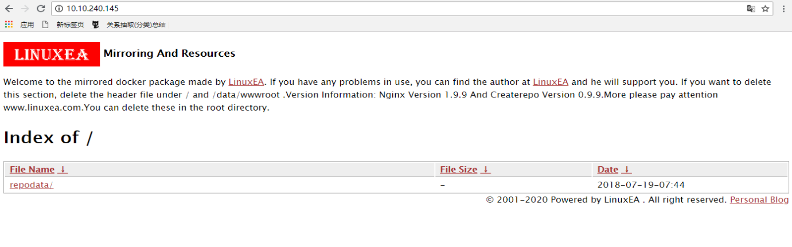

延用之前的supervisor和inotify，这次加入ENV环境变量，主要配合compose做参数传递
### 构建顺序
我做了一个docker createrepo示例，并用了nginx和ngx-fancyindex模块，这样一来，这个过程就需要如下几步才能完成一个镜象的制作：
1，选择基础镜象
2，构建过程整理
3，需求构建
4，测试

我大致将一个镜象构建分为如上几步
1，选择基础镜像，主要是因为便捷和缩小难度，并且从镜象的使用频率来考虑是否需要花大量的时间来进行构建符合自己的镜象包
2，构建过程必须透明，必须了解所构建的应用，熟悉所构建的应用并了解特性才能做好，测试建议使用多条run命令（多条run会形成多层，多层可复用（当在报错时，可以减少构建时间），多层会叠加，体积更大）
3，需求构建，如：nginx编译，编译所依赖包安装，createrepo，supervisor和inotify的安装配置，配置的修改,createrepo的配置关系等，甚至于要考虑这些依赖包在最后是否需要卸载，如果卸载影响到那些功能，我这里用ngx-fancyindex模块，在构建镜像前，这些文件都准备好了，在最后添加到dockerfile中，最后build，而后push到dockerhub
* 注意

在这个工程中，如果用compose，那么如果有挂载文件，那么这个顺序是要注意的，如果在dockerfile中创建的目录，且写入了文件，最后启动的时候，就会出现文件被映射目录覆盖的问题，这时候就需要启动脚本，在脚本中定义好，因为脚本只有在启动的时候才执行，这里值得注意到就是他的执行顺序和启动顺序的微妙关系
4，测试前面所有的步骤是否完成，主要测试第三步
supervisor和inotify，参考：`https://www.linuxea.com/1873.html`
### 变量传递
至于变量的传递，大概经历了以下过程：
在compose中的environment类似export
```
[marksugar@www.linuxea.com vhost]# export NGINX_PORT=81;
[marksugar@www.linuxea.com vhost]# export SERVER_NAME=0.0.0.0;
```
查看环境变量
```
[marksugar@www.linuxea.com vhost]# env|egrep "SERVER_NAME|NGINX_PORT"
SERVER_NAME=0.0.0.0
NGINX_PORT=81
```
而后在用`envsubst < /etc/nginx/vhost/ps.env > /etc/nginx/vhost/ps.conf  `
在看已经被替换
```
[marksugar@www.linuxea.com vhost]# cat ps.conf 
listen 81;
server_name 0.0.0.0;
```
### dockerfile
基础镜象centos:7 ，编译nginx，安装依赖包，克隆第三方模块，安装所需安装包，在最后下载配置文件和添加启动脚本，如下：
* dockerfile文件
```
FROM centos:7
MAINTAINER wwww.linuxea.com
ENV version=1.9.9
ENV USER=www
ENV INSTALL_PATH="/usr/local"
ENV WWWPATH="/data/wwwroot"
RUN useradd ${USER} -s /sbin/nologin -M \
	&& yum install epel* -y \
	&& yum install openssl-devel pcre pcre-devel gcc make createrepo python-pip inotify-tools git gettext -y \
	&& pip install supervisor \
	&& git clone https://github.com/aperezdc/ngx-fancyindex.git "${INSTALL_PATH}/ngx-fancyindex" \
	&& sed -i 's/f4f4f4/fff/g' /usr/local/ngx-fancyindex/template.html \
	&& curl -Lk http://nginx.org/download/nginx-${version}.tar.gz |tar xz -C ${INSTALL_PATH} \
	&& cd /usr/local/nginx-${version} && ./configure \
		--prefix=/usr/local/nginx \
		--conf-path=/etc/nginx/nginx.conf \
		--user=${USER} \
		--group=${USER} \
		--error-log-path=/data/logs/error.log \
		--http-log-path=/data/logs/access.log \
		--pid-path=/var/run/nginx/nginx.pid \
		--lock-path=/var/lock/nginx.lock \
		--with-http_ssl_module \
		--with-http_stub_status_module \
		--with-http_gzip_static_module \
		--with-http_flv_module \
		--with-http_mp4_module \
		--http-client-body-temp-path=/var/tmp/nginx/client \
		--http-proxy-temp-path=/var/tmp/nginx/proxy \
		--http-fastcgi-temp-path=/var/tmp/nginx/fastcgi \
		--http-uwsgi-temp-path=/var/tmp/nginx/uwsgi \
		--add-module=${INSTALL_PATH}/ngx-fancyindex/  \
	&& make && make install \
	&& ln -s /usr/local/nginx/sbin/nginx /sbin/nginx \
	&& rm -rf /etc/nginx/nginx.conf \
	&& mkdir -p /var/tmp/nginx/{client,fastcgi,proxy,uwsgi} /etc/nginx/vhost ${WWWPATH}/ /data/logs \
	&& curl -Lk https://raw.githubusercontent.com/LinuxEA-Mark/docker-createrepo/master/nginx.conf -o /etc/nginx/nginx.conf \
	&& curl -Lk https://raw.githubusercontent.com/LinuxEA-Mark/docker-createrepo/master/footer.html -o /tmp/footer.html \
	&& curl -Lk https://raw.githubusercontent.com/LinuxEA-Mark/docker-createrepo/master/header.html -o /tmp//header.html \
	&& curl -Lk https://raw.githubusercontent.com/LinuxEA-Mark/docker-createrepo/master/supervisord.conf -o /etc/supervisord.conf \
	&& echo -e "listen 80;\nserver_name localhost;" > /etc/nginx/vhost/ps.conf \
	&& echo -e "listen \${NGINX_PORT};\nserver_name \${SERVER_NAME};" > /etc/nginx/vhost/ps.env \
	&& echo -e '#!/bin/bash\nmkdir /data/{wwwroot,logs} -p\n cp /tmp/*.html /data/wwwroot \ncreaterepo -pdo /data/wwwroot /data/wwwroot\nenvsubst < /etc/nginx/vhost/ps.env > /etc/nginx/vhost/ps.conf \nsupervisord  -n -c /etc/supervisord.conf' > /startup.sh \
	&& chmod +x /startup.sh \
	&& yum remove git openssl-devel pcre-devel gcc make python-pip -y \
	&& \rm -rf /usr/local/nginx-1.9.9/ ngx-fancyindex/ /var/cache/yum \
	&& yum clean all
ENTRYPOINT ["/startup.sh"]
```
### compose文件
* compose文件

在compose中进行配置，如下，主要关注environment
```
version: '3'
services:
  nginx_createrepo:
    image: nginx_createrepo
#    build:
#      context: https://raw.githubusercontent.com/LinuxEA-Mark/docker-createrepo/master/Dockerfile
    container_name: nginx_createrepo
    restart: always
    network_mode: "host"
    volumes:
      - /data/mirrors:/data
    environment:
      - NGINX_PORT=80
      - SERVER_NAME=localhost
```

如上所示中，在compose启动之前，修改compose文件的NGINX_PORT和SERVER_NAME即会修改nginx配置文件，也就是ps.conf的listen和servername
在如上的dockerfile中如下：
```
echo -e "listen 80;\nserver_name localhost;" > /etc/nginx/vhost/ps.conf
echo -e "listen \${NGINX_PORT};\nserver_name \${SERVER_NAME};" > /etc/nginx/vhost/ps.env
envsubst < /etc/nginx/vhost/ps.env > /etc/nginx/vhost/ps.conf
```
为了方便启动，配置文件在github上
```
#!/bin/bash
DPATH=/data/mirrors
mkdir -p ${DPATH}
curl -Lk https://raw.githubusercontent.com/LinuxEA-Mark/docker-createrepo/master/docker-compose.yml -o ${DPATH}/docker-compose.yml 
docker-compose -f ${DPATH}/docker-compose.yml up -d
```
### 一步安装
```
curl -Lk https://raw.githubusercontent.com/LinuxEA-Mark/docker-createrepo/master/install_start.sh|bash
```
也可以在github上下载dockerfile本地build
当你up起来后，就可以打开浏览器，ip:80查看，可以作为文件服务器或者mirrors源使用，当然，他不会去主动同步其他源



