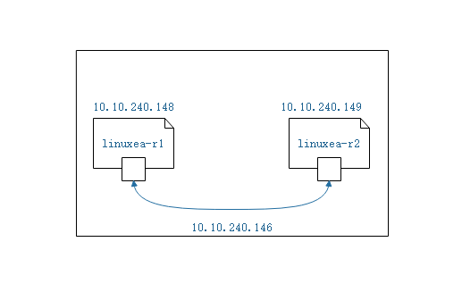
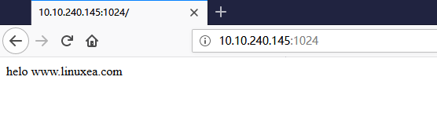
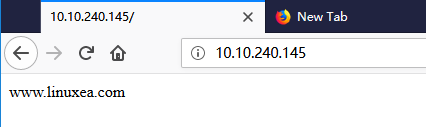

此前我们知道在容器中一共有6个名称空间是被隔离的，其中NET,UTS,ITC是能够共享的。

其中网络也有多种方式，现在我们可以使用ip route模拟容器的名称空间。ip netns命令来进行添加，编辑等。

## 网络名称空间

我们手动创建名称空间，网络名称空间

添加linuxea-r1和linuxea-r2网络名称空间，并进行配置虚拟网卡对，而后配置ip，模拟



先添加linuxea-r1和linuxea-r2网络名称空间
```
[marksugar@linuxea.com146 ~]# ip netns add linuxea-r1
[marksugar@linuxea.com146 ~]# ip netns add linuxea-r2
```
列出网络名称空间
```
[marksugar@linuxea.com146 ~]# ip netns list
linuxea-r2
linuxea-r1
```
使用exec 和ip a查看，在netnamespace中是没有任何接口的
```
[marksugar@linuxea.com146 ~]#  ip netns exec linuxea-r1 ip a
1: lo: <LOOPBACK> mtu 65536 qdisc noop state DOWN qlen 1
    link/loopback 00:00:00:00:00:00 brd 00:00:00:00:00:00
```

```
[marksugar@linuxea.com146 ~]#  ip netns exec linuxea-r2 ip a
1: lo: <LOOPBACK> mtu 65536 qdisc noop state DOWN qlen 1
    link/loopback 00:00:00:00:00:00 brd 00:00:00:00:00:00
```
现在，可以使用ip命令，创建虚拟网卡对，而后手动分配到这个网络名称空间中

name指明名称veth1.1，指明类型type veth，peer另外一半的veth1.2

```
[marksugar@linuxea.com146 ~]# ip link add name veth1.1 type  veth peer name veth1.2
```

虚拟网卡是成对出现的

```
[marksugar@linuxea.com146 ~]# ip link sh
....
1198: veth1.2@veth1.1: <BROADCAST,MULTICAST,M-DOWN> mtu 1500 qdisc noop state DOWN mode DEFAULT qlen 1000
    link/ether 2e:4a:03:95:ab:e3 brd ff:ff:ff:ff:ff:ff
1199: veth1.1@veth1.2: <BROADCAST,MULTICAST,M-DOWN> mtu 1500 qdisc noop state DOWN mode DEFAULT qlen 1000
    link/ether 26:fb:90:88:02:91 brd ff:ff:ff:ff:ff:ff
....    
```

现在可以将verh1.2 放到刚创建的名称空间linuxea-r1中

```
[marksugar@linuxea.com146 ~]# ip link set dev veth1.2 netns linuxea-r1
```

verh1.2已经没有了，只剩下veth1.1，一个设备只能属于是一个名称空间

```
[marksugar@linuxea.com146 ~]# ip link show
...
1199: veth1.1@if1198: <BROADCAST,MULTICAST> mtu 1500 qdisc noop state DOWN mode DEFAULT qlen 1000
    link/ether 26:fb:90:88:02:91 brd ff:ff:ff:ff:ff:ff link-netnsid 0
```

而后切入到linuxea-r1中查看，veth1.2已在此中了。这样就完成了网卡调用

```
[marksugar@linuxea.com146 ~]#  ip netns exec linuxea-r1 ip a
1: lo: <LOOPBACK> mtu 65536 qdisc noop state DOWN qlen 1
    link/loopback 00:00:00:00:00:00 brd 00:00:00:00:00:00
1198: veth1.2@if1199: <BROADCAST,MULTICAST> mtu 1500 qdisc noop state DOWN qlen 1000
    link/ether 2e:4a:03:95:ab:e3 brd ff:ff:ff:ff:ff:ff link-netnsid 0
```

可以修改网卡名称，veth1.2 成 eth0

```
[marksugar@linuxea.com146 ~]#  ip netns exec linuxea-r1 ip link set dev veth1.2 name eth0
```

在查看已经被修改了

```
[marksugar@linuxea.com146 ~]# ip netns exec linuxea-r1 ip a
1: lo: <LOOPBACK> mtu 65536 qdisc noop state DOWN qlen 1
    link/loopback 00:00:00:00:00:00 brd 00:00:00:00:00:00
1198: eth0@if1199: <BROADCAST,MULTICAST> mtu 1500 qdisc noop state DOWN qlen 1000
    link/ether 2e:4a:03:95:ab:e3 brd ff:ff:ff:ff:ff:ff link-netnsid 0
```

配置一个ip地址，并且激活

```
[marksugar@linuxea.com146 ~]# ip addr add 10.10.240.147/24 dev veth1.1
```

```
[marksugar@linuxea.com146 ~]# ip link set veth1.1 up
```

```
[marksugar@linuxea.com146 ~]# ip a
...
1199: veth1.1@if1198: <NO-CARRIER,BROADCAST,MULTICAST,UP> mtu 1500 qdisc noqueue state LOWERLAYERDOWN qlen 1000
    link/ether 26:fb:90:88:02:91 brd ff:ff:ff:ff:ff:ff link-netnsid 0
    inet 10.10.240.147/24 scope global veth1.1
       valid_lft forever preferred_lft forever
```

而后将 linuxea-r1 中的eth0也设置ip

```
[marksugar@linuxea.com146 ~]# ip netns exec linuxea-r1 ip  addr add 10.10.240.148/24 dev eth0
```

并且up

```
[marksugar@linuxea.com146 ~]# ip netns exec linuxea-r1 ip  link set eth0 up
```

现在 linuxea-r1就有了这个10.10.240.148ip地址

```
[marksugar@linuxea.com146 ~]# ip netns exec linuxea-r1 ip a
1: lo: <LOOPBACK> mtu 65536 qdisc noop state DOWN qlen 1
    link/loopback 00:00:00:00:00:00 brd 00:00:00:00:00:00
1198: eth0@if1199: <BROADCAST,MULTICAST,UP,LOWER_UP> mtu 1500 qdisc noqueue state UP qlen 1000
    link/ether 2e:4a:03:95:ab:e3 brd ff:ff:ff:ff:ff:ff link-netnsid 0
    inet 10.10.240.148/24 scope global eth0
       valid_lft forever preferred_lft forever
    inet6 fe80::2c4a:3ff:fe95:abe3/64 scope link 
       valid_lft forever preferred_lft forever
```

在宿主机并且可以Ping通

```
[marksugar@linuxea.com146 ~]# ping 10.10.240.148
PING 10.10.240.148 (10.10.240.148) 56(84) bytes of data.
64 bytes from 10.10.240.148: icmp_seq=1 ttl=64 time=0.062 ms
```

且mac地址就是 linuxea-r1的10.10.240.148的mac地址。

```
[marksugar@linuxea.com146 ~]# arping -I veth1.1 10.10.240.148 
ARPING 10.10.240.148 from 10.10.240.147 veth1.1
Unicast reply from 10.10.240.148 [2E:4A:03:95:AB:E3]  0.525ms
Unicast reply from 10.10.240.148 [2E:4A:03:95:AB:E3]  0.534ms
Unicast reply from 10.10.240.148 [2E:4A:03:95:AB:E3]  0.532ms
Unicast reply from 10.10.240.148 [2E:4A:03:95:AB:E3]  0.534ms
Unicast reply from 10.10.240.148 [2E:4A:03:95:AB:E3]  0.543ms
Unicast reply from 10.10.240.148 [2E:4A:03:95:AB:E3]  0.533ms
Unicast reply from 10.10.240.148 [2E:4A:03:95:AB:E3]  0.539ms
^CSent 7 probes (1 broadcast(s))
Received 7 response(s)
[marksugar@linuxea.com146 ~]# 
```

那我们如法炮制，把另外一张网卡对也加入到linuxea-r2中

```
[marksugar@linuxea.com146 ~]# ip link set dev veth1.1 netns linuxea-r2
```

现在本机就么有了

```
[marksugar@linuxea.com146 ~]# ip a
1: lo: <LOOPBACK,UP,LOWER_UP> mtu 65536 qdisc noqueue state UNKNOWN qlen 1
    link/loopback 00:00:00:00:00:00 brd 00:00:00:00:00:00
    inet 127.0.0.1/8 scope host lo
       valid_lft forever preferred_lft forever
2: eth0: <BROADCAST,MULTICAST,UP,LOWER_UP> mtu 1500 qdisc mq state UP qlen 1000
    link/ether 88:88:2f:5e:7d:24 brd ff:ff:ff:ff:ff:ff
    inet 10.10.240.146/8 brd 10.255.255.255 scope global dynamic eth0
       valid_lft 56314sec preferred_lft 56314sec
3: docker0: <NO-CARRIER,BROADCAST,MULTICAST,UP> mtu 1500 qdisc noqueue state DOWN 
    link/ether 02:42:44:e6:6c:9d brd ff:ff:ff:ff:ff:ff
    inet 172.17.0.1/16 scope global docker0
       valid_lft forever preferred_lft forever
1193: flannel.1: <BROADCAST,MULTICAST,UP,LOWER_UP> mtu 1450 qdisc noqueue state UNKNOWN 
    link/ether aa:fd:72:43:fc:f7 brd ff:ff:ff:ff:ff:ff
    inet 172.16.2.0/32 scope global flannel.1
       valid_lft forever preferred_lft forever
1194: cni0: <NO-CARRIER,BROADCAST,MULTICAST,UP> mtu 1500 qdisc noqueue state DOWN qlen 1000
    link/ether 0a:58:ac:10:02:01 brd ff:ff:ff:ff:ff:ff
    inet 172.16.2.1/24 scope global cni0
       valid_lft forever preferred_lft forever
```

回到linuxea-r2内，veth1.1尚未激活

```
[marksugar@linuxea.com146 ~]# ip netns exec linuxea-r2 ip a
1: lo: <LOOPBACK> mtu 65536 qdisc noop state DOWN qlen 1
    link/loopback 00:00:00:00:00:00 brd 00:00:00:00:00:00
1199: veth1.1@if1198: <BROADCAST,MULTICAST> mtu 1500 qdisc noop state DOWN qlen 1000
    link/ether 26:fb:90:88:02:91 brd ff:ff:ff:ff:ff:ff link-netnsid 0
```

我们这次设置ip是10.10.240.149，并且激活

```
[marksugar@linuxea.com146 ~]# ip netns exec linuxea-r2 ip addr add 10.10.240.149/24 dev veth1.1
```

```
[marksugar@linuxea.com146 ~]# ip netns exec linuxea-r2 ip a
1: lo: <LOOPBACK> mtu 65536 qdisc noop state DOWN qlen 1
    link/loopback 00:00:00:00:00:00 brd 00:00:00:00:00:00
1199: veth1.1@if1198: <BROADCAST,MULTICAST> mtu 1500 qdisc noop state DOWN qlen 1000
    link/ether 26:fb:90:88:02:91 brd ff:ff:ff:ff:ff:ff link-netnsid 0
    inet 10.10.240.149/24 scope global veth1.1
       valid_lft forever preferred_lft forever
```

激活

```
[marksugar@linuxea.com146 ~]# ip netns exec linuxea-r2  ip link set veth1.1 up
```

回到linuxea-r1 ping linuxea-r2的10.10.240.149，也就是10.10.240.148 ping 149

```
[marksugar@linuxea.com146 ~]# ip netns exec linuxea-r1 ping 10.10.240.149
PING 10.10.240.149 (10.10.240.149) 56(84) bytes of data.
64 bytes from 10.10.240.149: icmp_seq=1 ttl=64 time=0.052 ms
64 bytes from 10.10.240.149: icmp_seq=2 ttl=64 time=0.042 ms
^C
--- 10.10.240.149 ping statistics ---
2 packets transmitted, 2 received, 0% packet loss, time 1040ms
rtt min/avg/max/mdev = 0.042/0.047/0.052/0.005 ms
```

在用arping验证下10.10.240.149的mac地址

```
[marksugar@linuxea.com146 ~]# ip netns exec linuxea-r1 arping -I eth0 10.10.240.149
ARPING 10.10.240.149 from 10.10.240.148 eth0
Unicast reply from 10.10.240.149 [26:FB:90:88:02:91]  0.532ms
Unicast reply from 10.10.240.149 [26:FB:90:88:02:91]  0.531ms
Unicast reply from 10.10.240.149 [26:FB:90:88:02:91]  0.533ms
^CSent 3 probes (1 broadcast(s))
Received 3 response(s)
```

当然， 这是没有问题的

那么，此前我们知道，默认是有三种网络，bridge,host,none,默认就是bridge，那也就是说指定网络就剩下host和none

## none

none就是不创建网络设备

```
[marksugar@linuxea.com_10_10_240_145 ~]$ docker run --name linuxea -it --network none --rm alpine
/ # ip a
1: lo: <LOOPBACK,UP,LOWER_UP> mtu 65536 qdisc noqueue state UNKNOWN qlen 1000
    link/loopback 00:00:00:00:00:00 brd 00:00:00:00:00:00
    inet 127.0.0.1/8 scope host lo
       valid_lft forever preferred_lft forever
```

## bridge

我们回到默认的bridge

```
[marksugar@linuxea.com_10_10_240_145 ~]$ docker run --name linuxea -it --network bridge --rm alpine
WARNING: IPv4 forwarding is disabled. Networking will not work.
/ # 
```

但使用hostname查看，你会发现

```
/ # hostname
bd95e817b0a6
```

这里的主机名和使用docker ps -a查看的CONTAINER ID一样，这个id是随机生成的。

当然， 也可以使用命令注入主机名到容器内，使用`-h`，如下：

```
[marksugar@linuxea.com_10_10_240_145 ~]$ docker run --name linuxea -it --network none --rm -h linuxea.com alpine
/ # hostname 
linuxea.com
```

如果这个主机需要通过主机名访问其他主机，可以通过DNS解析`/etc/resolv.conf `和`/etc/hosts`文件

也可以进行run的时候注入` --dns `，如下：

```
[marksugar@linuxea.com_10_10_240_145 ~]$ docker run --name linuxea -it --network none --rm -h linuxea.com --dns 4.4.4.4  alpine
/ # cat /etc/resolv.conf 
nameserver 4.4.4.4
```

也可以设置search，` --dns-search `

```
[marksugar@linuxea.com_10_10_240_145 ~]$ docker run --name linuxea -it --network none --rm -h linuxea.com --dns 4.4.4.4 --dns-search linuxea.com  alpine
/ # cat /etc/resolv.conf 
search linuxea.com
nameserver 4.4.4.4
```

甚至于可以在添加hosts，`--add-host`

```
[marksugar@linuxea.com_10_10_240_145 ~]$ docker run --name linuxea -it --network none --rm -h linuxea.com --dns 4.4.4.4 --dns-search linuxea.com --add-host linuxea.com:9.9.9.9  alpine
/ # cat /etc/hosts
127.0.0.1	localhost
::1	localhost ip6-localhost ip6-loopback
fe00::0	ip6-localnet
ff00::0	ip6-mcastprefix
ff02::1	ip6-allnodes
ff02::2	ip6-allrouters
9.9.9.9	linuxea.com
```

## 端口暴露

端口暴露有4中方式：

1，将指定容器端口映射到主机所有地址的一个动态端口

我们将内网的端口80使用—p暴露

```
[marksugar@linuxea.com_10_10_240_145 ~]$ docker run --name linuxea -it --network bridge -p 80 --rm linuxea/httpd:v1 httpd -f -h /data/5idocker
```

而后可以使用curl容器ip访问

```
[marksugar@linuxea.com_10_10_240_145 ~]$  docker inspect -f {{.NetworkSettings.Networks.linuxea0.IPAddress}}  linuxea
```

```
[marksugar@linuxea.com_10_10_240_145 /data/mirrors/wwwroot]$ curl 172.17.0.4
helo www.linuxea.com
```

如果要使用node ip访问，就需要查看这个随机的暴露端口`iptables -t nat -vnL`，如下

这段意思就是当访问1024端口就被转发到172.17.0.4:80端口

```
[marksugar@linuxea.com_10_10_240_145 /data/mirrors/wwwroot]$ iptables -t nat -vnL
Chain DOCKER (2 references)
 pkts bytes target     prot opt in     out     source               destination         
    1    84 RETURN     all  --  docker0 *       0.0.0.0/0            0.0.0.0/0           
    0     0 DNAT       tcp  --  !docker0 *       0.0.0.0/0            0.0.0.0/0            tcp dpt:1024 to:172.17.0.4:80
```

也可以通过docker ps -a查看

```
[marksugar@linuxea.com_10_10_240_145 /data/mirrors/wwwroot]$ docker ps -a
CONTAINER ID        IMAGE                        COMMAND                  CREATED             STATUS                  PORTS                  NAMES
3bfe5d8feb8c        linuxea/httpd:v1             "httpd -f -h /data/5…"   13 hours ago        Up 13 hours             0.0.0.0:1024->80/tcp   linuxea
```

而后通过10.10.240.145:1025访问

```
[marksugar@linuxea.com_10_10_240_145 /data/mirrors/wwwroot]$ curl 10.10.240.145:1024
helo www.linuxea.com
```

也可以在物理机访问



此时删除容器，防火墙规则也会删除

2，将容器端口映射到指定的主机端口

一般情形，容器监听什么端口，我们就该暴露什么端口

-p hostport:containerport ,本地端口:容器端口

```
[marksugar@linuxea.com_10_10_240_145 /data/mirrors/wwwroot]$ docker run --name linuxea -it --network bridge -p 81:80 --rm linuxea/httpd:v1 httpd -f -h /data/5idocker
```
```
[marksugar@linuxea.com_10_10_240_145 ~]$ docker port linuxea
80/tcp -> 0.0.0.0:81
```

而后通过浏览器访问


3，将指定的容器端口映射到主机的指定的动态端口

如果我们想将容器内的端口暴露到指定的端口映射到物理的端口，就可以使用-p ip::containerport

ip::80 其中::中间是随机端口，ip是本机ip，80是容器内端口
```
[marksugar@linuxea.com_10_10_240_145 /data/mirrors/wwwroot]$ docker run --name linuxea -it --network bridge -p 10.10.240.145::80 --rm linuxea/httpd:v1 httpd -f -h /data/5idocker
```
查看端口
```
[marksugar@linuxea.com_10_10_240_145 ~]$ docker port linuxea
80/tcp -> 10.10.240.145:1024
```

通过浏览器访问


4，将指定的容器端口映射到主机指定的端口

我们不但可以向如上那样使用动态端口，指定固定端口，指定主机动态端口，也可以指定主机固定端口

```
[marksugar@linuxea.com_10_10_240_145 ~]$ docker run --name linuxea -it --network bridge -p 10.10.240.145:81:80 --rm linuxea/httpd:v1 httpd -f -h /data/5idocker
```

```
[marksugar@linuxea.com_10_10_240_145 ~]$ docker port linuxea
80/tcp -> 10.10.240.145:81
```

通过浏览器访问


注意事项：暴露端口，这个端口在容器内必须是被监听的，也就是存在的，如果容器内不存在这个端口，就算你暴露了也是没有用的。并且-p选项可以使用多次-p 80:80 -p 8080:8080。

而使用了-P大写的P，就可以暴露容器内已经监听的端口。

## 联盟式容器

两个容器之间共享同一个网络名称空间。

- 联盟式容器是指两个名称空间各自使用user,mount,pid。但共享utf,nat,ipc名称空间

我们启动一个容器，状态如下

```
[marksugar@linuxea.com_10_10_240_145 /data/mirrors/wwwroot]$ docker run --name linuxea -it --rm busybox
/ # ip a
1: lo: <LOOPBACK,UP,LOWER_UP> mtu 65536 qdisc noqueue qlen 1000
    link/loopback 00:00:00:00:00:00 brd 00:00:00:00:00:00
    inet 127.0.0.1/8 scope host lo
       valid_lft forever preferred_lft forever
103: eth0@if104: <BROADCAST,MULTICAST,UP,LOWER_UP,M-DOWN> mtu 1500 qdisc noqueue 
    link/ether 02:42:ac:11:00:02 brd ff:ff:ff:ff:ff:ff
    inet 172.17.0.2/16 brd 172.17.255.255 scope global eth0
       valid_lft forever preferred_lft forever
```

我们在启动一个容器使用`--network container:linuxea`，这指网络名称空间使用第一个容器linuxea的网络名称空间。

```
[marksugar@linuxea.com_10_10_240_145 ~]$ docker run --name linuxea2 --network container:linuxea -it --rm busybox
/ # ip a
1: lo: <LOOPBACK,UP,LOWER_UP> mtu 65536 qdisc noqueue qlen 1000
    link/loopback 00:00:00:00:00:00 brd 00:00:00:00:00:00
    inet 127.0.0.1/8 scope host lo
       valid_lft forever preferred_lft forever
103: eth0@if104: <BROADCAST,MULTICAST,UP,LOWER_UP,M-DOWN> mtu 1500 qdisc noqueue 
    link/ether 02:42:ac:11:00:02 brd ff:ff:ff:ff:ff:ff
    inet 172.17.0.2/16 brd 172.17.255.255 scope global eth0
       valid_lft forever preferred_lft forever
```

网络名称空间是共享的，但是其他还是隔离的

为了更好的示例，创建一个httpd，在第一个linuxea容器

```
/ # mkdir /data/www -p
/ # echo "www.linuxea.com" >> /data/www/index.html
/ # httpd -h /data/www/
/ # netstat -tnl
Active Internet connections (only servers)
Proto Recv-Q Send-Q Local Address           Foreign Address         State       
tcp        0      0 0.0.0.0:80              0.0.0.0:*               LISTEN   
```

而后在linuxea2上使用127.0.0.1访问

```
/ # wget -O - -q 127.0.0.1
www.linuxea.com
```

linuxea和linuxea2是共享一个lo，也就是共享同一个IPC，彼此之间通讯。

这种效果相当于在传统主机上的两个进程直接通讯。

## host

host就不隔离网络名称空间，共享物理机的名称空间

```
[marksugar@linuxea.com_10_10_240_145 ~]$ docker run --name linuxea -it --network host --rm busybox
/ # ip a
1: lo: <LOOPBACK,UP,LOWER_UP> mtu 65536 qdisc noqueue qlen 1000
    link/loopback 00:00:00:00:00:00 brd 00:00:00:00:00:00
    inet 127.0.0.1/8 scope host lo
       valid_lft forever preferred_lft forever
2: eth0: <BROADCAST,MULTICAST,UP,LOWER_UP> mtu 1500 qdisc mq qlen 1000
    link/ether 88:88:2f:d9:89:67 brd ff:ff:ff:ff:ff:ff
    inet 10.10.240.145/8 brd 10.255.255.255 scope global dynamic eth0
       valid_lft 84609sec preferred_lft 84609sec
    inet 10.10.240.199/16 brd 10.0.255.255 scope global eth0:RSVIP
       valid_lft forever preferred_lft forever
3: docker0: <NO-CARRIER,BROADCAST,MULTICAST,UP> mtu 1500 qdisc noqueue 
    link/ether 02:42:67:1e:bf:16 brd ff:ff:ff:ff:ff:ff
    inet 172.17.0.1/16 brd 172.17.255.255 scope global docker0
       valid_lft forever preferred_lft forever
4: eth1: <BROADCAST,MULTICAST,UP,LOWER_UP> mtu 1500 qdisc mq qlen 1000
    link/ether fa:d9:57:90:8c:c8 brd ff:ff:ff:ff:ff:ff
    inet 10.0.1.172/8 brd 10.255.255.255 scope global dynamic eth1
       valid_lft 77223sec preferred_lft 77223sec
78: veth1,1@if77: <BROADCAST,MULTICAST,M-DOWN> mtu 1500 qdisc noop qlen 1000
    link/ether ca:e3:57:9d:46:6c brd ff:ff:ff:ff:ff:ff
79: veth1.2@veth1.1: <BROADCAST,MULTICAST,M-DOWN> mtu 1500 qdisc noop qlen 1000
    link/ether 06:3c:f3:f8:39:b1 brd ff:ff:ff:ff:ff:ff
80: veth1.1@veth1.2: <BROADCAST,MULTICAST,M-DOWN> mtu 1500 qdisc noop qlen 1000
    link/ether 66:96:16:71:13:4c brd ff:ff:ff:ff:ff:ff
```

而后如法炮制创建一个httpd

```
/ # mkdir /data/www -p
/ # echo "www.linuxea.com" >> /data/www/index.html
/ # httpd -h /data/www/
/ # netstat -tnl
Active Internet connections (only servers)
Proto Recv-Q Send-Q Local Address           Foreign Address         State       
tcp        0      0 0.0.0.0:3306            0.0.0.0:*               LISTEN      
tcp        0      0 0.0.0.0:6379            0.0.0.0:*               LISTEN      
tcp        0      0 0.0.0.0:6603            0.0.0.0:*               LISTEN      
tcp        0      0 0.0.0.0:80              0.0.0.0:*               LISTEN      
tcp        0      0 0.0.0.0:22992           0.0.0.0:*               LISTEN      
tcp        0      0 127.0.0.1:25            0.0.0.0:*               LISTEN      
tcp        0      0 127.0.0.1:6010          0.0.0.0:*               LISTEN      
tcp        0      0 127.0.0.1:6011          0.0.0.0:*               LISTEN      
tcp        0      0 127.0.0.1:6013          0.0.0.0:*               LISTEN      
tcp        0      0 127.0.0.1:6014          0.0.0.0:*               LISTEN      
tcp        0      0 0.0.0.0:10050           0.0.0.0:*               LISTEN      
tcp        0      0 0.0.0.0:4006            0.0.0.0:*               LISTEN   
```

这里的网络名称空间直接共享宿主机的，只要确保宿主机没有监听容器内监听的端口就可以运行。这种方式特点在与快捷。



## 定义docker0

自定义docker0网桥属性，需要编辑:/etc/docker/daemon.json文件

```
{
	"bip": "192.168.100.5/24", 
	"fixed-cidr": "10.20.0.0/16",
	"fixed-cidr-6":
	"mtu": 1500,
	"default-gateway": "10.20.0.1",
	"default-gateway-v6": 
	"dns": ["8.8.8.8","4.4.4.4"]
}
```

bip： docker0桥的ip和掩码，系统会自动计算得出桥所属的网络，并把网络当作随后加入此桥的所有容器的默认所有网络，并默认配置DHCP
default-gateway-v6:  ipv6 网关
dns": ["8.8.8.8","4.4.4.4"] 指定DNS

其实最关键的是bip，我们编辑bip到`/etc/docker/daemon.json `中，编辑前关闭docker

```
[marksugar@linuxea.com_10_10_240_145 ~]$ systemctl stop docker
```

```
[marksugar@linuxea.com_10_10_240_145 ~]$ cat /etc/docker/daemon.json 
{
  "registry-mirrors": ["https://9ykgc5q2.mirror.aliyuncs.com","https://registry.docker-cn.com"],
  "bip": "192.168.100.1/24"
}
```

而后启动docker 

```
[marksugar@linuxea.com_10_10_240_145 ~]$ systemctl start docker
```
此刻docker0的ip已经被修改成我们想要的ip了

```
3: docker0: <NO-CARRIER,BROADCAST,MULTICAST,UP> mtu 1500 qdisc noqueue state DOWN group default 
    link/ether 02:42:67:1e:bf:16 brd ff:ff:ff:ff:ff:ff
    inet 192.168.100.1/24 brd 192.168.100.255 scope global docker0
       valid_lft forever preferred_lft forever
```
此后分配的ip就是设置的ip了。
当然，你不单单可以设置这些ip，还有DNS，网关，mtu等等都可以进行设置。

## sock

通常，docker链接本地 socker管理本地的docker，也可以进行添加配置，远程链接

在此前编辑的文件中添加一条`"hosts": ["tcp://0.0.0.0:2375","unix:///var/run/docker.sock"]`，如下：

```
[marksugar@linuxea.com_10_10_240_145 ~]$ cat /etc/docker/daemon.json 
{
  "registry-mirrors": ["https://9ykgc5q2.mirror.aliyuncs.com","https://registry.docker-cn.com"],
  "bip": "192.168.100.1/24",
  "hosts": ["tcp://0.0.0.0:2375","unix:///var/run/docker.sock"]
}
```

而后重启

```
[marksugar@linuxea.com_10_10_240_145 ~]$ systemctl restart docker
```

```
[marksugar@linuxea.com_10_10_240_145 ~]$ ss -tlnp|grep 2375
LISTEN     0      32768        *:2375                     *:*                   users:(("dockerd",pid=12639,fd=5))
```

```
[marksugar@linuxea.com_10_10_240_145 ~]$ docker ps
CONTAINER ID        IMAGE                        COMMAND             CREATED             STATUS              PORTS               NAMES
c2563e96a47a        marksugar/mariadb:10.2.15    "/start.sh"         2 weeks ago         Up About an hour                        mariadb
6f008567ba35        marksugar/nginx_createrepo   "/startup.sh"       4 weeks ago         Up About an hour                        nginx_createrepo
5536d55fb3f1        marksugar/redis:4.0.11       "/startup.sh"       3 months ago        Up About an hour                        redis
f3b6eaca7b74        marksugar/maxscale:2.1.9     "/start.sh"         4 months ago        Up About an hour                        maxscale
```

要被其他节点访问到，还需要添加防火墙规则

```
[marksugar@linuxea.com_10_10_240_145 ~]$ iptables -I INPUT -p tcp --dport 2375 -j ACCEPT
```

接着就可以在其他节点访问本机的2375端口进行管理

```
[marksugar@linuxea.com202 ~]# docker -H 10.10.240.145:2375 ps 
CONTAINER ID        IMAGE                        COMMAND             CREATED             STATUS              PORTS               NAMES
c2563e96a47a        marksugar/mariadb:10.2.15    "/start.sh"         2 weeks ago         Up About an hour                        mariadb
6f008567ba35        marksugar/nginx_createrepo   "/startup.sh"       4 weeks ago         Up About an hour                        nginx_createrepo
5536d55fb3f1        marksugar/redis:4.0.11       "/startup.sh"       3 months ago        Up About an hour                        redis
f3b6eaca7b74        marksugar/maxscale:2.1.9     "/start.sh"         4 months ago        Up About an hour                        maxscale
```

## 创建自定义的桥

-d指定bridge，指定ip是--subnet "172.25.100.0/24" 网关是 --gateway "172.25.100.1" 名称是linuxea0

使用`--opt com.docker.network.bridge.name=linuxea0 linuxea0`指定名称网桥名称和网卡名称

如果你是compose。可以这样指定，参考[官网网络页面](https://docs.docker.com/network/)

```
   networks:
      linuxea0:
        driver: bridge
        ipam:
         driver: default
         config:
           - subnet: 172.25.100.0/24
        driver_opts:
          com.docker.network.bridge.name: linuxea0
```

直接创建如下

```
[marksugar@linuxea.com_10_10_240_145 ~]$ docker network create -d bridge --subnet "172.25.100.0/24" --gateway "172.25.100.1" --opt com.docker.network.bridge.name=linuxea0 linuxea0
d9bb0525cd4fe79912792b0014c89283c33d734de4bcac86ef59f72f7e9fa05e
```

查看

```
[marksugar@linuxea.com_10_10_240_145 ~]$ docker network ls
NETWORK ID          NAME                DRIVER              SCOPE
55bd1d72865f        bridge              bridge              local
52c6e8bc1257        host                host                local
5641646f87c0        linuxea0            bridge              local
39e5f4c19ea3        none                null                local
```

此时就多了一个br-5641646f87c0，ip就是这个地址的网关

```
[marksugar@linuxea.com_10_10_240_145 ~]$ ip a|grep linuxea
106: linuxea0: <NO-CARRIER,BROADCAST,MULTICAST,UP> mtu 1500 qdisc noqueue state DOWN group default 
    inet 172.25.100.1/24 brd 172.25.100.255 scope global linuxea0
```

此刻就可以创建容器加入到此网络

```
[marksugar@linuxea.com_10_10_240_145 ~]$ docker run --name linuxea -it --network linuxea0 --rm busybox
/ # ip a
1: lo: <LOOPBACK,UP,LOWER_UP> mtu 65536 qdisc noqueue qlen 1000
    link/loopback 00:00:00:00:00:00 brd 00:00:00:00:00:00
    inet 127.0.0.1/8 scope host lo
       valid_lft forever preferred_lft forever
107: eth0@if108: <BROADCAST,MULTICAST,UP,LOWER_UP,M-DOWN> mtu 1500 qdisc noqueue 
    link/ether 02:42:ac:19:64:02 brd ff:ff:ff:ff:ff:ff
    inet 172.25.100.2/24 brd 172.25.100.255 scope global eth0
       valid_lft forever preferred_lft forever
```

