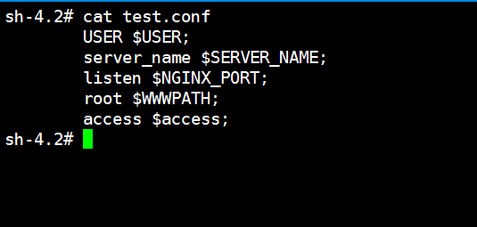

我知道这个主题已经过时了，但我有一个需求需要来做，当我收集了这些后发现非常有趣，我觉得可以将这些记录下来，这是非常棒的一件事。

我们将环境变量中的变量实际值通过几种方式替换到文件中环境变量，假如我的环境变量如下：

```
[root@linuxea ~]$ env
version=1.9.9
WWWPATH=/data/wwwroot
USER=www
SERVER_NAME=meftp.linuxea.com
NGINX_PORT=80
```

我的test.conf文件中的环境变量如下：

- 我需要实现的目的是：如果变量存在就替换，如果不存在就使用默认值

```
USER ${USER:-nginx};
server_name ${SERVER_NAME:-linuxea.com};
listen ${NGINX_PORT:-88};
root ${WWWPATH:-/var/www/html};
access ${access:-/var/logs/www.log};
```

[TOC]

## 第一种方式

```
[root@linuxea ~]$ ( echo "cat <<EOF" ; cat test.conf  ; echo EOF ) | sh
	USER www;
	server_name meftp.ds.com;
	listen 80;
	root /data/wwwroot;
	access /var/logs/www.log;
```

如果是在shell脚本中，它看起来像：

```
#!/bin/sh
cat > FILE <<EOF
USER ${USER:-nginx};
server_name ${SERVER_NAME:-linuxea.com};
listen ${NGINX_PORT:-88};
root ${WWWPATH:-/var/www/html};
access ${access:-/var/logs/www.log};
EOF
```

或者这样

```
[root@linuxea ~]$ eval "echo \"$(cat  test.conf)\""
	USER www;
	server_name meftp.ds.com;
	listen 80;
	root /data/wwwroot;
	access /var/logs/www.log;
```

如果ENV的这些值在文件中，则可以这样

```
[root@linuxea ~]$ cat .env 
version=1.9.9
WWWPATH=/data/wwwroot
USER=www
SERVER_NAME=meftp.linuxea.com
NGINX_PORT=80
```

如：

```
[root@linuxea ~]$ (. .env && eval "echo \"$(cat test.conf)\"")
USER www;
server_name meftp.linuxea.com;
listen 80;
root /data/wwwroot;
access /var/logs/www.log;
```

或者直接进行替换

```
[root@linuxea ~]$ envsubst < .env > test.conf 
[root@linuxea ~]$ cat test.conf
version=1.9.9
WWWPATH=/data/wwwroot
USER=www
SERVER_NAME=meftp.linuxea.com
NGINX_PORT=80
```

## 第二种方式

如果test.conf文件中仅仅只是变量，如：



```
[root@linuxea ~]$ cat test.conf 
	USER $USER;
	server_name $SERVER_NAME;
	listen $NGINX_PORT;
	root $WWWPATH;
	access $access;
```

替换的方式则可以如下进行：

全部替换1：

变量为空，则会替换为空

```
[root@linuxea ~]$ envsubst < test.conf 
	USER www;
	server_name meftp.ds.com;
	listen 80;
	root /data/wwwroot;
	access ;
```

```
[root@linuxea ~]$ perl -pe 's/\$(\{)?([a-zA-Z_]\w*)(?(1)\})/$ENV{$2}/g' < test.conf 
	USER www;
	server_name meftp.ds.com;
	listen 80;
	root /data/wwwroot;
	access ;
```

全部替换2：

变量不存在，则不替换

```
[root@linuxea ~]$  perl -pe 's/\$([_A-Z]+)/$ENV{$1}/g'  <  test.conf
	USER www;
	server_name meftp.ds.com;
	listen 80;
	root /data/wwwroot;
	access $access;
```

### 部分替换

倘若我只想替换指定的`$NGINX_PORT,$SERVER_NAME`的变量，而不是所有的，则可以将被替换的单引号引起来，如下：

```
[root@linuxea ~]$ envsubst '$NGINX_PORT,$SERVER_NAME' < test.conf 
	USER $USER;
	server_name meftp.ds.com;
	listen 80;
	root $WWWPATH;
	access $access;
```

如果有多个可以换行，如:

```
[root@linuxea ~]$ envsubst '$NGINX_PORT,
$SERVER_NAME' < test.conf 
	USER $USER;
	server_name meftp.ds.com;
	listen 80;
	root $WWWPATH;
	access $access;
```

也可以使用反斜杠：

```
[root@linuxea ~]$  envsubst \$NGINX_PORT,\$SERVER_NAME < test.conf 
	USER $USER;
	server_name meftp.ds.com;
	listen 80;
	root $WWWPATH;
	access $access
```

## 精确声明替换

当在使用一些系统敏感的变量替换的时候就会出现问题， 由此我们可以使用envsubst SHELL_FORMAT参数限制要在输入中替换的变量字符串（避免输入中的字符串意外替换为常见的shell变量值 - 例如$ HOME）。

此刻我.env文件中有HOME变量=linuxea.com，如下：

```
[root@linuxea ~]$  cat .env 
version=1.9.9
WWWPATH=/data/wwwroot
USER=www
SERVER_NAME=meftp.linuxea.com
NGINX_PORT=80
HOME=linuxea.com
```

而系统中的$HOME

```
[root@linuxea ~]$ echo $HOME
/root
```

使用envsubst SHELL_FORMAT

```
[root@linuxea ~]$ envsubst "$HOME" < .env > test.conf 
```

```
[root@linuxea ~]$ cat test.conf
version=1.9.9
WWWPATH=/data/wwwroot
USER=www
SERVER_NAME=meftp.linuxea.com
NGINX_PORT=80
HOME=linuxea.com
```

如果你有多个，可以`envsubst "$HOME,$HOSTNAME" < .env > test.conf `

延伸阅读：

```
https://unix.stackexchange.com/questions/294835/replace-environment-variables-in-a-file-with-their-actual-values
https://unix.stackexchange.com/questions/294378/replacing-only-specific-variables-with-envsubst
https://www.gnu.org/software/gettext/manual/html_node/envsubst-Invocation.html
https://www.gnu.org/software/gettext/manual/gettext.html#sh_002dformat
https://stackoverflow.com/questions/14155596/how-to-substitute-shell-variables-in-complex-text-files
```


