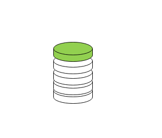
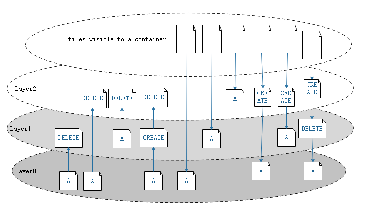
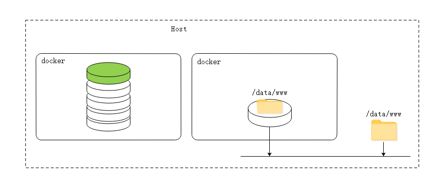
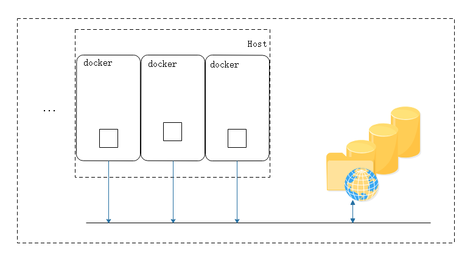
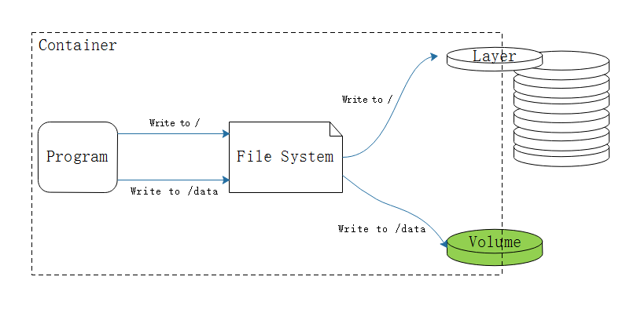
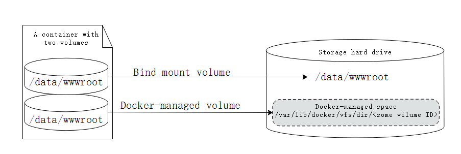
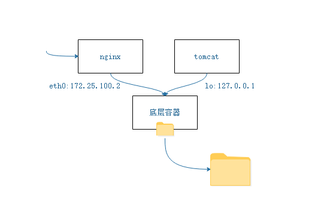

对docker来讲，作为容器运行的底层引擎，在运行容器时候每个容器内只运行一个程序及子程序，对于容器来讲，底层通过多层镜像联合挂载启动而成。底层能够存储此类分层构建并实现联合挂在文件系统包含：aufs，overlay2，在其上层会构建一个读写层

## 白话存储卷



对于读写层来讲，所有在容器中执行的操作，包括修改等，都在最上层的。对下层内容的操作，增删操作，就是通过“写时复制(COW)”来实现



如果一个A文件在最底层是存在的，而在layer1上标记为删除，那么在layer2上就看不见这个A文件了，用户肯定也看不到这个文件。同样，在layer0上的A文件，在Layer2上标记删除，在用户层仍然看不到这个文件。

在到达最上层之前被标记为删除，对于最上层的用户来讲都是不可见的，如果没有标记为删除，或者标记为删除后，用户又创建建立一个同样的，一模一样的同样的文件，用户也是可见的。

通常，在需要持久化存储服务的时候，如mysql,mariadb这类的应用，如果数据存放在最上的可写层，一方面性能较差且不说，容器在停止的时候，数据就会被删除（下图左）。要想绕过这种限制，就可以使用存储卷的机制来实现。存储卷可以在宿主机的某个文件目录，将这个目录与容器内部的文件系统之上的访问路径或者文件建立绑定关系。如下图



此后数据写入就直接写到宿主机的目录中，如上图右侧。这种方式类似于mount绑定的方式。这样一来容器文件在保存时候绕过容器的限制，通过宿主机的文件系统建立了关联关系，和容器内共享文件，也可以向容器供给文件。

容器宿主机是隔离的，通过这样的方式就可以与容器，容器与宿主机之间建立某个目录的绑定关系，在跨容器共享数据这样就简单多了。                                      

容器内文件系统建立绑定关系的目录相对于容器来将就称为volume，也称为存储卷。

这样一来，容器删除，容器绑定宿主机的这个存储卷目录中的数据就不会消失，容器再次启动的时候也可以再次接着使用，只要宿主机不会坏掉，数据就在。

假设现在我们使用一个共享文件系统，宿主机也能驱动文件系统存储服务（假设NFS），这就意味着每个主机都能使用，而后主机上的容器会关联宿主机的某个目录，当容器数据保存后，事实上是保存在存储文件系统之上。



还有一个好处在于，假设这个容器被删除，下次这个容器启动在那个机器上就不在局限于单机之上，在集群内多机器也能够访问到存储系统，存储系统上的目录依旧在，依然可以访问到这些数据。

如果一个有状态应用的数据数据存储在容器内，在删除重建后数据再可用是关键的。

在一些有状态的应用就可能会需要持久存储数据，而无状态的应用大多不需要持久存储，还有一种有状态无需存储(只需要保存在内存中)。

当然，在docker本身是借助宿主机的磁盘，容器关联的是宿主机的磁盘上的目录而已。也就是宿主机本地的。这个卷(volume)在上面提到，是一个或多个目录，此类目录可绕过联合文件系统，与宿主机上的某目录绑定关联。

在容器用到存储卷的时候，并不需要手动去创建，容器run的时候卷(volume)就会被创建，由base image提供的卷中的数据在此期间完成复制。存储卷volume独立于容器的生命周期实现持久化，因此删除容器之时不会删除卷。

卷为docker提供了独立容器的管理机制，镜像可以重用，而卷可以共享。如果将数据写在根上，依然会保存在联合文件系统目录当中，如果保存在卷上，就写如到宿主机的卷上，也就是关联到宿主机的目录上。



## docker存储卷

docker有两种类型的存储卷，每种类型都在容器中存在一个挂载点，但其在宿主机上的位置有所不同

- 绑定挂在卷 

容器内和宿主机都需要指定一个已知的路径，二者建立关联关系

- docker管理卷

在容器内指定挂载点，而被绑定到宿主机的目录是不需要已知的，由容器引擎执行创建管理，和容器建立关联关系。一般情况通常为目录下的id号



 在docker中使用存储卷，使用-v指定目录即可

### docker管理卷

使用-v指定目录即可-v /data/wwwroot，这段路径在容器内，而宿主机是有docker管理的卷

```
[marksugar@www.linuxea.com ~]$ docker run --name linuxea -it --network linuxea0 --rm -v /data/wwwroot busybox 
WARNING: IPv4 forwarding is disabled. Networking will not work.
/ # ls data/wwwroot/
/ #
```

而后可以通过docker inspect linuxea来查看被挂载到宿主机的目录

```
[marksugar@www.linuxea.com ~]$ docker inspect -f {{.Mounts}} linuxea
[{volume cc94787f8024ffbc381d14098a8b23dca4a4a819287dc996fe320d86c7358c2a /var/lib/docker/volumes/cc94787f8024ffbc381d14098a8b23dca4a4a819287dc996fe320d86c7358c2a/_data /data/wwwroot local  true }]
```
也可以看所有的信息
```
[marksugar@www.linuxea.com ~]$ docker inspect linuxea
...
        "Mounts": [
            {
                "Type": "volume",
                "Name": "a4bfafafc7dcbad92c4fc313850cfbbf056c3c9054cade231ef47a03eccb3dc4",
                "Source": "/var/lib/docker/volumes/a4bfafafc7dcbad92c4fc313850cfbbf056c3c9054cade231ef47a03eccb3dc4/_data",
                "Destination": "/data/wwwroot",
                "Driver": "local",
                "Mode": "",
                "RW": true,
                "Propagation": ""
            }
...            
```

现在被挂载到`/var/lib/docker/volumes/a4bfafafc7dcbad92c4fc313850cfbbf056c3c9054cade231ef47a03eccb3dc4/_data`下

我们在容器内写入文件

```
/ # echo `date` >> /data/wwwroot/index.html
/ # cat /data/wwwroot/index.html 
Tue Dec 4 07:17:17 UTC 2018
/ # 
```

而后在查看宿主机`/var/lib/docker/volumes/a4bfafafc7dcbad92c4fc313850cfbbf056c3c9054cade231ef47a03eccb3dc4/_data`目录

回到宿主机

```
[marksugar@www.linuxea.com ~]$ ll /var/lib/docker/volumes/a4bfafafc7dcbad92c4fc313850cfbbf056c3c9054cade231ef47a03eccb3dc4/_data
总用量 4
-rw-r--r-- 1 root root 28 12月  4 15:17 index.html
[marksugar@www.linuxea.com ~]$ cat /var/lib/docker/volumes/a4bfafafc7dcbad92c4fc313850cfbbf056c3c9054cade231ef47a03eccb3dc4/_data/index.html 
Tue Dec 4 07:17:17 UTC 2018
```

在宿主机追加到文件中，而后在返回容器查看是否在容器中也有

```
[marksugar@www.linuxea.com ~]$  echo `date` >> /var/lib/docker/volumes/a4bfafafc7dcbad92c4fc313850cfbbf056c3c9054cade231ef47a03eccb3dc4/_data/index.html
[marksugar@www.linuxea.com ~]$ cat /var/lib/docker/volumes/a4bfafafc7dcbad92c4fc313850cfbbf056c3c9054cade231ef47a03eccb3dc4/_data/index.html
Tue Dec 4 07:17:17 UTC 2018
2018年 12月 04日 星期二 15:34:58 CST
```

容器中

```
/ # cat /data/wwwroot/index.html 
Tue Dec 4 07:17:17 UTC 2018
2018年 12月 04日 星期二 15:34:58 CST
```

### 绑定挂载卷

如：-v /data/wwwrootdir:/data/wwwroot 。这里的/data/wwwrootdir:/data/wwwroot，前面的/data/wwwrootdir是宿主机的目录，后面的/data/wwwroot是容器内的目录

如果目录不存在则创建，如果存在则覆盖

```
[marksugar@www.linuxea.com ~]$ docker run --name linuxea -it --network linuxea0 --rm -v /data/wwwrootdir:/data/wwwroot busybox 
WARNING: IPv4 forwarding is disabled. Networking will not work.
/ # 
```

此时在宿主机上验证一下。在```echo `date +%D-%T` >> /data/wwwrootdir/index.html```写入时间

```
[marksugar@www.linuxea.com ~]$ echo `date +%D-%T` >> /data/wwwrootdir/index.html
[marksugar@www.linuxea.com ~]$ cat /data/wwwrootdir/index.html
12/04/18-15:41:24
```

回到容器内，index.html文件中已经注入的信息和宿主机一样。 

```
/ # cat /data/wwwroot/index.html 
12/04/18-15:41:24
```

而后删除容器，那这个文件仍然存在。

```
[marksugar@www.linuxea.com ~]$ ll /data/wwwrootdir/index.html 
-rw-r--r-- 1 root root 18 12月  4 15:41 /data/wwwrootdir/index.html
[marksugar@www.linuxea.com ~]$ cat /data/wwwrootdir/index.html
12/04/18-15:41:24
```

在重新run容器，挂载相同的目录

```
[marksugar@www.linuxea.com ~]$ docker run --name linuxea -it --network linuxea0 --rm -v /data/wwwrootdir:/data/wwwroot busybox 
WARNING: IPv4 forwarding is disabled. Networking will not work.
/ # cat /data/wwwroot/index.html 
12/04/18-15:41:24
```

```
[marksugar@www.linuxea.com ~]$ docker inspect -f {{.Mounts}} linuxea
[{bind  /data/wwwrootdir /data/wwwroot   true rprivate}]
```

可以看见文件仍然存在。由此，绑定挂载可完成一定意义的持久存储。

## 共享存储卷

两个容器分别是linuxea和linuxea1挂载宿主机同一个目录，并且在容器内写入数据共享

linuxea

```
[marksugar@www.linuxea.com ~]$ docker run --name linuxea -it --network linuxea0 --rm -v /data/wwwrootdir:/data/wwwroot busybox 
WARNING: IPv4 forwarding is disabled. Networking will not work.
/ # echo "linuxea" >> /data/wwwroot/index.html 
```

linuxea1

```
[marksugar@www.linuxea.com ~]$  docker run --name linuxea1 -it --network linuxea0 --rm -v /data/wwwrootdir:/data/wwwroot busybox
WARNING: IPv4 forwarding is disabled. Networking will not work.
/ # cat /data/wwwroot/index.html 
12/04/18-15:41:24
linuxea
/ # echo "linuxea1" >> /data/wwwroot/index.html 
/ # cat .
cat: read error: Is a directory
/ # cat /data/wwwroot/index.html 
12/04/18-15:41:24
linuxea
linuxea1
```

回到linuxea

```
/ # cat /data/wwwroot/index.html 
12/04/18-15:41:24
linuxea
linuxea1
```

## 复制存储卷

现在我们知道docker可以共享多个容器存储卷，但是如果共享太多操作起来会较为麻烦，我们可以使用复制来做

和上面一样，在初始化run的时候，指明要复制那个卷，使用--volumes-from选项。如下

```
[marksugar@www.linuxea.com ~]$ docker run --name linuxea2 -it --network linuxea0 --rm --volumes-from linuxea  busybox
WARNING: IPv4 forwarding is disabled. Networking will not work.
/ # cat /data/wwwroot/index.html 
12/04/18-15:41:24
linuxea
linuxea1
```

这样一来就有了三个容器使用同一个存储卷。

## 联盟容器之存储卷

那这样的话就可以延续之前网络中的的“联盟式容器”

我们创建一个容器，只要存在就可以，并且指定存储卷路径，而后这个容器作为后面启动其他几个有关联容器的基础架构容器。

nginx容器复制存储卷设置，tomcat也复制存储卷设置。“联盟式容器”则会共享网络名称空间，就可以建立密集的联盟关系。这样nginx和tomcat使用底层容器创建的网络名称空间，都通过底层容器的一个对外的网络ip和lo接口，lo用作内部通讯tomcat可监听，nginx监听对外的网络地址。用户先到nginx外部ip，而后到内部lo tomcat



我们简单使用联盟容器和volumes-from
创建一个容器，作为基础容器.--network linuxea0是我自己创建的linuxea0，可以不指定

```
[marksugar@www.linuxea.com ~]$ docker run --name init -it --network linuxea0 -v /data/init/volume:/data/wwwroot busybox
WARNING: IPv4 forwarding is disabled. Networking will not work.
/ # 
```

而后创建一个nginx加入到init网络中，并且复制init的存储卷--volumes-from

```
[marksugar@www.linuxea.com ~]$ docker run --name httpd --network container:init --volumes-from init -it busybox
WARNING: IPv4 forwarding is disabled. Networking will not work.
/ # 
```

我们来查看下存储卷文件路径

```
[marksugar@www.linuxea.com ~]$ docker inspect -f {{.Mounts}} httpd
[{bind  /data/init/volume /data/wwwroot   true rprivate
```

```
[marksugar@www.linuxea.com ~]$ docker inspect -f {{.Mounts}} init
[{bind  /data/init/volume /data/wwwroot   true rprivate}]
```

和ip

```
[marksugar@www.linuxea.com ~]$ docker inspect -f {{.NetworkSettings.Networks.linuxea0.IPAddress}} init
172.25.100.2
```

而httpd的ip地址是加入到init的，inspect看不到，我们通过进入容器ip a查看

```
[marksugar@www.linuxea.com ~]$ docker run --name httpd --network container:init --volumes-from init -it busybox
WARNING: IPv4 forwarding is disabled. Networking will not work.
/ # ip a
1: lo: <LOOPBACK,UP,LOWER_UP> mtu 65536 qdisc noqueue qlen 1000
    link/loopback 00:00:00:00:00:00 brd 00:00:00:00:00:00
    inet 127.0.0.1/8 scope host lo
       valid_lft forever preferred_lft forever
135: eth0@if136: <BROADCAST,MULTICAST,UP,LOWER_UP,M-DOWN> mtu 1500 qdisc noqueue 
    link/ether 02:42:ac:19:64:02 brd ff:ff:ff:ff:ff:ff
    inet 172.25.100.2/24 brd 172.25.100.255 scope global eth0
       valid_lft forever preferred_lft forever
/ # 
```

这样配置tomcat绑定127.0.0.1端口，而后使用httpd或者nginx代理本地127.0.0.1的tomcat端口即可。