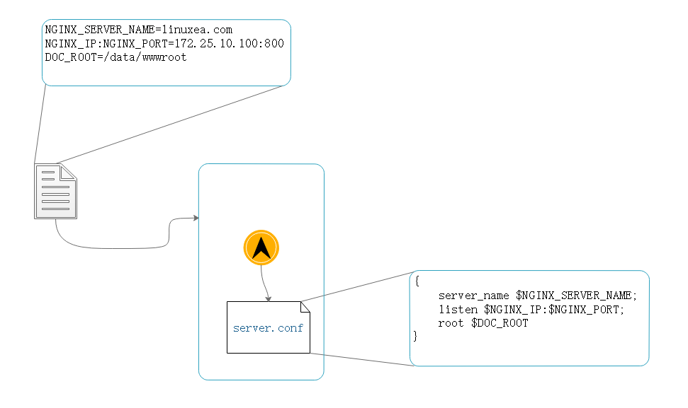
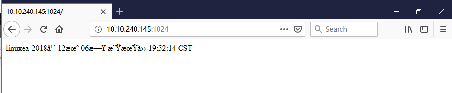
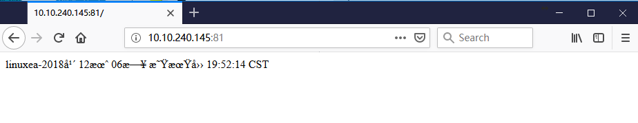

我们在安装一个nginx的时候，通常需要进行定制化模块和配置参数等。在nginx打包时候会使用一些默认的参数来定义并启动。

通常我们在使用一个容器的时候，要么进入容器内修改配置文件，而后重载，在没有使用容器的时候，一般我们通过nginx reload加载，但是在容器中，不得已删除在启动。

并且在dockerhub上拖一个nginx镜像的时候，不一定是符合我们需要的，我们可以进行修改，而后在commit，将可写层在打包，基于容器的自定义方式，但是这样比nginx relaod更加麻烦了，镜像的体积处理不当也会变的特别大。

配置文件打包进容器后，要修改也是一件麻烦事。特别是当在一个环境里面，我们可能多次使用，变更。如：测试，开发，生产等。这样的配置变更是常规的操作，那就意味着需要重新构建多个镜像，这显然是又增加了操作，这样的环境中配置文件写入到容器内在有些时候是不可取的，当然如果有一定的需求，也是可以接受。

其实可以自己制作镜像，封装应用程序到镜像中，存储卷将配置文件挂载到相应目录，这样也是可以的。

那么在docker是如何解决的？

仍然以nginx为例，如果此刻我需要一个虚拟主机，有一个域名，一个端口，一个目录，在nginx配置文件中的conf.d下，我们保存一个文件server.conf，内容如下：

```
{
    server_name $NGINX_SERVER_NAME;
    listen $NGINX_IP:$NGINX_PORT;
    root $DOC_ROOT
}
```

相信你也看到了，以这种变量的方式，在容器内部应用程序启动之前，使用一个程序，这个程序根据镜象中的某个文件，在镜象启动的时候向内部传递变量。这个程序将用户传递的变量替换保存在上述的server.conf文件中，而后由这个程序在启动主进程，而后退出。




- 有一个进程启动另外一个进程并替换当前进程，exec

使用配置文件的方式需要一个文件。当然，也可以直接加载系统当前环境变量中的数据，而后替换。这也是其中的表现之一。

通常也会有默认的参数，如果不进行变量替换，也会有默认的参数启动。

## dockerfile

此前我们知道，制作镜像的方式有两种，一种基于镜像，一种基于dockerfile，而docker镜像构建之前都已经试过。

dockerfile包含制作镜像的代码，包含命令指令，通过指令运行一些命令。
dockerfile由两类组成，注释信息和指令(参数)。

- 在dockerfile文件中指令是大写的，但是并不区分
- dockerfile执行的顺序是从上往下执行的，第一个非注释行必须是FROM
- dockerfile的目录必须是独有的
- dockerfile文件首字母必须是大写（Dockerfile）
- dockerfile中引用的文件，必须在同Dockerfile目录，或者目录下的目录或者文件

### dockererignore

> dockererignore


dockerfile还支持一个隐藏文件.dockererignore file。在.dockererignore当中可以写入很多文件，支持通配符

但凡写入到dockererignore的文件路径，在打包的时候都不会包含进去

而后通过docker build命令在dockerfile的独有目录下进行打包，打标签，推送镜像到仓库。

相比之前的镜像中使用docker打包可写层，而在基于dockerfile制作镜像的时候，不用启动容器，但是这个过程是docker build来完成。而docker build也是隐藏式的启动一个容器，只不过这个容器不是用我们自己手动去启动而已。

而dockerfile中的命令是在dockerfile中FROM的基础镜像之上运行的，如果基础镜像中没有dockerfile中的命令，是无法正常执行的。那么你可能需要进行安装才可以使用。

### Environment replacement

> Environment replacement

之前说的环境变量是使用环境变量来做一些替换，在启动容器时候的环境变量，这里的环境变量是说dockerfile中的环境变量，和docker build有关，并且和shell非常相像，如：

```
ENV NGINXPORT=80
```

引用时候，直接引用，也可以加花括号

```
$NGINXPORT AND ${NGINXPORT}
```

并且还支持shell一样的两种变量替换的特殊格式，如下：

```
${variable:-word}
${variable:+word}
```

`${variable:-word}`： 这种说明，如果variable未设置或为空，就默认值为word，如果设定就替换设定值

`${variable:+word}`：这种说明，如果variable值不是空，有值的时候就显示为word

### FROM

- FROM

FROM指令是最重要的一个且必须是Dockerfile文件开篇的第一个个非注释行，用于为镜像文件构建过程指定的i基础镜像，后续的指令运行与此镜像所提供的运行环境

实践中，基准镜像可以是任何可用镜像文件，默认i情况下，docker build会在docker主机上查找指定的镜像文件，在其不存在时，则会从Docker Hub Registry上拉取所需的镜像文件。

如果找不到指定的镜像文件，docker build会返回一个错误信息。

语法格式：

```
 FROM <repository>[:<tag>]
 FROM <repository>@:<digest>
```

` FROM <repository>[:<tag>]` 镜象仓库: 标签，这个标签是可以省略的，省略时默认为latest;

` FROM <repository>@:<digest>` 镜象仓库:哈希码

### MAINTAINER

- MAINTAINER

MAINTAINER用于让Dockerfile制作者提供本人的详细信息，在Dockerfile中MAINTAINER并不限制出现在那个位置，我们建议你放在FROM后面

```
 MAINTANIER "www.linuxea.com"
```

### LABEL

- LABEL

在较为新的版本上，LABEL替换了MAINTAINER，而LABEL是让用户给镜象指定很多元数据：

```
<key>=<value> <key>=<value> <key>=<value> <key>=<value> <key>=<value> <key>=<value>
```

MAINTAINER的信息可以作为LABEL的一个键值对，并且MAINTAINER在最新版本中是可以兼容的

### COPY

- COPY

用于将宿主机的文件复制到创建的新镜象中。在Dockerfile的当前目录中，将某一个文件或者几个文件复制到目标镜象的文件中

```
COPY <src> ... <dest>
COPY ["<src>",..."<dest>"]
```

src ： 要复制的源文件或者目录，支持使用通配符

dest：目标路径，即正在创建的image的文件系统路径，建议为<dest>使用绝对路径，否则，COPY制定则以WORKDIR为起始路径。

文件复制准则：

- <src>必须是build上下文中的路径，不能说其父目录中的文件
- 如果是<src>是目录，则其内部文件或者子目录会被递归复制，但<src>目录自身不会被复制
- 如果指定了多个<src>,或在<src>中使用了通配符，则<dest>必须是一个目录，且必须以/结尾
- 如果<dest>事先不存在，他将会自动创建，这包括其父目录路径

我们复制一个文件

```
COPY index.html /data/wwwroot
```

到此为止就已经可以做一个镜象

```
[marksugar@www.linuxea.com /data/linuxea]$ cat Dockerfile 
# describe : test
FROM busybox:latest
MAINTAINER www.linuxea.com
LABEL maintainer="www.linuxea.com"
COPY index.html /data/wwwroot/index.html
```

在当前目录创建一个`index.html`

```
[marksugar@www.linuxea.com /data/linuxea]$ echo linuxea-`date` >> ./index.html
[marksugar@www.linuxea.com /data/linuxea]$ cat ./index.html
linuxea-2018年 12月 06日 星期四 19:52:14 CST
```

### build

build的时候，使用-t 命名，并且COPY的文件应该和Dockerfile在同级目录，而后build，如下：

```
[marksugar@www.linuxea.com /data/linuxea]$ docker build  -t marksugar/httpd:1 ./
Sending build context to Docker daemon  3.072kB
Step 1/4 : FROM busybox:latest
 ---> 59788edf1f3e
Step 2/4 : MAINTAINER www.linuxea.com
 ---> Using cache
 ---> 7f12e197dfba
Step 3/4 : LABEL maintainer="www.linuxea.com"
 ---> Using cache
 ---> c28e9c23ae2f
Step 4/4 : COPY index.html /data/wwwroot/index.html
 ---> f51ffe499c66
Successfully built f51ffe499c66
Successfully tagged marksugar/httpd:1
```

当进行4步后，已经打包完成

```
[marksugar@www.linuxea.com /data/linuxea]$ docker images
REPOSITORY                                        TAG                 IMAGE ID            CREATED             SIZE
marksugar/httpd                                         1               f30285688fca        2 minutes ago       1.15MB
```

而后我们查看下刚才创建的文件是否已经被打包到/data/wwwroot/index.html中

使用cat /data/wwwroot/index.html，如下

```
[marksugar@www.linuxea.com /data/linuxea]$ docker run --name linuxea1 --rm marksugar/httpd:1 cat /data/wwwroot/index.html
WARNING: IPv4 forwarding is disabled. Networking will not work.

linuxea-2018年 12月 06日 星期四 19:52:14 CST
```

如上，已经被成功打包。

那如果我要COPY目录的话，就需要这样来写，如，copy /etc/zabbix/目录到容器中，如下：

先复制目录到当前目录下，也就是和Dockerfile同级目录

```
[marksugar@www.linuxea.com /data/linuxea]$ cp -r /etc/zabbix/ ./
```

Dockerfile如下：

```
[marksugar@www.linuxea.com /data/linuxea]$ cat Dockerfile
# describe : test
FROM busybox:latest
MAINTAINER www.linuxea.com
LABEL maintainer="www.linuxea.com"
COPY index.html /data/wwwroot/index.html
COPY zabbix /data/wwwroot/zabbix/
```

而后build

```
[marksugar@www.linuxea.com /data/linuxea]$ docker build  -t marksugar/httpd:2 ./
Sending build context to Docker daemon  33.28kB
Step 1/5 : FROM busybox:latest
 ---> 59788edf1f3e
Step 2/5 : MAINTAINER www.linuxea.com
 ---> Using cache
 ---> 7f12e197dfba
Step 3/5 : LABEL maintainer="www.linuxea.com"
 ---> Using cache
 ---> c28e9c23ae2f
Step 4/5 : COPY index.html /data/wwwroot/index.html
 ---> Using cache
 ---> f51ffe499c66
Step 5/5 : COPY zabbix /data/wwwroot/zabbix/
 ---> eb31fdcfcd13
Successfully built eb31fdcfcd13
Successfully tagged marksugar/httpd:2
```

验证/data/wwwroot/zabbix目录下的文件是否存在

```
[marksugar@www.linuxea.com /data/linuxea]$ docker run --name linuxea1 --rm marksugar/httpd:2 ls /data/wwwroot/zabbix
WARNING: IPv4 forwarding is disabled. Networking will not work.
scripts
zabbix_agentd.conf
zabbix_agentd.d
```

### ADD

ADD与COPY很相似，ADD支持几使用tar文件和URL路径

```
ADD <src> ... <dest>
ADD ["<src>",..."<dest>"]
```

如果<src>为URL且<dest>不是/结尾，则<src>指定的文件将被下载并直接被创建为<dest>，如果<dest>以/结尾，则文件名URL指定的文件将被直接下载并保存为<dest>/<filename>

如果<src>是一个本地的压缩tar文件，他将被展开成一个目录，其行为类似于"tar -x"命令；然而，通过URL获取到的tar文件将不会自动展开

如果<src>有多个，或其间接或直接使用了通配符，则<dest>必须是一个以/结尾的目录路径；如果<dest>不以/结尾，则其被视作一个普通文件，<src>的内容将被直接写入到<dest>

除此之外，ADD和COPY一样

- 示例

我們下載一個RUL的nginx到/usr/local/src/，来验证是否会被解压

```
[marksugar@www.linuxea.com /data/linuxea]$ cat Dockerfile 
# describe : test
FROM busybox:latest
MAINTAINER www.linuxea.com
LABEL maintainer="www.linuxea.com"
COPY index.html /data/wwwroot/index.html
COPY zabbix /data/wwwroot/zabbix/
ADD http://10.10.240.145/nginx-1.14.0.tar.gz /usr/local/src/
```

而后build

```
[marksugar@www.linuxea.com /data/linuxea]$ docker build -t marksugar/httpd:2 ./
Sending build context to Docker daemon  33.28kB
Step 1/6 : FROM busybox:latest
 ---> 59788edf1f3e
Step 2/6 : MAINTAINER www.linuxea.com
 ---> Using cache
 ---> 7f12e197dfba
Step 3/6 : LABEL maintainer="www.linuxea.com"
 ---> Using cache
 ---> c28e9c23ae2f
Step 4/6 : COPY index.html /data/wwwroot/index.html
 ---> Using cache
 ---> f51ffe499c66
Step 5/6 : COPY zabbix /data/wwwroot/zabbix/
 ---> Using cache
 ---> eb31fdcfcd13
Step 6/6 : ADD http://10.10.240.145/nginx-1.14.0.tar.gz /usr/local/src/
Downloading [==================================================>]  1.016MB/1.016MB
 ---> 0b2794e2984d
Successfully built 0b2794e2984d
Successfully tagged marksugar/httpd:3
```

而后进入容器查看，这个包事实上并没有被解压

```
[marksugar@www.linuxea.com /data/linuxea]$ docker run --name linuxea1 --rm marksugar/httpd:3 ls /usr/local/src
WARNING: IPv4 forwarding is disabled. Networking will not work.
nginx-1.14.0.tar.gz
```

接着在验证下本地的tag解压的方式，如下：

但是，有一个前提是我们要先现在这个nginx的tar包在本地

```
[marksugar@www.linuxea.com /data/linuxea]$ wget http://10.10.240.145/nginx-1.14.0.tar.gz
--2018-12-06 21:24:39--  http://10.10.240.145/nginx-1.14.0.tar.gz
正在连接 10.10.240.145:80... 已连接。
已发出 HTTP 请求，正在等待回应... 200 OK
长度：1016272 (992K) [application/octet-stream]
正在保存至: “nginx-1.14.0.tar.gz”

100%[=====================================================================================================================>] 1,016,272   --.-K/s 用时 0.001s  

2018-12-06 21:24:39 (688 MB/s) - 已保存 “nginx-1.14.0.tar.gz” [1016272/1016272])
```

那就成了这个样子

```
[marksugar@www.linuxea.com /data/linuxea]$ cat Dockerfile
# describe : test
FROM busybox:latest
MAINTAINER www.linuxea.com
LABEL maintainer="www.linuxea.com"
COPY index.html /data/wwwroot/index.html
COPY zabbix /data/wwwroot/zabbix/
ADD nginx-1.14.0.tar.gz /usr/local/src/
```

在build，在看

```
[marksugar@www.linuxea.com /data/linuxea]$ docker build -t marksugar/httpd:4 ./
Sending build context to Docker daemon   1.05MB
Step 1/6 : FROM busybox:latest
 ---> 59788edf1f3e
Step 2/6 : MAINTAINER www.linuxea.com
 ---> Using cache
 ---> 7f12e197dfba
Step 3/6 : LABEL maintainer="www.linuxea.com"
 ---> Using cache
 ---> c28e9c23ae2f
Step 4/6 : COPY index.html /data/wwwroot/index.html
 ---> Using cache
 ---> f51ffe499c66
Step 5/6 : COPY zabbix /data/wwwroot/zabbix/
 ---> Using cache
 ---> eb31fdcfcd13
Step 6/6 : ADD nginx-1.14.0.tar.gz /usr/local/src/
 ---> d65a535b0842
Successfully built d65a535b0842
Successfully tagged marksugar/httpd:4
```

在查看，已经被解压

```
[marksugar@www.linuxea.com /data/linuxea]$ docker run --name linuxea1 --rm marksugar/httpd:4 ls /usr/local/src
WARNING: IPv4 forwarding is disabled. Networking will not work.
nginx-1.14.0
[marksugar@www.linuxea.com /data/linuxea]$ docker run --name linuxea1 --rm marksugar/httpd:4 ls /usr/local/src/nginx-1.14.0
WARNING: IPv4 forwarding is disabled. Networking will not work.
CHANGES
CHANGES.ru
LICENSE
README
auto
conf
configure
contrib
html
man
src
[marksugar@www.linuxea.com /data/linuxea]$ 
```

### WORKDIR

用于指定Dockerfile中所有的RUN，CMD，ENTRYPOINT，COPY和ADD指定设定工作目录

```
WORKDIR <dirpath>
```

在Dockerfile文件中，WORKDIR指令可出现多次，其路径也可以为相对路径，不过，其实相对此前一个WORKDIR指令指定的路径

另外，WORKDIR也可调用ENV指定定义的变量、

```
WORKDIR /var/log
WORKDIR $STATEPATH
```

像这样

```
WORKDIR /usr/local/src/
ADD nginx-1.14.0.tar.gz ./
```

`WORKDIR`进入`/usr/local/src/`目录，而后`ADD nginx-1.14.0.tar.gz ./ `将`nginx-1.14.0.tar.gz`解压到当前目录，那当前目录也就是`/usr/local/src/`目录

如果WORKDIR做了相对路径引用，逆序查找顺序的时候，逆序的第一个WORKDIR的位置就是他的工作目录。

### Volume

此前，我们了解到，绑定挂载卷上可以指定容器和宿主机的目录的。但是，在dockerfile中的自动指定的时候，只能指定挂载点。

volume用于在image中创建一个挂载点目录，以挂载Docker host上的卷或其他容器上的卷

```
VOLUME <mountpoint> 或 VOLUME ["<mountpoint>"]
```

如果挂载点目录路径下此前的文件存在，docker run命令会在卷挂载完成后将此前的文件复制到新挂载的卷中

我们将VOLUME /data/mariadb/挂载

```
[marksugar@www.linuxea.com /data/linuxea]$ cat Dockerfile 
# describe : test
FROM busybox:latest
MAINTAINER www.linuxea.com
LABEL maintainer="www.linuxea.com"
COPY index.html /data/wwwroot/index.html
COPY zabbix /data/wwwroot/zabbix/
WORKDIR /usr/local/src/
ADD nginx-1.14.0.tar.gz ./

VOLUME /data/mariadb/
```

重新构建

```
[marksugar@www.linuxea.com /data/linuxea]$ docker build -t marksugar/httpd:5 ./
Sending build context to Docker daemon   1.05MB
Step 1/8 : FROM busybox:latest
 ---> 59788edf1f3e
Step 2/8 : MAINTAINER www.linuxea.com
 ---> Using cache
 ---> 7f12e197dfba
Step 3/8 : LABEL maintainer="www.linuxea.com"
 ---> Using cache
 ---> c28e9c23ae2f
Step 4/8 : COPY index.html /data/wwwroot/index.html
 ---> Using cache
 ---> f51ffe499c66
Step 5/8 : COPY zabbix /data/wwwroot/zabbix/
 ---> Using cache
 ---> eb31fdcfcd13
Step 6/8 : WORKDIR /usr/local/src/
Removing intermediate container 805c9be248af
 ---> 1659fdf0e432
Step 7/8 : ADD nginx-1.14.0.tar.gz ./
 ---> bcff476b6d7c
Step 8/8 : VOLUME /data/mariadb/
 ---> [Warning] IPv4 forwarding is disabled. Networking will not work.
 ---> Running in 2112dcfe986a
Removing intermediate container 2112dcfe986a
 ---> 664c3d943228
Successfully built 664c3d943228
Successfully tagged marksugar/httpd:5
```

run起来查看下是否被挂载

```
[marksugar@www.linuxea.com /data/linuxea]$ docker run --name linuxea1 --rm marksugar/httpd:5 mount|grep mariadb
WARNING: IPv4 forwarding is disabled. Networking will not work.
/dev/mapper/DTVG-root on /data/mariadb type xfs (rw,relatime,attr2,inode64,noquota)
```

也可以这样看

```
[marksugar@www.linuxea.com ~]$ docker inspect linuxea1
...
"Mounts": [
            {
                "Type": "volume",
                "Name": "49a020511459b54042ce42cfca7717455ced52b17d04ab8d92770832d4e8ab5a",
                "Source": "/var/lib/docker/volumes/49a020511459b54042ce42cfca7717455ced52b17d04ab8d92770832d4e8ab5a/_data",
                "Destination": "/data/mariadb",
                "Driver": "local",
                "Mode": "",
                "RW": true,
                "Propagation": ""
            }
        ],
...        
```

Voulume被定义在Dockerfile中，在启动的时候就不需要定义的，就会自动有一个存储卷，不过这个存储卷在宿主机的位置，用的是docker管理的路径格式。

### EXPOSE

EXPOSE将容器内的已经监听的端口暴露出去，用于为容器打开指定的监听端口以实现与外部通信

```
EXPOSE <port>[/<protocol>][<promt>[/<protocol>] ...]
```

<protocol>用于指定传输层协议，可为tcp或udp二者之一，默认为tcp协议

EXPOSE默认可以一次指定多个端口，如：

```
EXPOSE 11211/tcp 11211/udp
```

其中会自动生成一条DNAT规则，假如你使用的是默认网络

但是，这里只是负责暴露容器内监听的端口，并不意味着设置EXPOSE就已经暴露到宿主机。

至于到了宿主机上是什么端口，如果不指定，那就是随机的。一般情况下，在docker run的时候加-大P指定

-P表示要暴露的端口，而要暴露的端口是在镜象内EXPOSE配置的端口。

```
-P 11211:11211
```

我们试图暴露

```
[marksugar@www.linuxea.com /data/linuxea]$ cat Dockerfile
# describe : test
FROM busybox:latest
MAINTAINER www.linuxea.com
LABEL maintainer="www.linuxea.com"
COPY index.html /data/wwwroot/index.html
COPY zabbix /data/wwwroot/zabbix/
WORKDIR /usr/local/src/
ADD nginx-1.14.0.tar.gz ./
VOLUME /data/mariadb/

EXPOSE 80/tcp
```

build

```
[marksugar@www.linuxea.com /data/linuxea]$ docker build -t marksugar/httpd:6 ./
Sending build context to Docker daemon   1.05MB
Step 1/9 : FROM busybox:latest
 ---> 59788edf1f3e
Step 2/9 : MAINTAINER www.linuxea.com
 ---> Using cache
 ---> 7f12e197dfba
Step 3/9 : LABEL maintainer="www.linuxea.com"
 ---> Using cache
 ---> c28e9c23ae2f
Step 4/9 : COPY index.html /data/wwwroot/index.html
 ---> Using cache
 ---> f51ffe499c66
Step 5/9 : COPY zabbix /data/wwwroot/zabbix/
 ---> Using cache
 ---> eb31fdcfcd13
Step 6/9 : WORKDIR /usr/local/src/
 ---> Using cache
 ---> 1659fdf0e432
Step 7/9 : ADD nginx-1.14.0.tar.gz ./
 ---> Using cache
 ---> bcff476b6d7c
Step 8/9 : VOLUME /data/mariadb/
 ---> Using cache
 ---> 664c3d943228
Step 9/9 : EXPOSE 80/tcp
 ---> [Warning] IPv4 forwarding is disabled. Networking will not work.
 ---> Running in 1b82b3db2f99
Removing intermediate container 1b82b3db2f99
 ---> 23efb60395d4
Successfully built 23efb60395d4
Successfully tagged marksugar/httpd:6
```

而后我们run起这个容器，并且使用`httpd -f -h /data/wwwroot/`启动httpd

```
[marksugar@www.linuxea.com /data/linuxea]$ docker run --name linuxea1 --rm marksugar/httpd:6 httpd -f -h /data/wwwroot/
WARNING: IPv4 forwarding is disabled. Networking will not work.
```

获取到此容器的ip

```
[marksugar@www.linuxea.com ~]$ docker inspect -f {{.NetworkSettings.Networks.bridge.IPAddress}} linuxea1
192.168.100.2
```

访问试试

```
[marksugar@www.linuxea.com ~]$ curl 192.168.100.2

linuxea-2018年 12月 06日 星期四 19:52:14 CST
```

当然，你也可以这样

```
[marksugar@www.linuxea.com ~]$ curl $(docker inspect -f {{.NetworkSettings.Networks.bridge.IPAddress}} linuxea1)

linuxea-2018年 12月 06日 星期四 19:52:14 CST
```

- -P

那么此时也是没有暴露端口的，因为没有加-p选项，没有-p选项就是待暴露，但是尚未暴露

```
[marksugar@www.linuxea.com ~]$ docker port linuxea1 
[marksugar@www.linuxea.com ~]$ 
```

那现在可以使用-P指定，也就是随机的

```
[marksugar@www.linuxea.com /data/linuxea]$ docker run --name linuxea1 --rm -P marksugar/httpd:6 httpd -f -h /data/wwwroot/
WARNING: IPv4 forwarding is disabled. Networking will not work.
```

在看

```
[marksugar@www.linuxea.com ~]$ docker port linuxea1 
80/tcp -> 0.0.0.0:1024
```

我们通过宿主机的ip访问1024

```
[marksugar@www.linuxea.com ~]$ curl 10.10.240.145:1024

linuxea-2018年 12月 06日 星期四 19:52:14 CST
```
有些乱码，我们暂且不管


- -p

也可以使用-p 使用-p 81:80，将容器的80暴露到宿主机的81端口

```
[marksugar@www.linuxea.com /data/linuxea]$ docker run --name linuxea1 --rm -p 81:80 marksugar/httpd:6 httpd -f -h /data/wwwroot/
WARNING: IPv4 forwarding is disabled. Networking will not work.
```

```
[marksugar@www.linuxea.com ~]$ docker port linuxea1 
80/tcp -> 0.0.0.0:81
```

```
[marksugar@www.linuxea.com ~]$ curl 10.10.240.145:81

linuxea-2018年 12月 06日 星期四 19:52:14 CST
```



### ENV

ENV用于镜象定义所需的环境变量，并可被Dockerfile文件中位于其后的其他指令(如ENV，ADD，COPY等)所调用

调用格式为`$varibale_name`或`${varibale_name}`

```
ENV <key> <value> 或 ENV <key>=<value>
```
第一种格式中，<key>之后的所有内容均会被起视作为<value>的组成部分，因此，一次只能设置一个变量

第二种格式可用一次是设置多个变量，每个变量作为一个"<key>=<value>"的键值对，如果<value>中包含空格，可以以反射线`(\)`进行转义，也可以通过对<value>加引号进行标识；另外，反斜线也可用于续行

定义多个变量的时候，可以使用第二种方式，以便于在同一层中完成所有功能

我们添加几个变量而后在中应用，如下

```
ENV NG_PATH /usr/local/src/
ENV NG_VERSION="1.14.0" \
	ZABBIX=/data/wwwroot/zabbix/
```

引用

```
COPY zabbix $ZABBIX
WORKDIR ${NG_PATH:-/usr/local/src/}
ADD nginx-${NG_VERSION:-1.14.0}.tar.gz ./
```

` ${NG_PATH:-/usr/local/src/}`这里可以用`${NG_PATH:-}`的方式，也就是说，如果没有变量或者变量为空值，默认参数就是`/usr/local/src/`，最终如下：

```
[marksugar@www.linuxea.com /data/linuxea]$ cat Dockerfile 
# describe : test
FROM busybox:latest
MAINTAINER www.linuxea.com
ENV NG_PATH /usr/local/src/
ENV NG_VERSION="1.14.0" \
	ZABBIX=/data/wwwroot/zabbix/
LABEL maintainer="www.linuxea.com"
COPY index.html /data/wwwroot/index.html
COPY zabbix $ZABBIX
WORKDIR ${NG_PATH:-/usr/local/src/}
ADD nginx-${NG_VERSION:-1.14.0}.tar.gz ./
VOLUME /data/mariadb/

EXPOSE 80/tcp
```

而后build

```
marksugar@www.linuxea.com /data/linuxea]$ docker build -t marksugar/httpd:7 ./
Sending build context to Docker daemon   1.05MB
Step 1/11 : FROM busybox:latest
 ---> 59788edf1f3e
Step 2/11 : MAINTAINER www.linuxea.com
 ---> Using cache
 ---> 7f12e197dfba
Step 3/11 : ENV NG_PATH /usr/local/src/
 ---> Running in e228dd6984c8
Removing intermediate container e228dd6984c8
 ---> e6c199578807
Step 4/11 : ENV NG_VERSION="1.14.0" 	ZABBIX=/data/wwwroot/zabbix/
 ---> Running in 0322efbf9c4c
Removing intermediate container 0322efbf9c4c
 ---> c0b20f2d3726
Step 5/11 : LABEL maintainer="www.linuxea.com"
 ---> Running in f5fdceb54d99
Removing intermediate container f5fdceb54d99
 ---> 9236122c20ae
Step 6/11 : COPY index.html /data/wwwroot/index.html
 ---> f13e97d53c76
Step 7/11 : COPY zabbix $ZABBIX
 ---> 4b46be31391c
Step 8/11 : WORKDIR ${NG_PATH:-/usr/local/src/}
Removing intermediate container 4ca70ebc77a9
 ---> 48b53e685832
Step 9/11 : ADD nginx-${NG_VERSION:-1.14.0}.tar.gz ./
 ---> d785091af380
Step 10/11 : VOLUME /data/mariadb/
 ---> Running in fb2d1a8ccdbf
Removing intermediate container fb2d1a8ccdbf
 ---> 7d93a3a2d717
Step 11/11 : EXPOSE 80/tcp
 ---> Running in 282a1384d563
Removing intermediate container 282a1384d563
 ---> 5f6b1362d52d
Successfully built 5f6b1362d52d
Successfully tagged marksugar/httpd:7
```

run起来验证下，变量被引用ok

```
[marksugar@www.linuxea.com ~]$ docker run --name linuxea1 --rm -p 81:80 marksugar/httpd:7 ls /usr/local/src
nginx-1.14.0
```

```
[marksugar@www.linuxea.com ~]$ docker run --name linuxea1 --rm -p 81:80 marksugar/httpd:7  ls /data/wwwroot/zabbix
scripts
zabbix_agentd.conf
zabbix_agentd.d
```

那么这些ENV定义在Dockerfile中，而后在启动的容器中是已经存在

```
[marksugar@www.linuxea.com ~]$ docker run --name linuxea1 --rm -p 81:80 marksugar/httpd:7  printenv
PATH=/usr/local/sbin:/usr/local/bin:/usr/sbin:/usr/bin:/sbin:/bin
HOSTNAME=af3e048f900f
NG_PATH=/usr/local/src/
NG_VERSION=1.14.0
ZABBIX=/data/wwwroot/zabbix/
HOME=/root
```

尽管在build的时候，已经使用了一次这些环境变量构建了此前Dockerfile中变量值的构建，并且完成。但是，这些变量仍然在docker容器中，在run启动的时候是可以被重新赋值的。这个赋值当然是不会影响到此前构建过的惊喜，如果此时第二次调用被重新赋值过的变量，就会得到新的变量赋值

这次我们将之前的`NG_VERSION=1.14.0`改成` NG_VERSION=1.15.2`，只需要在启动的时候使用-e，如：`-e NG_VERSION="1.15.2"`。

```
[marksugar@www.linuxea.com ~]$ docker run --name linuxea1 --rm -p 81:80 -e NG_VERSION="1.15.2" marksugar/httpd:7 printenv
PATH=/usr/local/sbin:/usr/local/bin:/usr/sbin:/usr/bin:/sbin:/bin
HOSTNAME=df943feee8b7
NG_VERSION=1.15.2
NG_PATH=/usr/local/src/
ZABBIX=/data/wwwroot/zabbix/
HOME=/root
```

### RUN

用于指定docker build过程中运行的程序，可以说任何命令

```
RUN <command>
RUN ["<executable>","<param1>","<param2>"]
```

- 第一种格式中，<command>通常是一个shell命令，且以“/bin/sh -c”来运行它，这意味着此进程在容器中的pid不为1，不能接受unix信号。因此，当使用docker stop <container>命令停止容器时，此进程接收不到SIGTERM信号；
- 第二种语法格式中的参数是一个json格式的数组，其中<executable>为要运行的命令，后面的<paramN>为传递给命令的选项或参数；然而，此种格式指令的命令不会以"/bin/sh -c "来发起，因此常见的shell操作如变量替换以及通配符(?,*等)替换将不会进行；不过，如果要运行的命令依赖于此shell特性的话，可以将其替换为类似下面的格式。

```
RUN ["/bin/bash","-c","<executable>","<param1>"]
```

RUN和CMD，RUN是在docker build中运行,也就说在构建镜像时候build过程中运行的命令；而CMD是在镜像启动的时候运行的命令，如果没有指定运行的命令，CMD就是默认运行的命令

我们加一段RUN命令，内容是下载nginx安装包，而后解压，并且更名，主要体验下RUN命令使用

```
RUN cd /usr/local \
	&& wget http://10.10.240.145/nginx-${NG_VERSION}.tar.gz \
	&& tar -xf nginx-${NG_VERSION}.tar.gz \
	&& mv nginx-${NG_VERSION} nginx
```

```
# describe : test
FROM busybox:latest
MAINTAINER www.linuxea.com
ENV NG_PATH /usr/local/src/
ENV NG_VERSION="1.14.0" \
	ZABBIX=/data/wwwroot/zabbix/
LABEL maintainer="www.linuxea.com"
COPY index.html /data/wwwroot/index.html
COPY zabbix $ZABBIX
WORKDIR ${NG_PATH:-/usr/local/src/}
ADD nginx-${NG_VERSION:-1.14.0}.tar.gz ./
VOLUME /data/mariadb/

RUN cd /usr/local \
	&& wget http://10.10.240.145/nginx-${NG_VERSION}.tar.gz \
	&& tar -xf nginx-${NG_VERSION}.tar.gz \
	&& mv nginx-${NG_VERSION} nginx
EXPOSE 80/tcp
```

而后进行build，验证下RUN命令中的操作是否被正常执行了

```
[marksugar@www.linuxea.com /data/linuxea]$ docker build -t marksugar/httpd:8 ./
Sending build context to Docker daemon  1.051MB
Step 1/12 : FROM busybox:latest
 ---> 59788edf1f3e
Step 2/12 : MAINTAINER www.linuxea.com
 ---> Using cache
 ---> 7f12e197dfba
Step 3/12 : ENV NG_PATH /usr/local/src/
 ---> Using cache
 ---> e6c199578807
Step 4/12 : ENV NG_VERSION="1.14.0" 	ZABBIX=/data/wwwroot/zabbix/
 ---> Using cache
 ---> c0b20f2d3726
Step 5/12 : LABEL maintainer="www.linuxea.com"
 ---> Using cache
 ---> 9236122c20ae
Step 6/12 : COPY index.html /data/wwwroot/index.html
 ---> Using cache
 ---> f13e97d53c76
Step 7/12 : COPY zabbix $ZABBIX
 ---> Using cache
 ---> 4b46be31391c
Step 8/12 : WORKDIR ${NG_PATH:-/usr/local/src/}
 ---> Using cache
 ---> 48b53e685832
Step 9/12 : ADD nginx-${NG_VERSION:-1.14.0}.tar.gz ./
 ---> Using cache
 ---> d785091af380
Step 10/12 : VOLUME /data/mariadb/
 ---> Using cache
 ---> 7d93a3a2d717
Step 11/12 : RUN cd /usr/local 	&& wget http://10.10.240.145/nginx-${NG_VERSION}.tar.gz 	&& tar -xf nginx-${NG_VERSION}.tar.gz 	&& mv nginx-${NG_VERSION} nginx
 ---> Running in 3b8cb3885487
Connecting to 10.10.240.145 (10.10.240.145:80)
nginx-1.14.0.tar.gz  100% |********************************|  992k  0:00:00 ETA

Removing intermediate container 3b8cb3885487
 ---> 13e679e9c193
Step 12/12 : EXPOSE 80/tcp
 ---> Running in dd7199f76aa3
Removing intermediate container dd7199f76aa3
 ---> 5b194defe89f
Successfully built 5b194defe89f
Successfully tagged marksugar/httpd:8
```

而后启动，`ls /usr/local/nginx`，那说明run的命令是执行成功的。nginx解压后是nginx-1.14.0已经被重命名成nginx

```
[marksugar@www.linuxea.com /data/linuxea]$ docker run --name linuxea1 --rm -p 81:80 marksugar/httpd:8 ls /usr/local/nginx
CHANGES
CHANGES.ru
LICENSE
README
auto
conf
configure
contrib
html
man
src
```

那么RUN是可以被运行成多次的，但是多次意味着被挂在多层，你可以使用一条RUN组织续航起来，否则build后的容器会非常之大的。

- 你需要明白，RUN命令是运行在基础镜像之上，那也就是说RUN命令的运行是随着基础镜像的变化而不同的，如：centos安装软件是yum，ubuntu则是apk-get ,其依赖包名称也是不相同的。