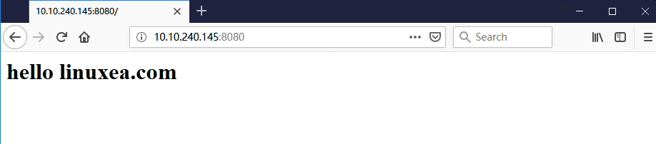

此前的RUN和CMD，我们知道，RUN是构建的时候运行的命令，在镜像完成后RUN就运行结束。随后推送到仓库中，这些RUN命令是不会在进行运行的。

-　init

在Docker上下文中，一个Docker只会运行一个应用程序，那么应该运行那个程序，又是什么应用？

一般情况下，能拥有生产能力的应用通常在宿主机上一般表现是运行在后台守护进程程序，如：mysql,nginx等。

这些服务在运行时候，都是以某个进程运行。某个进程都应该是某个进程的子进程，除init之外，而init是由内核启动的，一般我们在启动一个进程的时候，是以shell的子进程运行的，在命令行下创建的任何进程都是shell的子进程，而有一些经常也会直接占据shell的终端设备，就算使用&放置后台，启动的父进程也仍然是shell。进程终止的时候会将所有的子进程销毁，这种情况下我们会使用nohub command &，这样一来就类似于将启动的进程init

那么在Docker中运行的init进程(init的id是1)是由内核启动，还是托管shell启 动。如果基于内核启动` ls /etc/* `,`|`等shell特性是无法使用的，那么如果基于shell启动，那init的id就不再是1了

- exec

假如想基于shell的方式来启动一个主进程，那么shell的id号就是1，而后基于此在启动主进程，但是这样一来shell就不能退出，那可能需要一种能够剥离终端的方式启动，但是剥离了终端的方式启动，主进程号又不是1了。不过，我们可以使用exec来解决，shell启动是没有问题，进程号id是1也没有关系，exec顶替shell的id为1，取代shell进程，shell退出后exec就成了id为1的进程。

在很多时候，在容器内启动一个应用程序的时候可以不基于shell，直接启动也可以，也可以基于shell，如果基于shell启动，并且不违背shell主进程id为1的调节关系，那么就可以使用第二种方式，exec。

## CMD

RUN是构建的镜象build时候执行的，而cmd是定义一个镜象文件启动为容器时候默认要运行的程序，而Docker容器默认运行一个程序，在运行CMD的时候，是可以写多条CMD的，而最后一条CMD是生效的。而RUN是可以从上倒下接多RUN命令逐一运行。

CMD类属于RUN命令，CMD指令也可以用于运行任何命令或应用程序，不过，二者的运行时间点不同

- RUN指令运行与映像文件构建过程中，而CMD指令运行于基于Dockerfile构建出的新映像文件启动一个容器时
- CMD指令的首要目的在于为启动的容器指定默认要运行的程序，且运行结束后，容器也将终止；不过，CMD指令的命令其可以被Docker run命令选项所覆盖
- 在Dockerfile中可以存在多个CMD指令，但仅最后一个会生效

命令

```
CMD <command>
CMD ["<executable>","<paraml>","<param2>"]
CMD ["<param1>","<param2>"]
```

前两种语法格式的意义同RUN

第一种的CMD的命令执行是直接写命令的，并且PID不为1，也无法接收信号(接收信号的必然是pid为1的超级管理进程)，docker stop也无法停止。

第二种直接启动为ID为1的进程，可接受处理shell信号的。

第三种则用于ENTRYPOINT指令提供默认参数

- 编写Dockerfile

如，创建目录后追加文件，最后用CMD直接调用httpd启动

```bash
FROM busybox
LABEL maintainer="linuxea.com" app="CMD"
ENV WEB_ROOT="/data/wwwroot"

RUN mkdir -p ${WEB_ROOT} \
	&& echo '<h1> helo linuxea .</h1>' >> ${WEB_ROOT}/index.html
CMD /bin/httpd -f -h ${WEB_ROOT}
```

开始build

```bash
[marksugar@www.linuxea.com /data/linuxea2]$ docker build -t marksugar/httpd:9 
Sending build context to Docker daemon  2.048kB
Step 1/5 : FROM busybox
 ---> 59788edf1f3e
Step 2/5 : LABEL maintainer="linuxea.com" app="CMD"
 ---> Running in b6e91f2461dd
Removing intermediate container b6e91f2461dd
 ---> 53559ed7015a
Step 3/5 : ENV WEB_ROOT="/data/wwwroot"
 ---> Running in 3e615febfd44
Removing intermediate container 3e615febfd44
 ---> a7917cb7ecbb
Step 4/5 : RUN mkdir -p ${WEB_ROOT} 	&& echo '<h1> helo linuxea .</h1>' >> ${WEB_ROOT}/index.html
 ---> Running in 15153c929109
Removing intermediate container 15153c929109
 ---> 8e5548f3c00a
Step 5/5 : CMD /bin/httpd -f -h ${WEB_ROOT}
 ---> Running in feeb34a9c423
Removing intermediate container feeb34a9c423
 ---> a091b6d8a31d
Successfully built a091b6d8a31d
Successfully tagged marksugar/httpd:9
```

从这里可以看到，这条启动命令是/bin/sh启动的子进程，在此后启动的时候会替换成id1，也就是默认执行exec将/bin/sh替换掉

```
[marksugar@www.linuxea.com /data/linuxea2]$ docker inspect  marksugar/httpd:9
...			
			"Cmd": [
                "/bin/sh",
                "-c",
                "/bin/httpd -f -h ${WEB_ROOT}"
...                
```

而后run起来，但是这里是没有交互式接口的，尽管使用了-it

```
[marksugar@www.linuxea.com /data/linuxea2]$ docker run --name linuxea --rm  -it marksugar/httpd:9 
```

不过，可以使用exec进入容器，`/bin/httpd -f -h /data/wwwroot`的id为1

- 我们在Dockerfile中直接使用命令的方式避免他不是1，那么这里就直接启动为1，默认执行力exec替换。这也就说明了，尽管使用-it仍然进入不了容器的原因，init1的进程不是shell。进入就要在使用exec绕过进入

```bash
[marksugar@www.linuxea.com ~]$ docker exec -it linuxea sh
/ # ps aux
PID   USER     TIME  COMMAND
    1 root      0:00 /bin/httpd -f -h /data/wwwroot
    7 root      0:00 sh
   13 root      0:00 ps aux
/ # 
```

> 第二种格式

```
CMD ["/bin/httpd","-f","-h ${WEB_ROOT}"]
```

以这种方式进行build

```bash
FROM busybox
LABEL maintainer="linuxea.com" app="CMD"
ENV WEB_ROOT="/data/wwwroot"

RUN mkdir -p ${WEB_ROOT} \
	&& echo '<h1> helo linuxea .</h1>' >> ${WEB_ROOT}/index.html
#CMD /bin/httpd -f -h ${WEB_ROOT}
CMD ["/bin/httpd","-f","-h ${WEB_ROOT}"]
```

启动就会报错No such file

```bash
[marksugar@www.linuxea.com /data/linuxea2]$ docker run --name linuxea --rm  -it marksugar/httpd:10 
httpd: can't change directory to ' ${WEB_ROOT}': No such file or directory
```

报错No such file是因为`CMD ["/bin/httpd","-f","-h ${WEB_ROOT}"]`并不会运行成shell的子进程，而此变量是shell的变量，内核却不知道这个路径，所以会报错。

不过，我们可以指定为shell，如： `CMD ["/bin/sh","-c","/bin/httpd","-f","-h ${WEB_ROOT}"]`

- 引言

此前我们使用一条命令运行容器的时候，CMD的指令是可以被覆盖的，如下

```bash
[marksugar@www.linuxea.com ~]$ docker run --name linuxea --rm  -it marksugar/httpd:9 ls /etc
group        hosts        mtab         passwd       shadow
hostname     localtime    network      resolv.conf
```

上面这条命令是说，运行这个容器，`ls /etc`覆盖了此前镜像中的CMD中的启动httpd的命令。

但是有时候我们不希望被覆盖，就使用ENTRYPOINT

## ENTRYPOINT

类似于CMD指令的功能，用于为容器指定默认的运行程序，从而使得容器像是一个单独的可执行文件

与CMD不同的是由ENTRYPOINT启动的程序不会被docker run命令行指定的参数所覆盖，而且，这些命令行参数会被当作参数传递给ENTRYPOINT指令的指定程序 

不过，docker run命令--entrypoint选项参数可覆盖ENTRYPOINT指令指定的程序

```bash
ENTRYPOINT  <command>
ENTRYPOINT  ["<executable>","<param1>","<param2>"]
```

docker run命令传入的命令参数会覆盖CMD指令的内容并且附加到ENTRYPOINT命令最后作为其参数使用

Dockerfile文件中也可以存在多个ENTRYPOINT指令，但仅有最后一个生效

我们先编写一个Dockerfile，使用NETRYPOINT启动

```
FROM busybox
LABEL maintainer="linuxea.com" app="CMD"
ENV WEB_ROOT="/data/wwwroot"

RUN mkdir -p ${WEB_ROOT} \
	&& echo '<h1> helo linuxea .</h1>' >> ${WEB_ROOT}/index.html
ENTRYPOINT /bin/httpd -f -h ${WEB_ROOT}
```

而后build

```bash
[marksugar@www.linuxea.com /data/linuxea2]$ docker build -t marksugar/httpd:11 .
Sending build context to Docker daemon  2.048kB
Step 1/5 : FROM busybox
 ---> 59788edf1f3e
Step 2/5 : LABEL maintainer="linuxea.com" app="CMD"
 ---> Using cache
 ---> 53559ed7015a
Step 3/5 : ENV WEB_ROOT="/data/wwwroot"
 ---> Using cache
 ---> a7917cb7ecbb
Step 4/5 : RUN mkdir -p ${WEB_ROOT} 	&& echo '<h1> helo linuxea .</h1>' >> ${WEB_ROOT}/index.html
 ---> Using cache
 ---> 8e5548f3c00a
Step 5/5 : ENTRYPOINT /bin/httpd -f -h ${WEB_ROOT}
 ---> Running in 34c028efac0d
Removing intermediate container 34c028efac0d
 ---> b7be6f74fc65
Successfully built b7be6f74fc65
Successfully tagged marksugar/httpd:11
```

启动是没有问题的

```bash
[marksugar@www.linuxea.com /data/linuxea2]$ docker run --name linuxea --rm  -it marksugar/httpd:11
```

我们获取到这个ip。访问试试

```
[marksugar@www.linuxea.com ~]$ docker inspect -f {{.NetworkSettings.IPAddress}} linuxea
192.168.100.2
```

```
[marksugar@www.linuxea.com ~]$ curl 192.168.100.2
<h1> helo linuxea .</h1>
```

- ENTRYPOINT

而后使用CMD的方式同样来覆盖

```
[marksugar@www.linuxea.com /data/linuxea2]$ docker run --name linuxea --rm  -it marksugar/httpd:11 ls /etc
```

容器依然运行起来，但我们并没有看到`ls /etc`的内容。这是因为在run的时候使用了`ls /etc`并不会替换Dockerfile中ENTRYPOINT的运行命令，只是在ENTRYPOINT命令之后加了`ls /etc`，而httpd识别不出`ls /etc`而已 

如果一定要进行覆盖，就需要使用`--entrypoint`，如下：

`docker run --name linuxea --rm  -it --entrypoint "/bin/ls" marksugar/httpd:11 -al /etc`

```
[marksugar@www.linuxea.com ~]$ docker run --name linuxea --rm  -it --entrypoint "/bin/ls" marksugar/httpd:11 -al /etc
total 28
drwxr-xr-x    1 root     root            66 Dec  8 09:07 .
drwxr-xr-x    1 root     root             6 Dec  8 09:07 ..
-rw-rw-r--    1 root     root           307 Sep  6 20:11 group
-rw-r--r--    1 root     root            13 Dec  8 09:07 hostname
-rw-r--r--    1 root     root           177 Dec  8 09:07 hosts
-rw-r--r--    1 root     root           127 May  4  2018 localtime
lrwxrwxrwx    1 root     root            12 Dec  8 09:07 mtab -> /proc/mounts
drwxr-xr-x    6 root     root            79 Oct  1 22:37 network
-rw-r--r--    1 root     root           340 Sep  6 20:11 passwd
-rw-r--r--    1 root     root           114 Dec  8 09:07 resolv.conf
-rw-------    1 root     root           243 Sep  6 20:11 shadow
```

 ## 环境变量的传入 

我们设计一个nginx镜像，通过传入变量来来做。

准备一个启动的脚本，其中会去`etc/nginx/conf.d/linuxea.conf`写入文件，定义三个变量字段和默认参数

```
[marksugar@www.linuxea.com-145 /data/linuxea3]$ cat entrypoint.sh 
#!/bin/sh

cat  > /etc/nginx/conf.d/linuxea.conf << EOF
server {
        server_name ${HOSTNAME};
        listen ${IP:-0.0.0.0}:${NGPORT:-8080};
        root ${NGINX_ROOT:-/usr/share/nginx/html};
       }
EOF

exec "$@"
```

还有一个index.html文件

```
[marksugar@www.linuxea.com-145 /data/linuxea3]$ cat index.html 
<h1> hello linuxea.com</h1>
```

而后准备Dockerfile

在dockerfile中使用nginx:1.14.2-alpine做为基础镜像，我们主要使用配置的环境变量

其中指定`ENV NGINX_ROOT="/data/wwwroot"`,这个环境变量会被传递到后面的容器中

而后ADD脚本和文件

> CMD与ENTRYPOINT

CMD的命令是用来启动nginx，而后定义ENTRYPOINT，其中ENTRYPOINT运行完成后才会运行CMD，`/bin/entrypoint.sh`脚本读取环境变量生成配置文件，而后运行CMD，CMD是当作参数传递给ENTRYPOINT。对于这个`/bin/entrypoint.sh`脚本而言，是需要引用这个CMD的参数，所以就要在脚本最后加上`“$@”`(`“$@”`：脚本的所有参数)，并且是使用`exec "$@"`，那么最后就是`/bin/entrypoint.sh`

 那么首先就是/bin/entrypoint.sh脚本运行shell进程初始化配置文件，而后运行CMD，并且将CMD用来顶替ENTRYPOINT的进程。那也就意味着如果CMD命令中定义的nginx启动了，这个/bin/entrypoint.sh脚本就退出。

```
[marksugar@www.linuxea.com-145 /data/linuxea3]$ cat Dockerfile 
FROM nginx:1.14.2-alpine
LABEL maintainer="linuxea.com"
ENV NGINX_ROOT="/data/wwwroot"

ADD entrypoint.sh /bin/entrypoint.sh
ADD index.html ${NGINX_ROOT}/
CMD ["/usr/sbin/nginx","-g","daemon off;"]
ENTRYPOINT ["/bin/entrypoint.sh"]
```

而后bind

```
[marksugar@www.linuxea.com-145 /data/linuxea3]$ docker build -t marksugar/nginx:v2 .
Sending build context to Docker daemon  4.096kB
Step 1/7 : FROM nginx:1.14.2-alpine
 ---> d956af1ad36a
Step 2/7 : LABEL maintainer="linuxea.com"
 ---> Using cache
 ---> cde7cdca165b
Step 3/7 : ENV NGINX_ROOT="/data/wwwroot"
 ---> Using cache
 ---> d578dff11d4e
Step 4/7 : ADD entrypoint.sh /bin/entrypoint.sh
 ---> Using cache
 ---> cab2b9ecf51d
Step 5/7 : ADD index.html ${NGINX_ROOT}/
 ---> 5fe3bcf8a547
Step 6/7 : CMD ["/usr/sbin/nginx","-g","daemon off;"]
 ---> Running in 7bfbda86cfa5
Removing intermediate container 7bfbda86cfa5
 ---> 44b39604b80f
Step 7/7 : ENTRYPOINT ["/bin/entrypoint.sh"]
 ---> Running in 5373eb7e742e
Removing intermediate container 5373eb7e742e
 ---> f569a0cd5230
Successfully built f569a0cd5230
Successfully tagged marksugar/nginx:v2
```

在run起来，我们查看这个配置文件，其中root的变量在Dockerfile中定义的值也被传递到这个配置文件中。
```
[marksugar@www.linuxea.com-145 /data/linuxea3]$ docker exec -i linuxea cat /etc/nginx/conf.d/linuxea.conf
server {
        server_name 0e5e5cff1c10;
        listen 0.0.0.0:8080;
        root /data/wwwroot;
       }
```

将端口也映射成8080，可在浏览器访问



日志也会进行输出
```
[marksugar@www.linuxea.com-145 /data/linuxea3]$ docker run --name linuxea -p 8080:8080 --rm marksugar/nginx:v2 
10.10.0.96 - - [08/Dec/2018:13:45:03 +0000] "GET / HTTP/1.1" 200 28 "-" "Mozilla/5.0 (Windows NT 10.0; Win64; x64) AppleWebKit/537.36 (KHTML, like Gecko) Chrom
```

甚至于我们可以run的时候传递参数生成，如：

`-e "HOSTNAME=www.linuxea.com"`
`-e "IP=127.0.0.1"`
`-e "NGPORT=8888"`

```
[marksugar@www.linuxea.com-145 /data/linuxea3]$ docker run --name linuxea -p 8080:8080 --rm -e "HOSTNAME=www.linuxea.com" -e "IP=127.0.0.1" -e "NGPORT=8888" marksugar/nginx:v2 
```

在如docker容器查看，容器正常启动

```
[marksugar@www.linuxea.com-145 /data/linuxea3]$ docker exec -i linuxea ps aux
PID   USER     TIME  COMMAND
    1 root      0:00 nginx: master process /usr/sbin/nginx -g daemon off;
    9 nginx     0:00 nginx: worker process
   15 root      0:00 ps aux
```
`127.0.0.1：8888`端口已经运行

```
[marksugar@www.linuxea.com-145 /data/linuxea3]$ docker exec -i linuxea netstat -ntl
Active Internet connections (only servers)
Proto Recv-Q Send-Q Local Address           Foreign Address         State       
tcp        0      0 0.0.0.0:80              0.0.0.0:*               LISTEN      
tcp        0      0 127.0.0.1:8888          0.0.0.0:*               LISTEN     
```

文件参数已经被替换。

```
[marksugar@www.linuxea.com-145 /data/linuxea3]$ docker exec -i linuxea cat /etc/nginx/conf.d/linuxea.conf
server {
        server_name www.linuxea.com;
        listen 127.0.0.1:8888;
        root /data/wwwroot;
       }
```

## health check

当我们基于镜像启动一个容器的时候，容器在什么时候退出，又在什么时候运行？事实上只要这个容器的主进程不是运行在后台，也没有停止，那么这个容器就不会停止。

容器在判断容器正常与否，并不会根据容器是否能够正常服务，而仅仅是看容器主进程是否运行着，因此这种判断机制并不能说明容器就是健康的。

那么我们就可以使用curl，或者wget，向主页发起请求，如果主页内容状态是对的，或者内容是我们期望的来判断是否运行正常，这样的精度才是我们想要的

health check并不是检测一次就是ok的，他是一个周期的持续性的检测

当容器指定了*运行状况检查时*，除了正常状态外，它还具有*运行*状况。这个状态最初是`starting`。每当健康检查通过时，它就会变成`healthy`（以前的状态）。经过一定数量的连续失败后，它就变成了`unhealthy`

- `--interval=DURATION`（**间隔**时间，默认值：`30s`）
- `--timeout=DURATION`（**超时**秒数，默认值：`30s`）
- `--start-period=DURATION`（默认值：`0s`）
- `--retries=N`（**失败的重试次数**，默认值：`3`）

**start period**：容器在启动的时候，可能需要一定的准备的初始化时间，如果容器被run就开始检测，那如果容器也没有准备妥当，那此时检测肯定是失败的。那么就需要给容器一个启动的准备时间来做初始化。而这个start-period就是。

检测发出后返回状态值：

- 0：成功 - 容器健康且随时可用
- 1：不健康 - 容器无法正常工作
- 2：保留 - 不要使用此退出代码

例如，要检查每五分钟左右网络服务器能够在三秒钟内为网站的主页面提供服务：

```
HEALTHCHECK --interval=5m --timeout=3s \
  CMD curl -f http://localhost/ || exit 1
```

这样以来就不依赖进程是否运行来判断，而是判断访问是否正常来判断

接着上面的Dockerfile，添加一行，时间均是3s，方便测试：
--interval=3s 
--timeout=3s 
--start-period=3s
```
HEALTHCHECK --interval=3s --timeout=3s --start-period=3s CMD wget -O - -q http://${IP:-0.0.0.0}:${NGPORT:-80}
```

```
[marksugar@www.linuxea.com-145 /data/linuxea3]$ cat Dockerfile 
FROM nginx:1.14.2-alpine
LABEL maintainer="linuxea.com"
ENV NGINX_ROOT="/data/wwwroot"

ADD entrypoint.sh /bin/entrypoint.sh
ADD index.html ${NGINX_ROOT}/

EXPOSE 8080/tcp 80/tcp

HEALTHCHECK --interval=3s --timeout=3s --start-period=3s CMD wget -O - -q http://${IP:-0.0.0.0}:${NGPORT:-80} || exit 1
#HEALTHCHECK --start-period=3s CMD wget -O - -q http://${IP:-0.0.0.0}:${NGPORT} || exit 1

CMD ["/usr/sbin/nginx","-g","daemon off;"]
ENTRYPOINT ["/bin/entrypoint.sh"]
```

而后build

```
[marksugar@www.linuxea.com /data/linuxea3]$ docker build -t marksugar/nginx:v3 .
```
run起来后，就会发起`wget -O - -q http://${IP:-0.0.0.0}:${NGPORT:-80}`，说明状态健康
```
[marksugar@www.linuxea.com-145 /data/linuxea3]$ docker run --name linuxea  --rm -e "NGPORT=8080" marksugar/nginx:v3
127.0.0.1 - - [08/Dec/2018:15:23:15 +0000] "GET / HTTP/1.1" 200 28 "-" "Wget" "-"
127.0.0.1 - - [08/Dec/2018:15:23:18 +0000] "GET / HTTP/1.1" 200 28 "-" "Wget" "-"
127.0.0.1 - - [08/Dec/2018:15:23:21 +0000] "GET / HTTP/1.1" 200 28 "-" "Wget" "-"
127.0.0.1 - - [08/Dec/2018:15:23:24 +0000] "GET / HTTP/1.1" 200 28 "-" "Wget" "-"
127.0.0.1 - - [08/Dec/2018:15:23:27 +0000] "GET / HTTP/1.1" 200 28 "-" "Wget" "-"
127.0.0.1 - - [08/Dec/2018:15:23:30 +0000] "GET / HTTP/1.1" 200 28 "-" "Wget" "-"
127.0.0.1 - - [08/Dec/2018:15:23:33 +0000] "GET / HTTP/1.1" 200 28 "-" "Wget" "-"
127.0.0.1 - - [08/Dec/2018:15:23:36 +0000] "GET / HTTP/1.1" 200 28 "-" "Wget" "-"
```

此时我将端口修改为81，而81并没有监听，wget将失败，也就没有了wget日志，而docker ps 将能看到状态为unhealthy，说明不健康

```
[marksugar@www.linuxea.com-145 /data/linuxea3]$ docker ps -a
CONTAINER ID        IMAGE                        COMMAND                  CREATED             STATUS                      PORTS               NAMES
13fcf1bd14c4        marksugar/nginx:v4           "/bin/entrypoint.sh …"   19 seconds ago      Up 18 seconds (unhealthy)   80/tcp, 8080/tcp    linuxea
```

## shell

该`SHELL`指令允许覆盖用于*shell*形式的命令的默认shell 。Linux上的默认shell是`["/bin/sh", "-c"]`，而在Windows上`["cmd", "/S", "/C"]`。该`SHELL`指令*必须*以JSON格式写入Dockerfile。

参考：https://docs.docker.com/engine/reference/builder/#shell

## STOPSIGNAL

该`STOPSIGNAL`指令设置将发送到容器的系统调用信号以退出。此信号可以是与内核的系统调用表中的位置匹配的有效无符号数，例如9，或SIGNAME格式的信号名，例如SIGKILL，例如15，停止容器。如果要发送其他的信号就要在这里定义

```
STOPSIGNAL signal
```

## ARG

`ARG`指令定义了一个变量，可以`docker build`使用该`--build-arg <varname>=<value>` 标志在构建时将该变量传递给构建器。这样定义的Dockerfile可以适用于较多的场景，尤其是程序版本迭代。如果指定了未在Dockerfile中定义的构建参数，则构建会输出警告。

示例：

定义ARG author默认是"linuxea.com.cn"

```
ARG author="linuxea.com.cn"
LABEL maintainer="${author}"
```

```
[marksugar@www.linuxea.com-145 /data/linuxea3]$ cat Dockerfile 
FROM nginx:1.14.2-alpine

ARG author="linuxea.com.cn"
LABEL maintainer="${author}"
ENV NGINX_ROOT="/data/wwwroot"

ADD entrypoint.sh /bin/entrypoint.sh
ADD index.html ${NGINX_ROOT}/

EXPOSE 8080/tcp 80/tcp

HEALTHCHECK --interval=3s --timeout=3s --start-period=3s CMD wget -O - -q http://${IP:-0.0.0.0}:${NGPORT:-80}||exit 1
#HEALTHCHECK --start-period=3s CMD wget -O - -q http://${IP:-0.0.0.0}:${NGPORT} || exit 1

CMD ["/usr/sbin/nginx","-g","daemon off;"]
ENTRYPOINT ["/bin/entrypoint.sh"]
```

build

```
[marksugar@www.linuxea.com-145 /data/linuxea3]$ docker build --build-arg author="mark www.linuxea.com" -t marksugar/nginx:v5 .
```

查看，marksugar/nginx:v5的Labels是默认的linuxea.com.cn

```
[marksugar@www.linuxea.com-145 /data/linuxea3]$ docker inspect -f {{.ContainerConfig.Labels}} marksugar/nginx:v5
map[maintainer:linuxea.com.cn]
```

而后重新build，重新赋值--build-arg author="mark www.linuxea.com"

```
[marksugar@www.linuxea.com-145 /data/linuxea3]$ docker build --build-arg author="mark www.linuxea.com" -t marksugar/nginx:v6 .
```

而后在查看，赋值被生效

```
[marksugar@www.linuxea.com-145 /data/linuxea3]$ docker inspect -f {{.ContainerConfig.Labels}} marksugar/nginx:v6
map[maintainer:mark www.linuxea.com]
```

## ONBUILD

用于在Dockerfile中定义一个触发器，Dockerfile用于build镜像文件，此镜像文件可作为base image被另一个Dockerfile用作FROM指令的参数，并以之构建新的映像文件

在后面的这个Dockerfile中的FROM指令在build过程中被执行时，将会“触发”创建其base image的Dockerfile文件中的ONBUILD指令定义的触发器

```
ONBULD <INSTRUCTION>
```

尽管任何指令都可注册成为触发器指令，但ONBUILD不能自我嵌套，且不会触发FROM和MAINTAINER指令

使用包含ONBUILD指令的Dockerfile构建的镜像应该使用特殊的标签，例如：mysql:5.6-onbuild

在ONBUILD指令中使用ADD或COPY指令如果缺少指定的源文件时会失败(比如二次build copy，本地却无文件)。多数情况下，ONBUILD会执行ADD或者RUN进行下载安装等。

- **也就说ONBUILD不会在自己构建的时候执行，而是在被其他人使用作为基础镜像的时候才会执行。**

添加一条ONBUILD，示例如下：

```
ONBUILD ADD http://10.10.240.145/CentOS-Base.repo /etc/
```

如下:

```
[marksugar@www.linuxea.com-145 /data/linuxea3]$ cat Dockerfile 
FROM nginx:1.14.2-alpine

ARG author="linuxea.com.cn"
LABEL maintainer="${author}"
ENV NGINX_ROOT="/data/wwwroot"

ADD entrypoint.sh /bin/entrypoint.sh
ADD index.html ${NGINX_ROOT}/

EXPOSE 8080/tcp 80/tcp

HEALTHCHECK --interval=3s --timeout=3s --start-period=3s CMD wget -O - -q http://${IP:-0.0.0.0}:${NGPORT:-80}||exit 1
#HEALTHCHECK --start-period=3s CMD wget -O - -q http://${IP:-0.0.0.0}:${NGPORT} || exit 1


ONBUILD ADD http://10.10.240.145/CentOS-Base.repo /etc/


CMD ["/usr/sbin/nginx","-g","daemon off;"]
ENTRYPOINT ["/bin/entrypoint.sh"]
```

而后build为marksugar/httpd:v7

```
[marksugar@www.linuxea.com-145 /data/linuxea3]$ docker  build -t marksugar/httpd:v7 .
Sending build context to Docker daemon  4.608kB
Step 1/11 : FROM nginx:1.14.2-alpine
 ---> d956af1ad36a
Step 2/11 : ARG author="linuxea.com.cn"
 ---> Using cache
 ---> c4c543206ad1
Step 3/11 : LABEL maintainer="${author}"
 ---> Using cache
 ---> 36edfcb86dfb
Step 4/11 : ENV NGINX_ROOT="/data/wwwroot"
 ---> Using cache
 ---> 6547ed95f45a
Step 5/11 : ADD entrypoint.sh /bin/entrypoint.sh
 ---> Using cache
 ---> d650f4dcb46c
Step 6/11 : ADD index.html ${NGINX_ROOT}/
 ---> Using cache
 ---> 865b4df58910
Step 7/11 : EXPOSE 8080/tcp 80/tcp
 ---> Using cache
 ---> 1454ea1fc5e3
Step 8/11 : HEALTHCHECK --interval=3s --timeout=3s --start-period=3s CMD wget -O - -q http://${IP:-0.0.0.0}:${NGPORT:-80}||exit 1
 ---> Using cache
 ---> 157834157357
Step 9/11 : ONBUILD ADD http://10.10.240.145/CentOS-Base.repo /etc/
 ---> Running in 37e29f61d449
Removing intermediate container 37e29f61d449
 ---> f334451b2c4c
Step 10/11 : CMD ["/usr/sbin/nginx","-g","daemon off;"]
 ---> Running in d3b24f896853
Removing intermediate container d3b24f896853
 ---> b9307347b1ce
Step 11/11 : ENTRYPOINT ["/bin/entrypoint.sh"]
 ---> Running in cd1f126e961f
Removing intermediate container cd1f126e961f
 ---> a79987f1e18a
Successfully built a79987f1e18a
Successfully tagged marksugar/httpd:v7
```

```
[marksugar@www.linuxea.com-145 /data/linuxea3]$ docker images
REPOSITORY                                        TAG                 IMAGE ID            CREATED              SIZE
marksugar/httpd                                   v7                  a79987f1e18a        About a minute ago   17.7MB
```

重新写一个Dockerfile，调用刚刚构建的marksugar/httpd:v7

```
[marksugar@www.linuxea.com-145 /data/linuxea4]$ cat Dockerfile 
FROM marksugar/httpd:v7

RUN echo "helo" >> /tmp/linuxea.txt
```

在build的时候，就会执行上一个Dockerfile中的ONBUILD命令，如下：

```
[marksugar@www.linuxea.com-145 /data/linuxea4]$ docker build -t onbuild:1 .
Sending build context to Docker daemon  2.048kB
Step 1/2 : FROM marksugar/httpd:v7
# Executing 1 build trigger
Downloading [==================================================>]  1.664kB/1.664kB
 ---> b64f3cd2ba7f
Step 2/2 : RUN echo "helo" >> /tmp/linuxea.txt
 ---> Running in e9f45b68bb24
Removing intermediate container e9f45b68bb24
 ---> 63bced5b493c
Successfully built 63bced5b493c
Successfully tagged onbuild:1
```

而后run起来验证下

```
[marksugar@www.linuxea.com-145 /data/linuxea4]$ docker run --name onbuild --rm onbuild:1 ls /etc/CentOS-Base.repo
/etc/CentOS-Base.repo
```

```
[marksugar@www.linuxea.com-145 /data/linuxea4]$ docker run --name onbuild --rm onbuild:1 cat  /etc/CentOS-Base.repo
# CentOS-Base.repo
#
# The mirror system uses the connecting IP address of the client and the
# update status of each mirror to pick mirrors that are updated to and
# geographically close to the client.  You should use this for CentOS updates
# unless you are manually picking other mirrors.
#
# If the mirrorlist= does not work for you, as a fall back you can try the 
# remarked out baseurl= line instead.
#
#

[base]
name=CentOS-$releasever - Base
mirrorlist=http://mirrorlist.centos.org/?release=$releasever&arch=$basearch&repo=os&infra=$infra
#baseurl=http://mirror.centos.org/centos/$releasever/os/$basearch/
gpgcheck=1
gpgkey=file:///etc/pki/rpm-gpg/RPM-GPG-KEY-CentOS-7
...
```


