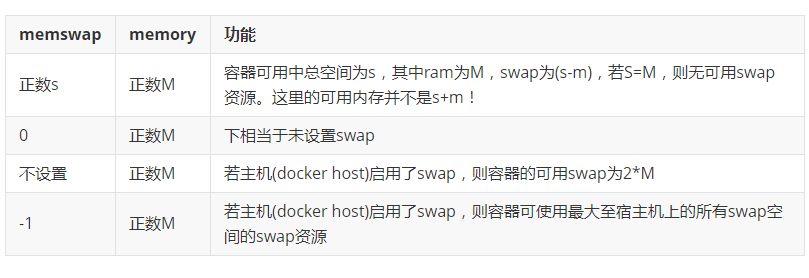
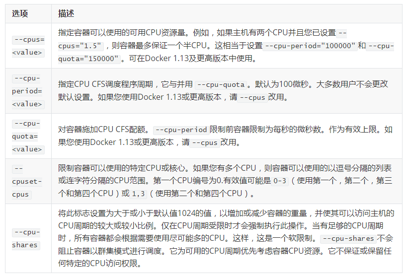
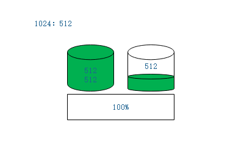
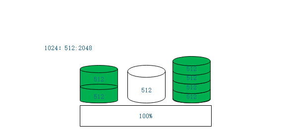
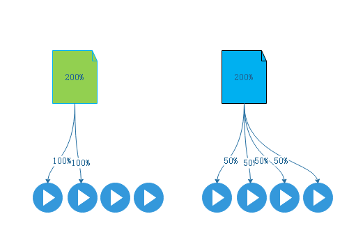

我们知道容器能够运行，依赖内核的两个特性，一个是名称空间，一个是控制组。默认在docker中是没有任何资源限制的，在某些极端情况下能够几乎耗尽docker主机之上的所有资源。

在此基础之上docker provides提供了一个控制容器能够使用多少内存，cpu，io，我们可以进行控制cpu和内存，而IO较弱控制。而其中的内存是非可压缩资源，CPU是可压缩资源。当容器内的进程耗尽CPU时，并且申请更多内存时候，可能会产生OOM。而CPU则不会出现这种问题。这些资源的限制依赖于[capabilities](https://docs.docker.com/engine/security/security/#linux-kernel-capabilities)

资源限制从名称空间和cgroup来进行定义

## Memory

- OOM

如果在linux主机上，内核探测到当前宿主机已经没有足够内存可用于执行某些重要的系统功能，就会抛出OOME，并且开始启动kill 进程，以便于释放资源。

一旦发生OOME，任何进程都有可能会被杀死 ，包括docker daemon在内

> 如果内核发现内存被几乎耗尽无法执行本身的运作的时候，会进行检测使用内存异常的hogs进程。但是并不是使用内存最多的就是被杀掉的进程。这可能取决于，申请的内存总大小内耗尽比例来取决最佳被杀掉的进程，这个列表顺序可能是逆序的。

为此，docker特地调整了docker daemon的OOM优先级，但是容器的优先级并未调整。

> 为了便于控制，引入了一个oom-adj的功能，以防止系统中的重要进程被杀死，并定义要杀死的进程的顺序。`oom_adj`的可能值范围为-17到+15。分数越高，相关过程越有可能被OOM杀手杀死。如果 `oom_adj`设置为-17，则不会考虑将该进程用于OOM查杀。

> 在每一个进程可以分配一个OOM-score的得分计算，根据其不良分数选择在内存不足情况下被杀死，，这个得分计算根据内存的申请的空间

参考：
```
https://lwn.net/Articles/317814/
https://lwn.net/Articles/391222/
https://lwn.net/Articles/548180/
https://lwn.net/Articles/391206/
```

对于一些非常重要的容器，在启动的时候就需要调整oom_adj，另外也可以定义容器的策略，在出现OOM被kill后就restart

默认是没有对资源限制的，限制容器的内存和CPU资源是有选项可以使用：

- 内存资源

raw,swap

```
| `-m` 要么 `--memory=`  | 限制容器使用内存，单位是k,b,m,g作为单位使用，可单独使用 |
| `--memory-swap`*       | 允许此容器交换到磁盘的内存量。查看[`--memory-swap`详情](https://docs.docker.com/config/containers/resource_constraints/#--memory-swap-details)。这个选项生效依赖于raw的选项是否配置 |
| `--memory-swappiness`  | 默认情况下，主机内核可以交换容器使用的匿名页面的百分比。您可以设置`--memory-swappiness`0到100之间的值，以调整此百分比。查看[`--memory-swappiness`详情](https://docs.docker.com/config/containers/resource_constraints/#--memory-swappiness-details)。 0并不是不使用|
| `--memory-reservation` | 允许您指定小于软件限制的软限制`--memory`，当Docker检测到主机上的争用或内存不足时，该限制将被激活。如果使用`--memory-reservation`，则必须将其设置为低于`--memory`优先级。因为它是软限制，所以不保证容器不超过限制。 |
| `--kernel-memory`      | 容器可以使用的最大内核内存量。允许的最小值是`4m`。由于内核内存无法换出，因此内核内存不足的容器可能会阻塞主机资源，这可能会对主机和其他容器产生副作用。查看[`--kernel-memory`详情](https://docs.docker.com/config/containers/resource_constraints/#--kernel-memory-details)。 |
| `--oom-kill-disable`   | 默认情况下，如果发生内存不足（OOM）错误，内核会终止容器中的进程。要更改此行为，请使用该`--oom-kill-disable`选项。仅在已设置`-m/--memory`选项的容器上禁用OOM杀手。如果`-m`未设置该标志，则主机可能会耗尽内存，并且内核可能需要终止主机系统的进程才能释放内存。 |
```
参考:https://docs.docker.com/config/containers/resource_constraints/#limit-a-containers-access-to-memory


--memory-swap和memory联系与区别



| memswap | memory | 功能 |
|--------------------------------------|:--------------------------------------------|--------------------------------------|
| 正数s | 正数M | 容器可用中总空间为s，其中ram为M，swap为(s-m)，若S=M，则无可用swap资源。这里的可用内存并不是s+m！ |
| 0 | 正数M | 下相当于未设置swap |
| 不设置 | 正数M | 若主机(docker host)启用了swap，则容器的可用swap为2*M |
| -1 | 正数M | 若主机(docker host)启用了swap，则容器可使用最大至宿主机上的所有swap空间的swap资源 |

- 容器内使用free命令看到的swap空间并不具有其所展现出的空间的指示意义

## CPU

每一个容器都可以使用宿主机上所有的CPU资源。作为用户来讲，可以设置各种约束来限制给定容器访问主机的CPU额度。

我们知道,CPU的核心数是少于进程数的，一个系统之上运行了很多个进程，运行的进程数量大于核心数量的时候， 那个才是优先被运行？大多数用户使用和配置是由[CFS调度](https://docs.docker.com/config/containers/resource_constraints/#configure-the-default-cfs-scheduler)程序来决定的。

内核管理中最重要的一个组件[CFS](https://en.wikipedia.org/wiki/Completely_Fair_Scheduler)(Completely Fair Scheduler)，处理调度进程在本地的核心之上，用于普通Linux进程的Linux内核CPU调度程序。多个运行时标志允许您配置容器具有的CPU资源访问量。使用这些设置时，Docker会修改主机上容器的cgroup的设置。

然而每个进程都是有优先级的，这种非实时优先级，有效范围是100-139，这个范围是可以使用nice(niceness scale)进行调整,-20到19,数字越小优先级越高。默认nice值为零。在1.13及更高版本中，支持[实时调度程序](https://docs.docker.com/config/containers/resource_constraints/#configure-the-realtime-scheduler)。

另外，还有实时优先级，0-99，默认范围为**1**到**99**，这些都是内核级的。然后**100**到**139**用于用户空间(非实时)，[调度器CFS](https://www.kernel.org/doc/Documentation/scheduler/sched-design-CFS.txt)就是调度这些100-139之间的进程的

>  延伸阅读：
> CFS: https://www.kernel.org/doc/Documentation/scheduler/sched-design-CFS.txt
> CFS: https://en.wikipedia.org/wiki/Completely_Fair_Scheduler
> 进程调度：https://en.wikipedia.org/wiki/Completely_Fair_Scheduler
> CPU调度：https://www.studytonight.com/operating-system/cpu-scheduling
> 进程优先级调整:
> https://bencane.com/2013/09/09/setting-process-cpu-priority-with-nice-and-renice/
> https://developer.ibm.com/tutorials/l-lpic1-103-6/
> https://www.ostechnix.com/change-priority-process-linux/
> https://www.nixtutor.com/linux/changing-priority-on-linux-processes/
> https://www.tecmint.com/set-linux-process-priority-using-nice-and-renice-commands/

CPU资源也分为io密集型和CPU密集型，对于cpu密集型的可能需要调低优先级，当调度后就会耗时较长，而IO密集型是IO调度。对于占用很长时间的进程动态调低优先级，对于那些占用CPU很少又经常调度不上去的(CPU)将会调整高一些。

CPU分配：



| 选项                   | 描述                                                         |
| ---------------------- | ------------------------------------------------------------ |
| `--cpus=<value>`       | 指定容器可以使用的可用CPU资源量。例如，如果主机有两个CPU并且您已设置`--cpus="1.5"`，则容器最多保证一个半CPU。这相当于设置`--cpu-period="100000"`和`--cpu-quota="150000"`。可在Docker 1.13及更高版本中使用。 |
| `--cpu-period=<value>` | 指定CPU CFS调度程序周期，它与并用 `--cpu-quota`。默认为100微秒。大多数用户不会更改默认设置。如果您使用Docker 1.13或更高版本，请`--cpus`改用。 |
| `--cpu-quota=<value>`  | 对容器施加CPU CFS配额。`--cpu-period`限制前容器限制为每秒的微秒数。作为有效上限。如果您使用Docker 1.13或更高版本，请`--cpus`改用。 |
| `--cpuset-cpus`        | 限制容器可以使用的特定CPU或核心。如果您有多个CPU，则容器可以使用的以逗号分隔的列表或连字符分隔的CPU范围。第一个CPU编号为0.有效值可能是`0-3`（使用第一个，第二个，第三个和第四个CPU）或`1,3`（使用第二个和第四个CPU）。 |
| `--cpu-shares`         | 将此标志设置为大于或小于默认值1024的值，以增加或减少容器的重量，并使其可以访问主机的CPU周期的较大或较小比例。仅在CPU周期受限时才会强制执行此操作。当有足够的CPU周期时，所有容器都会根据需要使用尽可能多的CPU。这样，这是一个软限制。`--cpu-shares`不会阻止容器以群集模式进行调度。它为可用的CPU周期优先考虑容器CPU资源。它不保证或保留任何特定的CPU访问权限。 |

参考：https://docs.docker.com/config/containers/resource_constraints/#configure-the-default-cfs-scheduler

>  而--cpu-shares是按照比例切分。

- 1024:512

比如当前系统上运行了两个人容器，第一个容器是1024，第二个容器是512，假如这俩个容器都需要可能多的使用CPU。假如CPU资源有100份(100%)，分为2分之一，各占512，而CPU资源以512为单位分为三份在两个容器上，如下：



第一个容器占2份，而第二个容器占用1份，如果此时第二个容器启动后并没有占用CPU，那么第一个容器就可以占用第二个容器的512，这种方式就是共享式。在需要的时候就分配需要的额度，不需要的时候就给需要的使用。

- 1024:512:2048

假如现在有更大的比例，如下图



这样一来就是分为了七份，2+1+4，分七份后后可用资源占用比例就不一样了,最后的2048是分成了4份542。同样，如果其中某一份容器或多个容器暂时不占用分配自己的CPU资源，仍然会被其他繁忙的容器所占用全部。也就是说，只要容器都在使用，就按照比例分配，如果只有一个使用，其他的不使用，这个使用的容器能够占用所有的CPU资源。如果有两个在使用，就按照剩下的比例分配给使用的，这个过程是随时动态调整的。任何一个容器不使用，就会被其他使用的容器说分配掉。

CPU是可压缩资源，可随时加入更多的容器使用，只不过不同的分法，得到的结果不一样而已。

CPU可压缩资源通过共享方式来分派，可压缩，也可随时调整比例。

CPUshares有一特点，假如有4核心cpu，其中没一个容器的进程可任意调度到任何一个核心上面运行。一共使用1024比例，但是另外2个容器都不运行，那这个容器就不单单有一颗CPU的运算能力，而是有4颗CPU的运算能力，一颗CPU是100%，4个就相当于有400%的CPU。

- --cpus

当然，也可以限制，假设如果一共有4核心，一个进程最多使用2个核心，且无论其他CPU空闲超过2个以上或者其他，被限制的cpu只能使用2核心，另外两个核心是空闲的(任意取其二，剩下不取) 。如下图左

假设使用限制是2核心，也就是说，在4核心的cpu上使用的最多只能是200%，一个核心为100%，那也就是2颗核心。而现在可能是另外的一种方式，同样适用2核心，最多使用200%，但是却是每个核心各50%，重量不超过200%即可。如下图右



但是，我们也可以限制核心数。

- --cpuset-cpus

--cpus意味着这个进程只能运行在那个CPU核心。假如有4个核心，用的是0和3进行编号，那1和2就不能使用

这些分配可以分为几种：

1，按照压缩方式比例分配

2，限定最多使用的核心数

3，限定使用那些个CPU

假如只有--cpuset-cpus限制了只能使用的0和1，那说明只能使用两个CPU，也就是200%，也可以限制使用的cpu时间周期和配额，这些选项在run或create时间使用。

## 配置

我们下载`lorel/docker-stress-ng`测试


我们在dockerhub上选择latest版本拉取到本地
```
[marksugar@www.linuxea.com /data/harbor]$ docker pull lorel/docker-stress-ng
Using default tag: latest
latest: Pulling from lorel/docker-stress-ng
c52e3ed763ff: Pull complete 
a3ed95caeb02: Pull complete 
7f831269c70e: Pull complete 
Digest: sha256:c8776b750869e274b340f8e8eb9a7d8fb2472edd5b25ff5b7d55728bca681322
Status: Downloaded newer image for lorel/docker-stress-ng:latest
```

- memory

可以使用` docker run --name stress --rm lorel/docker-stress-ng --help`查看帮助

```
 -m N, --vm N             start N workers spinning on anonymous mmap
 (-m N，-  vm 			 N启动N个工作人员在匿名mmap上旋转)
 --vm-bytes N             allocate N bytes per vm worker (default 256MB)
 (--vm-bytes			  N为每个vm worker分配N个字节（默认为256MB） )
```

我们先对内存进行压测

使用-m 指定配置大小为256m，而后使用  --vm 2 ,一个vm的默认是256M，压测观测下

```
[marksugar@www.linuxea.com /data/harbor]$ docker run --name stress --rm -m 256m lorel/docker-stress-ng  --vm 2 
stress-ng: info: [1] defaulting to a 86400 second run per stressor
stress-ng: info: [1] dispatching hogs: 2 vm
```

观测内存的使用情况

```
[marksugar@www.linuxea.com ~]$ docker top stress
UID                 PID                 PPID                C                   STIME               TTY                 TIME                CMD
root                12685               12670               0                   11:52               ?                   00:00:00            /usr/bin/stress-ng --vm 2
root                12716               12685               0                   11:52               ?                   00:00:00            /usr/bin/stress-ng --vm 2
root                12717               12685               0                   11:52               ?                   00:00:00            /usr/bin/stress-ng --vm 2
root                12799               12717               70                  11:52               ?                   00:00:00            /usr/bin/stress-ng --vm 2
root                12810               12716               5                   11:52               ?                   00:00:00            /usr/bin/stress-ng --vm 2
```

可以使用`docker stats stress`，内存最多使用在限制内的大小

```
[marksugar@www.linuxea.com ~]$ docker stats stress


CONTAINER ID        NAME                CPU %               MEM USAGE / LIMIT   MEM %               NET I/O             BLOCK I/O           PIDS
3b96828e471a        stress              0.00%               255.9MiB / 256MiB   99.95%              712B / 42B          2.36GB / 20.5GB     5

CONTAINER ID        NAME                CPU %               MEM USAGE / LIMIT   MEM %               NET I/O             BLOCK I/O           PIDS
3b96828e471a        stress              137.67%             255.8MiB / 256MiB   99.92%              712B / 42B          2.53GB / 21.8GB     5

CONTAINER ID        NAME                CPU %               MEM USAGE / LIMIT   MEM %               NET I/O             BLOCK I/O           PIDS
3b96828e471a        stress              137.67%             255.8MiB / 256MiB   99.92%              712B / 42B          2.53GB / 21.8GB     5

CONTAINER ID        NAME                CPU %               MEM USAGE / LIMIT   MEM %               NET I/O             BLOCK I/O           PIDS
3b96828e471a        stress              139.01%             255.8MiB / 256MiB   99.91%              712B / 42B          2.69GB / 23GB       5
```

可以看到这个内存一直在使用达99%

- cpu

我们在验证下CPU

限制使用2核心，也就是最多使用200%，运行8个进程使用（无论起多少进程，只有2核心分配）

> 请注意，这样的限制只能使用2个cpu，那就意味着0-3的cpu任何两个都会被使用，并不固定在那一颗CPU

```
[marksugar@www.linuxea.com /data/harbor]$ docker run --name stress --rm --cpus 2  lorel/docker-stress-ng  --cpu 8
stress-ng: info: [1] defaulting to a 86400 second run per stressor
stress-ng: info: [1] dispatching hogs: 8 cpu
```

使用docker top stress观测，8个进程已经运行

```
[marksugar@www.linuxea.com ~]$ docker top stress
UID                 PID                 PPID                C                   STIME               TTY                 TIME                CMD
root                32201               32185               0                   14:19               ?                   00:00:00            /usr/bin/stress-ng --cpu 8
root                32232               32201               25                  14:19               ?                   00:00:01            /usr/bin/stress-ng --cpu 8
root                32233               32201               25                  14:19               ?                   00:00:01            /usr/bin/stress-ng --cpu 8
root                32234               32201               25                  14:19               ?                   00:00:01            /usr/bin/stress-ng --cpu 8
root                32235               32201               25                  14:19               ?                   00:00:01            /usr/bin/stress-ng --cpu 8
root                32236               32201               25                  14:19               ?                   00:00:01            /usr/bin/stress-ng --cpu 8
root                32237               32201               25                  14:19               ?                   00:00:01            /usr/bin/stress-ng --cpu 8
root                32238               32201               25                  14:19               ?                   00:00:01            /usr/bin/stress-ng --cpu 8
root                32239               32201               25                  14:19               ?                   00:00:01            /usr/bin/stress-ng --cpu 8
```

而CPU最多使用200

```
[marksugar@www.linuxea.com ~]$ docker stats stress

CONTAINER ID        NAME                CPU %               MEM USAGE / LIMIT     MEM %               NET I/O             BLOCK I/O           PIDS
d4b2a1641d67        stress              200.05%             18.77MiB / 3.848GiB   0.48%               0B / 42B            0B / 0B             9

CONTAINER ID        NAME                CPU %               MEM USAGE / LIMIT     MEM %               NET I/O             BLOCK I/O           PIDS
d4b2a1641d67        stress              200.05%             18.77MiB / 3.848GiB   0.48%               0B / 42B            0B / 0B             9

CONTAINER ID        NAME                CPU %               MEM USAGE / LIMIT     MEM %               NET I/O             BLOCK I/O           PIDS
d4b2a1641d67        stress              199.37%             18.77MiB / 3.848GiB   0.48%               0B / 42B            0B / 0B             9

CONTAINER ID        NAME                CPU %               MEM USAGE / LIMIT     MEM %               NET I/O             BLOCK I/O           PIDS
d4b2a1641d67        stress              199.37%             18.77MiB / 3.848GiB   0.48%               0B / 42B            0B / 0B             9

CONTAINER ID        NAME                CPU %               MEM USAGE / LIMIT     MEM %               NET I/O             BLOCK I/O           PIDS
d4b2a1641d67        stress              200.50%             18.77MiB / 3.848GiB   0.48%               0B / 42B            0B / 0B             9

CONTAINER ID        NAME                CPU %               MEM USAGE / LIMIT     MEM %               NET I/O             BLOCK I/O           PIDS
d4b2a1641d67        stress              200.50%             18.77MiB / 3.848GiB   0.48%               0B / 42B            0B / 0B             9

CONTAINER ID        NAME                CPU %               MEM USAGE / LIMIT     MEM %               NET I/O             BLOCK I/O           PIDS
d4b2a1641d67        stress              200.10%             18.77MiB / 3.848GiB   0.48%               0B / 42B            0B / 0B             9

CONTAINER ID        NAME                CPU %               MEM USAGE / LIMIT     MEM %               NET I/O             BLOCK I/O           PIDS
```

假如我们没有限制，将会跑近400%，也就是全部资源被使用

当然，也可以指定运行在那一颗之上。

比如，限制运行在0，2上

> 这样--cpuset-cpus 0,2 只会运行在0，2不会运行在其他的CPU核心上。

```
[marksugar@www.linuxea.com /data/harbor]$ docker run --name stress --rm --cpuset-cpus 0,2  lorel/docker-stress-ng  --cpu 8
stress-ng: info: [1] defaulting to a 86400 second run per stressor
stress-ng: info: [1] dispatching hogs: 8 cpu
```

仍然在限制内

```
[marksugar@www.linuxea.com ~]$ docker stats stress

CONTAINER ID        NAME                CPU %               MEM USAGE / LIMIT     MEM %               NET I/O             BLOCK I/O           PIDS
21537336658b        stress              200.76%             21.71MiB / 3.848GiB   0.55%               0B / 42B            0B / 0B             9

CONTAINER ID        NAME                CPU %               MEM USAGE / LIMIT     MEM %               NET I/O             BLOCK I/O           PIDS
21537336658b        stress              200.76%             21.71MiB / 3.848GiB   0.55%               0B / 42B            0B / 0B             9

CONTAINER ID        NAME                CPU %               MEM USAGE / LIMIT     MEM %               NET I/O             BLOCK I/O           PIDS
21537336658b        stress              200.29%             21.71MiB / 3.848GiB   0.55%               0B / 42B            0B / 0B             9

CONTAINER ID        NAME                CPU %               MEM USAGE / LIMIT     MEM %               NET I/O             BLOCK I/O           PIDS
21537336658b        stress              200.29%             21.71MiB / 3.848GiB   0.55%               0B / 42B            0B / 0B             9

```

而后我们在宿主机查看top，0，2cpu已经跑满，说明限制是ok的

```
[marksugar@www.linuxea.com /data/harbor]$ top
top - 14:25:02 up 85 days, 23:51,  4 users,  load average: 2.37, 3.31, 3.04
Tasks: 167 total,   9 running,  91 sleeping,   0 stopped,   0 zombie
%Cpu0  :  99.3/0.3   100[||||||||||||||||||||||||||||||||||||||||||||||||||||||||||||||||||||||||||||||||||||||||||||||||||| ]
%Cpu1  :   0.7/0.7     1[||                                                                                                  ]
%Cpu2  : 100.0/0.0   100[||||||||||||||||||||||||||||||||||||||||||||||||||||||||||||||||||||||||||||||||||||||||||||||||||||]
%Cpu3  :   1.0/1.0     2[||                                                                                                  ]
KiB Mem : 29.4/4034596  [|||||||||||||||||||||||||||||                                                                       ]
KiB Swap:  1.9/4190204  [||                                                                                                  ]

  PID USER      PR  NI    VIRT    RES    SHR S  %CPU %MEM     TIME+ COMMAND                                                                                                                                                                                                 
  582 root      20   0    6924   2444    620 R  25.2  0.1   0:04.17 stress-ng-cpu                                                                                                                                                                                           
  590 root      20   0    6924   2444    620 R  25.2  0.1   0:04.16 stress-ng-cpu                                                                                                                                                                                           
  583 root      20   0    6924   3960    620 R  24.9  0.1   0:04.16 stress-ng-cpu                                                                                                                                                                                           
  584 root      20   0    6924   3960    620 R  24.9  0.1   0:04.16 stress-ng-cpu                                                                                                                                                                                           
  585 root      20   0    6924   2444    620 R  24.9  0.1   0:04.16 stress-ng-cpu                                                                                                                                                                                           
  587 root      20   0    6924   2444    620 R  24.9  0.1   0:04.16 stress-ng-cpu                              
```

- --cpu-shares共享

那如果是共享的方式就不同了

> 共享的方式--cpu-shares，在没有使用的时候都会被吃掉，如果有其他的容器运行则分配给别人

```
[marksugar@www.linuxea.com /data/harbor]$ docker run --name stress --rm --cpu-shares 1024  lorel/docker-stress-ng  stress --cpu 8
stress-ng: info: [1] defaulting to a 86400 second run per stressor
stress-ng: info: [1] dispatching hogs: 8 cpu
```

只运行一个容器的时候，CPU 400%

```
[marksugar@www.linuxea.com ~]$ docker stats stress

CONTAINER ID        NAME                CPU %               MEM USAGE / LIMIT     MEM %               NET I/O             BLOCK I/O           PIDS
dc3c61506fb9        stress              399.67%             17.14MiB / 3.848GiB   0.44%               0B / 42B            0B / 0B             9

CONTAINER ID        NAME                CPU %               MEM USAGE / LIMIT     MEM %               NET I/O             BLOCK I/O           PIDS
dc3c61506fb9        stress              399.67%             17.14MiB / 3.848GiB   0.44%               0B / 42B            0B / 0B             9

CONTAINER ID        NAME                CPU %               MEM USAGE / LIMIT     MEM %               NET I/O             BLOCK I/O           PIDS
dc3c61506fb9        stress              400.42%             17.14MiB / 3.848GiB   0.44%               0B / 42B            0B / 0B             9

CONTAINER ID        NAME                CPU %               MEM USAGE / LIMIT     MEM %               NET I/O             BLOCK I/O           PIDS
dc3c61506fb9        stress              400.42%             17.14MiB / 3.848GiB   0.44%               0B / 42B            0B / 0B             9
```

我们在运行一个容器,也做限制为512

```
[marksugar@www.linuxea.com /data/harbor]$  docker run --name stress1 --rm --cpu-shares 512  lorel/docker-stress-ng  stress --cpu 8
stress-ng: info: [1] defaulting to a 86400 second run per stressor
stress-ng: info: [1] dispatching hogs: 8 cpu
```

在来观测此前运行一个容器时候的stress，现在已经掉到266%左右

```
[marksugar@www.linuxea.com ~]$ docker stats stress

CONTAINER ID        NAME                CPU %               MEM USAGE / LIMIT     MEM %               NET I/O             BLOCK I/O           PIDS
dc3c61506fb9        stress              265.84%             17.14MiB / 3.848GiB   0.44%               1.07kB / 42B        0B / 0B             9

CONTAINER ID        NAME                CPU %               MEM USAGE / LIMIT     MEM %               NET I/O             BLOCK I/O           PIDS
dc3c61506fb9        stress              267.23%             17.14MiB / 3.848GiB   0.44%               1.07kB / 42B        0B / 0B             9

CONTAINER ID        NAME                CPU %               MEM USAGE / LIMIT     MEM %               NET I/O             BLOCK I/O           PIDS
dc3c61506fb9        stress              267.23%             17.14MiB / 3.848GiB   0.44%               1.07kB / 42B        0B / 0B             9

CONTAINER ID        NAME                CPU %               MEM USAGE / LIMIT     MEM %               NET I/O             BLOCK I/O           PIDS
dc3c61506fb9        stress              265.52%             17.14MiB / 3.848GiB   0.44%               1.07kB / 42B        0B / 0B            
```

而stress1的使用是133%

```
[marksugar@www.linuxea.com ~]$ docker stats stress1

CONTAINER ID        NAME                CPU %               MEM USAGE / LIMIT     MEM %               NET I/O             BLOCK I/O           PIDS
2db9d935886c        stress1             133.23%             17.16MiB / 3.848GiB   0.44%               1.07kB / 42B        0B / 0B             9

CONTAINER ID        NAME                CPU %               MEM USAGE / LIMIT     MEM %               NET I/O             BLOCK I/O           PIDS
2db9d935886c        stress1             132.16%             17.16MiB / 3.848GiB   0.44%               1.07kB / 42B        0B / 0B             9

CONTAINER ID        NAME                CPU %               MEM USAGE / LIMIT     MEM %               NET I/O             BLOCK I/O           PIDS
2db9d935886c        stress1             132.16%             17.16MiB / 3.848GiB   0.44%               1.07kB / 42B        0B / 0B             9

CONTAINER ID        NAME                CPU %               MEM USAGE / LIMIT     MEM %               NET I/O             BLOCK I/O           PIDS
2db9d935886c        stress1             133.08%             17.16MiB / 3.848GiB   0.44%               1.07kB / 42B        0B / 0B             
```

CPU资源被两个容器动态瓜分

在资源紧张的情况下，可以调整--oom-kill-disadble禁用被kill，和--oom-score-adj调整优先级来尽量避免优先被kill