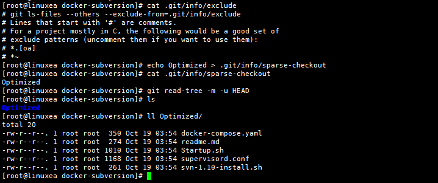

# 稀疏检出

单独检出单个目录

git在检出时，默认检出所有文件，那如果我只想稀疏的检出某一个目录该怎么办。
git是可以支持这种类似的需求方式，如下：
第一次克隆，不检出

```
[root@linuxea ~]# git clone --no-checkout  https://github.com/LinuxEA-Mark/docker-subversion.git
Cloning into 'docker-subversion'...
remote: Enumerating objects: 119, done.
remote: Total 119 (delta 0), reused 0 (delta 0), pack-reused 119
Receiving objects: 100% (119/119), 17.97 KiB | 0 bytes/s, done.
Resolving deltas: 100% (62/62), done.
[root@linuxea ~]# cd docker-subversion/
```
启用[稀疏的方式](https://git-scm.com/docs/git-read-tree#_sparse_checkout)
```
[root@linuxea docker-subversion]# git config core.sparsecheckout true
```
```
[root@linuxea docker-subversion]# ls .git/info/
exclude
[root@linuxea docker-subversion]# ls
```
接下来就需要将目录名称写入sparse-checkout文件
