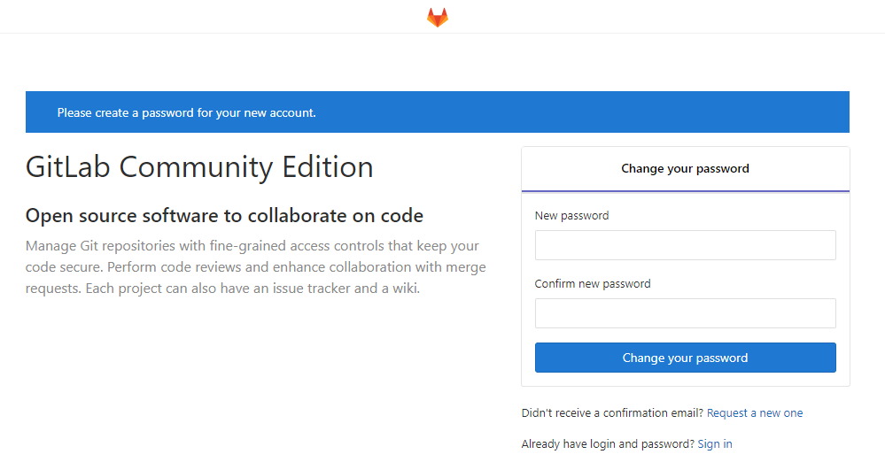
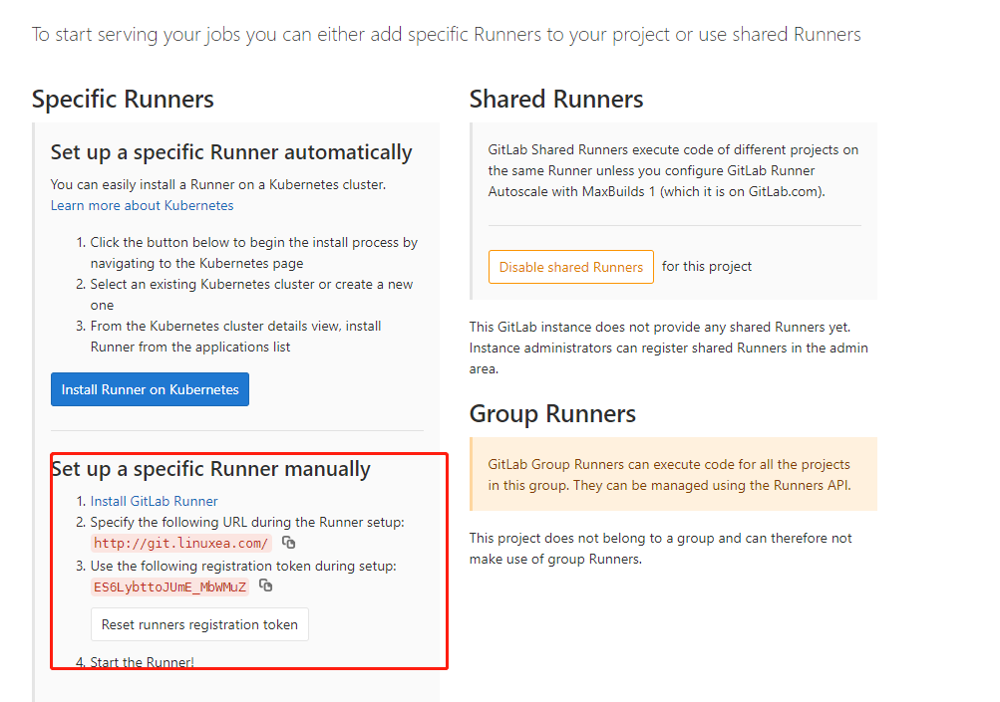
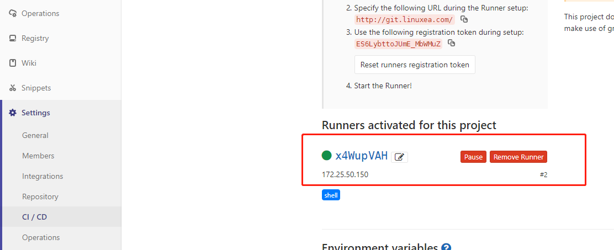

配置gitlab和gitlab-runner，我们来完成一个  gitlab-ci/cd的过程，在这个过程中， 使用了docker build镜像，那么有一些配置是需要修改的。于是我简单的记录了gitlab和gitlab-runner这个安装和配置的过程。


阅读此章节，你将了解gitlab和gitlab-runner的配置和安装，以及harbor私有仓库在.gitlab-ci.yml后续使用前的配置。

## install gitlab

```
yum install -y curl policycoreutils-python openssh-server
```

```
curl https://packages.gitlab.com/install/repositories/gitlab/gitlab-ee/script.rpm.sh | sudo bash
```

```
yum install -y gitlab-ce
```

```
It looks like GitLab has not been configured yet; skipping the upgrade script.

       *.                  *.
      ***                 ***
     *****               *****
    .******             *******
    ********            ********
   ,,,,,,,,,***********,,,,,,,,,
  ,,,,,,,,,,,*********,,,,,,,,,,,
  .,,,,,,,,,,,*******,,,,,,,,,,,,
      ,,,,,,,,,*****,,,,,,,,,.
         ,,,,,,,****,,,,,,
            .,,,***,,,,
                ,*,.
  


     _______ __  __          __
    / ____(_) /_/ /   ____ _/ /_
   / / __/ / __/ /   / __ `/ __ \
  / /_/ / / /_/ /___/ /_/ / /_/ /
  \____/_/\__/_____/\__,_/_.___/
  

Thank you for installing GitLab!
```

修改配置文件，便于docker推送registry     

```
external_url 'http://git.linuxea.com'
gitlab_rails['registry_enabled'] = true
gitlab_rails['registry_path'] = "/var/opt/gitlab/gitlab-rails/shared/registry"
gitlab_rails['registry_api_url'] = "http://registry.linuxea.com"
registry['enable'] = false
```

```
gitlab-ctl reconfigure
```
开始修改密码


## 配置gitlab-runner

[yum安装](https://docs.gitlab.com/runner/install/linux-repository.html#installing-the-runner)

```
$ curl -L https://packages.gitlab.com/install/repositories/runner/gitlab-runner/script.rpm.sh | sudo bash
$ yum install gitlab-runner
```
或者[下载二进制包](https://docs.gitlab.com/runner/install/linux-manually.html#help-and-feedback)

```
$ wget -O /usr/local/bin/gitlab-runner http://meftp.ds.com/gitlab-cicd/gitlab-runner-linux-amd64
$ chmod +x /usr/local/bin/gitlab-runner
$ sudo useradd --comment 'GitLab Runner' --create-home gitlab-runner --shell /bin/bash
$ gitlab-runner install --user=gitlab-runner --working-directory=/home/gitlab-runner
$ gitlab-runner start
```

或者使用[docker](<https://docs.gitlab.com/runner/register/index.html#docker>)

```
docker pull gitlab/gitlab-runner:alpine-v11.9.0
```

```
docker run --name gitlab-runner \
   -v /srv/gitlab-runner/config:/etc/gitlab-runner \
   -d gitlab/gitlab-runner:alpine-v11.9.0 
```

配置gitlab-runner使用shell作为执行在.docker-ci.yml命令的终端工具

- 这里的信息在项目中的settings->ci/cd->Runners中查看



```
gitlab-runner register \
  --non-interactive \
  --url "http://git.linuxea.com/" \
  --registration-token "ES6LybttoJUmE_MbWMuZ" \
  --executor "shell,docker" \
  --description "172.25.50.150-docker-shell" \
  --tag-list "shell" \
  --run-untagged=true \
  --locked="false"
```
或者使用[docker](<https://docs.gitlab.com/runner/register/index.html#docker>)

```
docker exec -it gitlab-runner gitlab-runner register
Runtime platform                                    arch=amd64 os=linux pid=28 revision=692ae235 version=11.9.0
Running in system-mode.                            
                                                   
Please enter the gitlab-ci coordinator URL (e.g. https://gitlab.com/):
http://git.linuxea.com/
Please enter the gitlab-ci token for this runner:
mWKTPccYDUNzcLW5Byem
Please enter the gitlab-ci description for this runner:
[051478b648e8]: 172.25.250.247
Please enter the gitlab-ci tags for this runner (comma separated):
docker_172.25.250.247_runner
Registering runner... succeeded                     runner=mWKTPccY
Please enter the executor: ssh, virtualbox, docker-ssh+machine, kubernetes, docker, docker-ssh, parallels, shell, docker+machine:
docker 
Please enter the default Docker image (e.g. ruby:2.1):
docker:dind
Runner registered successfully. Feel free to start it, but if it's running already the config should be automatically reloaded! 
```

```
concurrent = 1
check_interval = 0

[session_server]
  session_timeout = 1800

[[runners]]
  name = "172.25.250.247"
  url = "http://git.linuxea.com/"
  token = "NmYzEJvPYKXQQR8-ChAu"
  executor = "docker"
  [runners.docker]
    tls_verify = false
    image = "docker:dind"
    privileged = false
    disable_entrypoint_overwrite = false
    oom_kill_disable = false
    disable_cache = false
    volumes = ["/cache"]
    shm_size = 0
  [runners.cache]
    [runners.cache.s3]
    [runners.cache.gcs]
```

这两者的配置是不一样的，我这里使用的是shell,添加完成上线后就出现如下



- 我们需要注意的是，我们可能需要在配置中添加一个超级权限[privileged](https://docs.gitlab.com/runner/executors/docker.html#use-docker-in-docker-with-privileged-mode)，否则可能会报权限的问题，示例如下：

```
concurrent = 1
check_interval = 0

[session_server]
  session_timeout = 1800

[[runners]]
  name = "172.25.250.247"
  url = "http://git.linuxea.com/"
  token = "x4WupVAHeuwyyZ57nDPo"
  executor = "shell"
  privileged="true"
  [runners.cache]
    [runners.cache.s3]
    [runners.cache.gcs]
```

在实际使用的时候，如果出现权限不够，可如下尝试：

```
usermod -aG docker gitlab-runner
usermod -aG root gitlab-runner
```

## 延伸阅读

- [linuxea:gitlab-ci/cd runner配置和安装(一)](https://www.linuxea.com/1800.html)
- [linuxea:gitlab-ci的定时任务](https://www.linuxea.com/2323.html)
- [linuxea:docker仓库harbor-https的配置和使用](https://www.linuxea.com/2338.html)
- [linuxea:白话容器之Registry与Harbor的构建和使用 (26)](https://www.linuxea.com/2236.html)

## 阅读更多
- [devops](https://www.linuxea.com/tag/devops/)
- [gitlab](https://www.linuxea.com/tag/gitlab/)
- [jenkins](https://www.linuxea.com/tag/jenkins/)