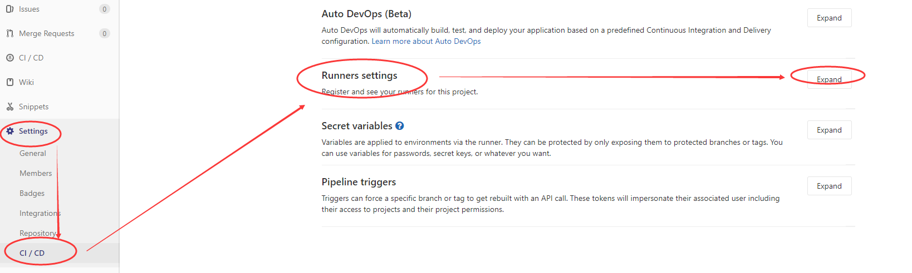
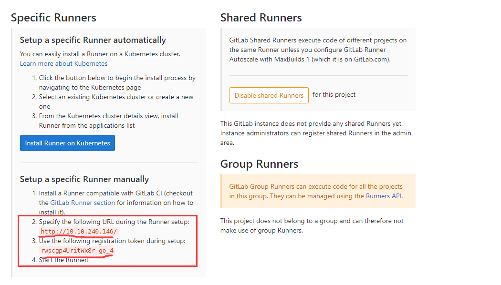
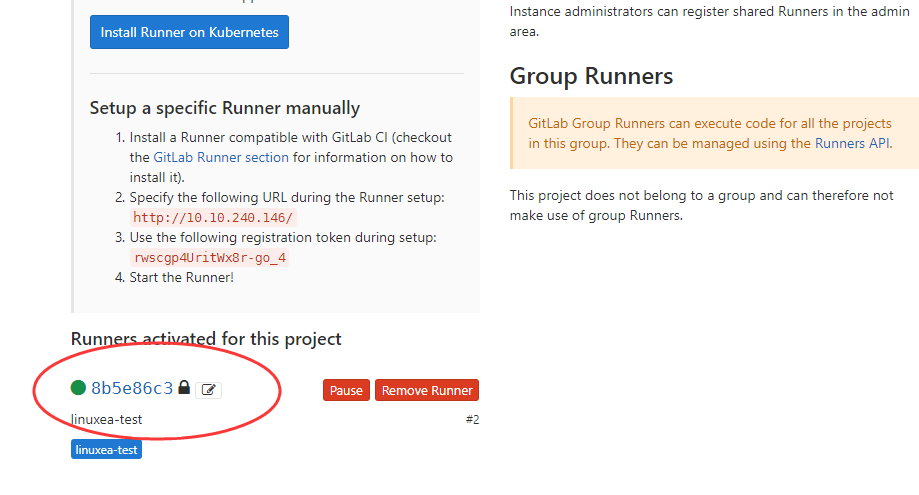

gitlab ee安装:
`https://about.gitlab.com/installation/#centos-7`
gitlab ce安装:
`wget --content-disposition https://packages.gitlab.com/gitlab/gitlab-ce/packages/el/7/gitlab-ce-10.8.4-ce.0.el7.x86_64.rpm/download.rpm`

## runner安装
```
https://docs.gitlab.com/runner/install/linux-manually.html
```
```
[marksugar@www.linuxea.com ~]$ wget -O /usr/local/bin/gitlab-runner https://gitlab-runner-downloads.s3.amazonaws.com/latest/binaries/gitlab-runner-linux-amd64
```
创建用户
```
[marksugar@www.linuxea.com ~]$ useradd --comment 'GitLab Runner' --create-home gitlab-runner --shell /bin/bash
[marksugar@www.linuxea.com ~]$ cd /usr/local/bin
```
开始安装
```
[marksugar@www.linuxea.com /usr/local/bin]$ ./gitlab-runner install --user=gitlab-runner --working-directory=/home/gitlab-runner
[marksugar@www.linuxea.com /usr/local/bin]$ gitlab-runner start
```
## 开始配置runners

1,在gitlab项目中左侧设置settings-->CI/CD-->Runners settings


我们使用的是指定的runner

2,开始在客户端配置(拉代码端)

### 开始注册

```
[marksugar@www.linuxea.com /usr/local/bin]$ gitlab-runner register
Running in system-mode.                            
                                          
Please enter the gitlab-ci coordinator URL (e.g. https://gitlab.com/):
请输入gitlab-ci的网址   
http://10.10.240.146

Please enter the gitlab-ci token for this runner:
请输入gitlab-ci runner的标记
rwscgp4UritWx8r-go_4

Please enter the gitlab-ci description for this runner:
请输入gitlab-ci runner说明
[DS-VM-Node_10_10_240_145.dwhd.org]: linuxea-test
Please enter the gitlab-ci tags for this runner (comma separated):
请输入gitlab-ci runner标签
linuxea-test        
Whether to run untagged builds [true/false]:
是否运行未标记的版本:
[false]: true
Whether to lock the Runner to current project 
[true/false]:
是否将runner锁定到当前项目：
[true]: true
Registering runner... succeeded   注册成功                runner=rwscgp4U
Please enter the executor: virtualbox, docker+machine, docker-ssh+machine, kubernetes, shell, ssh, parallels, docker, docker-ssh:
请输入执行程序:virtualbox, docker+machine, docker-ssh+machine, kubernetes, shell, ssh, parallels, docker, docker-ssh:
shell
Runner registered successfully. Feel free to start it, but if it's running already the config should be automatically reloaded! 
注册成功
[marksugar@www.linuxea.com /usr/local/bin]$ 
```

在返回gitlab已经激活成功

