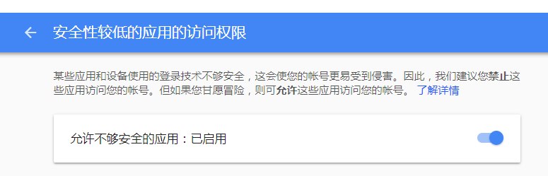
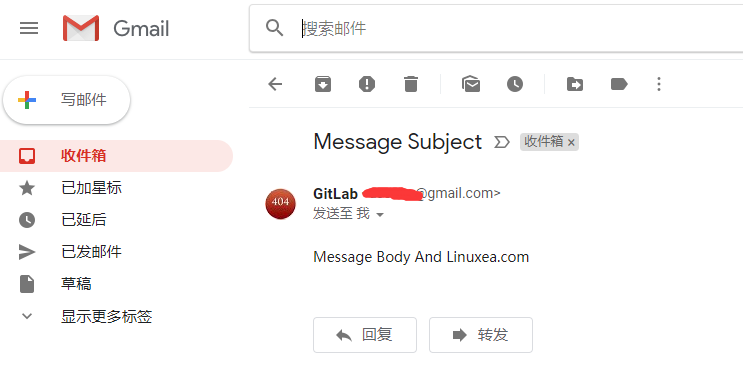
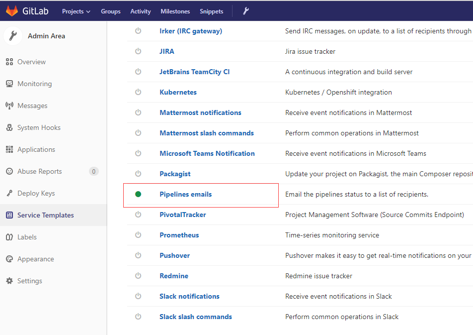
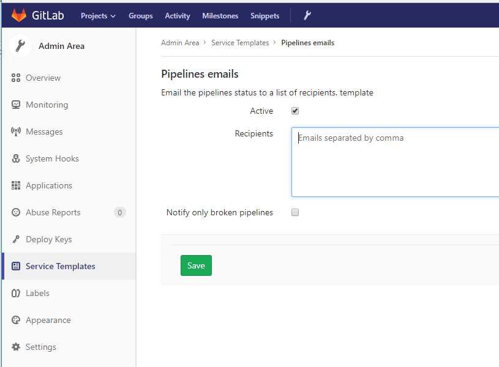
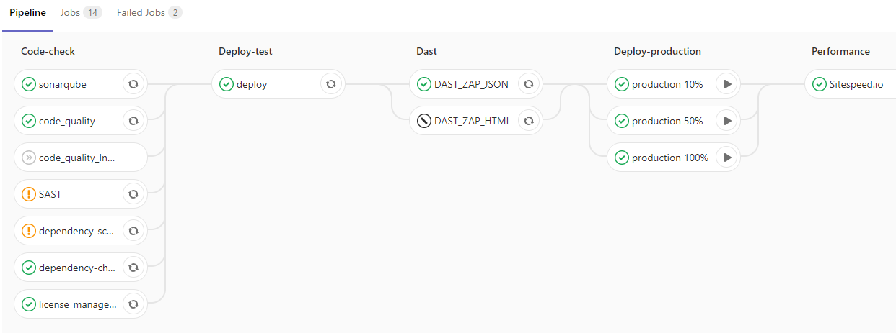
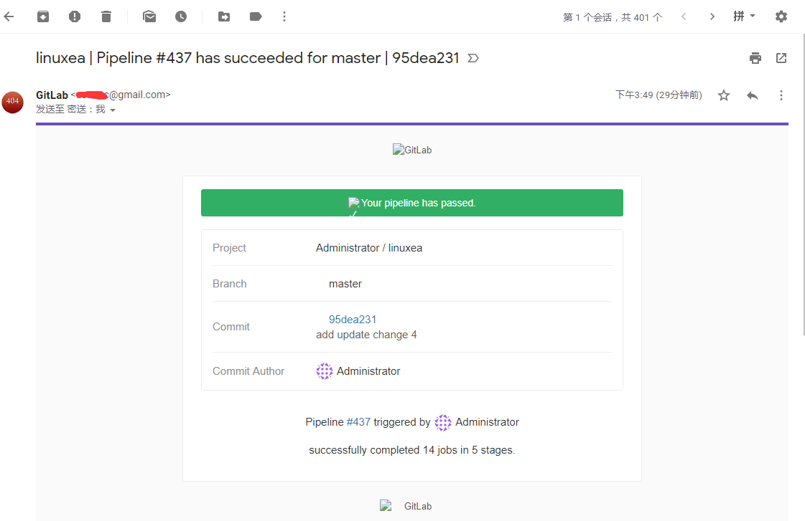

## configure email

如果希望通过SMTP服务器而不是通过Sendmail发送应用程序电子邮件，添加以下配置信息 `/etc/gitlab/gitlab.rb`并运行`gitlab-ctl reconfigure` 

### 本地主机上的SMTP 

这种简单地启用SMTP并使用默认设置的配置可用于在本地主机上运行的MTA，该主机不提供`sendmail`接口或提供`sendmail`与GitLab不兼容的接口，如Exim。

```
gitlab_rails['smtp_enable'] = true
```

### 没有SSL的SMTP 

默认情况下，SSL为SMTP启用。如果SMTP服务器不支持通过SSL进行通信，使用以下设置：

```
gitlab_rails['smtp_enable'] = true;
gitlab_rails['smtp_address'] = 'localhost';
gitlab_rails['smtp_port'] = 25;
gitlab_rails['smtp_domain'] = 'localhost';
gitlab_rails['smtp_tls'] = false;
gitlab_rails['smtp_openssl_verify_mode'] = 'none'
gitlab_rails['smtp_enable_starttls_auto'] = false
gitlab_rails['smtp_ssl'] = false
gitlab_rails['smtp_force_ssl'] = false
```

### Gmail

```
gitlab_rails['smtp_enable'] = true
gitlab_rails['smtp_address'] = "smtp.gmail.com"
gitlab_rails['smtp_port'] = 587
gitlab_rails['smtp_user_name'] = "my.email@gmail.com"
gitlab_rails['smtp_password'] = "my-gmail-password"
gitlab_rails['smtp_domain'] = "smtp.gmail.com"
gitlab_rails['smtp_authentication'] = "login"
gitlab_rails['smtp_enable_starttls_auto'] = true
gitlab_rails['smtp_tls'] = false
gitlab_rails['smtp_openssl_verify_mode'] = 'peer'
```

#### 访问权限打开

要用的话先启用较低应用的访问权限

#### config change

而后修改配置文件

```
[marksugar@www.linuxea.com ~]# cat /etc/gitlab/gitlab.rb |egrep  "^[^#]*gitlab_rails\['smtp_"
 gitlab_rails['smtp_enable'] = true
 gitlab_rails['smtp_address'] = "smtp.gmail.com"
 gitlab_rails['smtp_port'] = 587
 gitlab_rails['smtp_user_name'] = "userlinuxea@gmail.com"
 gitlab_rails['smtp_password'] = "password.gzc.ooo"
 gitlab_rails['smtp_domain'] = "smtp.gmail.com"
 gitlab_rails['smtp_authentication'] = "login"
 gitlab_rails['smtp_enable_starttls_auto'] = true
 gitlab_rails['smtp_tls'] = false
 gitlab_rails['smtp_openssl_verify_mode'] = 'peer'
```

重启
```
[marksugar@www.linuxea.com /etc/gitlab]# gitlab-ctl restart
ok: run: alertmanager: (pid 6301) 0s
ok: run: gitaly: (pid 6320) 1s
ok: run: gitlab-monitor: (pid 6333) 0s
ok: run: gitlab-workhorse: (pid 6349) 1s
ok: run: logrotate: (pid 6365) 0s
ok: run: nginx: (pid 6373) 0s
ok: run: node-exporter: (pid 6381) 1s
ok: run: postgres-exporter: (pid 6390) 0s
ok: run: postgresql: (pid 6400) 1s
ok: run: prometheus: (pid 6484) 0s
ok: run: redis: (pid 6496) 1s
ok: run: redis-exporter: (pid 6500) 0s
ok: run: sidekiq: (pid 6510) 0s
ok: run: unicorn: (pid 6522) 0s
```
#### Test Email

发送测试邮件
`Notify.test_email('userlinuxea@gmail.com', 'Message Subject', 'Message Body And Linuxea.com').deliver_now`

```
[marksugar@www.linuxea.com /etc/gitlab]# gitlab-rails console
-------------------------------------------------------------------------------------
 Gitlab:       10.8.4 (2268d0c)
 Gitlab Shell: 7.1.2
 postgresql:   9.6.8
-------------------------------------------------------------------------------------
Loading production environment (Rails 4.2.10)
irb(main):001:0>
irb(main):004:0> Notify.test_email('userlinuxea@gmail.com', 'Message Subject', 'Message Body And Linuxea.com').deliver_now

Notify#test_email: processed outbound mail in 1.1ms

Sent mail to userlinuxea@gmail.com (3516.5ms)
Date: Tue, 03 Jul 2018 14:02:28 +0800
From: GitLab <gitlab@10.10.240.146>
Reply-To: GitLab <noreply@10.10.240.146>
To: usertzc@gmail.com
Message-ID: <5b3b1174199c3_19b23f9c467db1184948@DS-VM-Node146.cluster.com.mail>
Subject: Message Subject
Mime-Version: 1.0
Content-Type: text/html;
 charset=UTF-8
Content-Transfer-Encoding: 7bit
Auto-Submitted: auto-generated
X-Auto-Response-Suppress: All

<!DOCTYPE html PUBLIC "-//W3C//DTD HTML 4.0 Transitional//EN" "http://www.w3.org/TR/REC-html40/loose.dtd">
<html><body><p>Message Body</p></body></html>

=> #<Mail::Message:69940213947220, Multipart: false, Headers: <Date: Tue, 03 Jul 2018 14:02:28 +0800>, <From: GitLab <gitlab@10.10.240.146>>, <Reply-To: GitLab <noreply@10.10.240.146>>, <To: userlinuxea@gmail.com>, <Message-ID: <5b3b1174199c3_19b23f9c467db1184948@DS-VM-Node146.cluster.com.mail>>, <Subject: Message Subject>, <Mime-Version: 1.0>, <Content-Type: text/html; charset=UTF-8>, <Content-Transfer-Encoding: 7bit>, <Auto-Submitted: auto-generated>, <X-Auto-Response-Suppress: All>>
```

登陆查看



#### pipeline email设置

Admin area(小板手) ---> service templates---> pipelines emails



而后添加邮件



在运行一次



运行完成，就能收到邮件



### 腾讯企业邮箱（QQ exmail） 

```
gitlab_rails['smtp_enable'] = true
gitlab_rails['smtp_address'] = "smtp.exmail.qq.com"
gitlab_rails['smtp_port'] = 465
gitlab_rails['smtp_user_name'] = "xxxx@xx.com"
gitlab_rails['smtp_password'] = "password"
gitlab_rails['smtp_authentication'] = "login"
gitlab_rails['smtp_enable_starttls_auto'] = true
gitlab_rails['smtp_tls'] = true
gitlab_rails['gitlab_email_from'] = 'xxxx@xx.com'
gitlab_rails['smtp_domain'] = "exmail.qq.com"
```

参考：

```
https://docs.gitlab.com/omnibus/settings/smtp.html#more-examples-are-welcome
```

