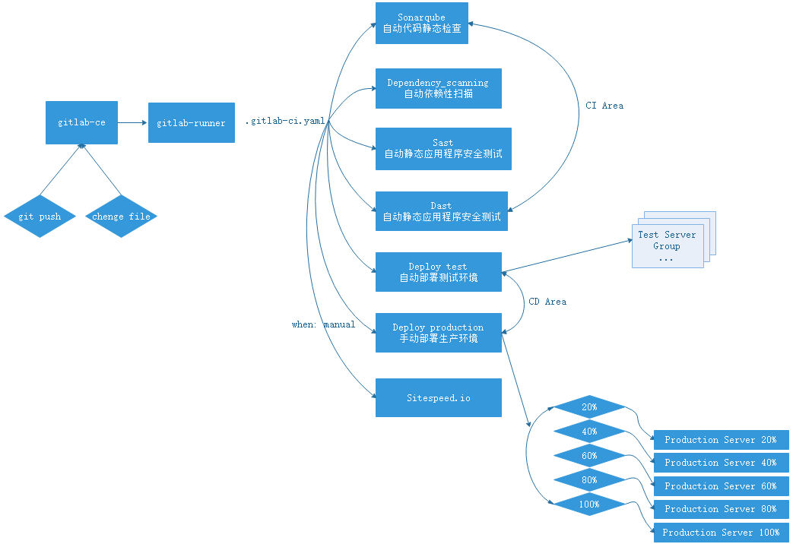

## 拓扑

我们假设先将它分为四部分

- code-check
- deploy-test
- dast
- deploy-production
- performance
  并且对静态检测，测试部署，动态检测，生产部署，performance，的前三项做了简单粗糙的配置，其中使用了sonarqube，code_quality，sast(Static Application Security Testing)，dependency-scanning，DAST(zaproxy)，Sitespeed.io集成
  它可能是这样的



## YAML

文件如下:

```
stages:
  - code-check
  - deploy-test
  - dast
  - deploy-production
  - performance
# 变量
variables:
  WWWDIR: "/data/wwwroot"
  ANSIBLEGROUP: "linuxea"
  LANG: "en_US.UTF-8"
  VERSION: "1.11"
  SONAR_URL: "http://10.0.1.61:9000"
  SONAR_KN: "sonar-linuxea"
  SONAR_CFG: "sonar-scanner -Dsonar.host.url=$SONAR_URL -Dsonar.projectKey=$SONAR_KN -Dsonar.projectName=$SONAR_KN -Dsonar.projectBaseDir=/root/src -Dsonar.sources=./ -Dsonar.java.binaries=./"
  website: "http://zabbix.dtops.cc"
# 所有 stage 之前的操作
before_script:
  - echo "start now!"
  - export LANG=en_US.UTF-8
  - export LANGUAGE=en_US:en
  - export LC_ALL=en_US.UTF-8 
  - sudo chown -R gitlab-runner.gitlab-runner ${PWD} || true
# &job_docker_group
.code_check_Static: &job_docker_group
  stage: code-check
  image: docker:stable
  variables:
    DOCKER_DRIVER: overlay2
    PATHD: /home/gitlab-runner/Increment/
  allow_failure: true
  services:
    - docker:stable-dind 
# &zap_docker_group
.zap_check: &zap_docker_group
  stage: dast
  image: registry.gitlab.com/gitlab-org/security-products/zaproxy
  variables:
    login_url: "https://example.com/sign-in"
    john_name: "USERNAME"
    john_pwd: "PASSWORD"
  allow_failure: true   
  services:
    - docker:stable-dind   
.performance: &performance
  stage: performance
  image: docker:git
  variables:
    URL: $website
  services:
    - docker:stable-dind   
# 增量生产部署    
.production: &production   
  stage: deploy-production
  environment:
    name: production
    url: https://www.linuxea.com
  only:
    - master      
# sonarqube代码质量检查
1/8 sonarqube:
  stage: code-check
  script: 
    - docker run --rm
      --volume  $(pwd):/root/src 
      --volume /etc/localtime:/etc/localtime:ro
      --volume /var/run/docker.sock:/var/run/docker.sock
      "newtmitch/sonar-scanner" $SONAR_CFG  || true
    - sudo chown -R gitlab-runner.gitlab-runner ${PWD}
    - date
  artifacts:
    paths: [sonarqube.json]
# 代码全量静态质量检查
2/8 code_quality:
  <<: *job_docker_group
  script:
    - if [ `docker ps -a|egrep "codeclimate|gitlab"|wc -l` -gt 0 ];then  docker ps -a|docker rm -f $(egrep "gitlab|codeclimate"|awk -F' ' 'END{print $NF}'); else echo "Nothing Codeclimate Runing"; fi
    - export SP_VERSION=$(echo "$CI_SERVER_VERSION" | sed 's/^\([0-9]*\)\.\([0-9]*\).*/\1-\2-stable/')
    - docker run --rm
        --env SOURCE_CODE="$PWD"
        --volume "$PWD":/code
        --volume /var/run/docker.sock:/var/run/docker.sock
        --volume /etc/localtime:/etc/localtime:ro
        "registry.gitlab.com/gitlab-org/security-products/codequality:$SP_VERSION" /code
    - date
  artifacts:
    paths: [codeclimate.json]
# 代码增量静态质量检查    
2/8 code_quality_Increment:
  <<: *job_docker_group
  script:
    - if [ `docker ps -a|egrep "codeclimate|gitlab"|wc -l` -gt 0 ];then  docker ps -a|docker rm -f $(egrep "gitlab|codeclimate"|awk -F' ' 'END{print $NF}'); else echo "Nothing Codeclimate Runing"; fi
    - export VERSION_PATH=$(echo "$CI_REPOSITORY_URL"|awk -F'/' '{print $NF}')
    - export PATH_LAST=$PATHD$VERSION_PATH
    - if [ -d $PATH_LAST ];then echo "$PATH_LAST is runing"; else mkdir $PATH_LAST -p; fi
    - git archive -o $PWD/version-$(git rev-parse HEAD)-latest.tar.gz $(git rev-parse HEAD) $(git diff --name-only HEAD HEAD~1)
    - tar xf version-$(git rev-parse HEAD)-latest.tar.gz -C $PATH_LAST
    - export SP_VERSION=$(echo "$CI_SERVER_VERSION" | sed 's/^\([0-9]*\)\.\([0-9]*\).*/\1-\2-stable/')
    - docker run --rm
        --env SOURCE_CODE="$PATH_LAST"
        --volume $PATH_LAST:/code
        --volume /etc/localtime:/etc/localtime:ro
        --volume /var/run/docker.sock:/var/run/docker.sock
        "registry.gitlab.com/gitlab-org/security-products/codequality:$SP_VERSION" /code  
    - date
  artifacts:
    paths: [codeclimate.json]
  when: on_failure
# 静态代码安全扫描    
# Static Application Security Testing
3/8 SAST:
  <<: *job_docker_group    
  script:
    - export SP_VERSION=$(echo "$CI_SERVER_VERSION" | sed 's/^\([0-9]*\)\.\([0-9]*\).*/\1-\2-stable/')
    - docker run --rm
       --env SAST_CONFIDENCE_LEVEL="${SAST_CONFIDENCE_LEVEL:-3}"
       --volume "$PWD":/code
       --volume /etc/localtime:/etc/localtime:ro
       --volume /var/run/docker.sock:/var/run/docker.sock
       "registry.gitlab.com/gitlab-org/security-products/sast:${SP_VERSION}" /app/bin/run /code
    - date
  artifacts:
    paths: [gl-sast-report.json]    
# 依赖扫描    
4/8 dependency-scanning:
  <<: *job_docker_group
  script:
    - export SP_VERSION=$(echo "$CI_SERVER_VERSION" | sed 's/^\([0-9]*\)\.\([0-9]*\).*/\1-\2-stable/')
    - docker run --rm
        --env DEP_SCAN_DISABLE_REMOTE_CHECKS="${DEP_SCAN_DISABLE_REMOTE_CHECKS:-false}"
        --volume "$PWD:/code"
        --volume /etc/localtime:/etc/localtime:ro
        --volume /var/run/docker.sock:/var/run/docker.sock
        "registry.gitlab.com/gitlab-org/security-products/dependency-scanning:$SP_VERSION" /code
    - date
  artifacts:
    paths: [gl-dependency-scanning-report.json]    
  except:
    variables:
      - $CONTAINER_SCANNING_DISABLE
    
5/8 license_management:
  <<: *job_docker_group
  script:
    - if [ `docker ps -a|egrep "dependency-scanning"|wc -l` -gt 0 ];then  docker ps -a|docker rm -f $(egrep "dependency-scanning"|awk -F' ' 'END{print $NF}'); else echo "Nothing dependency-scanning Runing"; fi
    - export LICENSE_MANAGEMENT_VERSION=$(echo "$CI_SERVER_VERSION" | sed 's/^\([0-9]*\)\.\([0-9]*\).*/\1-\2-stable/')
    - docker run --rm
        --volume /etc/localtime:/etc/localtime:ro    
        --volume "$PWD:/code"
        "registry.gitlab.com/gitlab-org/security-products/license-management:latest" analyze /code 
#        "registry.gitlab.com/gitlab-org/security-products/license-management:$LICENSE_MANAGEMENT_VERSION" analyze /code        
    - date
  artifacts:
    paths: [gl-license-management-report.json]  
  except:
    variables:
      - $CONTAINER_SCANNING_DISABLE
    

# 安全测试
# Dynamic Application Security Testing
1/2 DAST_ZAP_JSON:
  <<: *zap_docker_group 
  script:
    - if [ `docker ps -a|egrep "owasp"|wc -l` -gt 0 ];then  echo "this $(docker ps -a|awk '/owasp/{print $2}') been deleted" && docker ps -a|docker rm -f $(egrep "owasp"|awk -F' ' 'END{print $NF}'); else echo "Nothing owasp/.... Runing"; fi    
    - docker run --rm
      --volume /etc/localtime:/etc/localtime:ro    
      --volume $PWD:/zap/wrk/:rw -t "registry.gitlab.com/gitlab-org/security-products/zaproxy" zap-baseline.py -t $website -g gen.conf -J gl-dast-report.json || true    
    - date      
  dependencies:
    -  deploy
  artifacts:
    paths: [gl-dast-report.json]   
#      --volume $PWD:/zap/wrk/:rw -t "owasp/zap2docker-weekly" zap-baseline.py -t $website -g gen.conf -J gl-dast-report.json || true   
2/2 DAST_ZAP_HTML:
  <<: *zap_docker_group
  script:   
    - if [ `docker ps -a|egrep "owasp"|wc -l` -gt 0 ];then  echo "this $(docker ps -a|awk '/owasp/{print $2}') been deleted" && docker ps -a|docker rm -f $(egrep "owasp"|awk -F' ' 'END{print $NF}'); else echo "Nothing owasp/.... Runing"; fi   
    - docker run --rm
     --volume /etc/localtime:/etc/localtime:ro    
     --volume $PWD:/zap/wrk/:rw -t "registry.gitlab.com/gitlab-org/security-products/zaproxy" zap-baseline.py -t $website -g gen.conf -r testreport.html  || true     
    - date     
  artifacts:
    paths: [testreport.html]     
#     --volume $PWD:/zap/wrk/:rw -t "owasp/zap2docker-weekly" zap-baseline.py -t $website -g gen.conf -r testreport.html  || true    
#    - docker run
#      --volume $PWD:/zap/wrk/    
#      --volume /etc/localtime:/etc/localtime:ro     
#      "owasp/zap2docker-stable" zap-baseline.py -t $website -g gen.conf -r testreport.html      
#部署 
deploy:
  stage: deploy-test
  environment:
    name: staging
    url: https://staging.example.com  
  only:
    - master 
  script:
    - ansible ${ANSIBLEGROUP} -m shell -a "[ -d ${WWWDIR} ]||mkdir ${WWWDIR} -p"
    - ansible ${ANSIBLEGROUP} -m synchronize -a 'src=./ dest=${WWWDIR}/ rsync_opts=--delete,--exclude=*.json,--exclude=*.yml,--exclude=*.git'
    #- ansible ${ANSIBLEGROUP} -m shell -a "chown -R 400.400 /data/wwwroot/"
  when: always  

production 10%:
  <<: *production    
  script: echo "deploy-production"
  when: manual
  allow_failure: false    
production 50%:
  <<: *production   
  script: echo "deploy-production"
  when: manual
  allow_failure: false  

production 100%:
  <<: *production 
  script: echo "deploy-production"
  when: manual
  allow_failure: false    

Sitespeed.io:
  <<: *performance
  script:
    - mkdir gitlab-exporter
    - wget -O ./gitlab-exporter/index.js https://gitlab.com/gitlab-org/gl-performance/raw/master/index.js
    - mkdir sitespeed-results
    - docker run --shm-size=1g --rm -v "$(pwd)":/sitespeed.io sitespeedio/sitespeed.io:7.1.3 --plugins.add ./gitlab-exporter --outputFolder sitespeed-results $website || true
    - cp sitespeed-results/data/performance.json $PWD/performance.json
    - sudo chown -R gitlab-runner.gitlab-runner $PWD
  artifacts:
    paths:
    - performance.json
    - sitespeed-results/ 
  when: always    
```

