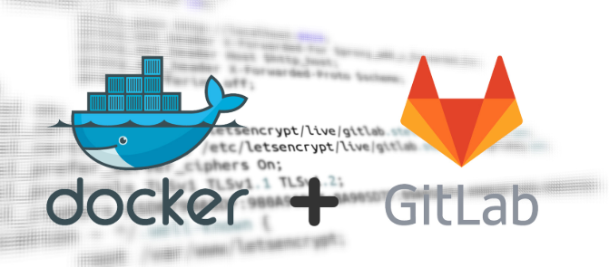
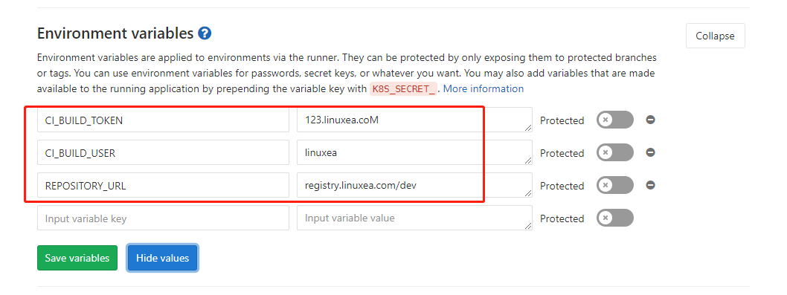
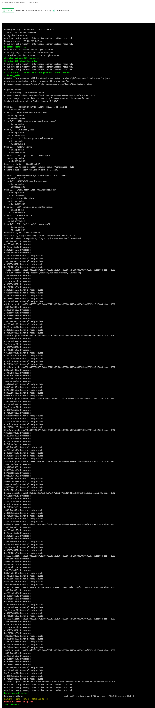
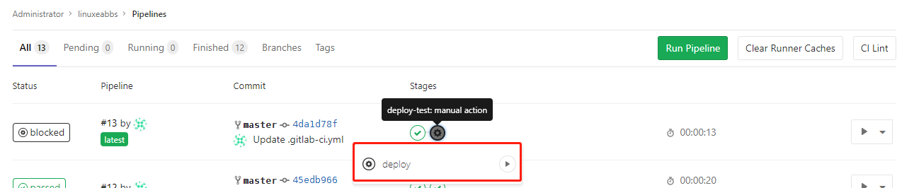
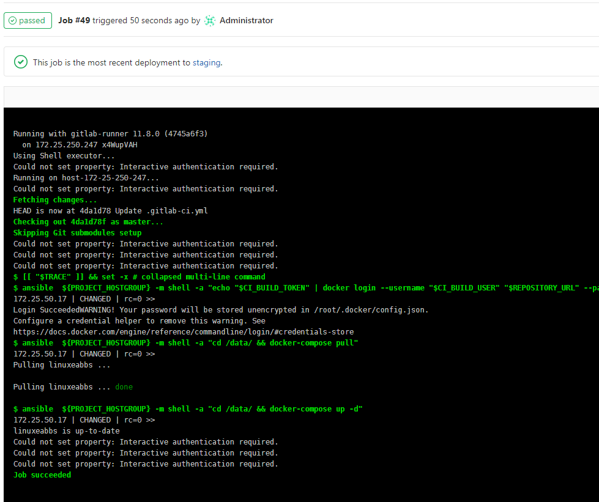
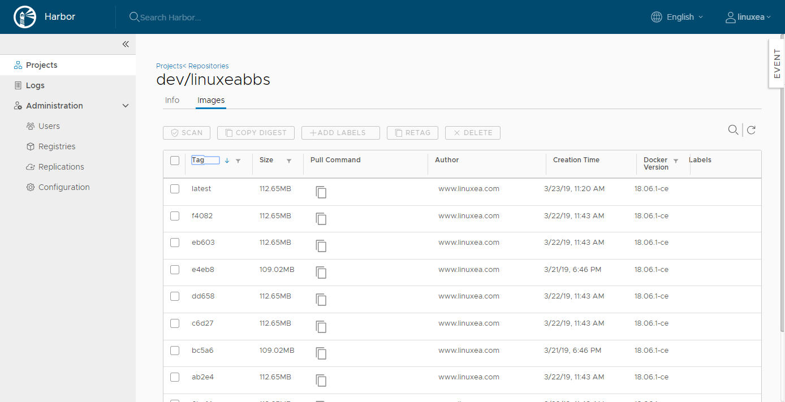

此前发布了一些关于[gitlab](https://www.linuxea.com/tag/gitlab/)和[jenkins](https://www.linuxea.com/tag/jenkins/)的文章，主要围绕简单的发布更新，但没有涉及到docker环节，此篇将会简单的介绍如何通过gitlab-ci来做一次docker的打包和发布。

阅读此章节，你将了解如何使用gitlab-ci进行docker打包镜像，以及周边的依赖使用。

如果你不了解gitlab和gitlab-runner的使用，请查看此前的[gitlab和gitlab-runner的配置安装部分](https://www.linuxea.com/2344.html)

- 简述

我们先准备一个非常简单的代码，而后通过gitlab-ci使用docker build镜像，而后push到仓库中，在使用ansible命令到node节点来拉取镜像，完成一个非常简单的发布更新。这里需要注意的是gitlab和私有仓库的验证问题，可以参考[linuxea:gitlab和gitlab-runner与harbor的配置安装](<https://www.linuxea.com/2344.html#install_gitlab>)的配置部分，大致可能是这样：

```
external_url 'http://git.linuxea.com'
gitlab_rails['registry_enabled'] = true
gitlab_rails['registry_path'] = "/var/opt/gitlab/gitlab-rails/shared/registry"
gitlab_rails['registry_api_url'] = "http://registry.linuxea.com"
registry['enable'] = false
```

尽管这只是一个简单的测试，但仍然可以通过这个过程来了解一次构建，或者说使用gitlab-ci构建发生的事情和部分细节。我将会在后续的文章中继续更新关于从docker镜像出发的问题上在做几个ci的处理，比如：镜像质量。

## 代码

准备一个go文件测试

```
package main

import (
	"fmt"
	"net/http"
)

func Hello(w http.ResponseWriter,r *http.Request)  {
	fmt.Println("helo www.linuxea.com")
	fmt.Fprint(w,"20190303 www.linuxea.com")
}
func login(w http.ResponseWriter,r *http.Request)  {
	fmt.Println("login")
	fmt.Fprint(w,"login")
}
func main()  {
	http.HandleFunc("/",Hello)
	http.HandleFunc("/user/login",login)
	err := http.ListenAndServe("0.0.0.0:8080",nil)
	if err != nil {
		fmt.Println("http listen failed")
	}
}

```

- Dockerfile

dockerfile的作用将go文件复制到容器内启动即可

```
FROM marksugar/go:alpine-go1.11.5 as linuxea
MAINTAINER www.linuxea.com
LABEL maintainer="www.linuxea.com"
RUN mkdir /data
COPY linuxea.go /data/linuxea.go
COPY . /data/
WORKDIR /data
CMD ["go","run","linuxea.go"]
```
尽管这里使用的是COPY了一个文件，为了区分dockerignore的效果，我COPY .到/data下。我想我们在实际使用中仍然有必要使用[.dockerignore](https://www.linuxea.com/2297.html)来忽略一些文件，如下

```
.git
**/*.log
**/*-log-*
**/*.tar.gz
**/*.war
jenkins_home/*.txt
Dockerfile
.dockerignore
*.md
!info.md
LICENSE
CHANGELOG
.gitlab-ci.yml
```

## Registry

我们需要一个仓库来存放构建好的镜像，我这里使用的是Harbor，我在harbor创建另一个用户，而后在gitlab中设置，现在先测试一下登陆

```
[root@linuxea.com_10_10_240_145 ~/linuxeabbs]$ echo "123.linuxea.coM" | docker login --username linuxea registry.linuxea.com --password-stdin
WARNING! Your password will be stored unencrypted in /root/.docker/config.json.
Configure a credential helper to remove this warning. See
https://docs.docker.com/engine/reference/commandline/login/#credentials-store

Login Succeeded
```

Harbor**的构建和使用参考此前的**[linuxea:白话容器之Registry与Harbor的构建和使用 (26)](https://www.linuxea.com/2236.html)

## gitlab

我至少要设置三个变量在gitlab的ci构建中，分别是：

- CI_BUILD_TOKEN
- CI_BUILD_USER
- REPOSITORY_URL

这三个变量分别扮演用户，密码，Registry地址，如下：



这些变量在上面的registry中提到过，是在harbor中创建好的用户，以及仓库/dev也是我提前创建好的。此后我在.gitlab-ci.yml中调用

### gitlab-ci

在整个gitlab-ci中，只是做了两个阶段，分别是build镜像，推送到仓库，而后到节点上进行配置一个anisble，而后调用ansible pull镜像。

- 准备ansible

```
[linuxea-bbs]
172.25.50.17 ansible_ssh_user=root ansible_ssh_port=22992 ansible_ssh_pass=dtops.cc
```

我编写了简单的方式来实现这个构建和发布的过程，借用了docker-compose，在stages中分为两个阶段 ：build和deploy-test。这样用的好处是，在build中可以有多个阶段树，当build执行完成后，到了deploy-test会通过手动点击完成更新。如下：

```
stages:
  - build
  - deploy-test
# 变量
variables:
  LANG: "en_US.UTF-8"
  PROJECT_HOSTGROUP: "linuxea-bbs"
before_script:
  - echo "start now!"
  - export LANG=en_US.UTF-8
  - export LANGUAGE=en_US:en
  - export LC_ALL=en_US.UTF-8 
.base_init: &bash_init
  stage: build
  allow_failure: true
# build镜像	
1/3 docker_build:
  <<: *bash_init
  script:
    - docker_build
  artifacts:
    name: "$CI_JOB_STAGE-$CI_COMMIT_REF_NAME"    
    paths: [build.json]
2/3 image_check:
  <<: *bash_init
  script:
    - image_check
deploy:
  stage: deploy-test
  environment:
    name: staging
    url: http://172.25.50.17:8080 
  only:
    - master 
  script:
    #- ansible ${PROJECT_HOSTGROUP} -m shell -a "[ -d ${WWWDIR} ]||mkdir ${WWWDIR} -p"
    #- ansible ${PROJECT_HOSTGROUP} -m synchronize -a 'src=./ dest=${WWWDIR}/ rsync_opts=--delete,--exclude=*.json,--exclude=*.yml,--exclude=*.git'
    #- ansible ${ANSIBLEGROUP} -m shell -a "chown -R 400.400 /data/wwwroot/"
    - ansible  ${PROJECT_HOSTGROUP} -m shell -a "echo "$CI_BUILD_TOKEN" | docker login --username "$CI_BUILD_USER" "$REPOSITORY_URL" --password-stdin"
    - ansible  ${PROJECT_HOSTGROUP} -m shell -a "cd /data/ && docker-compose pull"
    - ansible  ${PROJECT_HOSTGROUP} -m shell -a "cd /data/ && docker-compose up -d"
  when: manual    
  allow_failure: false    
#-----------------------Auto_Devops-----------------------------  
.auto_devops: &auto_devops |  
  [[ "$TRACE" ]] && set -x
  
  function docker_build() {
  
    echo "$CI_BUILD_TOKEN" | docker login --username $CI_BUILD_USER $REPOSITORY_URL --password-stdin
    # docker login -u $CI_BUILD_USER -p $CI_BUILD_TOKEN $REPOSITORY_URL
    
    export PROJECT_NAME=$(echo "$CI_PROJECT_PATH_SLUG" |awk -F- '{print $2}')
    export PROJECT_TAG=$(echo "$CI_COMMIT_SHA" |cut -c 1-5)
    export IMAGE_TAG="$REPOSITORY_URL"/"$PROJECT_NAME":"$PROJECT_TAG"
    export IMAGE_TAG_LATEST="$REPOSITORY_URL"/"$PROJECT_NAME"
    export CONTAINER_IMAGE="$REPOSITORY_URL"/"$PROJECT_NAME"
    docker pull "$CONTAINER_IMAGE":latest || true
    docker build -t "$IMAGE_TAG" .
    docker build -t "$IMAGE_TAG_LATEST" .
    docker push "$IMAGE_TAG"
    docker push "$IMAGE_TAG_LATEST"
  }
  function image_check() {
    echo "image_check"
  }
before_script:
  #- echo "$CI_BUILD_TOKEN" | docker login --username $CI_BUILD_USER $REPOSITORY_URL --password-stdin
  - *auto_devops 
```

- 重要说明

如上所示，其中我使用版本号码的前五位数作为每次更新的镜像标签，并且每次会build两个镜像，分别是带标签的镜像和最新的镜像，这样的好处在于，每次更新只需要重新拉取即可。而回滚则指定镜像标签即可。命令摘取出来如下：

- CI_PROJECT_PATH_SLUG：获取项目名称
- PROJECT_TAG：获取版本号
- IMAGE_TAG：组合变量

```
    export PROJECT_NAME=$(echo "$CI_PROJECT_PATH_SLUG" |awk -F- '{print $2}')
    export PROJECT_TAG=$(echo "$CI_COMMIT_SHA" |cut -c 1-5)
    export IMAGE_TAG="$REPOSITORY_URL"/"$PROJECT_NAME":"$PROJECT_TAG"
    export IMAGE_TAG_LATEST="$REPOSITORY_URL"/"$PROJECT_NAME"
    export CONTAINER_IMAGE="$REPOSITORY_URL"/"$PROJECT_NAME"
    docker pull "$CONTAINER_IMAGE":latest || true
    docker build -t "$IMAGE_TAG" .
    docker build -t "$IMAGE_TAG_LATEST" .
    docker push "$IMAGE_TAG"
    docker push "$IMAGE_TAG_LATEST"
```

一旦代码发生变动就会执行gitlab-ci.yml的代码。

- build image



开始部署




点击开始执行ansible



一旦完成后，镜像仓库中就会有很多版本号的镜像，并且有一个latest，而且在这个在每次更新的时候都保持不变



在实际使用的时候，如果出现权限不够，可如下尝试：

```
usermod -aG docker gitlab-runner
usermod -aG root gitlab-runner
```

- 提示

为了确保能够拉取到镜像，你需要配置daemon.json 

```
[root@etcd2 ~]# cat /etc/docker/daemon.json 
{
  "insecure-registries": ["registry.linuxea.com"]
}
```

另外，你可能还需要配置这些私有的域名解析 。如果你有疑问，你可以留言或者加入我们的QQ讨论群

## 延伸阅读

- [linuxea:gitlab-ci/cd runner配置和安装(一)](https://www.linuxea.com/1800.html)
- [linuxea:gitlab-ci的定时任务](https://www.linuxea.com/2323.html)
- [linuxea:docker仓库harbor-https的配置和使用](https://www.linuxea.com/2338.html)
- [linuxea:白话容器之Registry与Harbor的构建和使用 (26)](https://www.linuxea.com/2236.html)
- [linuxea:Docker多阶段构建与- target和--cache-from](https://www.linuxea.com/2314.html)

## 阅读更多
- [devops](https://www.linuxea.com/tag/devops/)
- [gitlab](https://www.linuxea.com/tag/gitlab/)
- [jenkins](https://www.linuxea.com/tag/jenkins/)