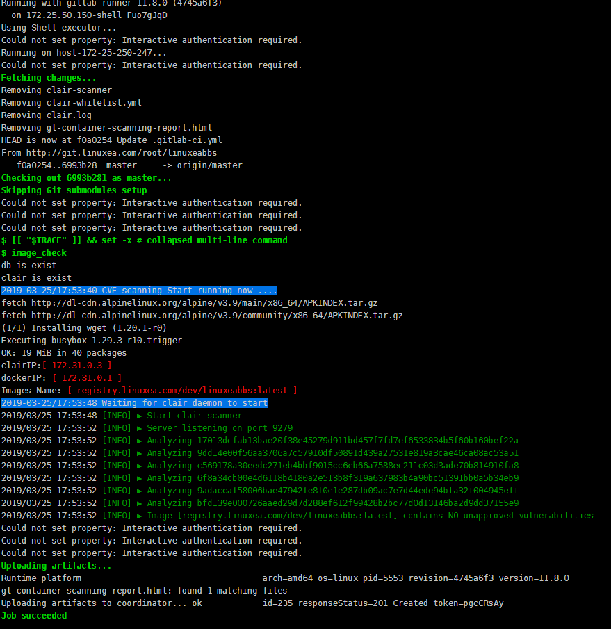

一个镜像被build完成后，并不一定就是符合预期的，这往往取决于编写Dockerfile的用户的水平。尽管我们可以安排很多规则，使用很多制度去规避这些风险，但是总有一些事情发生超乎我的预料之外。为此，我们需要一些检测 镜像是否符合预期的手段。

Docker镜像包含一个应用程序及其所有依赖项。由于它还包含操作系统的众多二进制文件和库，因此确保其根文件系统中不存在任何漏洞或至少不存在任何关键或主要漏洞非常重要。扫描CI / CD管道中的镜像可以降低这种安全风险。

在[前一篇文章](https://www.linuxea.com/2350.html)中，我简单的介绍了如何使用gitlab在一个非常简单的go项目上设置CI / CD管道。

管道中定义了了两个阶段：

- build 镜像
- 部署

> 事实上 ，我们可以在build镜像之前，做静态的代码分析

在此过程中构建的docker镜像基于我此前 制作的镜像，但是这是一个无验证其内部的，我们需要做一些改善。
阅读本章节，你将了解在CI中对镜像做一些简单的漏洞检测，在此后的文章中还继续会有此类的应用出现在CI中。

## 添加镜像扫描到管道

有几种镜像扫描解决方案，商业和开源。在本文中，我们将使用[Clair](https://github.com/coreos/clair)和[clair-scanner](https://github.com/arminc/clair-scanner)，2个开源工具。

GitLab的以下文档提供了添加专用于镜像扫描的附加阶段的所有说明，[https：//docs.gitlab.com/ce/ci/examples/container_scanning.html](https://docs.gitlab.com/ce/ci/examples/container_scanning.html)，它基本上运行Clair服务器，提供现有的CVE，然后二进制文件->clair-scanner检查镜像构建的每一层。

上述链接中的管道语法是基于Docker的，经过尝试，发现并不适用于当下我的shell环境，于是我做了简单的修改。那现在的这个函数风格就成了这样：

```
  function image_check() {
    export PROJECT_NAME=$(echo "$CI_PROJECT_PATH_SLUG" |awk -F- '{print $2}')
    export CLAIRR=$(docker inspect --format={{.NetworkSettings.IPAddress}} clair)
    export DINDIRR=$(ip addr show docker0|awk 'NR==3{split($2,a,"/"); print a[1]}')
    export IMAGE_TAG_LATEST="$REPOSITORY_URL"/"$PROJECT_NAME":latest
    if [ `docker ps -a|awk '{print $NF}'|egrep "db"|wc -l` == 1 ];then echo "db is exist"; else docker run -d --name db arminc/clair-db:latest; fi
    if [ `docker ps -a|awk '{print $NF}'|egrep "clair"|wc -l` == 1 ];then echo "clair is exist"; else docker run -p 6060:6060 --link db:postgres -d --name clair --restart on-failure arminc/clair-local-scan:v2.0.7; fi
    echo -e "\033[44;37m`date +%F/%T` CVE scanning Start running now ....\033[0m"  
    docker run --name docker-dind -i --rm -v /var/run/docker.sock:/var/run/docker.sock docker:stable-dind  apk add wget ca-certificates \
      && wget -qO ./clair-scanner https://github.com/arminc/clair-scanner/releases/download/v8/clair-scanner_linux_amd64 \
      && chmod +x ./clair-scanner \
      && echo -e "clairIP:\033[31m\033[01m[ $CLAIRR ]\033[0m\ndockerIP: \033[31m\033[01m\033[05m[ $DINDIRR ]\033[0m\nImages Name: \033[31m\033[01m\033[05m[ $IMAGE_TAG_LATEST ]\033[0m \033[0m" \
      && touch clair-whitelist.yml \
      && while( ! wget -q -O /dev/null http://"$CLAIRR":6060/v1/namespaces ) ; do sleep 1 ; done \
      && retries=0 \
      && echo -e "\033[44;37m`date +%F/%T` Waiting for clair daemon to start\033[0m" \
      && while( ! wget -T 10 -q -O /dev/null http://"$CLAIRR":6060/v1/namespaces ) ; do sleep 1 ; echo -n "." ; if [ $retries -eq 10 ] ; then echo " Timeout, aborting." ; exit 1 ; fi ; retries=$(($retries+1)) ; done \
      && ./clair-scanner -c http://"$CLAIRR":6060 --ip "$DINDIRR" -r gl-container-scanning-report.html -l clair.log -w clair-whitelist.yml "$IMAGE_TAG_LATEST" || true
  }
```

还是使用了docker-in-docker，不过，我从shell启动，而后传递参数，而不是直接在gitlab-ci中定义docker images。

注意：

- 我这里有使用的ansible，ansible在宿主机，docker中需要安装也可以，如果这样，就意味着需要重新build docker:dind镜像。我只能寄托于gitlab-runner的[executors(执行人)](https://docs.gitlab.com/runner/executors/)支持多个，当然，这是不存在的。很明显，这也不合时宜。并且，我更喜欢这样的shell风格，仅此而已。

添加了这个新阶段，让我们看看它是如何运行新的管道。下面的屏幕截图显示了这个新的**image_sanning**阶段的部分输出。



可以在顶部看到镜像的每一层都被分析。可以看到，这似乎还不错，没有明显的漏洞。

### 摘要

这篇短文说明在现有的CI / CD管道中添加简单的镜像扫描阶段并不复杂。这提供了其他信息，例如镜像包含的漏洞的数量和ID。从这些信息来看，仍然很难知道如何处理它们，但是遵循好的习惯能够避免一些问题。

## 延伸阅读

- [linuxea:如何使用gitlab-ci/cd来构建docker镜像和发布](https://www.linuxea.com/2350.html)

- [linuxea:gitlab-ci/cd runner配置和安装(一)](https://www.linuxea.com/1800.html)
- [linuxea:gitlab-ci的定时任务](https://www.linuxea.com/2323.html)
- [linuxea:docker仓库harbor-https的配置和使用](https://www.linuxea.com/2338.html)
- [linuxea:白话容器之Registry与Harbor的构建和使用 (26)](https://www.linuxea.com/2236.html)
- [linuxea:Docker多阶段构建与- target和--cache-from](https://www.linuxea.com/2314.html)

## 阅读更多
- [devops](https://www.linuxea.com/tag/devops/)
- [gitlab](https://www.linuxea.com/tag/gitlab/)
- [gitlab-ci/cd](https://www.linuxea.com/tag/gitlab-ci-cd/)
- [jenkins](https://www.linuxea.com/tag/jenkins/)