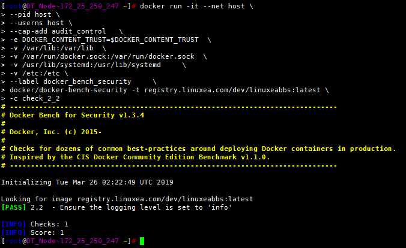
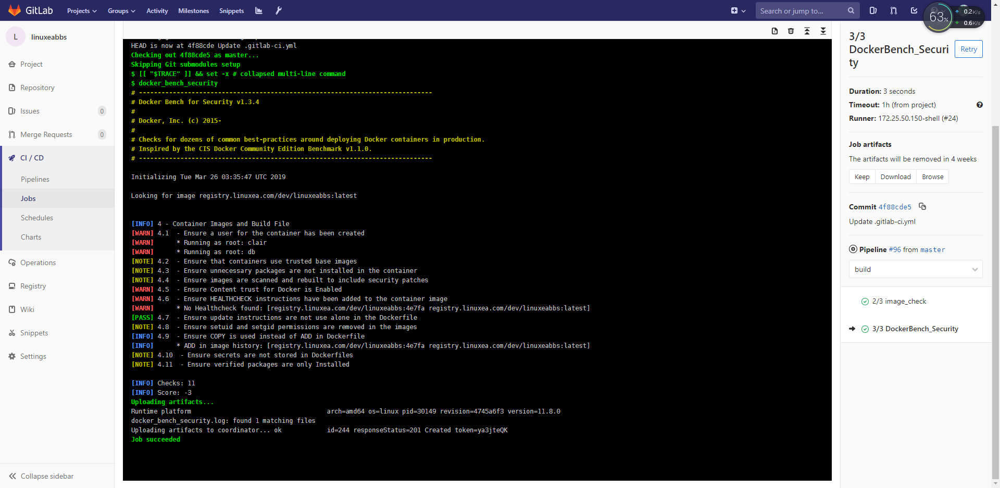

在前面的两篇中，记录了[gitlab-ci构建构建docker镜像](https://www.linuxea.com/2350.html)和[安全漏洞扫描](https://www.linuxea.com/2354.html)，但在github上还有一个不错的项目
--> [Docker Bench for Security](https://github.com/docker/docker-bench-security)

- Docker Bench for Security是一个脚本，用于检查有关在生产中部署Docker容器的许多常见最佳实践。附：[DOCKER安全性和最佳实践](https://blog.docker.com/2015/05/understanding-docker-security-and-best-practices/)

这其中， 检查的东西很多样化，包括：资源限制，明文密码，swarm以及其他的一些辅助性质或者参考价值的信息。

阅读本章，你将了解[Docker Bench for Security](https://github.com/docker/docker-bench-security)在gitlab-ci中的集成实践，这将有助于推动gitlab-cI自动化。
## 运行Docker Bench
有提供现成的Docker容器镜像，我们直接拿来使用。
>请注意，此容器正以大量特权运行- 共享主机的文件系统，pid和网络命名空间，因为基准测试的部分应用于正在运行的主机。不要忘记根据你的操作系统调整共享卷，例如它可能不使用systemd

```
docker run -it --net host --pid host --userns host --cap-add audit_control \
    -e DOCKER_CONTENT_TRUST=$DOCKER_CONTENT_TRUST \
    -v /var/lib:/var/lib \
    -v /var/run/docker.sock:/var/run/docker.sock \
    -v /usr/lib/systemd:/usr/lib/systemd \
    -v /etc:/etc --label docker_bench_security \
    docker/docker-bench-security
```

默认情况下，会检查所有的容器项目和镜像，我们要通过选项来规避一些我们想要的结果：

```
  -b           optional  Do not print colors
  -h           optional  Print this help message
  -l FILE      optional  Log output in FILE
  -c CHECK     optional  Comma delimited list of specific check(s)
  -e CHECK     optional  Comma delimited list of specific check(s) to exclude
  -i INCLUDE   optional  Comma delimited list of patterns within a container name to check
  -x EXCLUDE   optional  Comma delimited list of patterns within a container name to exclude from check
  -t TARGET    optional  Comma delimited list of images name to check
```

- type

一共会检查如下几项，我们通过-c参数：[-c docker_daemon_configuration](https://github.com/docker/docker-bench-security/blob/master/functions_lib.sh#L153) 来检查我们想要一个[函数的结果](https://github.com/docker/docker-bench-security/blob/master/functions_lib.sh)。如果你的粒度更小 ，可以使用:[-c check_2](<https://github.com/docker/docker-bench-security/blob/master/functions_lib.sh#L22>)。而这些参数可以在这个项目的[functions_lib.sh](<https://github.com/docker/docker-bench-security/blob/master/functions_lib.sh>)找到。

```
[INFO] 1 - Host Configuration
[INFO] 2 - Docker daemon configuration
[INFO] 3 - Docker daemon configuration files
[INFO] 4 - Container Images and Build File
[INFO] 5 - Container Runtime
[INFO] 6 - Docker Security Operations
[INFO] 7 - Docker Swarm Configuration
```

示例：

仅仅检查`-c docker_daemon_configuration`，并且镜像只是`registry.linuxea.com/dev/linuxeabbs:latest`

```
[root@linuxea.com ~]# docker run -it --net host \
--pid host \
--userns host \
--cap-add audit_control   \
-e DOCKER_CONTENT_TRUST=$DOCKER_CONTENT_TRUST  \
-v /var/lib:/var/lib  \
-v /var/run/docker.sock:/var/run/docker.sock  \
-v /usr/lib/systemd:/usr/lib/systemd     \
-v /etc:/etc \
--label docker_bench_security     \
docker/docker-bench-security -t registry.linuxea.com/dev/linuxeabbs:latest -c docker_daemon_configuration
```


在或者检查某一个小项



## 添加到管道

参数：

- -t 指定镜像
- -c 指定CIS，只检查指定的项目
- -l 结果输出到文件(似乎不好用，用tee代替)

添加新的项

```
3/3 DockerBench_Security:
  <<: *bash_init
  script:
    - docker_bench_security
  artifacts:
    name: "$CI_JOB_STAGE-$CI_COMMIT_REF_NAME"    
    paths: [docker_bench_security.log]
```

函数部分

```
  function docker_bench_security() {
    export PROJECT_NAME=$(echo "$CI_PROJECT_PATH_SLUG" |awk -F- '{print $2}')
    export IMAGE_TAG_LATEST="$REPOSITORY_URL"/"$PROJECT_NAME":latest	  
    docker run -i --rm --net host \
      --pid host \
      --userns host \
      --cap-add audit_control   \
      -e DOCKER_CONTENT_TRUST=$DOCKER_CONTENT_TRUST  \
      -v /var/lib:/var/lib  \
      -v /var/run/docker.sock:/var/run/docker.sock  \
      -v /usr/lib/systemd:/usr/lib/systemd     \
      -v /etc:/etc \
      --label docker_bench_security     \
      docker/docker-bench-security -t "$IMAGE_TAG_LATEST" -c container_images |tee docker_bench_security.log
  }
```

运行部分结果如下：



## 延伸阅读

- [linuxea:如何使用gitlab-ci/cd来构建docker镜像和发布](https://www.linuxea.com/2350.html)
- [linuxea:gitlab-ci/cd docker容器漏洞扫描clair-scanner](https://www.linuxea.com/2354.html)
- [linuxea:gitlab-ci/cd runner配置和安装(一)](https://www.linuxea.com/1800.html)
- [linuxea:gitlab-ci的定时任务](https://www.linuxea.com/2323.html)
- [linuxea:docker仓库harbor-https的配置和使用](https://www.linuxea.com/2338.html)
- [linuxea:白话容器之Registry与Harbor的构建和使用 (26)](https://www.linuxea.com/2236.html)
- [linuxea:Docker多阶段构建与- target和--cache-from](https://www.linuxea.com/2314.html)

## 阅读更多
- [devops](https://www.linuxea.com/tag/devops/)
- [gitlab](https://www.linuxea.com/tag/gitlab/)
- [gitlab-ci/cd](https://www.linuxea.com/tag/gitlab-ci-cd/)
- [jenkins](https://www.linuxea.com/tag/jenkins/)