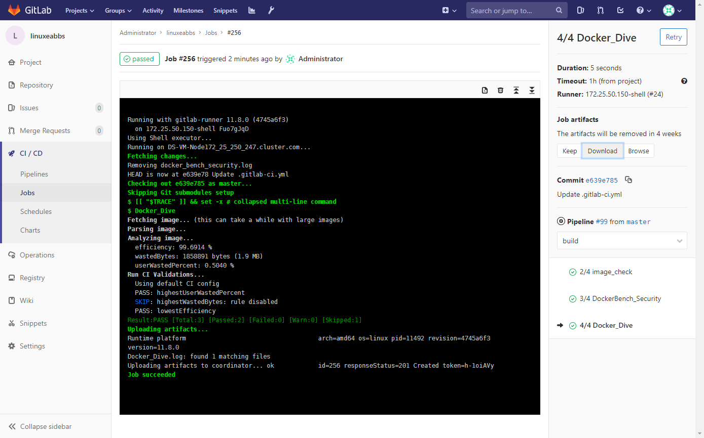

在此前的两篇关于gitlab-ci的镜像的安全和质量的问题上做了一些简单的描述，现在就着此前的，我们在使用另外一个开源工具[dive](<https://github.com/wagoodman/dive>)，使用dive用来对 镜像每个图层做分析，分析效率和镜像是否有浪费的空间，最后打印一个测试品质的报告。

> 此前在另外一篇文章[如何从docker镜像恢复Dockerfile](https://www.linuxea.com/2276.html)提到如何简单使用dive查看dockerfile.

阅读本章节，你将了解[dive](https://github.com/wagoodman/dive)的基本使用和在gitlab-ci中的集成方式。我们先来看gitlab上作者给出的基本功能如下

## 描述

**显示按层细分的Docker镜像内容**

当你在左侧选择一个图层时，将显示该图层的内容以及右侧的所有先前图层。此外，还可以使用箭头键完全浏览文件树（可以查看一些 dockerfile指令）。<当你使用dive image的时候你会进入一个交互式的接口>

**指出每层中发生了哪些变化**

已更改，已修改，添加或删除的文件在文件树中指示。可以调整此值以显示特定图层的更改，或直到此图层的聚合更改。

**估算“镜像效率”**

左下方窗格显示基本图层信息和一个实验指标，用于猜测镜像所包含的空间浪费。这可能是跨层重复文件，跨层移动文件或不完全删除文件。提供了百分比“得分”和总浪费的文件空间。

**快速构建/分析周期**

你可以构建Docker镜像并使用一个命令立即进行分析： `dive build -t some-tag .`

你只需要`docker build`使用相同的`dive build` 命令替换你的命令。

**CI集成** 分析和成像，并根据镜像效率和浪费的空间获得通过/失败结果。`CI=true`在调用任何有效的dive命令时，只需在环境中进行设置。

## 安装

- centos

```
curl -OL https://github.com/wagoodman/dive/releases/download/v0.7.0/dive_0.7.0_linux_amd64.rpm 
rpm -i dive_0.7.0_linux_amd64.rpm
```
- docker

```
docker run --rm -i -v /var/run/docker.sock:/var/run/docker.sock  \
  -e CI=true   \
  wagoodman/dive:v0.7  registry.linuxea.com/dev/linuxeabbs:latest
```

##  使用

我们主要围绕CI展开
>  如果要查看Dockerfile或者其他层的详情，可以使用`dive  IMAGE`,参考[如何从docker镜像恢复Dockerfile](https://www.linuxea.com/2276.html)
```
[root@linuxea.com ~]# CI=true dive registry.linuxea.com/dev/linuxeabbs:latest
Fetching image... (this can take a while with large images)
Parsing image...
Analyzing image...
  efficiency: 99.6914 %
  wastedBytes: 1858891 bytes (1.9 MB)
  userWastedPercent: 0.5040 %
Run CI Validations...
  Using default CI config
  PASS: highestUserWastedPercent
  SKIP: highestWastedBytes: rule disabled
  PASS: lowestEfficiency
Result:PASS [Total:3] [Passed:2] [Failed:0] [Warn:0] [Skipped:1]
```

- 如何理解这些内容背后的含义是什么？参考[github作者](<https://github.com/wagoodman/dive/issues/158>)的回复，总体就如下3条规则

**efficiency：**这基本上是（总镜像大小）/（总和（所有层中的字节数））。我们的想法是，如果你不删除任何文件或添加任何文件两次，那么你的“效率”为100％。如果你开始复制/删除文件，则会根据效率计算（按浪费文件的大小加权）。
**wastedBytes：**发现在多个层上重复的原始字节数，或者发现在更高层中删除的原始字节数（因此，如果最终未使用，则可能不应该在任何层中。
**userWastedPercent：**这基本上是效率的倒数，除了不考虑基础镜像的任何修改。更具体地说，这是wastedBytes / sum（所有层中的字节，基本镜像层除外）。

## 集成到管道

```
4/4 Docker_Dive:
  <<: *bash_init
  script:
    - Docker_Dive
  artifacts:
    name: "$CI_JOB_STAGE-$CI_COMMIT_REF_NAME"   
    paths: [Docker_Dive.log]	
```

函数部分

```
  function Docker_Dive() {
    export PROJECT_NAME=$(echo "$CI_PROJECT_PATH_SLUG" |awk -F- '{print $2}')
    export IMAGE_TAG_LATEST="$REPOSITORY_URL"/"$PROJECT_NAME":latest	
    docker run --rm -i -v /var/run/docker.sock:/var/run/docker.sock  -e CI=true \
      wagoodman/dive:v0.7 "$IMAGE_TAG_LATEST"  |tee Docker_Dive.log
  }  
```

部分截图如下：


## 延伸阅读

- [linuxea:如何使用gitlab-ci/cd来构建docker镜像和发布](https://www.linuxea.com/2350.html)
- [如何从docker镜像恢复Dockerfile](https://www.linuxea.com/2276.html)
- [linuxea:gitlab-ci/cd docker容器漏洞扫描clair-scanner](https://www.linuxea.com/2354.html)
- [linuxea:gitlab-ci/cd runner配置和安装(一)](https://www.linuxea.com/1800.html)
- [linuxea:gitlab-ci的定时任务](https://www.linuxea.com/2323.html)
- [linuxea:docker仓库harbor-https的配置和使用](https://www.linuxea.com/2338.html)
- [linuxea:白话容器之Registry与Harbor的构建和使用 (26)](https://www.linuxea.com/2236.html)
- [linuxea:Docker多阶段构建与- target和--cache-from](https://www.linuxea.com/2314.html)

## 阅读更多
- [devops](https://www.linuxea.com/tag/devops/)
- [gitlab](https://www.linuxea.com/tag/gitlab/)
- [gitlab-ci/cd](https://www.linuxea.com/tag/gitlab-ci-cd/)
- [jenkins](https://www.linuxea.com/tag/jenkins/)


[1]: https://www.linuxea.com/usr/uploads/2019/03/3482874911.png