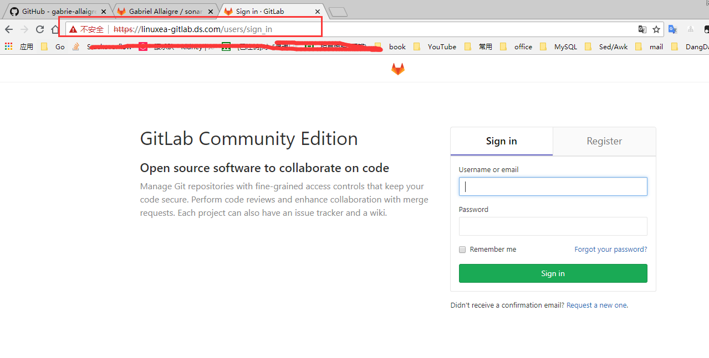

### gitlab https配置
自己签名一个证书给gitlab使用
事实上我并不推荐使用https自签证书，如果还使用了runner那你肯定会明白的
#### 根证书自签
开始根证书私钥文件创建
```
[root@Linuxea-VM-Node146 /etc/gitlab/trusted-certs]# cd /etc/pki/CA/
[root@Linuxea-VM-Node146 /etc/pki/CA]#(umask 077; openssl genrsa -out /etc/pki/CA/private/cakey.pem 2048)
Generating RSA private key, 2048 bit long modulus
....+++
..................................................................+++
e is 65537 (0x10001)
```
生成CA自己的私钥文件，cakey.pem。默认权限为600；
```
[root@Linuxea-VM-Node146 /etc/pki/CA]#  openssl req -new -x509 -key /etc/pki/CA/private/cakey.pem -out /etc/pki/CA/cacert.pem -days 36
You are about to be asked to enter information that will be incorporated
into your certificate request.
What you are about to enter is what is called a Distinguished Name or a DN.
There are quite a few fields but you can leave some blank
For some fields there will be a default value,
If you enter '.', the field will be left blank.
-----
Country Name (2 letter code) [XX]:cn  #国家
State or Province Name (full name) []:shanghai # 身份
Locality Name (eg, city) [Default City]:shanghai # 城市
Organization Name (eg, company) [Default Company Ltd]:ca #机构i
Organizational Unit Name (eg, section) []:ops # 部门名称
Common Name (eg, your name or your server's hostname) []:linuxea-gitlab.ds.com # 主机名称
Email Address []:user@163.com  # 邮箱
```
根据私钥文件生成CA自签证书。CA给自己签发一个证书；
来关注下以下几个文件
*  index.txt 创建索引文件
* serial  证书编号位置
* echo 01 > serial  自定义开始证书编号
* touch crlnumber  已吊销证书编号文件
```
[root@Linuxea-VM-Node146 /etc/pki/CA]# touch index.txt  serial
[root@Linuxea-VM-Node146 /etc/pki/CA]# echo 01 > serial 
[root@Linuxea-VM-Node146 /etc/pki/CA]# touch crlnumber  
```
以上的三个文件，是CA配置文件中定义的文件名，必须手动创建出来；
以上简单自建CA配置完毕；
#### 签发gitlab证书
到gitlab目录在创建一个证书，而后用上面的根证书来进行签发
```
[root@Linuxea-VM-Node146 /etc/pki/CA]# mkdir /etc/gitlab/ssl
[root@Linuxea-VM-Node146 /etc/pki/CA]# cd /etc/gitlab/ssl
[root@Linuxea-VM-Node146 /etc/gitlab/ssl]#  (umask 077; openssl genrsa -out linuxea-gitlab.ds.com.key 1024)
Generating RSA private key, 1024 bit long modulus
.......................++++++
....................++++++
e is 65537 (0x10001)
```
```
[root@Linuxea-VM-Node146 /etc/gitlab/ssl]# ll
总用量 4
-rw------- 1 root root 891 7月   9 13:10 linuxea-gitlab.ds.com.key
```
创建申请
```
[root@Linuxea-VM-Node146 /etc/gitlab/ssl]# openssl req -new -key ./linuxea-gitlab.ds.com.key -out ./linuxea-gitlab.ds.com.csr -days 365
You are about to be asked to enter information that will be incorporated
into your certificate request.
What you are about to enter is what is called a Distinguished Name or a DN.
There are quite a few fields but you can leave some blank
For some fields there will be a default value,
If you enter '.', the field will be left blank.
-----
Country Name (2 letter code) [XX]:cn
State or Province Name (full name) []:shanghai
Locality Name (eg, city) [Default City]:shanghai
Organization Name (eg, company) [Default Company Ltd]:gitlab-linuxea
Organizational Unit Name (eg, section) []:linuxea
Common Name (eg, your name or your server's hostname) []:linuxea-gitlab.ds.com
Email Address []:user@163.com

Please enter the following 'extra' attributes
to be sent with your certificate request
A challenge password []:
An optional company name []:
```
CA服务器上操作
开始签发
```
[root@Linuxea-VM-Node146 /etc/gitlab/ssl]# openssl ca -in linuxea-gitlab.ds.com.csr -out ./linuxea-gitlab.ds.com.crt -days 365
Using configuration from /etc/pki/tls/openssl.cnf
Check that the request matches the signature
Signature ok
The organizationName field needed to be the same in the
CA certificate (ca) and the request (gitlab-linuxea)
```
解决报错，修改配置文件
```
[root@Linuxea-VM-Node146 /etc/gitlab/ssl]# vim /etc/pki/tls/openssl.cnf 
 84 [ policy_match ]
 85 countryName||   = optional
 86 stateOrProvinceName|= optional
 87 organizationName|   = optional                 
 88 organizationalUnitName| = optional
 89 commonName| |   = supplied
 90 emailAddress|   |   = optional
```
在颁发一次
```
[root@Linuxea-VM-Node146 /etc/gitlab/ssl]# openssl ca -in linuxea-gitlab.ds.com.csr -out ./linuxea-gitlab.ds.com.crt -days 365
Using configuration from /etc/pki/tls/openssl.cnf
Check that the request matches the signature
Signature ok
Certificate Details:
        Serial Number: 1 (0x1)
        Validity
            Not Before: Jul  9 05:19:07 2018 GMT
            Not After : Jul  9 05:19:07 2019 GMT
        Subject:
            countryName               = cn
            stateOrProvinceName       = shanghai
            organizationName          = gitlab-linuxea
            organizationalUnitName    = linuxea
            commonName                = linuxea-gitlab.ds.com
            emailAddress              = user@163.com
        X509v3 extensions:
            X509v3 Basic Constraints: 
                CA:FALSE
            Netscape Comment: 
                OpenSSL Generated Certificate
            X509v3 Subject Key Identifier: 
                DE:FF:FD:A3:6E:96:9A:F8:D4:9A:1E:F2:FE:1B:99:FB:A3:A3:07:4F
            X509v3 Authority Key Identifier: 
                keyid:00:8A:F1:19:5D:42:7E:CD:14:10:56:62:6C:C1:D6:00:36:6C:B0:29

Certificate is to be certified until Jul  9 05:19:07 2019 GMT (365 days)
Sign the certificate? [y/n]:y


1 out of 1 certificate requests certified, commit? [y/n]y
Write out database with 1 new entries
Data Base Updated
```
查看
```
[root@Linuxea-VM-Node146 /etc/gitlab/ssl]# cat /etc/pki/CA/serial
02
[root@Linuxea-VM-Node146 /etc/gitlab/ssl]# ll /etc/pki/CA/newcerts/01.pem 
-rw-r--r-- 1 root root 3917 7月   9 13:19 /etc/pki/CA/newcerts/01.pem
```
修改gitlab文件
```
[root@Linuxea-VM-Node146 ~]# vim /etc/gitlab/gitlab.rb 
13 external_url 'https://linuxea-gitlab.ds.com'
14 nginx['redirect_http_to_https']=true
15 nginx['ssl_certificate'] = "/etc/pki/CA/newcerts/01.pem"
16 nginx['ssl_certificate_key'] = "/etc/gitlab/ssl/linuxea-gitlab.ds.com.key"  
```
```
[root@Linuxea-VM-Node146 ~]# gitlab-ctl reconfigure
```

gitlab https已经配置完成

### gitlab runner配置
gitlab一旦用来https,这可不当紧，但是runner也就需要了，不然会报错
```
[marksugar@www.linuxea.com ~]$ gitlab-runner verify
Running in system-mode.                                                                   
ERROR: Verifying runner... failed                   runner=awSshzhi status=couldn't execute POST against https://linuxea-gitlab.ds.com/api/v4/runners/verify: Post https://linuxea-gitlab.ds.com/api/v4/runners/verify: x509: certificate signed by unknown authority
ERROR: Verifying runner... failed                   runner=fc4a03c9 status=couldn't execute POST against https://linuxea-gitlab.ds.com/api/v4/runners/verify: Post https://linuxea-gitlab.ds.com/api/v4/runners/verify: x509: certificate signed by unknown authority
```
`--tls-ca-file`来解决
```
[marksugar@www.linuxea.com /etc/gitlab-runner]$ gitlab-runner register --tls-ca-file ~/01.pem 
Running in system-mode.                            
                                                   
Please enter the gitlab-ci coordinator URL (e.g. https://gitlab.com/):
https://linuxea-gitlab.ds.com/
Please enter the gitlab-ci token for this runner:
awSshzhiuXp1KbxmXbk3
Please enter the gitlab-ci description for this runner:
[Linuxea-VM-Node_10_10_240_145.dwhd.org]: 145-runner
Please enter the gitlab-ci tags for this runner (comma separated):
 145-runner 
Whether to run untagged builds [true/false]:
[false]: true
Whether to lock the Runner to current project [true/false]:
[true]: true
Registering runner... succeeded                     runner=awSshzhi
Please enter the executor: docker, parallels, shell, docker-ssh+machine, kubernetes, docker-ssh, ssh, virtualbox, docker+machine:
shell
Runner registered successfully. Feel free to start it, but if it's running already the config should be automatically reloaded! 
```