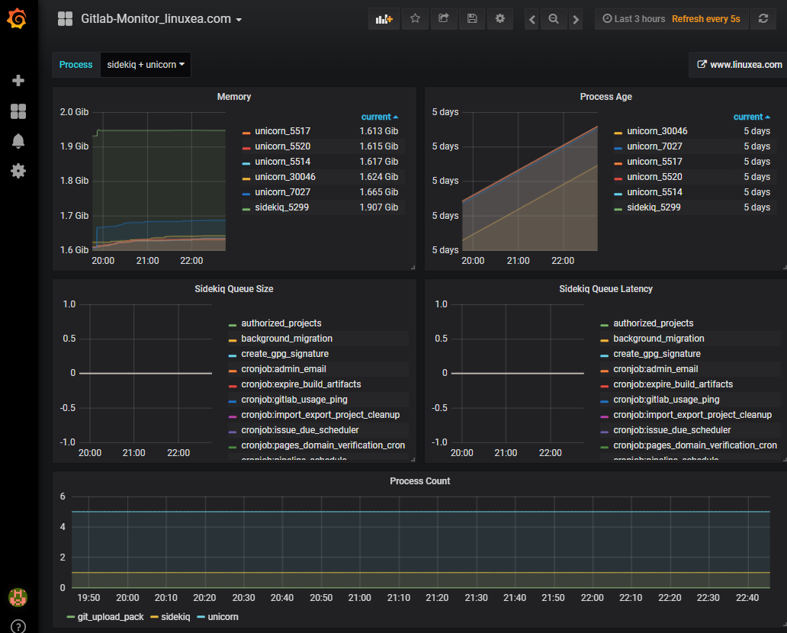
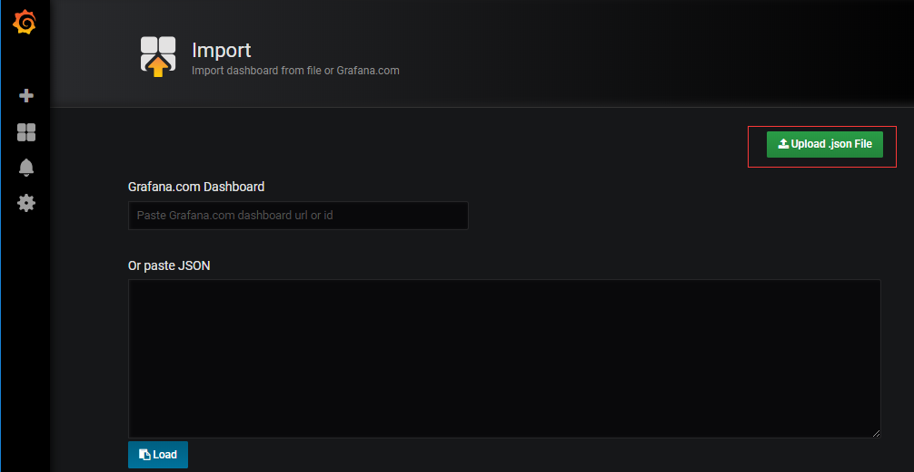
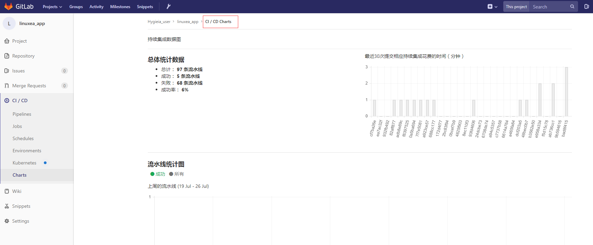
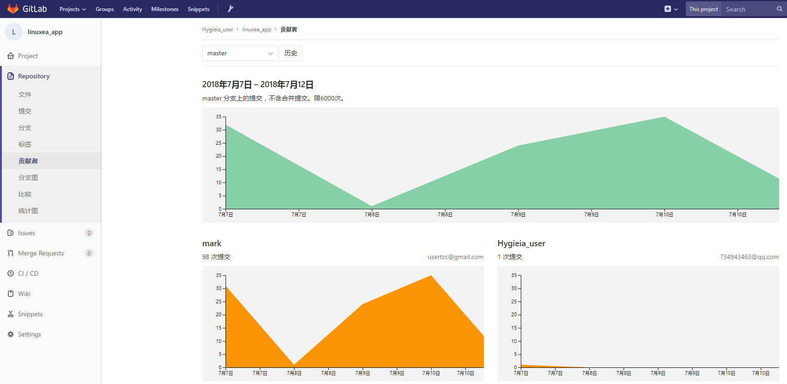
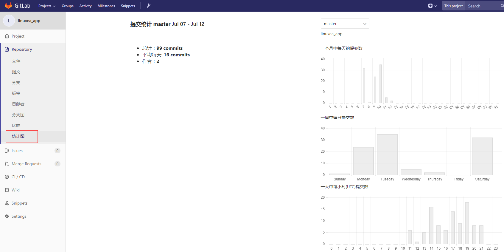

gitlab和Prometheus监控
前面一篇中，有提到过使用Hygieia，Hygieia更善于集中式的展示更多的CI套件的状态。倘若我所有的CI都是自动化(特别是使用gitlab-ci)，那我们可能只需要健康容器的运行状态了，如果是jenkins那可能有些不同，这取决你使用的方式。
gitlab的套包中的Prometheus自带了gitlab套件的所有的exporter，基本上开箱即用。
并且在gitlab中已经完成了部分的，在之前章节的Hygieia所能暂时的部分功能(仅仅是gitlab本身)
本篇简单的叙述下，gitlab和gitlab Prometheus的监控，其中涉及到Grafana，Grafana在后面会逐渐提到的更多
Hygieia参考：[Hygieia dashboard简单配置(十一)](https://www.linuxea.com/1871.html)  
简述：
如果你装的是gitlab官网的包的话，Prometheus将会捆绑在软件包中，我们只需要打开它，并且重新gitlab-ctl reconfigur即可打开来进行使用，它和Prometheus单独安装所差不多，但是还是建议另外安装，当然，如过另外安装你可能需要安装其他的几个exporter
几个exporter：

```
https://github.com/prometheus/prometheus/wiki/Default-port-allocations
```
###  Prometheus监控
修改配置文件
```
[marksugar@www.linuxea.com ~]# cat /etc/gitlab/gitlab.rb
```
主要修改这两项
```
prometheus_monitoring['enable'] = true 
```
这里改成0.0.0.0比较妥当
```
prometheus['listen_address'] = '0.0.0.0:9090'
```
而后gitlab-ctl reconfigur，并且restart
```
[marksugar@www.linuxea.com ~]#  gitlab-ctl reconfigure
[marksugar@www.linuxea.com ~]#  gitlab-ctl  restart
```
它的配置文件在`/var/opt/gitlab/prometheus`下，可以在Status界面中看到配置项
```
[marksugar@www.linuxea.com ~]# cat /var/opt/gitlab/prometheus/prometheus.yml 
```
在打开之前，放行端口，而后就通过IP：PORT打开Prometheus
```
[marksugar@www.linuxea.com ~]# iptables  -I INPUT 5 -p tcp --dport 9090 -j ACCEPT
```
官网提供的集中查询示例：
- **％使用的内存：** `(1 - ((node_memory_MemFree + node_memory_Cached) / node_memory_MemTotal)) * 100`
- **％CPU负载：** `1 - rate(node_cpu{mode="idle"}[5m])`
- **传输的数据：** `irate(node_network_transmit_bytes[5m])`
- **收到的数据：** `irate(node_network_receive_bytes[5m])`
还提供了,**postgres_exporter**,**redis_exporter**,以及gitlab的gitlab-monitor
### Grafana+Prometheus
so，我们安装一个grafana来展示Prometheus的信息
它呈现的效果大概是这样的(Grafana安装和配置实在是太简单了，就不说了)

我已上传json文件到github上，upload即可

json地址：

```
https://raw.githubusercontent.com/LinuxEA-Mark/jenkins_gitlab_Docker/master/gitlab_monitor_linuxea_com.json
```
### Gitlab监控
另外可以通过gitlab项目中的自带的监控来看，例如，项目中的流水线CI/CD Charts，如下：

也可以查看项目的提交信息，如下：

以及commits信息，如下：

参考：

```
https://docs.gitlab.com/ee/administration/monitoring/prometheus/
https://gitlab.com/gitlab-org/gitlab-monitor
https://docs.gitlab.com/ee/administration/monitoring/prometheus/gitlab_metrics.html#metrics-shared-directory
```

