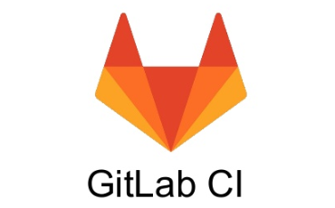
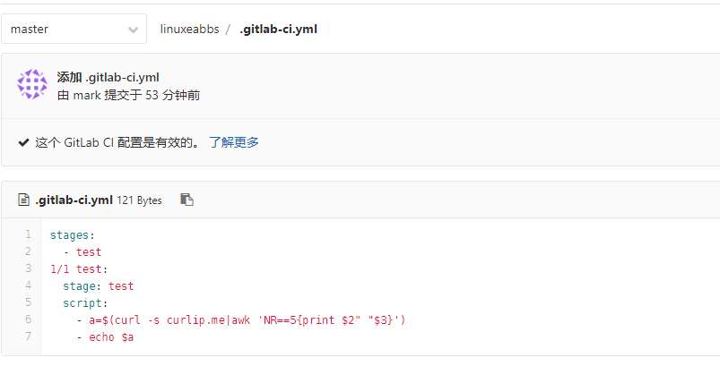
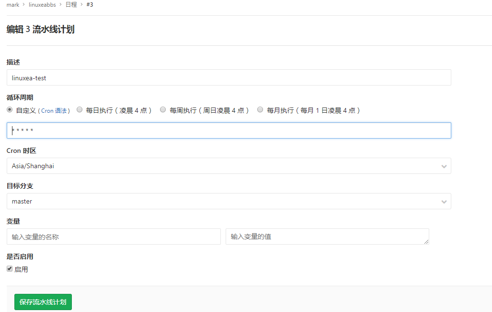

在此前的基于gitlab的ci/cd中，我写了几篇文章来说明他的基本用法，我将会在后续的文章中不断来完善gitlab和jenkins的用法。

阅读本章，你将了解gitlab基于ci的定时任务。

## 安装配置gitlab-runner

参考[官网的安装手册](https://docs.gitlab.com/runner/install/linux-repository.html#installing-the-runner)进行安装即可

```
yum install gitlab-runner
```
而后可以常用docker或者shell的方式来选择后续命令执行的环境

> 获取token，参考此前的[安装配置文章](https://www.linuxea.com/1800.html#%E5%BC%80%E5%A7%8B%E9%85%8D%E7%BD%AErunners)

- docker

```
gitlab-runner register \
  --non-interactive \
  --url "http://git.ds.com/" \
  --registration-token "jQj1Fi2xd53xqg3ZeMVU" \
  --executor "docker" \
  --docker-image alpine:3.9 \
  --description "docker-runner" \
  --tag-list "docker,shell" \
  --run-untagged \
  --locked="false"
```

- shell

```
gitlab-runner register \
  --non-interactive \
  --url "http://git.xx.com/" \
  --registration-token "jQj1Fi2xd53xqg3ZeMVU" \
  --executor "shell" \
  --description "docker-runner" \
  --tag-list "docker,shell" \
  --run-untagged \
  --locked="false"
```

我这里使用的shell

```
root@linuxea.com 🐳 ~ ☸   2019-03-14 15:48:43 
$ gitlab-runner register \
>   --non-interactive \
>   --url "http://git.xx.com/" \
>   --registration-token "jQj1Fi2xd53xqg3ZeMVU" \
>   --executor "shell" \
>   --description "docker-runner" \
>   --tag-list "docker,shell" \
>   --run-untagged \
>   --locked="false"
Runtime platform                                    arch=amd64 os=linux pid=13181 revision=4745a6f3 version=11.8.0
Running in system-mode.                                              
Registering runner... succeeded                     runner=jQj1Fi2x
Runner registered successfully. Feel free to start it, but if it's running already the config should be automatically reloaded! 
```

配置文件位置

```
root@linuxea.com 🐳 ~ ☸    2019-03-14 15:49:34 
$ cat /etc/gitlab-runner/config.toml 
concurrent = 1
check_interval = 0

[session_server]
  session_timeout = 1800

[[runners]]
  name = "docker-runner"
  url = "http://git.ds.com/"
  token = "b5819c16ec11f45e8b6a59175453ec"
  executor = "shell"
  [runners.cache]
    [runners.cache.s3]
    [runners.cache.gcs]
```

一般情况下，配置完成我们需要重启一下，尽管提示说会生效

```
systemctl restart gitlab-runner.service 
```

如果不想重启，可以通过list查看，并使用status查看是否runing

```
root@linuxea.com 🐳 ~ ☸  2019-03-14 15:50:34 
$ gitlab-runner list
Runtime platform                                    arch=amd64 os=linux pid=14411 revision=4745a6f3 version=11.8.0
Listing configured runners                          ConfigFile=/etc/gitlab-runner/config.toml
docker-runner                                       Executor=shell Token=b5819c16ec11f45e8b6a59175453ec URL=http://git.ds.com/
```

```
root@linuxea.com 🐳 ~ ☸  2019-03-14 15:51:30 
$ gitlab-runner status docker-runner 
Runtime platform                                    arch=amd64 os=linux pid=14523 revision=4745a6f3 version=11.8.0
gitlab-runner: Service is running!
```

如果没有，也可以使用gitlab-runner start docker-runner来进行启动

## 测试计划任务

我们创建一个项目用作测试，并且写一个简单的命令，命名为`.gitlab-ci.yml`

```
stages:
  - test
1/1 test:
  stage: test
  script: 
    - a=$(curl -s curlip.me|awk 'NR==5{print $2" "$3}')
    - echo $a
```

如下图



然后我们将使用GitLab-CI安排它每天运行。

现在，我们配置"日程表"(汉化后叫日程表)。CI/CD ---> 日程表--->新建计划。我们创建一个1分钟执行一次的计划。这里的定时，取决于[cron配置](https://baike.baidu.com/item/cron/10952601?fr=aladdin)。那么表现的形式大致如下



不过，这样你会发现，他只会运行一次，而后将遵循1小时运行一次的规律

这些信息在[gitlab社区有过讨论](https://gitlab.com/gitlab-org/gitlab-ce/issues/45695)，得出的结果，也就是如果一个job设置了计划，那么最小的粒度是1小时

## 延伸阅读

- [安装runner](https://docs.gitlab.com/runner/install/linux-repository.html#installing-the-runner)

- [配置runner](https://docs.gitlab.com/runner/register/)

## 查看更多

如果你要查看更多关于jenkins和gitlab-ci/cd的文章，请关注一下分类。

- [gitlab-ci/cd](https://www.linuxea.com/tag/gitlab/)
- [jenkins](https://www.linuxea.com/tag/jenkins/)