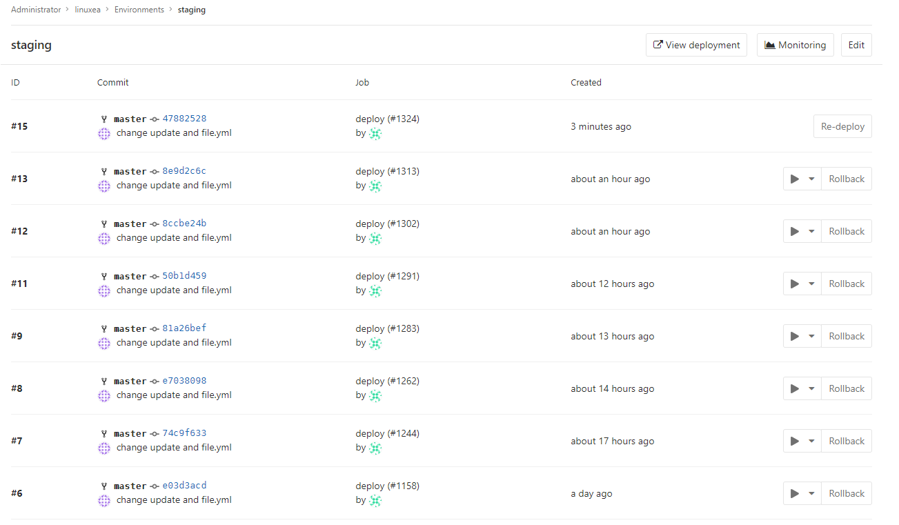
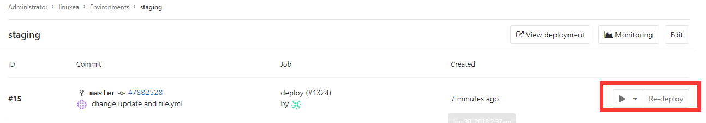
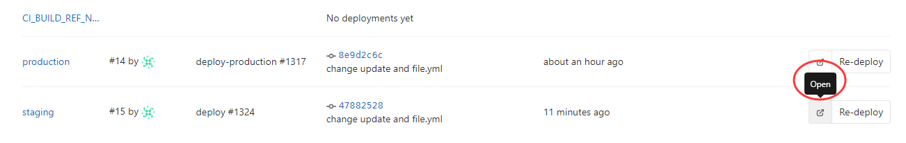

## gitlab-ci.yaml文件基础配置

在gitlab-ci中缩进很重要，始终使用空格，而不是tab

### allow_failure
* allow_failure: true
用于在不影响CI套件其余部分的情况下允许作业失败的情况。失败的作业不会影响提交状态。也就是说当标记有allow_failure: true的这一个job1运行失败了，也不会停止运行下一个

###  when
* when
when 用于实施失败或失败时运行的作业。
when 可以设置为以下值之一：
```
on_success - 只有在前一阶段的所有工作都成功后才能执行工作。这是默认设置。
on_failure - 只有在至少有一个来自前一阶段的工作失败时才执行工作。
always     - 执行工作，无论前一阶段的工作状况如何。
manual     - 手动执行作业
```
如下
```
stages:
- build
- cleanup_build
- test
- deploy
- cleanup

build_job:
  stage: build
  script:
  - make build

cleanup_build_job:
  stage: cleanup_build
  script:
  - cleanup build when failed
    when: on_failure

test_job:
  stage: test
  script:
  - make test

deploy_job:
  stage: deploy
  script:
  - make deploy
    when: manual

cleanup_job:
  stage: cleanup
  script:
  - cleanup after jobs
    when: always
```
 以上脚本将：
cleanup_build_job只有在build_job失败时才执行。
cleanup_job无论成功或失败，始终作为管道中的最后一步执行。
允许您deploy_job从GitLab的用户界面手动执行。
### cache
* cache:paths
  cache用于指定应在作业之间缓存的文件和目录列表。您只能使用项目工作区内的路径。
  如果cache定义在作业范围之外，则表示它在全局范围内设置，所有作业将使用该定义。
使用paths指令选择要缓存的文件或目录。通配符也可以使用
缓存中的所有文件binaries中为此.apk和.config文件：
```
rspec:
  script: test
  cache:
    paths:
    - binaries/*.apk
    - .config
```
由于缓存在作业之间共享，如果您为不同的作业使用不同的路径，则还应该设置不同的**缓存：密钥，** 否则缓存内容可能会被覆盖

假设在一台机器上执行（在同一个Runner /机器有效）：
* cache:key
```
stages:
- build
- test

before_script:
- echo "Hello"

job A:
  stage: build
  script:
  - mkdir vendor/
  - echo "build" > vendor/hello.txt
  cache:
    key: build-cache
    paths:
    - vendor/
  after_script:
  - echo "World"

job B:
  stage: test
  script:
  - cat vendor/hello.txt
  cache:
    key: build-cache
```
以下是后台发生的情况：
1，管道开始
2，job A 运行
3，before_script 被执行
4，script 被执行
5，after_script 被执行
6，cache运行并将vendor/目录压缩到cache.zip。这个文件然后保存在基于 Runner的设置和cache: key。
7，job B 运行
8，缓存被提取（如果找到）
9，before_script 被执行
10，script 被执行
11，管道完成

这里需要注意，如果在同一个runner中，Key相同的情况下，即使paths不同也会被执行顺序中的下一个job的key覆盖

这里的key的值如果是预设的变量是不能包含/或者URL编码的，在windows中是使用%百分号表示，在shell中是$符号

* cache:policy
这有助于加快作业执行并减少缓存服务器上的负载，尤其是当您有大量并行执行的缓存使用作业时。
此外，如果您的作业无条件地重新创建缓存而不参考其之前的内容，则可以policy: push在该作业中使用跳过下载步骤。
```
stages:
  - setup
  - test

prepare:
  stage: setup
  cache:
    key: gems
    paths:
      - vendor/bundle
  script:
    - bundle install --deployment
```

### retry
retry 允许您配置一个作业在发生故障时将被重试的次数。
当作业失败时，并且retry配置它将被重新处理达到retry关键字指定的时间。
如果retry设置为2，并且第二次运行（第一次重试）中的作业成功，则不会再次重试。retry值必须是一个正整数，等于或大于0，但低于或等于2（最多两次重试，总共三次）。

一个简单的例子：
```
test:
  script: rspec
  retry: 2
```
### 变量
#### variables

varoanles是内部变量，在作业环境中传递，工作在全局模式

如：
```
variables:
  DATABASE_URL: "postgres://postgres@postgres/my_database"
```
关闭变量，顶一个一个空的哈希值即可
```
job_name:
  variables: {}
```
在bash中访问环境变量，用$前缀变量名称
```
job_name:
  script:
    - echo $CI_JOB_ID
```
#### 变量表达式
```
deploy:
  script: cap staging deploy
  environment: staging
  only:
    variables:
      - $RELEASE == "staging"
      - $STAGING
```
如果任何条件在variables使用时评估为真，则将only创建新工作。如果任何表达式except在使用时评估为真，则不会创建作业     


### 调试跟踪

默认情况下，GitLab Runner在处理作业时隐藏了大部分的细节。这种行为可以缩短作业痕迹，并防止秘密泄露到跟踪中，除非脚本将它们写入屏幕。
请注意： 启用调试跟踪可能会造成严重的安全隐患。输出**将**包含所有变量和其他秘密的内容！输出**将**被上传到GitLab服务器并在作业追踪中可见！
要启用调试跟踪，请将该`CI_DEBUG_TRACE`变量设置为`true`：
```
job_name:
  variables:
    CI_DEBUG_TRACE: "true"
```
### .Hidden keys

如果要临时禁用某项工作，而不用注释定义，只需要在开始（也就是开头）的地方加上.即可

```
.check_code:
   script:
     - run linuxea.sh
```

如上，.check_code部分将不会被执行

### Anchors 

 有一个很方便的功能，他可以轻松的在文档中复制(类似函数)，可用来继承，或者复制，并且可以与.Hidden keys一起使用

```
.check_code: &job_definition
   images： alpine
   servers:
     - mariadb:10.0.28
     - php-fpm:7.0
   script:
     - run linuxea.sh
huidu:
  <<: *job_definition
  script:
  - ansible -m all -a "..."
shengchan:
  <<: *job_definition
  script:
  - ansible -m all -a "..."
```

& 设置名称：job_definition

<<将给定散列合并到当前

并且*包含制定的job_definition

如果不用的话，那可能是这样的：

```
.check_code: &job_definition
   images： alpine
   servers:
     - mariadb:10.0.28
     - php-fpm:7.0
   script:
     - run linuxea.sh
huidu:
   images： alpine
   servers:
     - mariadb:10.0.28
     - php-fpm:7.0
  script:
  - ansible -m all -a "..."
shengchan:
   images： alpine
   servers:
     - mariadb:10.0.28
     - php-fpm:7.0
  script:
  - ansible -m all -a "..."
```
### environment

```
deploy:
  stage: deploy-test
  environment:
    name: staging
    url: https://www.linuxea.com  
  only:
    - master 
```

该`environment`关键字只是GitLab一个暗示，这个工作实际上将部署到这个环境的`name`。`url`正如我们后面将会看到的，它也可以在GitLab中的不同地方暴露出来。每次指定并成功指定环境的作业时，都会记录部署，记住Git SHA和环境名称。
操作”> “环境”下的环境列表是您可以在其中查找环境的上次部署状态的信息的位置。
以下是Environments页面的外观。

这里有大量的信息，可以看到：

* 该环境的名称及其部署的链接
* 最后一个部署ID号码和谁执行它
* 上次部署的作业ID及其各自的作业名称
* 最后部署的提交信息，比如谁提交了哪些分支和提交的Git SHA
* 上次部署的确切时间
* 一个按钮，可将您带到您在environment关键字中定义的网址 .gitlab-ci.yml
* 重新部署最新部署的按钮，意味着它运行由特定提交的环境名称定义的作业
#### 查看部署历史记录
GitLab会跟踪部署，因此始终知道当前正在您的服务器上部署什么。这样，就可以在浏览器中的每个环境中拥有完整的部署历史记录。点击环境将显示其部署的历史记录。假设已经部署了多次，以下是特定环境的页面外观。


#### Re-deploy
我们可以看到与在Environments页面中相同的信息，但是这次显示了所有的部署。除了重新部署 按钮之外，现在每个部署都有回滚按钮。
你可能无法控制一切，所以有时候会出错。当那个不幸的时刻到来时，GitLab已经准备好了。只需单击可在部署页面（操作>环境>）中找到的回滚按钮，即可使用与其关联的提交重新启动作业。environment name


#### url
这url会在Environments页面中可以open打开
