gitlab+runner自动更新代码测试
## 持续集成
在整个持续集成的工作流程中是分有CI和CD，当代码提交后到线上运行。在以往这个过程中，需要测试环节，运维发布环节，灰度环节，转移线上，我们大致先分为三个过程，开发人员提交代码，测试人员测试代码，运维人员发布代码。在gitlab的持续集成中相对jenkins来讲区别并不大，尽管在之前的文章中极少提起jenkins和持续集成，交付的东西，但是也有少数的测试部分。来看gitlab的ci和cd，很简单：
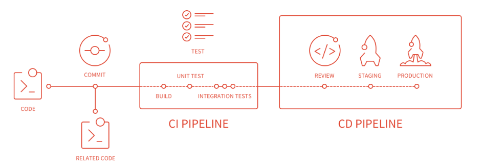
尽管这张图在官网有很多说明，但是既然读者已经看到这里，我还是有必要稍微解释一下这张图说表达的事情。
CI(Continuous Integration)/CD(Continuous Delivery)
当代码提交后，首先进入的CI环节，当然，这里大部分利用自动化软件，插件的形式进行测试，常规的测试使用jmeter,loadrunner 等等，测试的结果会通知测试人员，假如一切ok，则可能直接进入cd环节
如果前面的自动化测试完成，就进入部署环节，可以分为自动部署，自动化部署好处，如：减少人为干预，如果我们有了合理的可靠的方式，反倒人为干预越少越不会出现误操作的问题。开发重复的提交直接经过前面的环节后，通过则部署。当然，也可以手动进行触发部署。
总结一下：
收到提交操作，开始构建环节，进行测试，部署到测试环境。合并到主分支后在部署到生产环境。
这个过程不管在jenkins还是gitlab上都是透明的。在频繁的代码更新，代码测试，代码构建和部署，持续集成不可所缺
更多的内容可参考：https://docs.gitlab.com/ce/ci/README.html#exploring-gitlab-ci-cd

## ci/cd and runner角色
在gitlab-ce的持续集成里面，只要push到gitlab就会执行，随着内容的扩展，包含测试，便宜，部署一系列的内容。我们先体验下自动部署，相比较webhook那肯定是高端很多了
### gitlab-ci/cd
当安装完成gitlab-ce后，就可以直接用
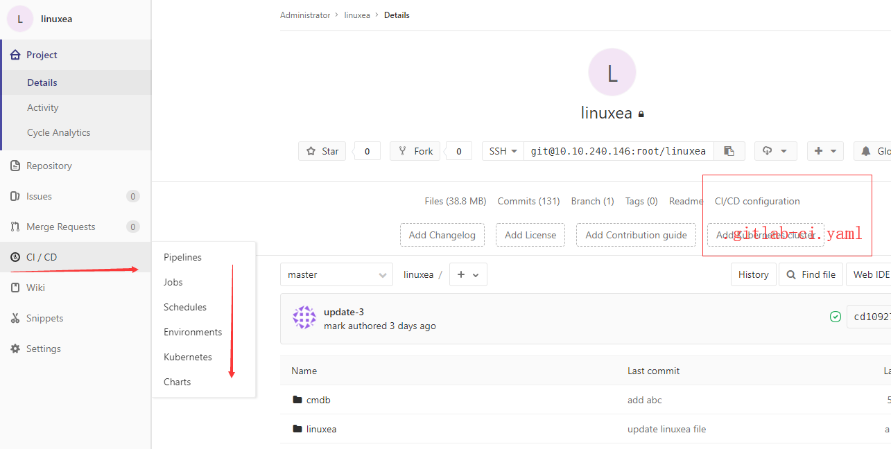
其中的.gitlab-ci.yml脚本解析是ci来做

### gitlab-Runner
最终.gitlab-ci.yml的内容，脚本等(script部分)，是由runner来负责的，在运行完成后的结果返回给gitlab，可以多任务同时运行。支持bash,windows batch和windows powershell，支持docker
一般情况下，至少需要一个gitlab和一个gitlab runner
## 自动更新
简单的测试一下，大致是这样的
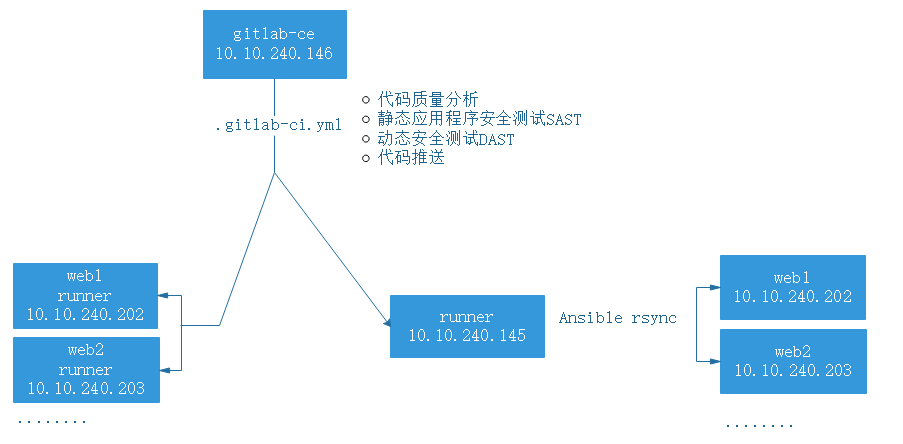
有push操作就会更新，且通过runner一台机器(也可以gitlab-ce本身),使用ansible推送到其他机器

### 准备Ansible推送
* 安装ansible
```
[marksugar@www.linuxea.com ~]$  yum install ansible -y
```
* 配置hosts文件
```
[marksugar@www.linuxea.com ~]$ cat /etc/ansible/hosts 
[linuxea]
10.10.240.202 ansible_ssh_user=root  ansible_ssh_pass=123
10.10.240.203 ansible_ssh_user=root  ansible_ssh_pass=123
```
修改下ansible的目录，权限问题可参考:https://www.linuxea.com/1793.html
*  假设有个项目叫"linuxea"我们开始一次提交代码
### 配置yaml文件
在项目中点击-->CI/CD configuration
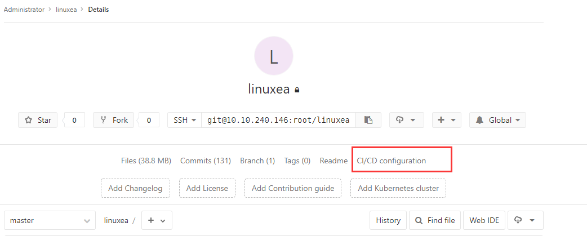
yaml如下：
用过jenkins pipline的就比较熟悉这个了，在前面几项都是自动测试的先略过，看最后部署，加上when: manual则需要手动触发

```
stages:
  - sonarqube
  - Junit-test
  - ZAP-test
  - deploy

# 变量
variables:
  WWWDIR: "/data/wwwroot/"
  ANSIBLEGROUP: "linuxea"

# 所有 stage 之前的操作
before_script:
  - cat /etc/redhat-release 
  
# 代码检查
lint:
  stage: sonarqube
  script: echo "代码检查"

# 单元测试
unit:
  stage: Junit-test
  script: echo "Junit-test"

# 安全测试
ZAP:
  stage: ZAP-test
  script: echo "ZAP-test"
# 部署到服务器
deploy:
  stage: deploy
  only:
    - master
  script:
    - ansible $ANSIBLEGROUP -m shell -a "[ -d $WWWDIR ]||mkdir $WWWDIR -p"
    - ansible $ANSIBLEGROUP -m synchronize -a 'src=./ dest=$WWWDIR rsync_opts=--delete'
  #when: manual
```
### 开始提交更新
提交一次代码
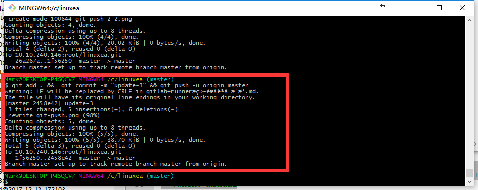
在打开gitlab中的pipeline，已经开始构建
PS：由于前面几步的内容都是echo，所以比较快的构建，后面直接运行了推送代码
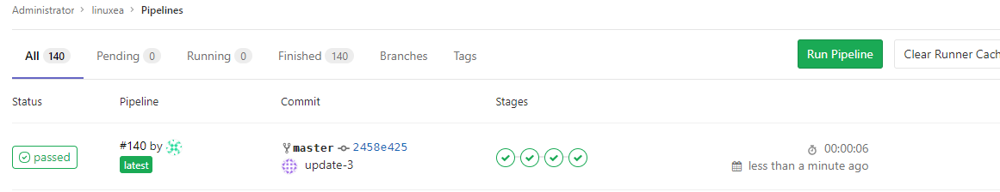
点击Passed可以看到构建的详细步骤
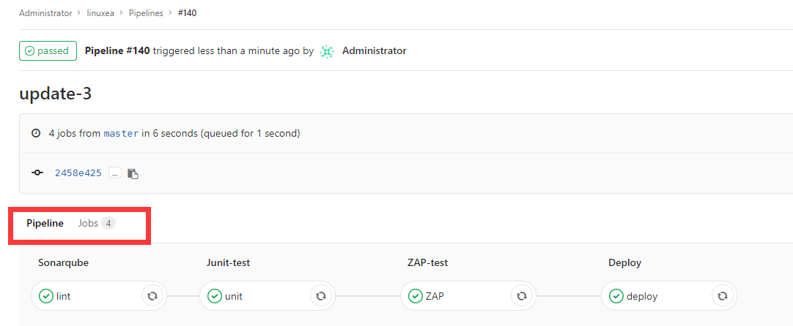
其中Pipeline中的每个步骤都可以点进去查看，也可以点击jobs的查看,点击旋转retry则重新执行一次
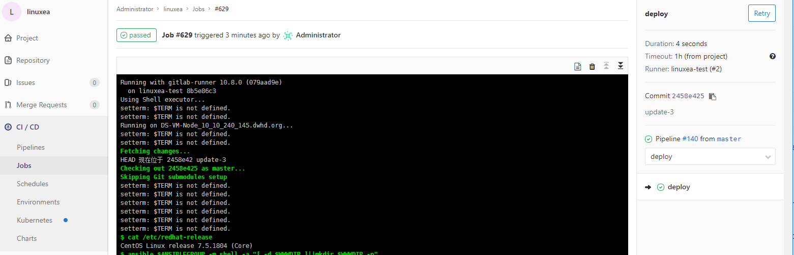
第一次自动更新完成。

### 回滚
在.gitlab-ci.yaml中打开 when: manual手动触发，如下图
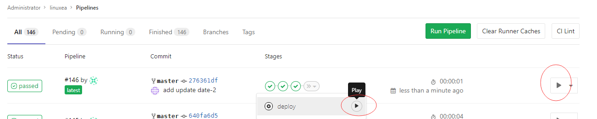
连续提交两次
提交第一次
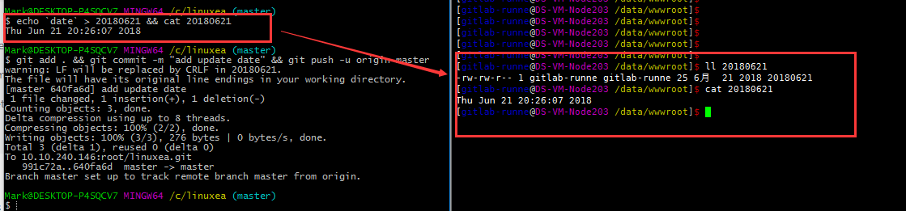
提交第二次
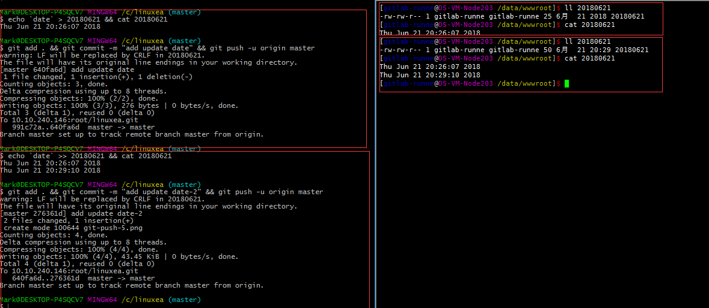
在web界面重新回到上个版本

在查看文件中的时间
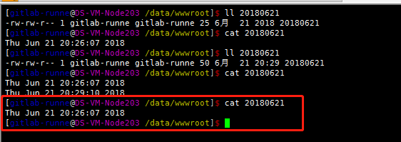


