gitlab-ci使用code climate，借鉴一些案列做增量的方式，并且我们试着加入sonar
* code climate

code climate是对GitHub和GitHub Enterprise做自动化代码审查 ，包括静态分析和测试覆盖率数据项，这些可以纳入整个开发流程中，如ci。通过有效的配置，在每次提交代码时候做出代码审查，减少错误，提高质量和测试覆盖率，他有辅助的浏览器插件支持，对Ruby，PHP，JavaScript和Python代码提供了高质量分析。并且它是可灵活配置的，并且也可以与jenkins CI build。
长期支持:
> Ruby
> Python
> PHP
> JavaScript
> Java
> TypeScript
> GoLang
> Swift

并且提供了大量的插件：`https://docs.codeclimate.com/docs/list-of-engines`
商业/开源
开源：`https://codeclimate.com/oss/`
gitlab and github :`https://github.com/codeclimate/codeclimate`
官网：`https://codeclimate.com/`

* sonarqube

sonarqube支持20多种编程语言，有长期维护的稳定版，可以对代码做质量检查，通过静态分析自动检查变成语言中的错误，异常以及安全漏洞，并且提供重复代码，编码标准，单元测试等报告。提供对Maven,ant,Gradle和持续集成工具的全自动分析提供支持
sonarqube官网：https://www.sonarqube.org/
相比较sonarqube和code climate，后者更适合小公司使用，前者在近年来的发展特别快，支持很多，受欢迎程度颇高，非常活跃
(终于完成了开场白，纯翻译与收集的信息，个人偏向使用Sonarqube)

10.0.1.61是sonar
10.10.240.202 是pgsql

## mysql配置
数据库授权(假如有数据库)：
```
MariaDB [(none)]> CREATE DATABASE sonar CHARACTER SET utf8 COLLATE utf8_general_ci;
Query OK, 1 row affected (0.00 sec)

MariaDB [(none)]> CREATE USER 'sonar' IDENTIFIED BY 'sonar';
Query OK, 0 rows affected (0.00 sec)

MariaDB [(none)]> GRANT ALL ON sonar.* TO 'sonar'@'10.0.1.61' IDENTIFIED BY 'sonar';
Query OK, 0 rows affected (0.00 sec)

MariaDB [(none)]>  FLUSH PRIVILEGES;
Query OK, 0 rows affected (0.00 sec)
```
下载sonarqube
downloads :https://www.sonarqube.org/downloads/
```
[marksugar@linuxea.com-Node61 ~]# unzip sonarqube-7.1.zip 
[marksugar@linuxea.com-Node61 ~]# mv sonarqube-7.1 /usr/local/sonarqube
sed -i 's/#sonar.web.host=0.0.0.0/sonar.web.host=0.0.0.0/g' /usr/local/sonarqube/conf/sonar.properties
sed -i 's/#sonar.web.port=9000/sonar.web.port=9009/g' /usr/local/sonarqube/conf/sonar.properties
sed -i 's/#sonar.jdbc.username=/sonar.jdbc.username=sonar/g' /usr/local/sonarqube/conf/sonar.properties
sed -i 's/#sonar.jdbc.password=/sonar.jdbc.password=sonar/g' /usr/local/sonarqube/conf/sonar.properties
echo 'sonar.jdbc.url=jdbc:mysql://10.10.240.203:3306/sonar?useUnicode=true&characterEncoding=utf8&rewriteBatchedStatements=true&useConfigs=maxPerformance' >> /usr/local/sonarqube/conf/sonar.properties
sonar.jdbc.url=jdbc:mysql://10.10.240.203:3306/sonar?useUnicode=true&characterEncoding=utf8&rewriteBatchedStatements=true&useConfigs=maxPerformance
```
mysql需要5.6以上，我们使用postgresql
## postgresql安装
在关系型数据库中SQLite and mysql and postgresql中后者相对是最新的，符合SQL的开源目标-RDBMS，但是mysql最受欢迎，普遍成都上使用较高，在mysql被收购后的mariadb更值得期待，但是在并发读写的问题上会有很多问题，但是在更新后相差不多
postgresql对数据的可靠性非常高，底层技术决定了pgsql可以快速有效的处理。由于实现了多版本并发控制（MVCC），它还确保了ACID的兼容性，因此不需要读锁就能实现对并发的支持。mysql只在innodb支持MVCC，mysql支持json索引，只支持数据类型，pgsql支持nosql/json等，但是postgresql配置更复杂。

ok，其实只是sonarqube官网推荐使用postgresql，我还是言归正传吧（编不下去了）！

### download 
yum安装下载页面：https://www.postgresql.org/download/linux/redhat/
二进制安装页面：https://www.enterprisedb.com/download-postgresql-binaries
```
[marksugar@linuxea.com-Node202 ~]# wget https://download.postgresql.org/pub/repos/yum/10/redhat/rhel-7-x86_64/pgdg-centos10-10-2.noarch.rpm
[marksugar@linuxea.com-Node202 ~]# yum localinstall pgdg-centos10-10-2.noarch.rpm -y
[marksugar@linuxea.com-Node202 ~]# yum install postgresql10-server postgresql10 -y 
[marksugar@linuxea.com-Node202 ~]# /usr/pgsql-10/bin/postgresql-10-setup initdb
Initializing database ... OK

[marksugar@linuxea.com-Node202 ~]# systemctl enable postgresql-10
Created symlink from /etc/systemd/system/multi-user.target.wants/postgresql-10.service to /usr/lib/systemd/system/postgresql-10.service.
[marksugar@linuxea.com-Node202 ~]# systemctl start postgresql-10
```
### useradd
pgsql创建数据库：
```
[marksugar@linuxea.com-Node202 ~]# su postgres
bash-4.2$ createuser -P -s -e sonar
Enter password for new role: 
Enter it again: 
SELECT pg_catalog.set_config('search_path', '', false)
CREATE ROLE sonar PASSWORD 'md5b05e02d26b524e4287428984d14a6824' SUPERUSER CREATEDB CREATEROLE INHERIT LOGIN;
bash-4.2$ psql
psql (10.4)
Type "help" for help.

postgres=# create database sonar owner=sonar;
CREATE DATABASE
```
### change configure
pgsql数据库配置修改
修改listen_addresses和port，并且添加防火墙放行
```
[marksugar@linuxea.com-Node202 /var/lib/pgsql/10/data]# sed -i "s/#listen_addresses =.*/listen_addresses = '*'/g" /var/lib/pgsql/10/data/postgresql.conf
[marksugar@linuxea.com-Node202 /var/lib/pgsql/10/data]# sed -i 's/#port =.*/port = 5432/g'  /var/lib/pgsql/10/data/postgresql.conf
[marksugar@linuxea.com-Node202 /var/lib/pgsql/10/data]# systemctl restart postgresql-10.service 
[marksugar@linuxea.com-Node202 /var/lib/pgsql/10/data]# ss -tlnp|grep postmaster
LISTEN     0      224          *:5432                     *:*                   users:(("postmaster",pid=5805,fd=3))
[marksugar@linuxea.com-Node202 /var/lib/pgsql/10/data]#  iptables -I INPUT 6  -s 10.0.1.61 -p tcp -m tcp -m state --state NEW -m multiport --dports 5432 -m comment --comment "psql" -j ACCEPT
```
* pgsql配置文件：
  pgsql配置文件中关注postgresql.conf和pg_hba.conf配置文件
```
  [marksugar@linuxea.com-Node202 /var/lib/pgsql/10/data]# ll /var/lib/pgsql/10/data/*.conf
  -rw------- 1 postgres postgres  4337 6月  15 14:39 /var/lib/pgsql/10/data/pg_hba.conf
  -rw------- 1 postgres postgres  1636 6月  15 13:54 /var/lib/pgsql/10/data/pg_ident.conf
  -rw------- 1 postgres postgres    88 6月  15 13:54 /var/lib/pgsql/10/data/postgresql.auto.conf
  -rw------- 1 postgres postgres 22678 6月  15 14:40 /var/lib/pgsql/10/data/postgresql.conf
  [marksugar@linuxea.com-Node202 /var/lib/pgsql/10/data]# 
```
## sonarqube configure

### 解压安装
* ps提示，docker的sonar位置：https://hub.docker.com/_/sonarqube/
  下载位置：https://www.sonarqube.org/downloads/

这里下载的是7.1版本的，并不是长期支持的LTS版本

```
[marksugar@linuxea.com-Node61 ~]# unzip sonarqube-7.1.zip
[marksugar@linuxea.com-Node61 ~]# mv sonarqube-7.1 /usr/local/sonarqube
[marksugar@linuxea.com-Node61 ~]# cd /usr/local/sonarqube
[marksugar@linuxea.com-Node61 /usr/local/sonarqube]# ln -s bin/linux-x86-64/sonar.sh /etc/init.d/sonar 
```
### 配置文件示例
这里用的是pgsql，需要修改如下
```
[sonar@linuxea-VM-Node61 logs]$ egrep -v "^$|^#" /usr/local/sonarqube/conf/sonar.properties 
sonar.jdbc.username=sonar
sonar.jdbc.password=sonar
sonar.jdbc.url=jdbc:postgresql://10.10.240.202/sonar
sonar.web.host=0.0.0.0
sonar.web.port=9000
[sonar@linuxea-VM-Node61 logs]$ 
```
### 创建用户
在7.1中的es需要普通用户进行启动，我们进行创建
```
[marksugar@linuxea.com-Node61 /usr/local/sonarqube]# useradd sonar
[marksugar@linuxea.com-Node61 /usr/local/sonarqube]# chown -R sonar.sonar 
/usr/local/sonarqube
```
### 切换到普通用户启动sonar
```
[marksugar@linuxea.com-Node61 /usr/local/sonarqube]# su sonar
[sonar@linuxea-VM-Node61 sonarqube]$ /etc/init.d/sonar start
[sonar@linuxea-VM-Node61 sonarqube]$ ps aux|grep sonar
root      5556  0.0  0.1 185600  4360 pts/0    S    14:52   0:00 su sonar
sonar     5557  0.0  0.1 116580  4612 pts/0    S    14:52   0:00 bash
sonar     5806  0.0  0.0  17816  1732 ?        Sl   14:53   0:00 /usr/local/sonarqube/bin/linux-x86-64/./wrapper /usr/localE
sonar     5808  6.7  2.9 2570324 115016 ?      Sl   14:53   0:04 java -Dsonar.wrapped=true -Djava.awt.headless=true -Xms8m p
sonar     5846 18.3 19.9 3183096 786808 ?      Sl   14:53   0:10 /usr/java/jdk1.8.0_131/jre/bin/java -XX:+UseConcMarkSweepGs
sonar     5968 36.4 10.3 3200584 409640 ?      Sl   14:53   0:18 /usr/java/jdk1.8.0_131/jre/bin/java -Djava.awt.headless=trs
sonar     6025 19.2  7.6 3152668 304016 ?      Sl   14:53   0:07 /usr/java/jdk1.8.0_131/jre/bin/java -Djava.awt.headless=trs
sonar     6158  0.0  0.0 151036  3712 pts/0    R+   14:54   0:00 ps aux
sonar     6159  0.0  0.0 112672  2144 pts/0    S+   14:54   0:00 grep --color=auto sonar
[sonar@linuxea-VM-Node61 sonarqube]$ 
```
这里需要知道的是，你需要安装jdk的，否则肯定是不行的
jdk下载页面：http://www.oracle.com/technetwork/java/javase/downloads/jdk8-downloads-2133151.html
### 日志位置
sonar配置文件：
如果配置有问题，会体现在web.log中，sonar.log和es.log，请关注
```
[sonar@linuxea-VM-Node61 sonarqube]$ ll /usr/local/sonarqube/logs/
总用量 220
-rw-r--r-- 1 sonar sonar      0 6月  15 13:33 access.log
-rw-r--r-- 1 sonar sonar   4501 6月  15 14:53 ce.log
-rw-r--r-- 1 sonar sonar  43248 6月  15 14:53 es.log
-rw-r--r-- 1 sonar sonar     88 4月  17 08:14 README.txt
-rw-r--r-- 1 sonar sonar  20247 6月  15 14:53 sonar.log
-rw-r--r-- 1 sonar sonar 144138 6月  15 14:53 web.log
[sonar@linuxea-VM-Node61 sonarqube]$ 
```
启动起来后防火墙也需要开放的
## 开始配置sonar+gitlab
打开IP:PORT 用户名admin密码amdin
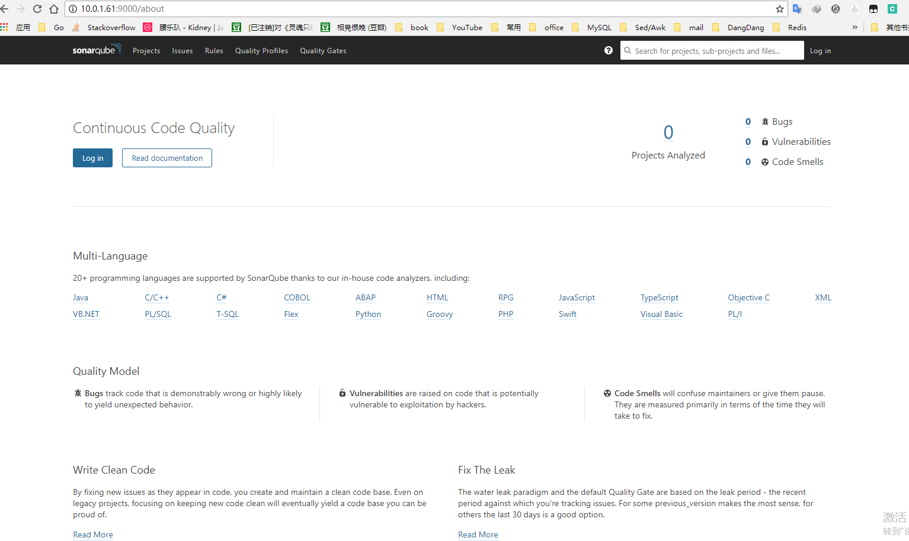
成功登录后

### 安装插件
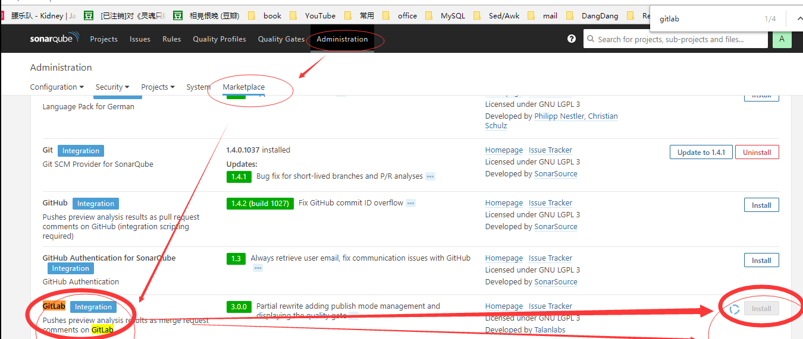
如果中间提示重启，重启即可。

### 开始配置gitlab插件
我们需要一个令牌，事实上在第一次启动sonar时候就需要了。这里的个人令牌仍然可以在第一次启动sonar提示的那个配置中生效，如下图所示，点击Create personal access token即可：
在打开gitlab中生成这个令牌是要放在sonar中的
GvP7GaxopwkoWqy7MZBh
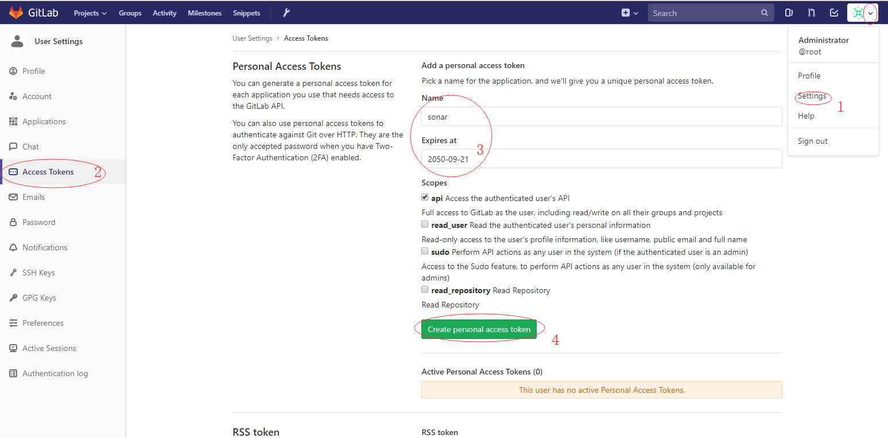

### 在配置sonar
回到sonar中，将信息填写到插件当中
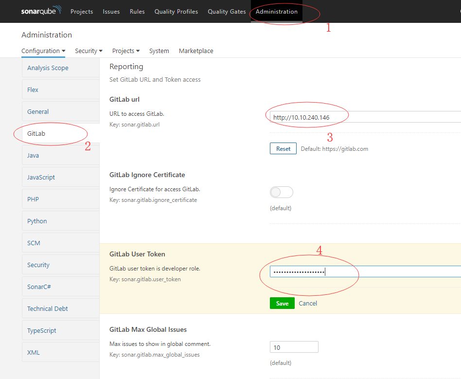
到此为止，gitlab和sonar已经关联完成

## 集成到ci
在gitlab的ci和cd中，官网是推荐用codeclimate，但是在使用过程中下载的速度奇慢，如果你使用的有问题，可参考sonar，后面则使用codeclimate(开源)，任选其一即可
codeclimate: https://github.com/codeclimate/codeclimate
* 有些权限问题需要提前解决，分别是docker和chown的权限，如果你有其他的，也需要授权
```
[marksugar@linuxea.com-Node_10_10_240_145 ~]$ usermod -G docker gitlab-runner 
[marksugar@linuxea.com-Node_10_10_240_145 ~]$ systemctl restart docker
[marksugar@linuxea.com-Node_10_10_240_145 ~]$ echo "gitlab-runner ALL=(root)NOPASSWD:/bin/chown" >>/etc/sudoers
```
### sonar-scanne
我们一如既往的使用docker来做，不过，不自己进行编写了build，直接使用现成的集成进去
docs : https://docs.sonarqube.org/display/SCAN/Analyzing+with+SonarQube+Scanner
docker：https://github.com/newtmitch/docker-sonar-scanner
#### gitlab-ci.yaml的部分说明
写入到gitlab-ci.yaml中
1，在stages中标记
```
stages:
  - code-check
```
2，全局变量的使用
```
  SONAR_URL: "http://10.0.1.61:9000"
  SONAR_KN: "sonar-linuxea"
  SONAR_CFG: "sonar-scanner -Dsonar.host.url=$SONAR_URL -Dsonar.projectKey=$SONAR_KN -Dsonar.projectName=$SONAR_KN -Dsonar.projectBaseDir=/root/src -Dsonar.sources=./ -Dsonar.java.binaries=./"
```
变量标明sonar server地址和端口，projectKey名称，java程序需要加上Dsonar.java.binaries=./
##### sonar-scanner
在开始之前，在runner机器上，提前拉取镜像：docker pull newtmitch/sonar-scanner 
```
1/2 sonarqube:
  stage: code-check
  script: 
    - docker run --rm
      --volume  $(pwd):/root/src 
      --volume /var/run/docker.sock:/var/run/docker.sock
      "newtmitch/sonar-scanner" $SONAR_CFG
    - sudo chown -R gitlab-runner.gitlab-runner ${PWD}
```
1/2 sonarqube指的是有两部分，sonarqube为部分之一
在script中，将当前目录下的所有都挂载到容器中的root/src下，$SONAR_CFG变量在全局变量中有写明，就是上面的那些参数
* 这里需要注意，sonar-scanner的镜像一定要提前拉取，否则可能会失败
###### 测试
添加一些错误Condition

提交后运行就会发现这些问题
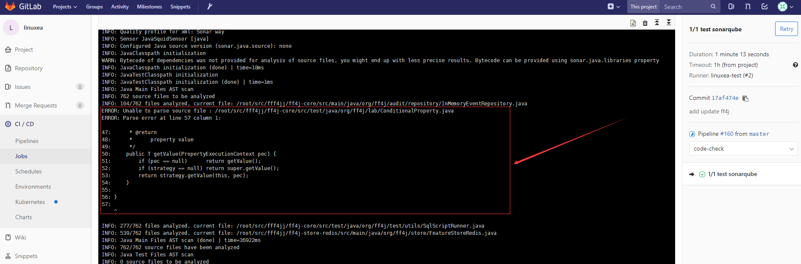
在来到sonarqube端
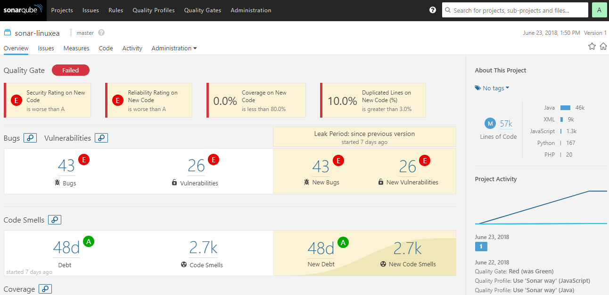
这个项目是从github克隆的一个项目测试使用

##### codeclimate（全量） 
codeclimate的git地址：https://github.com/codeclimate/codeclimate
codeclimate有开源和商业版的，可以关联到github上(https://codeclimate.com/dashboard)，并且gitlab官网的教程中是使用codeclimate的,参考：https://docs.gitlab.com/ee/ci/examples/code_climate.html
在运行后它会产生一个文件：codeclimate.json
* script
@主要来看script部分，其他的部分参阅官网的手册：https://docs.gitlab.com/ee/ci/yaml/README.html
`export SP_VERSION=$(echo "$CI_SERVER_VERSION" | sed 's/^\([0-9]*\)\.\([0-9]*\).*/\1-\2-stable/')`:主要获取gitlab版本号
在run的过程中传递一个变量`SOURCE_CODE="$PWD"`，这个变量必须要传递到镜像内
当run起`codequality:$SP_VERSION`镜像的时候，会run起`codeclimate/codeclimate:0.72.0`(run之前也需要拉取),codeclimate会去拉取镜像：
```
codeclimate/codeclimate-structure
codeclimate/codeclimate-duplication
codeclimate/codeclimate-eslint   
```
这几个镜像非常大，需要提前下载 好，不然可能会报超时的错误。如果下载失败可以考虑使用sonar
@这个里面的版本号是自动的，在`registry.gitlab.com/gitlab-org/security-products/codequality:10-8-stable`(这里是10-8的版本，识别去pull的)，容器中有个脚本会做处理，这也就是前面说的，在启动codequality后会run一个codeclimate容器，脚本如下：
```
#!/bin/sh

usage="$(basename "$0") [-h] <app_path>

where:
    -h  show this help text
    app_path The path to the source code of the project you want to analyze."

while getopts 'h' option; do
  case "$option" in
    h) echo "$usage"
       exit
       ;;
    :) printf "missing argument for -%s\n" "$OPTARG" >&2
       echo "$usage" >&2
       exit 1
       ;;
   \?) printf "illegal option: -%s\n" "$OPTARG" >&2
       echo "$usage" >&2
       exit 1
       ;;
  esac
done
shift $((OPTIND - 1))

if [ $# -ne 1 ] ; then
  echo "$usage"
  exit
fi

APP_PATH=$1
DEFAULT_FILES_PATH=${DEFAULT_FILES_PATH:-/codeclimate_defaults}
CODECLIMATE_VERSION=${CODECLIMATE_VERSION:-0.72.0}
CONTAINER_TIMEOUT_SECONDS=${TIMEOUT_SECONDS:-900} # default to 15 min

if [ -z "$SOURCE_CODE" ] ; then
  echo "SOURCE_CODE env variable not set"
  exit
fi

# Copy default config files unless already present for csslint, eslint (ignore), rubocop and coffeelint
for config_file in .csslintrc .eslintignore .rubocop.yml coffeelint.json; do
  if [ ! -f  $APP_PATH/$config_file ] ; then
    cp $DEFAULT_FILES_PATH/$config_file $APP_PATH/
  fi
done

# Copy default config file unless already present for code climate
# NB: check for all supported config files
if ! [ -f  $APP_PATH/.codeclimate.yml -o -f $APP_PATH/.codeclimate.json ] ; then
  cp $DEFAULT_FILES_PATH/.codeclimate.yml $APP_PATH/
fi

# Copy default config file unless already present for eslint
# NB: check for all supported config files
if ! [ -f  $APP_PATH/.eslintrc.js -o -f $APP_PATH/.eslintrc.yaml -o -f $APP_PATH/.eslintrc.yml -o -f $APP_PATH/.eslintrc.json -o -f $APP_PATH/.eslintrc ] ; then
  cp $DEFAULT_FILES_PATH/.eslintrc.yml $APP_PATH/
fi

# Run the code climate container.
# SOURCE_CODE env variable must be provided when launching this script. It allow
# code climate engines to mount the source code dir into their own container.
# TIMEOUT_SECONDS env variable is optional. It allows you to increase the timeout
# window for the analyze command.
docker run \
    --env CODECLIMATE_CODE="$SOURCE_CODE" \
    --env CONTAINER_TIMEOUT_SECONDS=$CONTAINER_TIMEOUT_SECONDS \
    --volume "$SOURCE_CODE":/code \
    --volume /tmp/cc:/tmp/cc \
    --volume /var/run/docker.sock:/var/run/docker.sock \
    "codeclimate/codeclimate:$CODECLIMATE_VERSION" analyze -f json > /tmp/raw_codeclimate.json

if [ $? -ne 0 ]; then
    echo "Could not analyze code quality for the repository at $APP_PATH"
    exit 1
fi

# Only keep "issue" type
jq -c 'map(select(.type | test("issue"; "i")))' /tmp/raw_codeclimate.json > "$APP_PATH/codeclimate.json"
```
.gitlab-ci.yaml的codequality如下：
直接复制粘贴即可使用
```
  stage: code-check
  image: docker:stable
  variables:
    DOCKER_DRIVER: overlay2
  allow_failure: true
  services:
    - docker:stable-dind
  script:
    - export SP_VERSION=$(echo "$CI_SERVER_VERSION" | sed 's/^\([0-9]*\)\.\([0-9]*\).*/\1-\2-stable/')
    - docker run --rm
        --env SOURCE_CODE="$PWD"
        --volume "$PWD":/code
        --volume /var/run/docker.sock:/var/run/docker.sock
        "registry.gitlab.com/gitlab-org/security-products/codequality:$SP_VERSION" /code
  artifacts:
    paths: [codeclimate.json]
```
###### 测试
提交代码后会自动执行
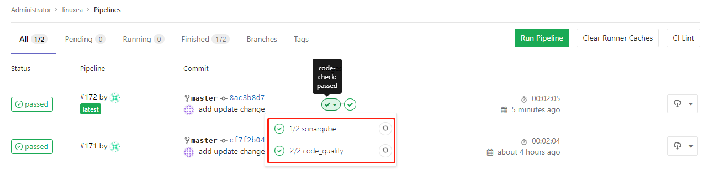
选择**code_quality**点击进去
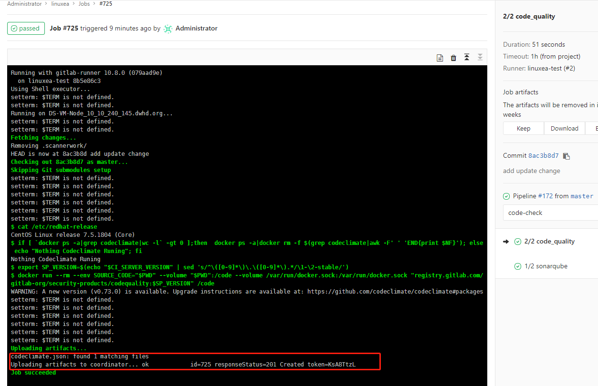
目录下会生成一个文件

##### **Codeclimate + git** (增量)
在CSDN上有位博主使用git做成增量：https://blog.csdn.net/aixiaoyang168/article/details/80014647#4codeclimate-%E5%9F%BA%E6%9C%AC%E5%91%BD%E4%BB%A4%E4%BD%BF%E7%94%A8 我修改了一下到了.gitlab-ci中
使用git检出来做`git archive -o ./version-$(git rev-parse HEAD)-latest.tar.gz $(git rev-parse HEAD) $(git diff --name-only HEAD HEAD~1)`将本次提交与上次代码的差异做检测
打包输出两个版本间的改变增量归档 
具体来看下：
* 不能创建在项目根目录下，因为每个步骤都会重新重新Fetch，那么在下一次执行Fetch之后创建的文件将被删除
* PATHD: /home/gitlab-runner/Increment/
```
3/3 code_quality_Increment:
  <<: *job_Static_code
  script:
    - if [ `docker ps -a|egrep "codeclimate|gitlab"|wc -l` -gt 0 ];then  docker ps -a|docker rm -f $(egrep "gitlab|codeclimate"|awk -F' ' 'END{print $NF}'); else echo "Nothing Codeclimate Runing"; fi
    - export VERSION_PATH=$(echo "$CI_REPOSITORY_URL"|awk -F'/' '{print $NF}')
    - export PATH_LAST=$PATHD$VERSION_PATH
    - if [ -d $PATH_LAST ];then echo "$PATH_LAST is runing"; else mkdir $PATH_LAST -p; fi
    - git archive -o $PWD/version-$(git rev-parse HEAD)-latest.tar.gz $(git rev-parse HEAD) $(git diff --name-only HEAD HEAD~1)
    - tar xf version-$(git rev-parse HEAD)-latest.tar.gz -C $PATH_LAST
    - export SP_VERSION=$(echo "$CI_SERVER_VERSION" | sed 's/^\([0-9]*\)\.\([0-9]*\).*/\1-\2-stable/')
    - docker run --rm
        --env SOURCE_CODE="$PATH_LAST"
        --volume $PATH_LAST:/code
        --volume /var/run/docker.sock:/var/run/docker.sock
        "registry.gitlab.com/gitlab-org/security-products/codequality:$SP_VERSION" /code
  artifacts:
    paths: [codeclimate.json]   
```
提交一次
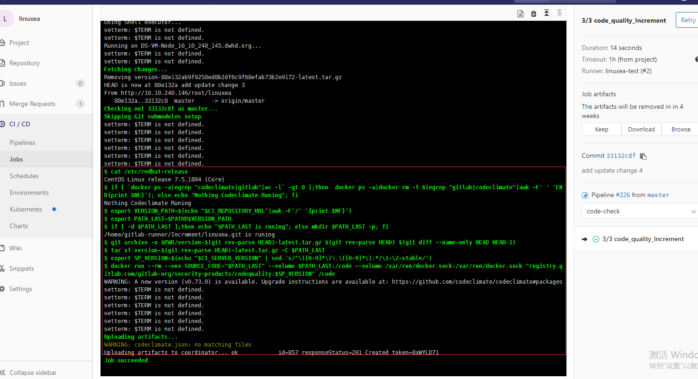
不能创建在项目根目录下，因为每个步骤都会重新重新Fetch

* 这样一来可不当紧，那codeclimate.json文件就存放在/home/gitlab-runner/Increment/项目名.git下，如果有必要可以在最后的步骤移动到代码根目录下

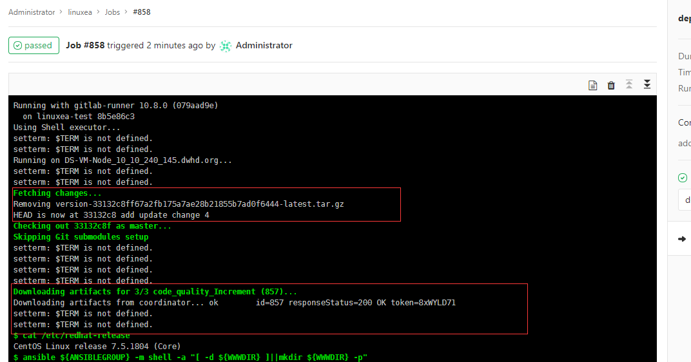
目录下已经有了上次提交的文件和处理过的json文件

```
[gitlab-runner@linuxea-VM-Node_10_10_240_145 ~/builds/8b5e86c3/0/root/linuxea]$ ll ~/Increment/linuxea.git/
总用量 12
-rw-r--r-- 1 root          root          7091 6月  25 11:46 codeclimate.json
-rw-r--r-- 1 root          root          2320 6月  25 11:38 coffeelint.json
drwxrwxr-x 5 gitlab-runner gitlab-runner   80 6月  25 11:46 linuxea
[gitlab-runner@linuxea-VM-Node_10_10_240_145 ~/builds/8b5e86c3/0/root/linuxea]$ 
```
其他参考：https://github.com/codeclimate/test-reporter/blob/master/examples/php_examples.md
其他参考：https://docs.codeclimate.com/docs/advanced-configuration
另外，合并代码也会进行检测
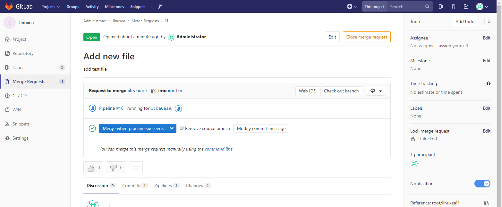
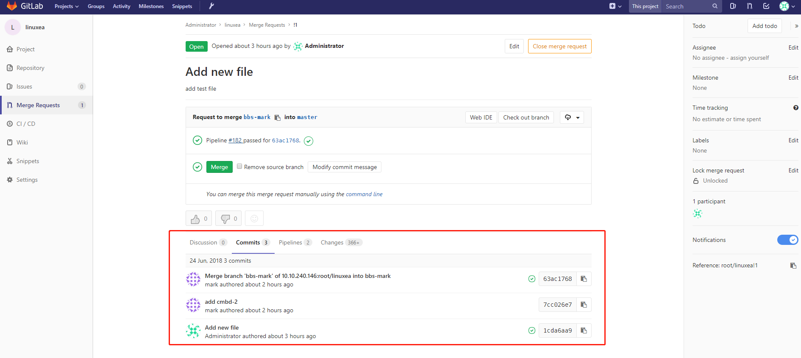

#### .gitlab-ci.yaml文件
yaml文件内容如下
其中如果docker运行后会出现没有删除的情况，这样以来会产生大量的无用容器，加条判断，在一开始就执行
```
- if [ `docker ps -a|egrep "codeclimate|gitlab"|wc -l` -gt 0 ];then  docker ps -a|docker rm -f $(egrep "gitlab|codeclimate"|awk -F' ' 'END{print $NF}'); else echo "Nothing Codeclimate Runing"; fi
```
如下：
```
stages:
  - code-check
  - deploy

# 变量
variables:
  WWWDIR: "/data/wwwroot"
  ANSIBLEGROUP: "linuxea"
  LANG: "en_US.UTF-8"
  VERSION: "1.11"
  SONAR_URL: "http://10.0.1.61:9000"
  SONAR_KN: "sonar-linuxea"
  SONAR_CFG: "sonar-scanner -Dsonar.host.url=$SONAR_URL -Dsonar.projectKey=$SONAR_KN -Dsonar.projectName=$SONAR_KN -Dsonar.projectBaseDir=/root/src -Dsonar.sources=./ -Dsonar.java.binaries=./"
# 所有 stage 之前的操作
before_script:
  - cat /etc/redhat-release 
.code_check_Static: &job_Static_code
  stage: code-check
  image: docker:stable
  variables:
    DOCKER_DRIVER: overlay2
    PATHD: /home/gitlab-runner/Increment/
  allow_failure: true
  services:
    - docker:stable-dind
# sonarqube代码检查
1/3 sonarqube:
  stage: code-check
  script: 
    - docker run --rm
      --volume  $(pwd):/root/src 
      --volume /var/run/docker.sock:/var/run/docker.sock
      "newtmitch/sonar-scanner" $SONAR_CFG
    - sudo chown -R gitlab-runner.gitlab-runner ${PWD} 
2/3 code_quality:
  <<: *job_Static_code
  script:
    - if [ `docker ps -a|egrep "codeclimate|gitlab"|wc -l` -gt 0 ];then  docker ps -a|docker rm -f $(egrep "gitlab|codeclimate"|awk -F' ' 'END{print $NF}'); else echo "Nothing Codeclimate Runing"; fi
    - export SP_VERSION=$(echo "$CI_SERVER_VERSION" | sed 's/^\([0-9]*\)\.\([0-9]*\).*/\1-\2-stable/')
    - docker run --rm
        --env SOURCE_CODE="$PWD"
        --volume "$PWD":/code
        --volume /var/run/docker.sock:/var/run/docker.sock
        "registry.gitlab.com/gitlab-org/security-products/codequality:$SP_VERSION" /code
  artifacts:
    paths: [codeclimate.json]
3/3 code_quality_Increment:
  <<: *job_Static_code
  script:
    - if [ `docker ps -a|egrep "codeclimate|gitlab"|wc -l` -gt 0 ];then  docker ps -a|docker rm -f $(egrep "gitlab|codeclimate"|awk -F' ' 'END{print $NF}'); else echo "Nothing Codeclimate Runing"; fi
    - export VERSION_PATH=$(echo "$CI_REPOSITORY_URL"|awk -F'/' '{print $NF}')
    - export PATH_LAST=$PATHD$VERSION_PATH
    - if [ -d $PATH_LAST ];then echo "$PATH_LAST is runing"; else mkdir $PATH_LAST -p; fi
    - git archive -o $PWD/version-$(git rev-parse HEAD)-latest.tar.gz $(git rev-parse HEAD) $(git diff --name-only HEAD HEAD~1)
    - tar xf version-$(git rev-parse HEAD)-latest.tar.gz -C $PATH_LAST
    - export SP_VERSION=$(echo "$CI_SERVER_VERSION" | sed 's/^\([0-9]*\)\.\([0-9]*\).*/\1-\2-stable/')
    - docker run --rm
        --env SOURCE_CODE="$PATH_LAST"
        --volume $PATH_LAST:/code
        --volume /var/run/docker.sock:/var/run/docker.sock
        "registry.gitlab.com/gitlab-org/security-products/codequality:$SP_VERSION" /code
  artifacts:
    paths: [codeclimate.json]   
# 部署到服务器
deploy:
  stage: deploy
  only:
    - master 
  script:
    - ansible ${ANSIBLEGROUP} -m shell -a "[ -d ${WWWDIR} ]||mkdir ${WWWDIR} -p"
    - ansible ${ANSIBLEGROUP} -m synchronize -a 'src=./ dest=${WWWDIR}/ rsync_opts=--delete,--exclude=*.json,--exclude=*.yml,--exclude=*.git'
    #- ansible ${ANSIBLEGROUP} -m shell -a "chown -R 400.400 /data/wwwroot/"
  #when: manual
```
在第一次使用全量的方式检测，后面都使用增量，本次的分享到此结束