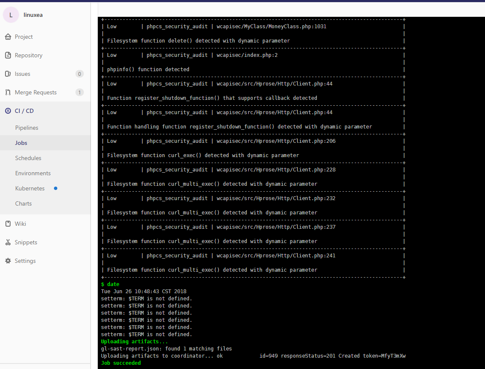

## SAST

SAST全拼Static Application Security Testing(静态应用安全测试)
下表显示支持哪些语言，软件包管理器和框架以及使用哪些工具。
| Language (package managers) / framework                      | Scan tool                                                    |
| ------------------------------------------------------------ | ------------------------------------------------------------ |
| C/C++                                                        | [Flawfinder](https://www.dwheeler.com/flawfinder/)           |
| Python ([pip](https://pip.pypa.io/en/stable/))               | [bandit](https://github.com/openstack/bandit)                |
| Ruby on Rails                                                | [brakeman](https://brakemanscanner.org)                      |
| Java ([Maven](https://maven.apache.org/) and [Gradle](https://gradle.org/)) | [find-sec-bugs](https://find-sec-bugs.github.io/)            |
| Scala ([sbt](https://www.scala-sbt.org/))                    | [find-sec-bugs](https://find-sec-bugs.github.io/)            |
| Go (experimental)                                            | [Go AST Scanner](https://github.com/GoASTScanner/gas)        |
| PHP                                                          | [phpcs-security-audit](https://github.com/FloeDesignTechnologies/phpcs-security-audit) |
| .NET                                                         | [Security Code Scan](https://security-code-scan.github.io)   |
| Node.js                                                      | [NodeJsScan](https://github.com/ajinabraham/NodeJsScan)      |
### 集成GitLab
首先，需要GitLab Runner和[docker-in-docker执行程序](https://docs.gitlab.com/ee/ci/docker/using_docker_build.html#use-docker-in-docker-executor)。然后你可以添加一个新的工作`.gitlab-ci.yml`，称为`sast`： 
```
sast:
  image: docker:stable
  variables:
    DOCKER_DRIVER: overlay2
  allow_failure: true
  services:
    - docker:stable-dind
  script:
    - export SP_VERSION=$(echo "$CI_SERVER_VERSION" | sed 's/^\([0-9]*\)\.\([0-9]*\).*/\1-\2-stable/')
    - docker run
        --env SAST_CONFIDENCE_LEVEL="${SAST_CONFIDENCE_LEVEL:-3}"
        --volume "$PWD:/code"
        --volume /var/run/docker.sock:/var/run/docker.sock
        "registry.gitlab.com/gitlab-org/security-products/sast:$SP_VERSION" /app/bin/run /code
  artifacts:
    paths: [gl-sast-report.json]
```
我们把他写入到我的.gitlab-ci.yml中
* 它会自动扫描并且匹配扫描工具，这意味着会去下载相应的镜像，请注意，如果镜像太大，可能失败，使用docker pull会更有用
```
4/4 sast:
  <<: *job_Static_code    
  script:
    - export SP_VERSION=$(echo "$CI_SERVER_VERSION" | sed 's/^\([0-9]*\)\.\([0-9]*\).*/\1-\2-stable/')
    - docker run --rm
       --env SAST_CONFIDENCE_LEVEL="${SAST_CONFIDENCE_LEVEL:-3}"
       --volume "$PWD":/code
       --volume /etc/localtime:/etc/localtime:ro
       --volume /var/run/docker.sock:/var/run/docker.sock
       "registry.gitlab.com/gitlab-org/security-products/sast:${SP_VERSION}" /app/bin/run /code
    - date
  artifacts:
    paths: [gl-sast-report.json]   
```
#### 注意
当运行的时候会检测代码并且去拉去相应的镜像服务,并且up，这个过程建议提前拉取镜像,如果检测是java则拉find-sec-bugs，php则会phpcs-security-audit，如下：
```
registry.gitlab.com/gitlab-org/security-products/analyzers/phpcs-security-audit   10-8-stable         deb0ae7639e1        6 weeks ago         402MB
registry.gitlab.com/gitlab-org/security-products/analyzers/find-sec-bugs          10-8-stable         8e096a39d6d1        6 weeks ago         775MB
```
当然，为了缩短运行的时间，也可以参考Scan tool中的名称提前拉取镜像
一旦Up起来就会运行起容器
```
[gitlab-runner@linuxea-vm-Node_10_10_240_145 ~/builds/8b5e86c3/0/root/linuxea]$ docker ps -a
CONTAINER ID        IMAGE                                                                           COMMAND                CREATED             STATUS              PORTS               NAMES
a6206abd0b3a        registry.gitlab.com/gitlab-org/security-products/analyzers/bandit:10-8-stable   "/analyzer run"        1 second ago        Created                                 dreamy_lichterman
d0ecf28d2de5        registry.gitlab.com/gitlab-org/security-products/sast:10-8-stable               "/app/bin/run /code"   4 seconds ago       Up 3 seconds                            upbeat_blackwell
[gitlab-runner@linuxea-vm-Node_10_10_240_145 ~/builds/8b5e86c3/0/root/linuxea]$ 
```
#### 测试
提交代码后测试(php的代码)


```
[gitlab-runner@linuxea-vm-Node_10_10_240_145 ~/builds/8b5e86c3/0/root/linuxea]$ ll -sh gl-sast-report.json
60K -rw-r--r-- 1 gitlab-runner gitlab-runner 58K 6月  26 10:48 gl-sast-report.json
[gitlab-runner@linuxea-vm-Node_10_10_240_145 ~/builds/8b5e86c3/0/root/linuxea]$ 
```
gitlab官方文档参考：`https://docs.gitlab.com/ee/ci/examples/sast.html`
仓库：`https://gitlab.com/gitlab-org/security-products/sast`
在页面中下载json
