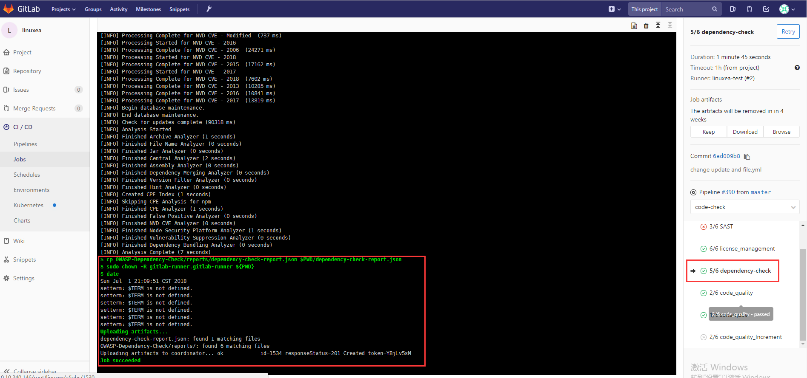
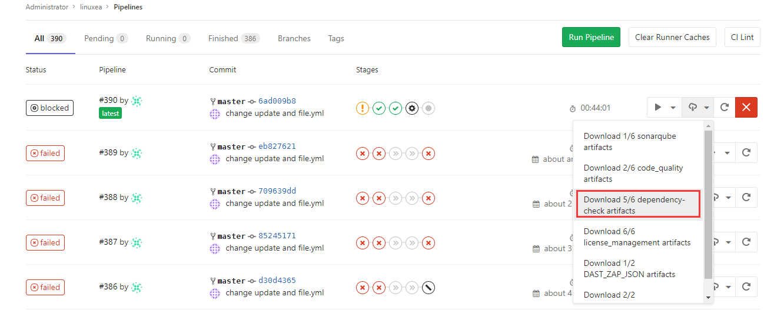
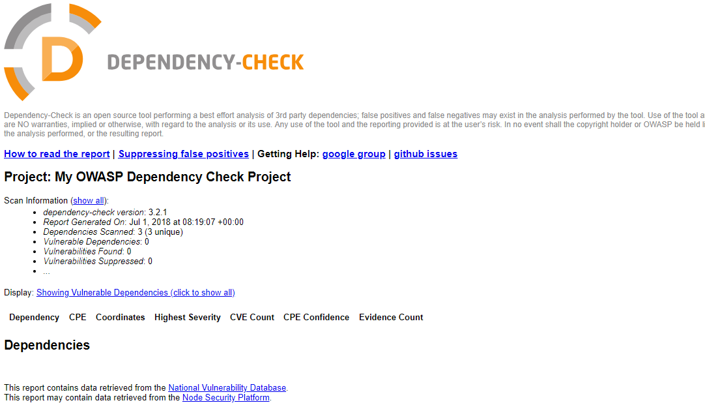

##  Dependency
如果正在使用[GitLab CI / CD](https://docs.gitlab.com/ee/ci/README.html)，则可以使用依赖项扫描来分析已知漏洞的依赖关系，方法是将CI作业包含在[现有`.gitlab-ci.yml`文件中，](https://docs.gitlab.com/ee/ci/examples/dependency_scanning.html)或使用[Auto DevOps](https://docs.gitlab.com/ee/topics/autodevops/index.html) 提供的[自动](https://docs.gitlab.com/ee/topics/autodevops/index.html)[依赖项扫描](https://docs.gitlab.com/ee/topics/autodevops/index.html#auto-dependency-scanning) 
依赖扫描参考：
```
https://docs.gitlab.com/ee/user/project/merge_requests/dependency_scanning.html
https://docs.gitlab.com/ee/ci/examples/dependency_scanning.html
```
使用dependency-scanning替代Dependency-Check，我顺便介绍下Dependency-Check，在后面
```
https://github.com/jeremylong/DependencyCheck
```
* 支持的语言和包管理器
The following table shows which languages and package managers are supported and which tools are used.

| Language (package managers)                                                 | Scan tool                                                                                                                         |
|-----------------------------------------------------------------------------|-----------------------------------------------------------------------------------------------------------------------------------|
| JavaScript ([npm](https://www.npmjs.com/), [yarn](https://yarnpkg.com/en/)) | [gemnasium](https://gitlab.com/gitlab-org/security-products/gemnasium/general), [Retire.js](https://retirejs.github.io/retire.js)         |
| Python ([pip](https://pip.pypa.io/en/stable/))                              | [gemnasium](https://gitlab.com/gitlab-org/security-products/gemnasium/general)                                                            |
| Ruby ([gem](https://rubygems.org/))                                         | [gemnasium](https://gitlab.com/gitlab-org/security-products/gemnasium/general), [bundler-audit](https://github.com/rubysec/bundler-audit) |
| Java ([Maven](https://maven.apache.org/))                                   | [gemnasium](https://gitlab.com/gitlab-org/security-products/gemnasium/general),                                                           |
| PHP ([Composer](https://getcomposer.org/))                                  | [gemnasium](https://gitlab.com/gitlab-org/security-products/gemnasium/general)                                                            |

### 集成GitLab
```
# 依赖扫描    
4/8 dependency-scanning:
  <<: *job_docker_group
  script:
    - export SP_VERSION=$(echo "$CI_SERVER_VERSION" | sed 's/^\([0-9]*\)\.\([0-9]*\).*/\1-\2-stable/')
    - docker run --rm
        --env DEP_SCAN_DISABLE_REMOTE_CHECKS="${DEP_SCAN_DISABLE_REMOTE_CHECKS:-false}"
        --volume "$PWD:/code"
        --volume /etc/localtime:/etc/localtime:ro
        --volume /var/run/docker.sock:/var/run/docker.sock
        "registry.gitlab.com/gitlab-org/security-products/dependency-scanning:$SP_VERSION" /code
    - date
  artifacts:
    paths: [gl-dependency-scanning-report.json]    
#  except:
#    variables:
#      - $CONTAINER_SCANNING_DISABLE
```
so，在gitlab官网提供的镜像中，很明显的这个报:Source code language/dependency manager is not yet supported for analyze 


## Dependency-Check
假如你觉得上面的那个不好用，没关系，还可以用Dependency-Check
Dependency-Check是一种软件组合分析（SCA）工具，它试图检测项目依赖项中包含的公开披露的漏洞。它通过确定给定依赖项是否存在公共平台枚举（CPE）标识符来完成此操作。如果找到，它将生成链接到相关CVE条目的报告。
文档和生产二进制版本的链接可以在[github页面](http://jeremylong.github.io/DependencyCheck/)上找到。此外，关于体系结构的更多信息和扩展依赖性检查的方法可以在[wiki](https://github.com/jeremylong/DependencyCheck/wiki)上找到。
目前，支持Java和.NET; 针对Ruby，Node.js，Python以及对C / C ++构建系统（autoconf和cmake）的有限支持已添加额外的实验支持 
参考：

```
https://jeremylong.github.io/DependencyCheck/dependency-check-cli/index.html
```
原本的docker脚本如下：
```
#!/bin/sh

OWASPDC_DIRECTORY=$HOME/OWASP-Dependency-Check
DATA_DIRECTORY="$OWASPDC_DIRECTORY/data"
REPORT_DIRECTORY="$OWASPDC_DIRECTORY/reports"

if [ ! -d "$DATA_DIRECTORY" ]; then
    echo "Initially creating persistent directories"
    mkdir -p "$DATA_DIRECTORY"
    chmod -R 777 "$DATA_DIRECTORY"

    mkdir -p "$REPORT_DIRECTORY"
    chmod -R 777 "$REPORT_DIRECTORY"
fi

# Make sure we are using the latest version
docker pull owasp/dependency-check

docker run --rm \
    --volume $(pwd):/src \
    --volume "$DATA_DIRECTORY":/usr/share/dependency-check/data \
    --volume "$REPORT_DIRECTORY":/report \
    owasp/dependency-check \
    --scan /src \
    --format "ALL" \
    --project "My OWASP Dependency Check Project" \
    --out /report
    # Use suppression like this: (/src == $pwd)
    # --suppression "/src/security/dependency-check-suppression.xml"
```
ok，我们修改下集成到gitlab里面(当然，提前pull镜像 `docker pull owasp/dependency-check`)
### 集成GitLab
注意：这里有个权限问题`gitlab-runner ALL=(root)NOPASSWD:/bin/chown,/bin/mkdir,/bin/chmod  `
```
5/8 dependency-check:
  stage: code-check
  script: 
    - export OWASPDC_DIRECTORY=$PWD/OWASP-Dependency-Check
    - export DATA_DIRECTORY=$OWASPDC_DIRECTORY/data
    - export REPORT_DIRECTORY=$OWASPDC_DIRECTORY/reports
    - '[[ ! -d "$DATA_DIRECTORY" ]] || echo "Initially creating persistent directories" && mkdir -p "$DATA_DIRECTORY" && sudo chmod -R 777 "$DATA_DIRECTORY" && mkdir -p "$REPORT_DIRECTORY" && sudo chmod -R 777 "$REPORT_DIRECTORY"'
    - docker run --rm
     --volume $(pwd):/src
     --volume "$DATA_DIRECTORY":/usr/share/dependency-check/data
     --volume "$REPORT_DIRECTORY":/report 
     "owasp/dependency-check"
     --scan /src
     --format "ALL"
     --project "My OWASP Dependency Check Project"
     --out /report
    - cp OWASP-Dependency-Check/reports/dependency-check-report.json $PWD/dependency-check-report.json
    - sudo chown -R gitlab-runner.gitlab-runner ${PWD}
    - date
  artifacts:
    paths: 
      - dependency-check-report.json
      - OWASP-Dependency-Check/reports/
```
试着运行一次

这里会产生几个文件

```
[gitlab-runner@www.linuxea.com linuxea]$ ll OWASP-Dependency-Check/reports/
总用量 272
-rw-r--r-- 1 gitlab-runner gitlab-runner    223 7月   1 21:09 dependency-check-report.csv
-rw-r--r-- 1 gitlab-runner gitlab-runner 139030 7月   1 21:09 dependency-check-report.html
-rw-r--r-- 1 gitlab-runner gitlab-runner  12086 7月   1 21:09 dependency-check-report.json
-rw-r--r-- 1 gitlab-runner gitlab-runner   8964 7月   1 21:09 dependency-check-report.xml
-rw-r--r-- 1 gitlab-runner gitlab-runner 110002 7月   1 21:09 dependency-check-vulnerability.html
[gitlab-runner@www.linuxea.com linuxea]$ 
```
下载下来即可查看

打开dependency-check-report.html，如下图：
点击：Display: [Showing Vulnerable Dependencies (click to show all)](#)  即可查看
