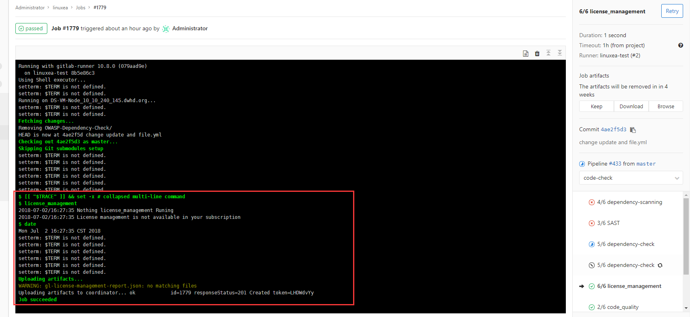

## license_management

GitLab工具，用于检测由提供的源使用的依赖关系的许可证。它目前仅基于许可证查找器，但将来可能会发生变化。
关于这一项可以不加入到自动化里面。因为在官方中发生了改变：https://docs.gitlab.com/ee/user/application_security/license_management/

* 支持的语言和包管理器
| Language   | Package managers                                             |
| ---------- | ------------------------------------------------------------ |
| JavaScript | [Bower](https://bower.io/), [npm](https://www.npmjs.com/)    |
| Go         | [Godep](https://github.com/tools/godep), go get              |
| Java       | [Gradle](https://gradle.org/), [Maven](https://maven.apache.org/) |
| .NET       | [Nuget](https://www.nuget.org/)                              |
| Python     | [pip](https://pip.pypa.io/en/stable/)                        |
| Ruby       | [gem](https://rubygems.org/)                                 |
### 集成Gitlab
这里的小细节是，需要判断"dependency-scanning"容器是否有搁置的，如果有就删除，这一点很重要
因为在运行的过程中，会出现很多问题，比如中断，失败等，如果没有删除则会出问题
--rm非常重要
```
5/8 license_management:
  stage: code-check
  image: docker:stable
  variables:
    DOCKER_DRIVER: overlay2
    PATHD: /home/gitlab-runner/Increment/
  allow_failure: true
  services:
    - docker:stable-dind 
  script:
    - if [ `docker ps -a|egrep "dependency-scanning"|wc -l` -gt 0 ];then  docker ps -a|docker rm -f $(egrep "dependency-scanning"|awk -F' ' 'END{print $NF}'); else echo "Nothing dependency-scanning Runing"; fi
    - export LICENSE_MANAGEMENT_VERSION=$(echo "$CI_SERVER_VERSION" | sed 's/^\([0-9]*\)\.\([0-9]*\).*/\1-\2-stable/')
    - docker run --rm
        --volume /etc/localtime:/etc/localtime:ro    
        --volume "$PWD:/code"
        "registry.gitlab.com/gitlab-org/security-products/license-management:latest" analyze /code       
    - date
  artifacts:
    paths: [gl-license-management-report.json]  
```
在 开始之前，我们可以测试下：
```
[gitlab-runner@www.linuxea.com linuxea]$ docker run --rm registry.gitlab.com/gitlab-org/security-products/license-management /test/test.sh
[INFO] Installing /code/java-maven/target/java-maven-1.0-SNAPSHOT.jar to /root/.m2/repository/com/gitlab/security_products/tests/java-maven/1.0-SNAPSHOT/java-maven-1.0-SNAPSHOT.jar
[INFO] Installing /code/java-maven/pom.xml to /root/.m2/repository/com/gitlab/security_products/tests/java-maven/1.0-SNAPSHOT/java-maven-1.0-SNAPSHOT.pom
[INFO] ------------------------------------------------------------------------
[INFO] BUILD SUCCESS
[INFO] ------------------------------------------------------------------------
[INFO] Total time: 02:54 min
[INFO] Finished at: 2018-07-02T02:41:15Z
[INFO] Final Memory: 20M/133M
[INFO] ------------------------------------------------------------------------
Running license_finder  in /code/java-maven
LicenseFinder::Maven: is active
/code/java-maven
All tests are OK.
```
那么在使用前需要判断一下是否存在license_management，如果没有则跳过打印`License management is not available in your subscription`
如果引用的话，那大概是这样的，如下：
```
  function license_management() {
    export LICENSE_MANAGEMENT_VERSION=$(echo "$CI_SERVER_VERSION" | sed 's/^\([0-9]*\)\.\([0-9]*\).*/\1-\2-stable/')
    if [ `docker ps -a|egrep "license_management"|wc -l` -gt 0 ];then  
      echo "this $(docker ps -a|awk '/license_management/{print $2}') Will be deleted"
      docker ps -a|docker rm -f $(egrep "license_management"|awk -F' ' 'END{print $NF}'); 
    else 
      echo "Nothing license_management Runing"; 
    fi  
    if echo $GITLAB_FEATURES |grep license_management > /dev/null ; then
      # Extract "MAJOR.MINOR" from CI_SERVER_VERSION and generate "MAJOR-MINOR-stable"
      LICENSE_MANAGEMENT_VERSION=$(echo "$CI_SERVER_VERSION" | sed 's/^\([0-9]*\)\.\([0-9]*\).*/\1-\2-stable/')
      echo "license_management Start running now ...."    
      docker run --volume "$PWD:/code" \
                 "registry.gitlab.com/gitlab-org/security-products/license-management:$LICENSE_MANAGEMENT_VERSION" analyze /code
    else
      echo "License management is not available in your subscription"
    fi
  }
```
License management，因为没有license_management，报`License management is not available in your subscription`后结束
